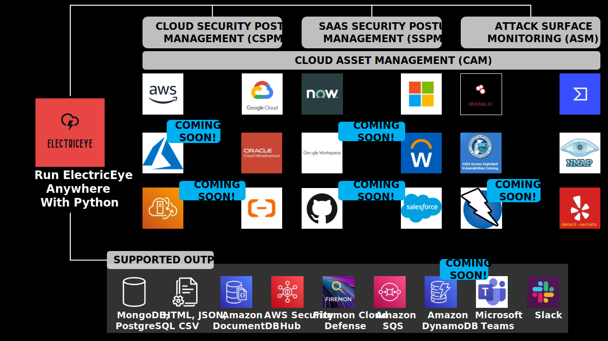

# ElectricEye

<p align="center">
  
</p>

ElectricEye is a multi-cloud, multi-SaaS Python CLI tool for Asset Management, Security Posture Management & Attack Surface Management supporting 100s of services and evaluations to harden your public cloud & SaaS environments with controls mapped to NIST CSF, 800-53, 800-171, ISO 27001, AICPA TSC (SOC2), and more!

    
<p><a href="https://gallery.ecr.aws/t4o3u7t2/electriceye"></a></p>

***Up here in space***<br/>
***I'm looking down on you***<br/>
***My lasers trace***<br/>
***Everything you do***<br/>
<sub>*Judas Priest, 1982*</sub>

## Table of Contents

- [Workflow](#workflow)
- [Quick Run Down](#quick-run-down-running-running)
- [Tell me more!](#tell-me-more-raised_eyebrow-raised_eyebrow)
- [Using ElectricEye](#using-electriceye)
- [Cloud Asset Management](./docs/asset_management/ASSET_MANAGEMENT.md)
- [Outputs](./docs/outputs/OUTPUTS.md)
- [FAQ](./docs/faq/FAQ.md)
- [Supported Services and Checks](#supported-services-and-checks)
- [Contributing](#contributing)
- [Developer & Testing Guide](./docs/new_checks/DEVELOPER_GUIDE.md)
- [Repository Security](#repository-security)
- [License](#license)

## Workflow



## Quick Run Down :running: :running:

- ElectricEye is a Python CLI tool that offers cross-Account, cross-Region, multi-Cloud & SaaS Asset Management, Security Posture Management, and Attack Surface Management capabilities across AWS, GCP, Oracle Cloud Infrastructure (OCI), and ServiceNow (*with more on the way!*). All Partitions are supported for AWS!

- ElectricEye offers over 800 checks for security, reliability, monitoring, and exposure across 100 CSP & SaaS services, including atypical services not supported by AWS Config/Google Cloud Asset API or mainstream CSPM & CNAPP tools.

- All checks are currently mapped to NIST Cybersecurity Framework V1.1, NIST Special Publication 800-53 Revision 4, AICPA 2020 Trust Service Criteria (TSCs), and ISO 27001:2013 Annex A controls.

- The EASM module uses NMAP for service discovery and reachability assessment of over 20 highly-dangerous ports and protocols for nearly every public-facing CSP service

- Outputs to AWS Security Hub, AWS DocumentDB, JSON, CSV, HTML Executive Reports, MongoDB, Amazon SQS, PostgreSQL, Amazon Simple Queue Service (SQS), Amazon DynamoDB, and [**FireMon Cloud Defense**](https://www.firemon.com/introducing-disruptops/).

## Tell Me More! :raised_eyebrow: :raised_eyebrow:

ElectricEye's core concept is the **Auditor** which are sets of Python scripts that run **Checks** per Service dedicated to a specific SaaS vendor or public cloud service provider called an **Assessment Target**. You can run an entire Assessment Target, a specific Auditor, or a specific Check within an Auditor. After ElectricEye is done with evaluations, it supports over a dozen types of **Outputs** ranging from an HTML executive report to AWS DocumentDB clusters. ElectricEye also uses other tools such as Shodan, `detect-secrets`, and NMAP for carrying out its Checks. While mainly a security tool, ElectricEye can be used for Cloud Asset Management use cases such as discovery and inventory and has Checks aligned to several best-practice regimes that cover resiliency, recovery, performance optimization, monitoring, as well as several 100 security checks against your cloud infrastructure and identities.

1. First, clone this repository and install the requirements using `pip3`: `pip3 install -r requirements.txt`.

2. Then, modify the [TOML file](./eeauditor/external_providers.toml) located in `ElectricEye/eeauditor/external_providers.toml` to specify various configurations for the CSP(s) and SaaS Provider(s) you want to assess.

3. Finally, run the Controller to learn about the various Checks, Auditors, Assessment Targets, and Outputs.

```bash
$ python3 eeauditor/controller.py --help
Usage: controller.py [OPTIONS]

Options:
  -t, --target-provider [AWS|Azure|OCI|GCP|Servicenow]
                                  CSP or SaaS Vendor Assessment Target, ensure
                                  that any -a or -c arg maps to your target
                                  provider e.g., -t AWS -a
                                  Amazon_APGIW_Auditor
  -a, --auditor-name TEXT         Specify which Auditor you want to run by
                                  using its name NOT INCLUDING .py. Defaults
                                  to ALL Auditors
  -c, --check-name TEXT           A specific Check in a specific Auditor you
                                  want to run, this correlates to the function
                                  name. Defaults to ALL Checks
  -d, --delay INTEGER             Time in seconds to sleep between Auditors
                                  being ran, defaults to 0
  -o, --outputs TEXT              A list of Outputs (files, APIs, databases)
                                  to send ElectricEye Findings - can provide
                                  more than one  [default: stdout]
  --output-file TEXT              For file outputs such as JSON and CSV, the
                                  name of the file, DO NOT SPECIFY .file_type
                                  [default: output]
  --list-options                  Lists all valid Output options
  --list-checks                   List all Checks, Assets, and Check
                                  Description within every Auditor for a
                                  specific Assessment Target
  --create-insights               Create SecurityHub insights for ElectricEye.
                                  This only needs to be done once per Security
                                  Hub instance
  --list-controls                 Lists all Controls (Check Titles) for an
                                  Assessment Target, used for mapping...
  --help                          Show this message and exit.
```

For more information see [here](#using-electriceye), you can read the [FAQ here](./docs/faq/FAQ.md), information on [Outputs is here](./docs/outputs/OUTPUTS.md) or, if you want a more in-depth analysis of the control flow and concepts review [the Developer Guide](./docs/new_checks/DEVELOPER_GUIDE.md).

## Using ElectricEye

Refer to sub-headings for per-CSP or per-SaaS setup instructions. Go to [Outputs](./docs/outputs/OUTPUTS.md) to, well, learn about Outputs and examples.

### Public Cloud Service Providers

- [For Amazon Web Services (AWS)](./docs/setup/Setup_AWS.md)
- [For Google Cloud Platform (GCP)](./docs/setup/Setup_GCP.md)
- [For Oracle Cloud Infrastructure](./docs/setup/Setup_OCI.md)
- [For Microsoft Azure (*Coming Soon*)](./docs/setup/Setup_Azure.md)

### Software-as-a-Service (SaaS) Providers

- [For ServiceNow](./docs/setup/Setup_ServiceNow.md)
- [For Microsoft M365 (E5) (*Coming Soon*)](./docs//Setup_M365.md)
- [For Workday ERP (*Coming Soon*)](./docs/setup/Setup_WorkDay.md)
- [For GitHub (*Coming Soon*)](./docs/setup/Setup_GitHub.md)

## Cloud Asset Management (CAM)

For more information on ElectricEye's CAM concept of operations and schema, refer to [the Asset Management documentation](./docs/asset_management/ASSET_MANAGEMENT.md).

## Supported Services and Checks

In total there are:

- **3** Supported Public CSPs: `AWS`, `GCP`, `OCI`
- **1** Supported SaaS Provider: `ServiceNow`
- **911** ElectricEye Checks
- **131** Supported CSP & SaaS Asset Components across all Services
- **104** ElectricEye Auditors

The tables of supported Services and Checks have been migrated to the respective per-Provider setup documentation linked above in [Using ElectricEye](#using-electriceye).

## Contributing

Refer to the [Developer Guide](./docs/new_checks/DEVELOPER_GUIDE.md) for instructions on how to produce new checks, for new SaaS and CSP support please open an Issue.

Feel free to open PRs and Issues where syntax, grammatic, and implementation errors are encountered in the code base.

### ElectricEye is for sale

Contact the maintainer for more information!

### Early Contributors

Quick shout-outs to the folks who answered the call early to test out ElectricEye and make it not-a-shit-sandwich.

##### Alpha Testing:

- [Mark Yancey](https://www.linkedin.com/in/mark-yancey-jr-aspiring-cloud-security-professional-a52bb9126/)

##### Beta Testing:

- [Martin Klie](https://www.linkedin.com/in/martin-klie-0600845/)
- [Joel Castillo](https://www.linkedin.com/in/joelbcastillo/)
- [Juhi Gupta](https://www.linkedin.com/in/juhi-gupta-09/)
- [Bulent Yidliz](https://www.linkedin.com/in/bulent-yildiz/)
- [Guillermo Ojeda](https://www.linkedin.com/in/guillermoojeda/)
- [Dhilip Anand Shivaji](https://www.linkedin.com/in/dhilipanand/)
- [Arek Bar](https://www.linkedin.com/in/arkadiuszbar/)
- [Ryan Russel](https://www.linkedin.com/in/pioneerrussell/)
- [Jonathan Nguyen](https://www.linkedin.com/in/jonanguyen/)
- [Jody Brazil](https://www.linkedin.com/in/jodybrazil/)
- [Dylan Shields](https://www.linkedin.com/in/dylan-shields-6802b1168/)
- [Manuel Leos Rivas](https://www.linkedin.com/in/manuel-lr/)
- [Andrew Alaniz](https://www.linkedin.com/in/andrewdalaniz/)
- [Christopher Childers](https://www.linkedin.com/in/christopher-childers-28950537/)

## Repository Security

Since ElectricEye is a security tool, it only makes sense to ensure a high-level of security of components are maintained. To that end the following tools are configured for usage. Refer to the build badges and Actions for detailed information about each run.

#### [`Syft`](https://github.com/anchore/syft)

See [results here](https://github.com/jonrau1/ElectricEye/actions/workflows/sbom-vulns.yml)!

A CLI tool and Go library for generating a Software Bill of Materials (SBOM) from container images and filesystems.

ElectricEye uses Syft to build an SBOM off of a built ElectricEye Docker Image in CycloneDX format and upload it as an artifact to every succesful GitHub Action run.

#### [`Grype`](https://github.com/anchore/grype)

See [results here](https://github.com/jonrau1/ElectricEye/actions/workflows/sbom-vulns.yml)!

A vulnerability scanner for container images and filesystems. Easily install the binary to try it out. Works with Syft, the powerful SBOM (software bill of materials) tool for container images and filesystems.

ElectricEye passes the CycloneDX SBOM from `Syft` to `Grype` to perform vulnerability scans on the built Docker image which combines all Python dependencies and built-in methods within the `alpine` Docker Image parent that ElectricEye uses. Builds with critical vulnerabilities are broken automatically. The results are posted to the GitHub Action and uploaded as `sarif` to GitHub Security

#### [`Dependabot`](https://github.com/dependabot)

Dependabot alerts tell you that your code depends on a package that is insecure. If your code depends on a package with a security vulnerability, this can cause a range of problems for your project or the people who use it. You should upgrade to a secure version of the package as soon as possible. If your code uses malware, you need to replace the package with a secure alternative.

ElectricEye uses Dependabot as a Software Composition Analysis (SCA) tool to run daily scans and open Pull Requests in the event that a Docker, Python, or GitHub-Action dependency requires a security patch.

#### [`CodeQL`](https://docs.github.com/en/code-security/code-scanning/automatically-scanning-your-code-for-vulnerabilities-and-errors/about-code-scanning-with-codeql)

See [results here](https://github.com/jonrau1/ElectricEye/actions/workflows/codeql-analysis.yml)!

CodeQL is the code analysis engine developed by GitHub to automate security checks. You can analyze your code using CodeQL and display the results as code scanning alerts.

ElectricEye uses `codeql` as a Static Application Security Testing (SAST) tool to scan all Auditors which are written in Python, `codeql` also looks for secrets in code. It is ran on push and on a schedule.

## License

This library is licensed under the Apache-2.0 License. See the LICENSE file.