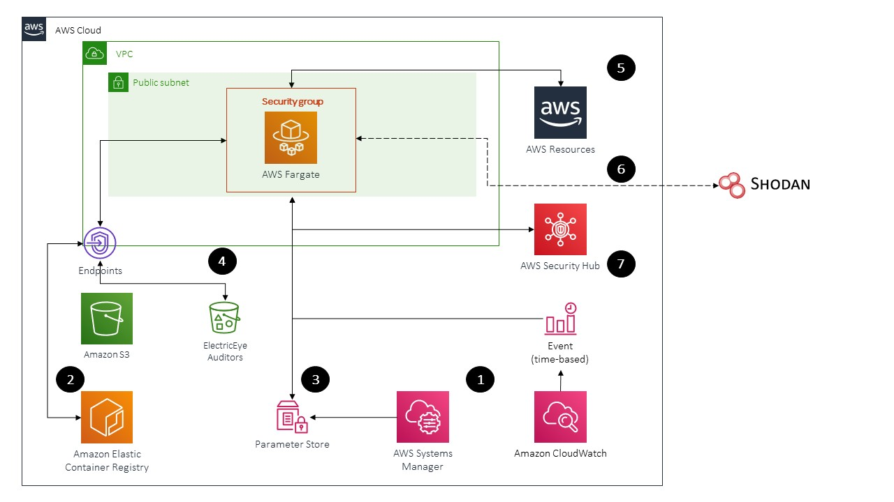
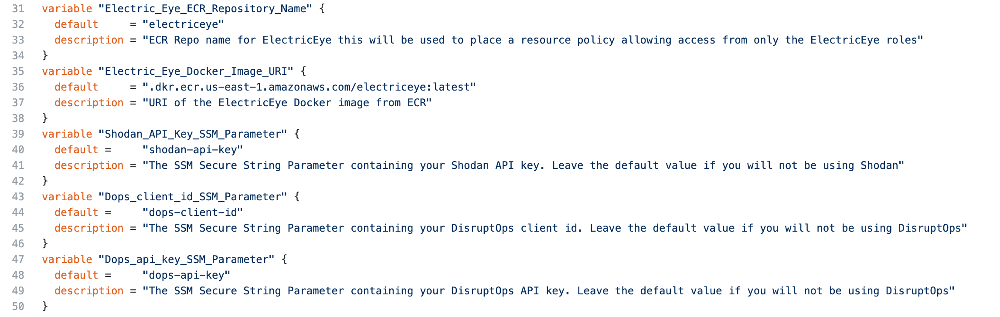
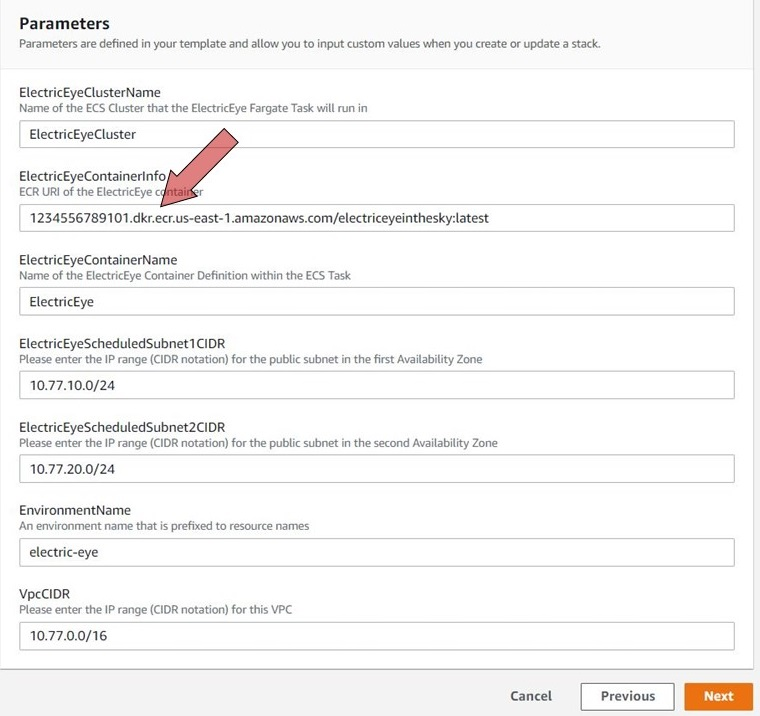
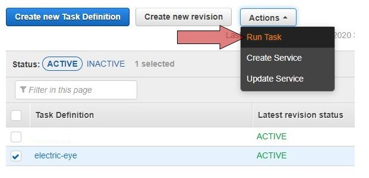
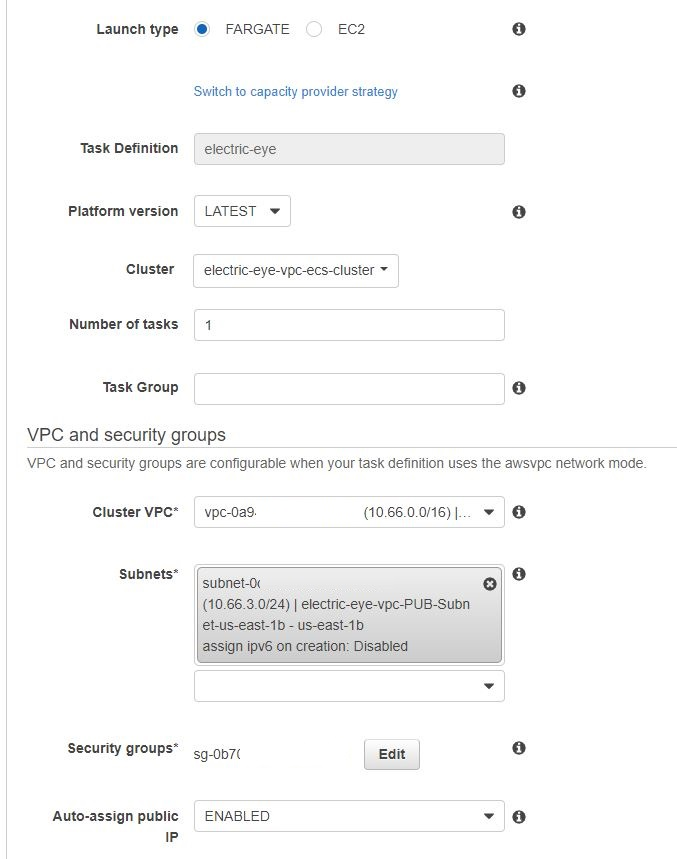
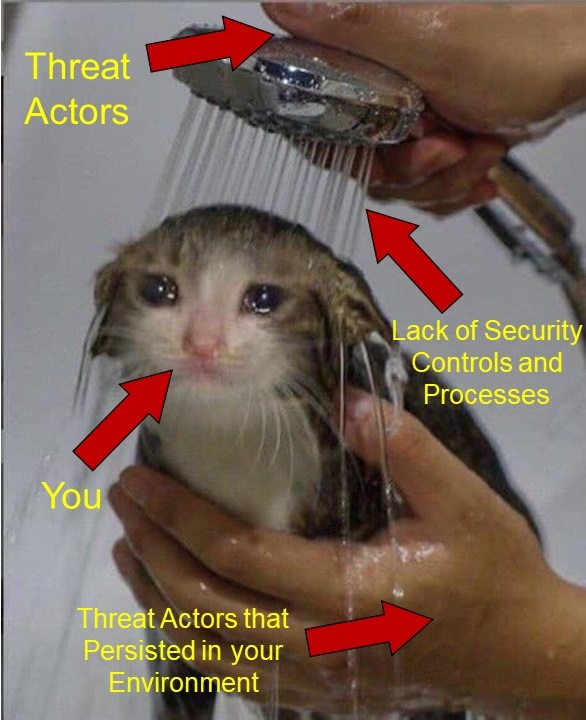

# ElectricEye

Continuously monitor your AWS services for configurations that can lead to degradation of confidentiality, integrity or availability. All results will be sent to Security Hub for further aggregation and analysis.

***Up here in space***<br/>
***I'm looking down on you***<br/>
***My lasers trace***<br/>
***Everything you do***<br/>
<sub>*Judas Priest, 1982*</sub>

## Table of Contents

- [Synopsis](#synopsis)
- [Description](#description)
- [Solution Architecture](#solution-architecture)
- [Setting Up](#setting-up)
  - [Build and push the Docker image](#build-and-push-the-docker-image)
  - [(OPTIONAL) Setup Shodan.io API Key](#optional-setup-shodanio-api-key)
  - [(OPTIONAL) Setup DisruptOps Client Id and API Key](#optional-setup-disruptops-client-id-and-api-key)
  - [Setup baseline infrastructure via Terraform](#setup-baseline-infrastructure-via-terraform)
  - [Setup baseline infrastructure via AWS CloudFormation](#setup-baseline-infrastructure-via-aws-cloudformation)
  - [Manually execute the ElectricEye ECS Task](#manually-execute-the-electriceye-ecs-task-you-only-need-to-do-this-once)
  - [Running locally](#running-locally)
- [Supported Services and Checks](#supported-services-and-checks)
- [Add-on Modules](#add-on-modules)
  - [Config Findings Pruner](https://github.com/jonrau1/ElectricEye/blob/master/add-ons/config-deletion-pruner)
  - [ElectricEye-Response](https://github.com/jonrau1/ElectricEye/blob/master/add-ons/electriceye-response)
  - [ElectricEye-ChatOps](https://github.com/jonrau1/ElectricEye/blob/master/add-ons/electriceye-chatops)
  - [ElectricEye-Pagerduty-Integration](https://github.com/jonrau1/ElectricEye/blob/master/add-ons/electriceye-pagerduty-integration)
  - [ElectricEye-Reports](https://github.com/jonrau1/ElectricEye/blob/master/add-ons/electriceye-reports)
- [Known Issues & Limitiations](#known-issues--limitations)
- [FAQ](https://github.com/jonrau1/ElectricEye#faq)
- [Contributing](#contributing)
- [Developing new Checks](#developer-guide)
- [Auditor testing](#auditor-testing)
- [License](#license)

## Synopsis

- **260+ security & AWS best practice detections** including services not covered by Security Hub/Config (AppStream, Cognito, EKS, ECR, DocDB, etc.), all findings are **aligned to NIST CSF, NIST 800-53, AICPA TSC and ISO 27001:2013**.
- Supports every **AWS Region and Partition** (Commercial, AWS GovCloud and AWS China Region)
- Built with **full AWS Security Hub support** in mind, can optionally output to JSON or CSV. **Can run as a CLI tool, in Fargate, as a standalone Container, or anywhere else** you can run Python (K8s, Batch, CodeBuild, EC2, etc.).
- **Multiple add-ons enable automated remediation, ChatOps, finding purging, and integrations** with third-party tools such as DisruptOps, Pagerduty, Slack, ServiceNow Incident Management, Jira, Azure DevOps, Shodan and Microsoft Teams.

## Description

ElectricEye is a set of Python scripts (affectionately called **Auditors**) that continuously monitor your AWS infrastructure looking for configurations related to confidentiality, integrity and availability that do not align with AWS best practices. All findings from these scans will be sent to AWS Security Hub where you can perform basic correlation against other AWS and 3rd Party services that send findings to Security Hub (optionally you can send findings to DisruptOps, CSV or JSON). Security Hub also provides a centralized view from which account owners and other responsible parties can view and take action on findings. ElectricEye supports all AWS commercial, China, and GovCloud Regions.

**Note**: If you would like to use the "classic" version of ElectricEye it is available in [this branch](https://github.com/jonrau1/ElectricEye/tree/electriceye-classic), however, it will not include any new auditors for services such as QLDB, RAM, etc. Some screenshots may not work correctly due to the linking, sorry about that.

ElectricEye was designed to run on AWS Fargate, which is a serverless container orchestration service, you can also run it via a CLI anywhere you have the required dependencies installed. On a schedule, Fargate will download all of the auditor scripts from a S3 bucket, run the checks and send results to Security Hub. All infrastructure will be deployed via CloudFormation or Terraform to help you apply this solution to many accounts and/or regions. All findings (passed or failed) will contain AWS documentation references in the `Remediation.Recommendation` section of the ASFF (and the **Remediation** section of the Security Hub UI) to further educate yourself and others on.

ElectricEye comes with several add-on modules to extend the core model which provides dozens of detection-based controls. ElectricEye-Response provides a multi-account response and remediation platform (also known as SOAR), ElectricEye-ChatOps integrates with Slack/Pagerduty/Microsoft Teams, and ElectricEye-Reports integrates with QuickSight, and the Config-Deletion-Pruner will auto-archive findings as Config-supported resources are deleted. All add-ons are supported by both CloudFormation and Terraform and can also be used independently of the core module itself.

Personas who can make use of this tool are DevOps/DevSecOps engineers, SecOps analysts, Cloud Center-of-Excellence personnel, Site Reliability Engineers (SREs), Internal Audit and/or Compliance Analysts.

## Solution Architecture

**Note:** Despite the focus on AWS Fargate, it is not a requirement anymore as of ElectricEye V2.0!



1. A [time-based CloudWatch Event](https://docs.aws.amazon.com/AmazonCloudWatch/latest/events/ScheduledEvents.html) runs ElectricEye every 12 hours (default value).

2. The ElectricEye Task will pull the Docker image from [Elastic Container Registry (ECR)](https://aws.amazon.com/ecr/).

3. Systems Manager Parameter Store passes the bucket name from which Auditors are downloaded. Optionally, ElectricEye will retrieve you API key(s) for [DisruptOps](https://disruptops.com/features/) and [Shodan](https://www.shodan.io/explore), if those integrations are configured.

4. The ElectricEye task will execute all Auditors to scan your AWS infrastructure and deliver both passed and failed findings to Security Hub. **Note:** ElectricEye will query the Shodan APIs to see if there is a match against select internet-facing AWS resources if configured.

5. If configured, ElectricEye will send findings to DisruptOps. DisruptOps is also [integrated with Security Hub](https://disruptops.com/aws-security-management-with-securityhub/) and can optionally enforce guardrails and orchestrate security automation from within the platform.

Refer to the [Supported Services and Checks](https://github.com/jonrau1/ElectricEye#supported-services-and-checks) section for an up-to-date list of supported services and checks performed by the Auditors.

## Setting Up

These steps are split across their relevant sections. All CLI commands are executed from an Ubuntu 18.04LTS [Cloud9 IDE](https://aws.amazon.com/cloud9/details/), modify them to fit your OS. 

**Note 1:** If you do use Cloud9, navigate to Settings (represented by a Gear icon) > AWS Settings and **unmark** the selection for `AWS managed temporary credentials` (move the toggle to your left-hand side) as shown below. If you do not, you instance profile will not apply properly.


**Note 2:** Ensure AWS Security Hub is enabled in the region you are attempting to run ElectricEye

**Note 3:** If you have never used ECS before you'll likely run into a problem with the service-linked role (SLR), or lack thereof, and you should follow the [instructions here](https://docs.aws.amazon.com/AmazonECS/latest/developerguide/using-service-linked-roles.html#service-linked-role-permissions) to have it created first

### Build and push the Docker image

**Note:** You must have [permissions to push images](https://docs.aws.amazon.com/AmazonECR/latest/userguide/docker-push-ecr-image.html) to ECR before performing this step. These permissions are not included in the instance profile example.

1. Update your machine and clone this repository

```bash
sudo apt update && sudo apt upgrade -y
sudo apt install -y unzip awscli docker.ce python3 python3-pip
pip3 install --upgrade pip
pip3 install --upgrade awscli
pip3 install --upgrade boto3
git clone https://github.com/jonrau1/ElectricEye.git
```

2. Create an ECR Repository with the AWS CLI

```bash
aws ecr create-repository \
    --repository-name ElectricEye \
    --image-scanning-configuration scanOnPush=true
```

3. Build and push the ElectricEye Docker image. Be sure to replace the values for your region, Account ID and name of the ECR repository

**Note**: If you are in GovCloud these commands are likely very different, please review for consistency (and open a PR if there is a better option for GovCloud)

```bash
cd ElectricEye
aws ecr get-login-password --region <AWS_REGION> | sudo docker login --username AWS --password-stdin <ACCOUNT_ID>.dkr.ecr.<AWS_REGION>.amazonaws.com
```

**Note**: If you are using AWS CLI v1 use the following in place of the line above

```bash
sudo $(aws ecr get-login --no-include-email --region <AWS_REGION>)
```

```bash
sudo docker build -t ElectricEye .
sudo docker tag ElectricEye:latest <ACCOUNT_ID>.dkr.ecr.<AWS_REGION>.amazonaws.com/ElectricEye:latest
sudo docker push <ACCOUNT_ID>.dkr.ecr.<AWS_REGION>.amazonaws.com/ElectricEye:latest
```

4. Navigate to the ECR console and copy the `URI` of your Docker image. It will be in the format of **`<ACCOUNT_ID>.dkr.ecr.<AWS_REGION.amazonaws.com/ElectricEye:latest`**. Save this as you will need it when configuring Terraform or CloudFormation.

### (OPTIONAL) Setup Shodan.io API Key

This is an **optional** step to setup a Shodan.io API key to determine if your internet-facing resources have been indexed. This is not an exact science as a lot of abstracted services (ES, RDS, ELB) share IP space with other resources and AWS addresses (non-EIP / BYOIP) are always change (such as when you have an EC2 instance shutoff for a prolonged period of time). You may end up having indexed resources that were indexed when someone else was using the IP space, you should still review it either way just to make sure.

1. Create a Shodan account and retrieve your Shodan.io API Key [from here](https://developer.shodan.io/dashboard).

2. Create a Systems Manager Parameter Store `SecureString` parameter for this API key:

```bash
aws ssm put-parameter \
    --name electriceye-shodan-api-key \
    --description 'Shodan.io API Key' \
    --type SecureString --value <API-KEY-HERE>
```

In both the Terraform config files and CloudFormation templates the value for this key is prepopulated with the value `placeholder`, overwrite them with this parameter you just created to be able to use the Shodan checks.

### (OPTIONAL) Setup DisruptOps Client Id and API Key

This is an optional step to setup for sending findings to DisruptOps. 

1. Create a Systems Manager Parameter Store `SecureString` parameter for the client id: 

```bash
aws ssm put-parameter \
    --name dops-client-id \
    --description 'DisruptOps client id' \
    --type SecureString \
    --value <CLIENT-ID-HERE>
```

2. Create a Systems Manager Parameter Store `SecureString` parameter for this API key: 

```bash
aws ssm put-parameter \
    --name dops-api-key \
    --description 'DisruptOps api key' \
    --type SecureString \
    --value <API-KEY-HERE>
```

In both the Terraform config files and CloudFormation templates the value for this key is prepopulated with the value `placeholder`, overwrite them with this parameter you just created to be able to use DisruptOps.

### Setup baseline infrastructure via Terraform

Before starting [attach this IAM policy](https://github.com/jonrau1/ElectricEye/blob/master/policies/Instance_Profile_IAM_Policy.json) to your [Instance Profile](https://docs.aws.amazon.com/IAM/latest/UserGuide/id_roles_use_switch-role-ec2_instance-profiles.html) (if you are using Cloud9 or EC2).

**Important Note:** The policy for the instance profile is ***highly dangerous*** given the S3, VPC and IAM related permissions given to it, Terraform needs a wide swath of CRUD permissions and even permissions for things that aren't deployed by the config files. For rolling ElectricEye out in a Production or an otherwise highly regulated environment, consider adding [IAM Condition Keys](https://docs.aws.amazon.com/IAM/latest/UserGuide/reference_policies_actions-resources-contextkeys.html#context_keys_table), using CI/CD (no human access) and backing up your Terraform state files to a S3 backend to add guardrails around this deployment. I would avoid adding these permissions to an IAM user, and any roles that use this should only be assumable by where you are deploying it from, consider adding other Condition Keys to the Trust Policy.

In this stage we will install and deploy the ElectricEye infrastructure via Terraform. To securely backup your state file, you should explore the usage of a [S3 backend](https://www.terraform.io/docs/backends/index.html), this is also described in this [AWS Security Blog post](https://aws.amazon.com/blogs/security/how-use-ci-cd-deploy-configure-aws-security-services-terraform/).

1. Install the dependencies for Terraform.

**Note:** Ensure this is the latest version of Terraform, since authoring this tool, I do not make use of it anymore and rely on outside contributors to update the Configs.

```bash
wget https://releases.hashicorp.com/terraform/0.14.4/terraform_0.14.4_linux_amd64.zip
unzip terraform_0.14.4_linux_amd64.zip
sudo mv terraform /usr/local/bin/
terraform --version
```

2. Change directories and modify the `variables.tf` config file to include the URI of your Docker image and the name of your ECR Repository as shown in the screenshot below. Optionally replace the values of the Shodan API Key, DisruptOps Client Id, and DisruptOps API Key parameters with yours if you created them in the previous optional steps.

```bash
cd terraform-config-files
nano variables.tf
```



3. Initialize, plan and apply your state with Terraform, this step should not take too long.

```bash
terraform init
terraform plan
terraform apply -auto-approve
```

4. Navigate to the S3 console and locate the name of the S3 bucket created by Terraform for the next step. It should be in the format of `electriceye-artifact-bucket-(AWS_REGION)-(ACCOUNT-NUMBER)` if you left everything else default in `variables.tf`

5. Navigate to the `auditors` directory and upload the code base to your S3 bucket

```bash
cd -
cd eeauditor/auditors/aws
aws s3 sync . s3://<your-bucket-name>
```

6. Navigate to the `insights` directory and execute the Python script to have Security Hub Insights created. Insights are saved searches that can also be used as quick-view dashboards (though nowhere near the sophistication of a QuickSight dashboard)

```bash
cd -
cd insights
python3 electriceye-insights.py
```

In the next stage you will launch the ElectricEye ECS task manually because after Terraform deploys this solution it will automatically run, and it will fail due to a lack of Auditor scripts in the S3 bucket.

### Setup baseline infrastructure via AWS CloudFormation

1. Download the [CloudFormation template](https://github.com/jonrau1/ElectricEye/blob/master/cloudformation/ElectricEye_CFN.yaml) and create a Stack. Refer to the [Get Started](https://docs.aws.amazon.com/AWSCloudFormation/latest/UserGuide/GettingStarted.Walkthrough.html) section of the *AWS CloudFormation User Guide* if you have not done this before.

2. Enter the URI of the Docker image in the space for the parameter **ElectricEyeContainerInfo**. Leave all other parameters as the default value, unless you already used `10.77.0.0/16` as the CIDR for one of your VPCs and plan to attach this VPC to your [T-Gateway](https://aws.amazon.com/transit-gateway/). Optionally replace the values of the Shodan API Key, DisruptOps Client Id, and DisruptOps API Key parameters with yours if you created them in the previous optional steps and then create your stack.


**NOTE**: The Terraform implementation applies a resource-based repository policy that only allows access to the ElectricEye ECS IAM Roles (Execution & Task), if you want to apply something similar for CloudFormation you will need to issue the following ECR CLI command:

```bash
aws ecr set-repository-policy \
    --repository-name <ECR_REPO_NAME> \
    --policy-text file://my-policy.json
```

You can create `my-policy.json` with the below example, replace the values for `<Task_Execution_Role_ARN>` and `<Task_Role.arn>` as needed.

```json
{
  "Version": "2008-10-17",
  "Statement": [
    {
      "Sid": "new statement",
      "Effect": "Allow",
      "Principal": {
        "AWS": [
          "<Task_Execution_Role_ARN>",
          "<Task_Role.arn>"
        ],
        "Service": "ecs-tasks.amazonaws.com"
      },
      "Action": [
        "ecr:BatchCheckLayerAvailability",
        "ecr:BatchGetImage",
        "ecr:DescribeImages",
        "ecr:DescribeRepositories",
        "ecr:GetAuthorizationToken",
        "ecr:GetDownloadUrlForLayer",
        "ecr:GetRepositoryPolicy",
        "ecr:ListImages"
      ]
    }
  ]
}
```

3. Navigate to the S3 console and locate the name of the S3 bucket created by CloudFormation for the next step. It should be in the format of `electric-eye-artifact-bucket--(AWS_REGION)-(ACCOUNT-NUMBER)`

4. Navigate to the `auditors` directory and upload the code base to your S3 bucket

```bash
cd -
cd eeauditor/auditors/aws
aws s3 sync . s3://<your-bucket-name>
```

5. Navigate to the `insights` directory and execute the Python script to have Security Hub Insights created. Insights are saved searches that can also be used as quick-view dashboards (though nowhere near the sophistication of a QuickSight dashboard)

```bash
cd -
cd insights
python3 electriceye-insights.py
```

### Manually execute the ElectricEye ECS Task

In this stage we will use the console the manually run the ElectricEye ECS task, it is optional.

1. Navigate to the ECS Console, select **Task Definitions** and toggle the `electric-eye` task definition. Select the **Actions** dropdown menu and select **Run Task** as shown in the below screenshot.



2. Configure the following settings in the **Run Task** screen as shown in the screenshot below.

- Launch type: **Fargate**
- Platform version: **LATEST**
- Cluster: **electric-eye-vpc-ecs-cluster** (unless named otherwise)
- Number of tasks: **1**
- Task group: ***LEAVE THIS BLANK***
- Cluster VPC: **electric-eye-vpc**
- Subnets: ***any eletric eye Subnet***
- Security groups: **electric-eye-vpc-sec-group** (you will need to select **Modify** and choose from another menu)
- Auto-assign public IP: **ENABLED**



3. Select **Run task**, in the next screen select the hyperlink in the **Task** column and select the **Logs** tab to view the result of the logs. **Note** logs coming to this screen may be delayed, and you may have several auditors report failures due to the lack of in-scope resources.

### Running locally

1. Navigate to the IAM console and click on **Policies** under **Access management**. Select **Create policy** and under the JSON tab, copy and paste the contents [Instance Profile IAM Policy](policies/Instance_Profile_IAM_Policy.json). Click **Review policy**, create a name, and then click **Create policy**.

2. Have python 3 and pip installed and setup virtualenv

```bash
pip3 install virtualenv --user
virtualenv .venv
```

3. This will create a virtualenv directory called .venv which needs to be activated

```bash
#For macOS and Linux
. .venv/bin/activate

#For Windows
.venv\scripts\activate
```

4. Install all dependencies

```bash
pip3 install -r requirements.txt
```

5. Run the controller

```bash
python3 eeauditor/controller.py
```

Add the `--help` option for info on running individual checks and auditors and different outputs options.

## Supported Services and Checks

These are the following services and checks perform by each Auditor. There are currently **275** checks supported across **80** AWS services / components using **60** Auditors. There are currently **62** supported response and remediation Playbooks with coverage across **32** AWS services / components supported by [ElectricEye-Response](https://github.com/jonrau1/ElectricEye/blob/master/add-ons/electriceye-response).

**Regarding Shield Advanced checks:** You must be subscribed to Shield Advanced, be on Business/Enterprise Support and be in us-east-1 to perform all checks. The Shield Adv API only lives in us-east-1, and to have the DRT look at your account you need Biz/Ent support, hence the pre-reqs.

| Auditor File Name                      | AWS Service                    | Auditor Scan Description                                                            |
|----------------------------------------|--------------------------------|-------------------------------------------------------------------------------------|
| Amazon_APIGW_Auditor.py                | API Gateway Stage              | Are stage metrics enabled                                                           |
| Amazon_APIGW_Auditor.py                | API Gateway Stage              | Is stage API logging enabled                                                        |
| Amazon_APIGW_Auditor.py                | API Gateway Stage              | Is stage caching enabled                                                            |
| Amazon_APIGW_Auditor.py                | API Gateway Stage              | Is cache encryption enabled                                                         |
| Amazon_APIGW_Auditor.py                | API Gateway Stage              | Is stage xray tracing configured                                                    |
| Amazon_APIGW_Auditor.py                | API Gateway Stage              | Is the stage protected by a WAF WACL                                                |
| Amazon_APIGW_Auditor.py                | API Gateway Rest API           | Do Rest APIs use Policies                                                           |
| Amazon_APIGW_Auditor.py                | API Gateway Rest API           | Do Rest APIs use Authorizers                                                        |
| Amazon_AppStream_Auditor.py            | AppStream 2.0 (Fleets)         | Do Fleets allow Default Internet Access                                             |
| Amazon_AppStream_Auditor.py            | AppStream 2.0 (Images)         | Are Images Public                                                                   |
| Amazon_AppStream_Auditor.py            | AppStream 2.0 (Users)          | Are users reported as Compromised                                                   |
| Amazon_AppStream_Auditor.py            | AppStream 2.0 (Users)          | Do users use SAML authentication                                                    |
| Amazon_CloudFront_Auditor.py           | CloudFront Distribution        | Does distribution have trusted signers with key pairs                               |
| Amazon_CloudFront_Auditor.py           | CloudFront Distribution        | Does distribution have Origin Shield enabled                                        |
| Amazon_CloudFront_Auditor.py           | CloudFront Distribution        | Does distribution have Geo Restriction enabled                                      |
| Amazon_CloudFront_Auditor.py           | CloudFront Distribution        | Does distribution have Default Viewer Certificate                                   |
| Amazon_CloudFront_Auditor.py           | CloudFront Distribution        | Does distribution have Field-Level Encryption enabled                               |
| Amazon_CloudFront_Auditor.py           | CloudFront Distribution        | Does distribution have WAF enabled                               |
| Amazon_CloudSearch_Auditor.py          | CloudSearch Domain             | Do Domains enforce HTTPS-only                                                       |
| Amazon_CloudSearch_Auditor.py          | CloudSearch Domain             | Do Domains use TLS 1.2                                                              |
| Amazon_CognitoIdP_Auditor.py           | Cognito Identity Pool          | Does the Password policy comply with AWS CIS Foundations Benchmark                  |
| Amazon_CognitoIdP_Auditor.py           | Cognito Identity Pool          | Cognito Temporary Password Age                                                      |
| Amazon_CognitoIdP_Auditor.py           | Cognito Identity Pool          | Does the Identity pool enforce MFA                                                  |
| Amazon_DocumentDB_Auditor.py           | DocumentDB Instance            | Are Instances publicly accessible                                                   |
| Amazon_DocumentDB_Auditor.py           | DocumentDB Instance            | Are Instance encrypted                                                              |
| Amazon_DocumentDB_Auditor.py           | DocumentDB Instance            | Is audit logging enabled                                                            |
| Amazon_DocumentDB_Auditor.py           | DocumentDB Cluster             | Is the Cluster configured for HA                                                    |
| Amazon_DocumentDB_Auditor.py           | DocumentDB Cluster             | Is the Cluster deletion protected                                                   |
| Amazon_DocumentDB_Auditor.py           | DocumentDB Cluster             | Is cluster audit logging on                                                         |
| Amazon_DocumentDB_Auditor.py           | DocumentDB Cluster             | Is cluster TLS enforcement on                                                       |
| Amazon_DocumentDB_Auditor.py           | DocDB Snapshot                 | Are docdb cluster snapshots encrypted                                               |
| Amazon_DocumentDB_Auditor.py           | DocDB Snapshot                 | Are docdb cluster snapshots public                                                  |
| Amazon_DynamoDB_Auditor.py             | DynamoDB Table                 | Do tables use KMS CMK for encryption                                                |
| Amazon_DynamoDB_Auditor.py             | DynamoDB Table                 | Do tables have PITR enabled                                                         |
| Amazon_DynamoDB_Auditor.py             | DynamoDB Table                 | Do tables have TTL enabled                                                          |
| Amazon_EBS_Auditor.py                  | EBS Volume                     | Is the Volume attached                                                              |
| Amazon_EBS_Auditor.py                  | EBS Volume                     | Is the Volume configured to be deleted on instance termination                      |
| Amazon_EBS_Auditor.py                  | EBS Volume                     | Is the Volume encrypted                                                             |
| Amazon_EBS_Auditor.py                  | EBS Snapshot                   | Is the Snapshot encrypted                                                           |
| Amazon_EBS_Auditor.py                  | EBS Snapshot                   | Is the Snapshot public                                                              |
| Amazon_EBS_Auditor.py                  | Account                        | Is account level encryption by default enabled                                      |
| Amazon_EC2_Auditor.py                  | EC2 Instance                   | Is IMDSv2 enabled                                                                   |
| Amazon_EC2_Auditor.py                  | EC2 Instance                   | Is Secure Enclave used                                                              |
| Amazon_EC2_Auditor.py                  | EC2 Instance                   | Is the instance internet-facing                                                     |
| Amazon_EC2_Auditor.py                  | EC2 Instance                   | Is Source/Dest Check disabled                                                       |
| Amazon_EC2_Auditor.py                  | AWS Account                    | Is Serial Port Access restricted                                                    |
| Amazon_EC2_Image_Builder_Auditor.py    | Image Builder                  | Are pipeline tests enabled                                                          |
| Amazon_EC2_Image_Builder_Auditor.py    | Image Builder                  | Is EBS encrypted                                                                    |
| Amazon_EC2_Security_Group_Auditor.py   | Security Group                 | Are all ports (-1) open to the internet                                             |
| Amazon_EC2_Security_Group_Auditor.py   | Security Group                 | Is FTP (tcp20-21) open to the internet                                              |
| Amazon_EC2_Security_Group_Auditor.py   | Security Group                 | Is TelNet (tcp23) open to the internet                                              |
| Amazon_EC2_Security_Group_Auditor.py   | Security Group                 | Is WSDCOM-RPC (tcp135) open to the internet                                         |
| Amazon_EC2_Security_Group_Auditor.py   | Security Group                 | Is SMB (tcp445) open to the internet                                                |
| Amazon_EC2_Security_Group_Auditor.py   | Security Group                 | Is MSSQL (tcp1433) open to the internet                                             |
| Amazon_EC2_Security_Group_Auditor.py   | Security Group                 | Is OracleDB (tcp1521) open to the internet                                          |
| Amazon_EC2_Security_Group_Auditor.py   | Security Group                 | Is MySQL/MariaDB (tcp3306) open to the internet                                     |
| Amazon_EC2_Security_Group_Auditor.py   | Security Group                 | Is RDP (tcp3389) open to the internet                                               |
| Amazon_EC2_Security_Group_Auditor.py   | Security Group                 | Is PostgreSQL (tcp5432) open to the internet                                        |
| Amazon_EC2_Security_Group_Auditor.py   | Security Group                 | Is Kibana (tcp5601) open to the internet                                            |
| Amazon_EC2_Security_Group_Auditor.py   | Security Group                 | Is Redis (tcp6379) open to the internet                                             |
| Amazon_EC2_Security_Group_Auditor.py   | Security Group                 | Is Splunkd (tcp8089) open to the internet                                           |
| Amazon_EC2_Security_Group_Auditor.py   | Security Group                 | Is Elasticsearch (tcp9200) open to the internet                                     |
| Amazon_EC2_Security_Group_Auditor.py   | Security Group                 | Is Elasticsearch (tcp9300) open to the internet                                     |
| Amazon_EC2_Security_Group_Auditor.py   | Security Group                 | Is Memcached (udp11211) open to the internet                                        |
| Amazon_EC2_Security_Group_Auditor.py   | Security Group                 | Is Redshift (tcp5439) open to the internet                                          |
| Amazon_EC2_Security_Group_Auditor.py   | Security Group                 | Is DocDB (tcp27017) open to the internet                                            |
| Amazon_EC2_Security_Group_Auditor.py   | Security Group                 | Is Cassandra (tcp9142) open to the internet                                         |
| Amazon_EC2_Security_Group_Auditor.py   | Security Group                 | Is Kafka (tcp9092) open to the internet                                             |
| Amazon_EC2_Security_Group_Auditor.py   | Security Group                 | Is NFS (tcp2049) open to the internet                                               |
| Amazon_EC2_Security_Group_Auditor.py   | Security Group                 | Is Rsync (tcp873) open to the internet                                              |
| Amazon_EC2_Security_Group_Auditor.py   | Security Group                 | Is TFTP (udp69) open to the internet                                                |
| Amazon_EC2_Security_Group_Auditor.py   | Security Group                 | Is Docker API (tcp2375) open to the internet                                        |
| Amazon_EC2_SSM_Auditor.py              | EC2 Instance                   | Is the instance managed by SSM                                                      |
| Amazon_EC2_SSM_Auditor.py              | EC2 Instance                   | Does the instance have a successful SSM association                                 |
| Amazon_EC2_SSM_Auditor.py              | EC2 Instance                   | Is the SSM Agent up to date                                                         |
| Amazon_EC2_SSM_Auditor.py              | EC2 Instance                   | Is the Patch status up to date                                                      |
| Amazon_ECR_Auditor.py                  | ECR Registry (Account)         | Is there a registry access policy                                                   |
| Amazon_ECR_Auditor.py                  | ECR Registry (Account)         | Is image replication configured                                                     |
| Amazon_ECR_Auditor.py                  | ECR Repository                 | Does the repository support scan-on-push                                            |
| Amazon_ECR_Auditor.py                  | ECR Repository                 | Is there an image lifecycle policy                                                  |
| Amazon_ECR_Auditor.py                  | ECR Repository                 | Is there a repo access policy                                                       |
| Amazon_ECR_Auditor.py                  | Image (Container)              | Does the latest container have any vulns                                            |
| Amazon_ECS_Auditor.py                  | ECS Cluster                    | Is container insights enabled                                                       |
| Amazon_ECS_Auditor.py                  | ECS Cluster                    | Is a default cluster provider configured                                            |
| Amazon_ECS_Auditor.py                  | ECS Task Definition            | Is the Task Definition using a Privileged container                                 |
| Amazon_ECS_Auditor.py                  | ECS Task Definition            | Do EC2-ECS containers use SELinux or AppArmor                                       |
| Amazon_EFS_Auditor.py                  | EFS File System                | Are file systems encrypted                                                          |
| Amazon_EFS_Auditor.py                  | EFS File System                | Does the File system have a custom policy attached                                  |
| Amazon_EKS_Auditor.py                  | EKS Cluster                    | Is the API Server publicly accessible                                               |
| Amazon_EKS_Auditor.py                  | EKS Cluster                    | Is K8s version 1.19 used                                                            |
| Amazon_EKS_Auditor.py                  | EKS Cluster                    | Are auth or audit logs enabled                                                      |
| Amazon_EKS_Auditor.py                  | EKS Cluster                    | Is K8s Secrets envelope encryption used                                             |
| Amazon_Elasticache_Redis_Auditor.py    | Elasticache Redis Cluster      | Is an AUTH Token used                                                               |
| Amazon_Elasticache_Redis_Auditor.py    | Elasticache Redis Cluster      | Is the cluster encrypted at rest                                                    |
| Amazon_Elasticache_Redis_Auditor.py    | Elasticache Redis Cluster      | Does the cluster encrypt in transit                                                 |
| Amazon_ElasticsearchService_Auditor.py | Elasticsearch Domain           | Are dedicated masters used                                                          |
| Amazon_ElasticsearchService_Auditor.py | Elasticsearch Domain           | Is Cognito auth used                                                                |
| Amazon_ElasticsearchService_Auditor.py | Elasticsearch Domain           | Is encryption at rest used                                                          |
| Amazon_ElasticsearchService_Auditor.py | Elasticsearch Domain           | Is Node2Node encryption used                                                        |
| Amazon_ElasticsearchService_Auditor.py | Elasticsearch Domain           | Is HTTPS-only enforced                                                              |
| Amazon_ElasticsearchService_Auditor.py | Elasticsearch Domain           | Is a TLS 1.2 policy used                                                            |
| Amazon_ElasticsearchService_Auditor.py | Elasticsearch Domain           | Are there available version updates                                                 |
| Amazon_ElasticsearchService_Auditor.py | Elasticsearch Domain           | Is ES in a VPC                                                                      |
| Amazon_ElasticsearchService_Auditor.py | Elasticsearch Domain           | Is ES Publicly Accessible                                                           |
| Amazon_ELB_Auditor.py                  | ELB (Classic Load Balancer)    | Do internet facing ELBs have a secure listener                                      |
| Amazon_ELB_Auditor.py                  | ELB (Classic Load Balancer)    | Do secure listeners enforce TLS 1.2                                                 |
| Amazon_ELB_Auditor.py                  | ELB (Classic Load Balancer)    | Is cross zone load balancing enabled                                                |
| Amazon_ELB_Auditor.py                  | ELB (Classic Load Balancer)    | Is connection draining enabled                                                      |
| Amazon_ELB_Auditor.py                  | ELB (Classic Load Balancer)    | Is access logging enabled                                                           |
| Amazon_ELBv2_Auditor.py                | ELBv2 (ALB)                    | Is access logging enabled for ALBs                                                  |
| Amazon_ELBv2_Auditor.py                | ELBv2 (ALB/NLB)                | Is deletion protection enabled                                                      |
| Amazon_ELBv2_Auditor.py                | ELBv2 (ALB/NLB)                | Do internet facing ELBs have a secure listener                                      |
| Amazon_ELBv2_Auditor.py                | ELBv2 (ALB/NLB)                | Do secure listeners enforce TLS 1.2                                                 |
| Amazon_ELBv2_Auditor.py                | ELBv2 (ALB/NLB)                | Are invalid HTTP headers dropped                                                    |
| Amazon_ELBv2_Auditor.py                | ELBv2 (NLB)                    | Do NLBs with TLS listeners have access logging enabled                              |
| Amazon_ELBv2_Auditor.py                | Amazon_ELBv2_Auditor.py        | Do ALBs have HTTP Desync protection enabled                                         |
| Amazon_EMR_Auditor.py                  | EMR Cluster                    | Do clusters have a sec configuration attached                                       |
| Amazon_EMR_Auditor.py                  | EMR Cluster                    | Do cluster sec configs enforce encryption in transit                                |
| Amazon_EMR_Auditor.py                  | EMR Cluster                    | Do cluster sec configs enforce encryption at rest for EMRFS                         |
| Amazon_EMR_Auditor.py                  | EMR Cluster                    | Do cluster sec configs enforce encryption at rest for EBS                           |
| Amazon_EMR_Auditor.py                  | EMR Cluster                    | Do cluster sec configs enforce Kerberos authN                                       |
| Amazon_EMR_Auditor.py                  | EMR Cluster                    | Is cluster termination protection enabled                                           |
| Amazon_EMR_Auditor.py                  | EMR Cluster                    | Is cluster logging enabled                                                          |
| Amazon_EMR_Auditor.py                  | AWS Account                    | Is EMR public SG block configured for the Account in the region                     |
| Amazon_Kinesis_Analytics_Auditor.py    | Kinesis analytics application  | Does application log to CloudWatch                                                  |
| Amazon_Kinesis_Data_Streams_Auditor.py | Kinesis data stream            | Is stream encryption enabled                                                        |
| Amazon_Kinesis_Data_Streams_Auditor.py | Kinesis data stream            | Is enhanced monitoring enabled                                                      |
| Amazon_Kinesis_Firehose_Auditor.py     | Firehose delivery stream       | Is delivery stream encryption enabled                                               |
| Amazon_Managed_Blockchain_Auditor.py   | Fabric peer node               | Are chaincode logs enabled                                                          |
| Amazon_Managed_Blockchain_Auditor.py   | Fabric peer node               | Are peer node logs enabled                                                          |
| Amazon_Managed_Blockchain_Auditor.py   | Fabric member                  | Are member CA logs enabled                                                          |
| Amazon_MQ_Auditor.py                   | Amazon MQ message broker       | Message brokers should be encrypted with customer-managed KMS CMKs                  |
| Amazon_MQ_Auditor.py                   | Amazon MQ message broker       | Message brokers should have audit logging enabled                                   |
| Amazon_MQ_Auditor.py                   | Amazon MQ message broker       | Message brokers should have general logging enabled                                 |
| Amazon_MQ_Auditor.py                   | Amazon MQ message broker       | Message broker should not be publicly accessible                                    |
| Amazon_MQ_Auditor.py                   | Amazon MQ message broker       | Message brokers should be configured to auto upgrade to the latest minor version    |
| Amazon_MSK_Auditor.py                  | MSK Cluster                    | Is inter-cluster encryption used                                                    |
| Amazon_MSK_Auditor.py                  | MSK Cluster                    | Is client-broker communications TLS-only                                            |
| Amazon_MSK_Auditor.py                  | MSK Cluster                    | Is enhanced monitoring used                                                         |
| Amazon_MSK_Auditor.py                  | MSK Cluster                    | Is Private CA TLS auth used                                                         |
| Amazon_MWAA(Airflow)_Auditor.py        | Airflow Environment            | Is a KMS CMK used for encryption                                                    |
| Amazon_MWAA(Airflow)_Auditor.py        | Airflow Environment            | Is the Airflow URL Public                                                           |
| Amazon_MWAA(Airflow)_Auditor.py        | Airflow Environment            | Are DAG Processing logs configured                                                  |
| Amazon_MWAA(Airflow)_Auditor.py        | Airflow Environment            | Are Scheduler logs configured                                                       |
| Amazon_MWAA(Airflow)_Auditor.py        | Airflow Environment            | Are Task logs configured                                                            |
| Amazon_MWAA(Airflow)_Auditor.py        | Airflow Environment            | Are Webserver logs configured                                                       |
| Amazon_MWAA(Airflow)_Auditor.py        | Airflow Environment            | Are Worker logs configured                                                          |
| Amazon_Neptune_Auditor.py              | Neptune instance               | Is Neptune configured for HA                                                        |
| Amazon_Neptune_Auditor.py              | Neptune instance               | Is Neptune storage encrypted                                                        |
| Amazon_Neptune_Auditor.py              | Neptune instance               | Does Neptune use IAM DB Auth                                                        |
| Amazon_Neptune_Auditor.py              | Neptune cluster                | Is SSL connection enforced                                                          |
| Amazon_Neptune_Auditor.py              | Neptune cluster                | Is audit logging enabled                                                            |
| Amazon_QLDB_Auditor.py                 | QLDB Ledger                    | Does ledger have deletion protection                                                |
| Amazon_QLDB_Auditor.py                 | QLDB Export                    | Is export encryption enabled                                                        |
| Amazon_RDS_Auditor.py                  | RDS DB Instance                | Is HA configured                                                                    |
| Amazon_RDS_Auditor.py                  | RDS DB Instance                | Are DB instances publicly accessible                                                |
| Amazon_RDS_Auditor.py                  | RDS DB Instance                | Is DB storage encrypted                                                             |
| Amazon_RDS_Auditor.py                  | RDS DB Instance                | Do supported DBs use IAM Authentication                                             |
| Amazon_RDS_Auditor.py                  | RDS DB Instance                | Are supported DBs joined to a domain                                                |
| Amazon_RDS_Auditor.py                  | RDS DB Instance                | Is performance insights enabled                                                     |
| Amazon_RDS_Auditor.py                  | RDS DB Instance                | Is deletion protection enabled                                                      |
| Amazon_RDS_Auditor.py                  | RDS DB Instance                | Is database CloudWatch logging enabled                                              |
| Amazon_RDS_Auditor.py                  | RDS Snapshot                   | Are snapshots encrypted                                                             |
| Amazon_RDS_Auditor.py                  | RDS Snapshot                   | Are snapshots public                                                                |
| Amazon_RDS_Auditor.py                  | RDS DB Cluster (Aurora)        | Is Database Activity Stream configured                                              |
| Amazon_RDS_Auditor.py                  | RDS DB Cluster (Aurora)        | Is the cluster encrypted                                                            |
| Amazon_Redshift_Auditor.py             | Redshift cluster               | Is the cluster publicly accessible                                                  |
| Amazon_Redshift_Auditor.py             | Redshift cluster               | Is the cluster encrypted                                                            |
| Amazon_Redshift_Auditor.py             | Redshift cluster               | Is enhanced VPC routing enabled                                                     |
| Amazon_Redshift_Auditor.py             | Redshift cluster               | Is cluster audit logging enabled                                                    |
| Amazon_S3_Auditor.py                   | S3 Bucket                      | Is bucket encryption enabled                                                        |
| Amazon_S3_Auditor.py                   | S3 Bucket                      | Is a bucket lifecycle enabled                                                       |
| Amazon_S3_Auditor.py                   | S3 Bucket                      | Is bucket versioning enabled                                                        |
| Amazon_S3_Auditor.py                   | S3 Bucket                      | Does the bucket policy allow public access                                          |
| Amazon_S3_Auditor.py                   | S3 Bucket                      | Does the bucket have a policy                                                       |
| Amazon_S3_Auditor.py                   | S3 Bucket                      | Is server access logging enabled                                                    |
| Amazon_S3_Auditor.py                   | Account                        | Is account level public access block configured                                     |
| Amazon_SageMaker_Auditor.py            | SageMaker Notebook             | Is notebook encryption enabled                                                      |
| Amazon_SageMaker_Auditor.py            | SageMaker Notebook             | Is notebook direct internet access enabled                                          |
| Amazon_SageMaker_Auditor.py            | SageMaker Notebook             | Is the notebook in a vpc                                                            |
| Amazon_SageMaker_Auditor.py            | SageMaker Endpoint             | Is endpoint encryption enabled                                                      |
| Amazon_SageMaker_Auditor.py            | SageMaker Model                | Is model network isolation enabled                                                  |
| Amazon_Shield_Advanced_Auditor.py      | Route53 Hosted Zone            | Are Rt53 hosted zones protected by Shield Advanced                                  |
| Amazon_Shield_Advanced_Auditor.py      | Classic Load Balancer          | Are CLBs protected by Shield Adv                                                    |
| Amazon_Shield_Advanced_Auditor.py      | ELBv2 (ALB/NLB)                | Are ELBv2s protected by Shield Adv                                                  |
| Amazon_Shield_Advanced_Auditor.py      | Elastic IP                     | Are EIPs protected by Shield Adv                                                    |
| Amazon_Shield_Advanced_Auditor.py      | CloudFront Distribution        | Are CF Distros protected by Shield Adv                                              |
| Amazon_Shield_Advanced_Auditor.py      | Account (DRT IAM Role)         | Does the DRT have account authZ via IAM role                                        |
| Amazon_Shield_Advanced_Auditor.py      | Account (DRT S3 Access)        | Does the DRT have access to WAF logs S3 buckets                                     |
| Amazon_Shield_Advanced_Auditor.py      | Account (Shield subscription)  | Is Shield Adv subscription on auto renew                                            |
| Amazon_Shield_Advanced_Auditor.py      | Global Accelerator Accelerator | Are GA Accelerators protected by Shield Adv                                         |
| Amazon_SNS_Auditor.py                  | SNS Topic                      | Is the topic encrypted                                                              |
| Amazon_SNS_Auditor.py                  | SNS Topic                      | Does the topic have plaintext (HTTP) subscriptions                                  |
| Amazon_SNS_Auditor.py                  | SNS Topic                      | Does the topic allow public access                                                  |
| Amazon_SNS_Auditor.py                  | SNS Topic                      | Does the topic allow cross-account access                                           |
| Amazon_SQS_Auditor.py                  | SQS Queue                      | Are there old messages                                                              |
| Amazon_SQS_Auditor.py                  | SQS Queue                      | Is Server Side Encryption Enabled                                                   |
| Amazon_SQS_Auditor.py                  | SQS Queue                      | Is the SQS Queue publically accessible                                              |
| Amazon_VPC_Auditor.py                  | VPC                            | Is the default VPC out and about                                                    |
| Amazon_VPC_Auditor.py                  | VPC                            | Is flow logging enabled                                                             |
| Amazon_VPC_Auditor.py                  | Subnet                         | Do subnets map public IPs                                                           |
| Amazon_VPC_Auditor.py                  | Subnet                         | Do subnets have available IP space                                                  |
| Amazon_WorkSpaces_Auditor.py           | Workspace                      | Is user volume encrypted                                                            |
| Amazon_WorkSpaces_Auditor.py           | Workspace                      | Is root volume encrypted                                                            |
| Amazon_WorkSpaces_Auditor.py           | Workspace                      | Is running mode set to auto-off                                                     |
| Amazon_WorkSpaces_Auditor.py           | DS Directory                   | Does directory allow default internet access                                        |
| Amazon_Xray_Auditor.py                 | XRay Encryption Config         | Is KMS CMK encryption used                                                          |
| AMI_Auditor.py                         | Amazon Machine Image (AMI)     | Are owned AMIs public                                                               |
| AMI_Auditor.py                         | Amazon Machine Image (AMI)     | Are owned AMIs encrypted                                                            |
| AWS_Amplify_Auditor.py                 | AWS Amplify                    | Does the app have basic auth enabled on the branches                                |
| AWS_Amplify_Auditor.py                 | AWS Amplify                    | Does the app have auto deletion for branches enabled                                |
| AWS_AppMesh_Auditor.py                 | App Mesh mesh                  | Does the mesh egress filter DROP_ALL                                                |
| AWS_AppMesh_Auditor.py                 | App Mesh virtual node          | Does the backend default client policy enforce TLS                                  |
| AWS_AppMesh_Auditor.py                 | App Mesh virtual node          | Do virtual node backends have STRICT TLS mode configured for inbound connections    |
| AWS_AppMesh_Auditor.py                 | App Mesh virtual node          | Do virtual nodes have an HTTP access log location defined                           |
| AWS_Backup_Auditor.py                  | EC2 Instance                   | Are EC2 instances backed up                                                         |
| AWS_Backup_Auditor.py                  | EBS Volume                     | Are EBS volumes backed up                                                           |
| AWS_Backup_Auditor.py                  | DynamoDB tables                | Are DynamoDB tables backed up                                                       |
| AWS_Backup_Auditor.py                  | RDS DB Instance                | Are RDS DB instances backed up                                                      |
| AWS_Backup_Auditor.py                  | EFS File System                | Are EFS file systems backed up                                                      |
| AWS_Cloud9_Auditor.py                  | Cloud9 Environment             | Are Cloud9 Envs using SSM for access                                                |
| AWS_CloudFormation_Auditor.py          | CloudFormation Stack           | Is drift detection enabled                                                          |
| AWS_CloudFormation_Auditor.py          | CloudFormation Stack           | Are stacks monitored                                                                |
| AWS_CloudTrail_Auditor.py              | CloudTrail                     | Is the trail multi-region                                                           |
| AWS_CloudTrail_Auditor.py              | CloudTrail                     | Does the trail send logs to CWL                                                     |
| AWS_CloudTrail_Auditor.py              | CloudTrail                     | Is the trail encrypted by KMS                                                       |
| AWS_CloudTrail_Auditor.py              | CloudTrail                     | Are global/management events logged                                                 |
| AWS_CloudTrail_Auditor.py              | CloudTrail                     | Is log file validation enabled                                                      |
| AWS_CodeArtifact_Auditor.py            | CodeArtifact Repo              | Does the CodeArtifact Repo have a least privilege resource policy attached          |
| AWS_CodeArtifact_Auditor.py            | CodeArtifact Domain            | Does the CodeArtifact Domain have a least privilege resource policy attached        |
| AWS_CodeBuild_Auditor.py               | CodeBuild project              | Is artifact encryption enabled                                                      |
| AWS_CodeBuild_Auditor.py               | CodeBuild project              | Is Insecure SSL enabled                                                             |
| AWS_CodeBuild_Auditor.py               | CodeBuild project              | Are plaintext environmental variables used                                          |
| AWS_CodeBuild_Auditor.py               | CodeBuild project              | Is S3 logging encryption enabled                                                    |
| AWS_CodeBuild_Auditor.py               | CodeBuild project              | Is CloudWatch logging enabled                                                       |
| AWS_Directory_Service_Auditor.py       | DS Directory                   | Is RADIUS enabled                                                                   |
| AWS_Directory_Service_Auditor.py       | DS Directory                   | Is CloudWatch log forwarding enabled                                                |
| AWS_DMS_Auditor.py                     | DMS Replication Instance       | Are DMS instances publicly accessible                                               |
| AWS_DMS_Auditor.py                     | DMS Replication Instance       | Is DMS multi-az configured                                                          |
| AWS_DMS_Auditor.py                     | DMS Replication Instance       | Are minor version updates configured                                                |
| AWS_Global_Accelerator_Auditor.py      | Global Accelerator Endpoint    | Is the endpoint healthy                                                             |
| AWS_Global_Accelerator_Auditor.py      | Global Accelerator Accelerator | Is flow logs enabled for accelerator                                                |
| AWS_Glue_Auditor.py                    | Glue Crawler                   | Is S3 encryption configured for the crawler                                         |
| AWS_Glue_Auditor.py                    | Glue Crawler                   | Is CWL encryption configured for the crawler                                        |
| AWS_Glue_Auditor.py                    | Glue Crawler                   | Is job bookmark encryption configured for the crawler                               |
| AWS_Glue_Auditor.py                    | Glue Data Catalog              | Is data catalog encryption configured                                               |
| AWS_Glue_Auditor.py                    | Glue Data Catalog              | Is connection password encryption configured                                        |
| AWS_Glue_Auditor.py                    | Glue Data Catalog              | Is a resource policy configured                                                     |
| AWS_IAM_Auditor.py                     | IAM Access Key                 | Are access keys over 90 days old                                                    |
| AWS_IAM_Auditor.py                     | IAM User                       | Do users have permissions boundaries                                                |
| AWS_IAM_Auditor.py                     | IAM User                       | Do users have MFA                                                                   |
| AWS_IAM_Auditor.py                     | IAM User                       | Do users have in-line policies attached                                             |
| AWS_IAM_Auditor.py                     | IAM User                       | Do users have managed policies attached                                             |
| AWS_IAM_Auditor.py                     | Password policy (Account)      | Does the IAM password policy meet or exceed AWS CIS Foundations Benchmark standards |
| AWS_IAM_Auditor.py                     | Server certs (Account)         | Are they any Server certificates stored by IAM                                      |
| AWS_KMS_Auditor.py                     | KMS key                        | Is key rotation enabled                                                             |
| AWS_KMS_Auditor.py                     | KMS key                        | Does the key allow public access                                                    |
| AWS_Lambda_Auditor.py                  | Lambda function                | Has function been used or updated in the last 30 days                               |
| AWS_Lambda_Auditor.py                  | Lambda function                | Is tracing enabled                                                                  |
| AWS_Lambda_Auditor.py                  | Lambda function                | Is code signing used                                                                |
| AWS_Lambda_Auditor.py                  | Lambda layer                   | Is the layer public                                                                 |
| AWS_License_Manager_Auditor            | License Manager configuration  | Do LM configurations enforce a hard limit on license consumption                    |
| AWS_RAM_Auditor.py                     | RAM Resource Share             | Is the resource share status not failed                                             |
| AWS_RAM_Auditor.py                     | RAM Resource Share             | Does the resource allow external principals                                         |
| AWS_Secrets_Manager_Auditor.py         | Secrets Manager secret         | Is the secret over 90 days old                                                      |
| AWS_Secrets_Manager_Auditor.py         | Secrets Manager secret         | Is secret auto-rotation enabled                                                     |
| AWS_Security_Hub_Auditor.py            | Security Hub (Account)         | Are there active high or critical findings in Security Hub                          |
| AWS_Security_Services_Auditor.py       | IAM Access Analyzer (Account)  | Is IAM Access Analyzer enabled                                                      |
| AWS_Security_Services_Auditor.py       | GuardDuty (Account)            | Is GuardDuty enabled                                                                |
| AWS_Security_Services_Auditor.py       | Detective (Account)            | Is Detective enabled                                                                |
| AWS_Security_Services_Auditor.py       | Macie2                         | Is Macie enabled                                                                    |
| Shodan_Auditor.py                      | EC2 Instance                   | Are EC2 instances w/ public IPs indexed                                             |
| Shodan_Auditor.py                      | ELBv2 (ALB)                    | Are internet-facing ALBs indexed                                                    |
| Shodan_Auditor.py                      | RDS Instance                   | Are public accessible RDS instances indexed                                         |
| Shodan_Auditor.py                      | Elasticsearch Domain           | Are ES Domains outside a VPC indexed                                                |
| Shodan_Auditor.py                      | ELB (CLB)                      | Are internet-facing CLBs indexed                                                    |
| Shodan_Auditor.py                      | DMS Replication Instance       | Are public accessible DMS instances indexed                                         |
| Shodan_Auditor.py                      | Amazon MQ message broker       | Are public accessible message brokers indexed                                       |
| Shodan_Auditor.py                      | CloudFront Distribution        | Are CloudFront distros indexed                                                      |
| Shodan_Auditor.py                      | Global Accelerator Accelerator | Are Global Accelerator Accelerators indexed                                         |

## Add-on Modules

The following are optional add-on's to ElectricEye that will extend its functionality via reporting, alerting, enrichment and/or finding lifecycle management.

- [Config Findings Pruner](https://github.com/jonrau1/ElectricEye/blob/master/add-ons/config-deletion-pruner)
  - This add-on utilizes the AWS Config recorder, an Amazon CloudWatch Event rule and AWS Lambda function to parse out the ARN / ID of a resource that has been deleted and use the Security Hub `UpdateFindings` API to archive the deleted resource based on its ARN / ID.

- [ElectricEye-Response](https://github.com/jonrau1/ElectricEye/blob/master/add-ons/electriceye-response)
  - ElectricEye-Response is a multi-account automation framework for response and remediation actions heavily influenced by [work I did when employed by AWS](https://aws.amazon.com/blogs/security/automated-response-and-remediation-with-aws-security-hub/). From your Security Hub Master, you can launch response and remediation actions by using CloudWatch Event rules, Lambda functions, Security Token Service (STS) and downstream services (such as Systems Manager Automation or Run Command). You can run these in a targetted manner (using Custom Actions) or fully automatically (using the CloudWatch detail type of `Security Hub Findings - Imported`).

- [ElectricEye-ChatOps](https://github.com/jonrau1/ElectricEye/blob/master/add-ons/electriceye-chatops)
  - ElectricEye-ChatOps utilizes EventBridge / CloudWatch Event Rules to consume `HIGH` and `CRITICAL` severity findings created by ElectricEye from Security Hub and route them to a Lambda function. Lambda will parse out certain elements from the Security Hub finding, create a message and post it to a Slack App's webhook for consumption by your security engineers or other personnel in a Slack channel.

- [ElectricEye-Reports](https://github.com/jonrau1/ElectricEye/blob/master/add-ons/electriceye-reports)
  - ElectricEye-Reports is an add-on that allows you the created detailed business intelligence (BI) reports from ElectricEye findings in Security Hub using [Amazon QuickSight](https://aws.amazon.com/quicksight/), a "...scalable, serverless, embeddable, machine learning-powered business intelligence (BI) service built for the cloud." Using QuickSight, you can create detailed reports that breakdown all of your ElectricEye findings by Severity, Region, Resource Type, as well as breakout by-Compliance Control reporting and further enrich the dataset in this solution with business-context such as Cost Center, Division, Business Owner, and other metadata. With this data you can create visualizations that can be used by a many Personas across Information Security, IT Audit, IT Operations, Product Development, and Risk functions - such as tracking compliance with specific controls, measuring Key Risk Indicators (KRIs), or preparing evidence for a formal audit certification/attestation/examination.

- [ElectricEye-Pagerduty-Integration](https://github.com/jonrau1/ElectricEye/blob/master/add-ons/electriceye-pagerduty-integration)
  - The Pagerduty integration for ElectricEye, like ElectricEye-ChatOps, utilizes EventBridge / CloudWatch Event Rules to consume `HIGH` and `CRITICAL` severity findings created by ElectricEye from Security Hub and route them to a Lambda function. Lambda will parse out certain elements from the Security Hub finding such as the title, remediation information and resource information and to form a Pagerduty Incident to be sent using the EventsV2 API. Pagerduty is an on-call management / incident management tool that has built-in intelligence and automation to route escalations, age-off incidents and can be integrated downstream with other tools.

## Known Issues & Limitations

This section is likely to wax and wane depending on future releases, PRs and changes to AWS APIs.

- If you choose to build and run ElectricEye without the IAC on your own and use an existing VPC or, in the future, decide to build internet-facing services in the ElectricEye VPC you may run into Shodan.io false positives. The `socket` python module will use the DNS servers available to them; getting the IPv4 address for a DNS name (from RDS or ES endpoints for example) in your VPC will return the private IP address and lead to false positives with Shodan

- No tag-based scoping or exemption process out of the box. You will need to manually archive these, remove checks not pertinent to you and/or create your own automation to automatically archive findings for resources that shouldn't be in-scope.

- Some resources, such as Elasticsearch Service or Elastic File System, cannot be changed after creation for some checks and will continue to show as non-compliant until you manually migrate them, or create automation to auto-archive these findings.

- If Shodan is not working you may be getting throttled, the free tier is supposed to be 1 TPS (I've definitely hit closer to 20 TPS without issue), but it may happen. Or, you didn't rebuild the Docker image which has included `requests` since 12 MAR 2020. Pass a `--no-cache` flag if you're rebuilding on the same machine.

- Sometimes copy and pasting the Auditors and `script.sh` to a S3 bucket via console from a Windows machine will carry over the bad line endings I sometimes accidently include from my own dirty Windows machine. Use the AWS CLI to copy over the files after a cloning / pulling this repo to avoid that, if you've already cloned do this:

```bash
cd ElectricEye
git pull
cd auditors
aws s3 sync . s3://<my-bucket-full-o-auditors>
```

## FAQ

### 0. Why is continuous compliance monitoring (CCM) important?

One of the main benefits to moving to the cloud is the agility it gives you to quickly iterate on prototypes, drive business value and globally scale. That is what is known as a double-edge sword, because you can also quickly iterate into an insecure state. CCM gives you near real-time security configuration information from which you can: assess risk to your applications and data, determine if you fell out of compliance with regulatory or industry framework requirements and/or determine if you fell out of your organizational privacy protection posture, among other things. Depending on how you deliver software or services, this will allow your developers to continue being agile in their delivery while remediating any security issues that pop up. If security is owned by a central function, CCM allows them to at least *keep up* with the business, make informed risk-based decisions and quickly take action and either remediate, mitigate or accept risks due to certain configurations.

ElectricEye won't take the place of a crack squad of principal security engineers or stand-in for a compliance, infosec, privacy or risk function but it will help you stay informed to the security posture of your AWS environment across a multitude of services. You should also implement secure software delivery, privacy engineering, secure-by-design configuration, and application security programs and rely on automation where you can to develop a mature cloud security program.

Or, you could just not do security at all and look like pic below:



### 1. Why should I use this tool?

Primarily because it is free to *use* (you still need to pay for the infrastructure). This tool will also help cover services not currently covered by AWS Config rules or AWS Security Hub security standards. This tool is also natively integrated with Security Hub, no need to create additional services to perform translation into the AWS Security Finding Format and call the `BatchImportFindings` API to send findings to Security Hub.

There is logic that will auto-archive findings as they move in and out of compliance, there are also other add-ons such as multi-account response & remediation playbooks, Config Recorder integration, Shodan integration, Slack integration and others that even if you do not use ElectricEye you can get some usage from the other stuff. Or just, you know, steal the code?

Finally, you can look like the GIF below, where your security team is Jacob Trouba (New York Rangers #8 in white) laying sick open-ice hits on pesky security violations represented by Dal Colle (New York Islanders #28 in that ugly uniform).


### 2. Will this tool help me become compliant with (insert framework of some sort here)?

No, it still won't. If you wanted to use this tool to satisfy an audit, I would recommend you work closely with your GRC and Legal functions to determine if the checks performed by ElectricEye will legally satisfy the requirements of any compliance framework or regulations you need to comply with. 

### 3. Can this be the primary tool I use for AWS security assessments?

Only you can make that determination. More is always better, there are far more mature projects that exist such as [Prowler](https://github.com/toniblyx/prowler), [PacBot](https://github.com/tmobile/pacbot), [Cloud Inquisitor](https://github.com/RiotGames/cloud-inquisitor) and [Scout2](https://github.com/nccgroup/ScoutSuite). You should perform a detailed analysis about which tools support what services, what checks, what your ultimate downstream tool will be for taking actions or analyzing findings (Splunk, Kibana, Security Hub, Demisto, Phantom, QuickSight, etc.) and how many false-positives or false-negatives are created by what tool. Some of those tools also do other things, and that is not to mention the endless list of logging, monitoring, tracing and AppSec related tools you will also need to use. There are additional tools listed in [FAQ #14](https://github.com/jonrau1/ElectricEye#14-what-are-those-other-tools-you-mentioned) below.

### 4. Why didn't you build Config rules do these?

I built ElectricEye with Security Hub in mind, using custom Config rules would require a lot of additional infrastructure and API calls to parse out a specific rule, map what little information Config gives to the ASFF and also perform more API calls to enrich the findings and send it, that is not something I would want to do. Additionally, you are looking at $0.001/rule evaluation/region and then have to pay for the Lambda invocations and (potentially) for any findings above the first 10,000 going to Security Hub a month.

### 5. What are the advantages over AWS Security Hub security standards? Why shouldn't I use those instead?

You should use them! The only notable "advantage" would be ElectricEye might support a resource before a Security Hub security standard does, or it may support a check that Security Hub security standards do not. At the very least, you should use the CIS AWS Foundations Benchmark standard, it contains common sense checks that audit IAM users and basic security group misconfigurations.

### 6. What are the advantages over Config Conformance Packs? Why shouldn't I use those instead?

Similar to above, ElectricEye may support another service or another type of check that Config rules do not, on top of the additional charges you pay for using Conformance packs ($0.0012 per evaluation per Region). That said, you should probably continue to use the IAM-related Config rules as many of them are powered by [Zelkova](https://aws.amazon.com/blogs/security/protect-sensitive-data-in-the-cloud-with-automated-reasoning-zelkova/), which uses automated reasoning to analyze policies and the future consequences of policies.

### 7. Can I scope these checks by tag or by a certain resource?

No. That is something in mind for the future, and a very good idea for a PR. The only way to do so now is to manually rewrite the checks and/or delete any auditors you don't need from use.

### 8. Why do I have to set this up per account? Why can't I just scan all of my resources across all accounts?

First, the IAM permissions needed to run all of the auditors' scans are numerous, and while not particularly destructive, give a lot of Read/List rights which can be an awesome recon tool (very fitting given the name of the tool) for a malicious insider or threat actor. Giving it cross-account just makes that totally-not-cool individual's job of mass destruction so much easier, this security information can give them all sorts of ideas for attacks to launch. Lastly, it could also make provisioning a little harder, given that you have to keep up to 1000s (depending on how many accounts you have) of roles up-to-date as ElectricEye adds new capabilities.

These are lazy answers above, I did not want to make this a master-member tool because security should be democratized. You are **NOT** doing your account owners, DevOps teams or anyone else in the business any favors if you are just running scans and slapping a report you did up in Quicksight in front of them. By allowing them to view their findings in their own Security Hub console and act on them, you are empowering and entrusting them with security goodness and fortune shall smile upon you. With that, I will not make this master-member nor accept any PRs that attempt to.

Plus, Security Hub supports master-member patterns, so you can get your nasty security-as-a-dashboard paws on the findings there.

### 9. Why don't you support (insert service name here)?

I will, eventually. If you really need a specific check supported RIGHT NOW please create an Issue, and if it is feasible, I will tackle it. PRs are welcome for any additions.

### 10. Where is that automated remediation you like so much?

Work has started in [ElectricEye-Response](https://github.com/jonrau1/ElectricEye/blob/master/add-ons/electriceye-response)

### 11. Why do some of the severity scores / labels for the same failing check have different values?!

Some checks, such as the EC2 Systems Manager check for having the latest patches installed are dual-purpose and will have different severities. For instance, that check looks if you have any patch state information reported at all, if you do not you likely are not even managing that instance as part of the patch baseline. If a missing or failed patch is reported, then the severity is bumped up since you ARE managing patches, but something happened and now the patch is not being installed.

In a similar vein, some findings that have a severity score of 0 (severity label of `INFORMATIONAL`) and a Compliance status of `PASSED` may not be Archived if it is something you may want to pay attention to. An example of this are EBS Snapshots that are shared with other accounts, it is nowhere near as bad as being public but you should audit these accounts to make sure you are sharing with folks who should be shared with (I cannot tell who that is, your SecOps analyst should be able to).

### 12. What if I run into throttling issues, how can I get the findings?

For now, I put (lazy) sleep steps in the bash script that runs all the auditors. It should hopefully add enough cooldown to avoid getting near the 10TPS rate limit, let alone the 30TPS burst limit of the BIF API. You are throttled after bursting, but the auditors do not run in parallel for this reason, so you should not run into that unless for some reason you have 1000s of a single type of resource in a single region.

### 13. How much does this solution cost to run?

The costs are extremely negligible, as the primary costs are Fargate vCPU and Memory per GB per Hour and then Security Hub finding ingestion above 10,000 findings per Region per Month (the first 10,000 is perpetually free). We will use two scenarios as an example for the costs, you will likely need to perform your own analysis to forecast potential costs. ElectricEye's ECS Task Definition is ***2 vCPU and 4GB of Memory by default***. I made a [very rough cost calculator](https://github.com/jonrau1/ElectricEye/blob/master/cost-calculator/electriceye-cost-calculations.csv) in CSV you can refer to, I will try to reflect the latest that is on the ReadMe to the worksheet, but no promises.

#### Fargate Costs

**NOTE:** This does not take Savings Plans into consideration, depending if you are an Enterprise Support customer and how well you tune these, you can possibly run ElectricEye for free on Fargate!

**30 Day Period: Running ElectricEye every 12 hours and it takes 5 minutes per Run**</br>
5 hours of total runtime per month: **$0.493700/region/account/month**

**30 Day Period: Running ElectricEye every 3 hours and it takes 10 minutes per Run**</br>
40 hours of total runtime per month: **$3.949600/region/account/month**

#### Security Hub Costs

**Having 5 resources per check in scope for 108 checks running 60 times a month (every 12 hours)**</br>
32,400 findings with 22,400 in scope for charges: **$0.6720/region/account/month**

**Having 15 resources per check in scope for 108 checks running 240 times a month (every 3 hours)**</br>
388,800 findings with 378,800 in scope for charges: **$11.3640/region/account/month**

If you take the most expensive examples of having 15 resources in scope for 108 checks being run every 3 hours (for 40 total hours of Fargate runtime and 378K findings in Security Hub) that would be a combined monthly cost of **$15.3136** with a yearly cost of **$183.76** per region per account. If you were running across *4 regions* that would be **$735.05** and across *18 regions* would be **$3,307.74** per year per account.

If you ran in 2 regions across 50 accounts your approx. cost would be **$18,376.32** per year, bump that up to 4 regions and 500 accounts and you are looking at approx. **$367,526.40** a year (price is the same for 1 region, 2000 accounts). You could potentially save up to 70% on Fargate costs by modifying ElectricEye to run on [Fargate Spot](https://aws.amazon.com/blogs/aws/aws-fargate-spot-now-generally-available/).

The best way to estimate your Security Hub costs is to refer to the Usage tab within the Settings sub-menu, this will give you your total usage types, items in scope for it and estimated items per month with a forecasted cost.

### 14. What are those other tools you mentioned?

You should consider taking a look at all of these:
#### Secrets Scanning

- [truffleHog](https://github.com/dxa4481/truffleHog)
- [git-secrets](https://github.com/awslabs/git-secrets)
- [detect-secrets](https://github.com/Yelp/detect-secrets)

#### SAST / SCA

- [Bandit](https://github.com/PyCQA/bandit) (for Python)
- [GoSec](https://github.com/securego/gosec) (for Golang)
- [NodeJsScan](https://github.com/ajinabraham/NodeJsScan) (for NodeJS)
- [tfsec](https://github.com/liamg/tfsec) (for Terraform SCA)
- [terrascan](https://github.com/cesar-rodriguez/terrascan) (another Terraform SCA)
- [Checkov](https://github.com/bridgecrewio/checkov) (Terraform & CFN SCA)
- [cfripper](https://github.com/Skyscanner/cfripper) (CloudFormation SCA)
- [codewarrior](https://github.com/CoolerVoid/codewarrior) (multi-language manual SAST tool)
- [brakeman](https://github.com/presidentbeef/brakeman) (Ruby on Rails SAST)
- [security-code-scan](https://github.com/security-code-scan/security-code-scan) (NET/netcore SAST tool)
- [dlint](https://github.com/dlint-py/dlint/) (another Python SAST / Linter tool for CI)
- [terraform_validate](https://github.com/elmundio87/terraform_validate) (Another Terraform SCA/Policy-as-Code tool, supports 0.11.x)
- [sKan](https://github.com/alcideio/skan) (K8s resource file / helm chart security scanner / linter by Alcide.io)
- [solgraph](https://github.com/raineorshine/solgraph) (Solidity smart contract SCA / control flow viz)

#### Linters

- [hadolint](https://github.com/hadolint/hadolint) (for Docker)
- [cfn-python-lint](https://github.com/aws-cloudformation/cfn-python-lint) (for CloudFormation)
- [cfn-nag](https://github.com/stelligent/cfn_nag) (for CloudFormation)
- [terraform-kitchen](https://github.com/newcontext-oss/kitchen-terraform) (InSpec tests against Terraform - part linter/part SCA)

#### DAST

- [Zed Attack Proxy (ZAP)](https://owasp.org/www-project-zap/)
- [Nikto](https://github.com/sullo/nikto) (web server scanner)

#### AV

- [ClamAV](https://www.clamav.net/documents/clamav-development)
- [aws-s3-virusscan](https://github.com/widdix/aws-s3-virusscan) (for S3 buckets, obviously)
- [BinaryAlert](http://www.binaryalert.io/) (serverless, YARA backed for S3 buckets)

#### IDS/IPS

- [Suricata](https://suricata-ids.org/)
- [Snort](https://www.snort.org/)
- [Zeek](https://www.zeek.org/)

#### DFIR

- [Fenrir](https://github.com/Neo23x0/Fenrir) (bash-based IOC scanner)
- [Loki](https://github.com/Neo23x0/Loki) (Python-based IOC scanner w/ Yara)
- [GRR Rapid Response](https://github.com/google/grr) (Python agent-based IR)
- this one is deprecated but... [MIG](http://mozilla.github.io/mig/)

#### TVM

- [DefectDojo](https://github.com/DefectDojo/django-DefectDojo)
- [OpenVAS](https://www.openvas.org/)
- [Trivy](https://github.com/aquasecurity/trivy) (container vuln scanning from Aqua Security)
- [Scuba](https://www.imperva.com/lg/lgw_trial.asp?pid=213) (database vuln scanning from Imperva)

#### Threat Hunting

- [ThreatHunter-Playbook](https://github.com/hunters-forge/ThreatHunter-Playbook)
- [Mordor](https://github.com/hunters-forge/mordor)

#### Red Team Toolbox

- [Pacu](https://github.com/RhinoSecurityLabs/pacu) (AWS exploitation framework)
- [LeakLooker](https://github.com/woj-ciech/LeakLooker) (Python-based finder of open databases / buckets)
- [aws_consoler](https://github.com/NetSPI/aws_consoler) (not a purpose built exploitation tool, but if your recon got you keys use this to turn it into console access)

#### ~~Kubernetes / Container~~ Microservices(?) Security Tools

- [Istio](https://istio.io/docs/setup/getting-started/) (microservices service mesh, mTLS, etc.)
- [Calico](https://www.projectcalico.org/#getstarted) (K8s network policy)
- [Envoy](https://www.envoyproxy.io/) (microservices proxy services, underpins AWS AppMesh)
- [Falco](https://sysdig.com/opensource/falco/) (a metric shitload of awesome k8s/container security features from Sysdig)
- [Goldilocks](https://github.com/FairwindsOps/goldilocks) (K8s cluster right-sizing from Fairwinds)
- [Polaris](https://github.com/FairwindsOps/polaris) (K8s best practices, YAML SCA/linting from Fairwinds)
- [kube-bench](https://github.com/aquasecurity/kube-bench) (K8s CIS Benchmark assessment from Aqua Security)
- [kube-hunter](https://github.com/aquasecurity/kube-hunter) (K8s attacker-eye-view of K8s clusters from Aqua Security)
- [rbac-tool](https://github.com/alcideio/rbac-tool) (K8s RBAC visualization tool from Alcide.io)

#### CCM Tools

- [Prowler](https://github.com/toniblyx/prowler)
  - [Prowler SecHub Integration](https://aws.amazon.com/blogs/security/use-aws-fargate-prowler-send-security-configuration-findings-about-aws-services-security-hub/)
- [PacBot](https://github.com/tmobile/pacbot)
- [Cloud Inquisitor](https://github.com/RiotGames/cloud-inquisitor)
- [Scout2](https://github.com/nccgroup/ScoutSuite)
- [Cloud Custodian](https://cloudcustodian.io/docs/index.html)

#### Threat Intel Tools

- [MISP](https://github.com/MISP/MISP) (Threat intel sharing platform, formerly Malware Information Sharing Platform)
  - [PyMISP](https://github.com/MISP/PyMISP) (Python implementation of MISP APIs)
- [STAXX](https://www.anomali.com/community/staxx) (Community edition threat intel platform from Anomali)
- [TCOpen](https://threatconnect.com/free/) (Community edition of ThreatConnect's platform)

#### Misc / Specialized

- [ContrastCE](https://www.contrastsecurity.com/contrast-community-edition) (open edition for Contrast Security IAST/SCA/RASP for Java and .NET)
- [LambdaGuard](https://github.com/Skyscanner/LambdaGuard)
- [SecHub SOC Inna Box](https://github.com/aws-samples/aws-security-services-with-terraform/tree/master/aws-security-hub-boostrap-and-operationalization)
- [OPA](https://github.com/open-policy-agent/opa) (open policy enforcement tool - works with K8s, TF, Docker, SSH, etc.)
- [SecHub InSpec Integration](https://aws.amazon.com/blogs/security/continuous-compliance-monitoring-with-chef-inspec-and-aws-security-hub/)
- [OpenDLP](https://code.google.com/archive/p/opendlp/) (open-source data loss protection tool)

### 15. Why did you swap the Dockerfile to being Alpine Linux-based?

The original (V1.0) Dockerfile used the `ubuntu:latest` image as its base image and was chunky (~450MB) where the Alpine image is a tiny bit under a 10th of that (41.95MB). It is also much faster to create and push the image since `apk` adds only what is needed and isn't bloated by the Ubuntu dependencies from `apt` or that come prepackaged. Lastly, the build logs are a lot less chatty with the (hacky) ENV value set for Python and Pip related logs. Oh, and as of 13 MARCH 2020 there are no vulns in this image. (Reminder for me to periodically update and confirm this)


### 16. I thought you said that ElectricEye will not help me pass an audit!?

**I have no idea if ElectricEye can be used to pass an audit. I will make no warranty or suggestion of that**. All I did was pick frameworks that are aligned to best practices such as NIST CSF and NIST SP 800-53. The other two (TSC & ISO 27001:2013) are backed by governing organizations and you *will* need a qualified 3rd Party Assessment Organization (3PAO) (yes I know that's a FedRAMP term) to audit you. This was requested by quite a lot of you who reached out to me so, all I did was do some light mapping from ElectricEye Auditors into NIST CSF and used the provided mappings in the CSF document to map to the other frameworks. 

I would **strongly suggest** having your Legal, Audit, Enterprise Risk Management (ER) and InfoSec teams review these mappings if you have the crazy plan to use it for audit preparedness or as evidence during a real audit / assessment. If you manage to convince those departments to use this you should probably run away because: *"And if the band you're in starts playing different tunes, I'll see you on the dark side of the moon"* (Brain Damage by Pink Floyd if you didn't get the reference).

### 17. At a high-level, how did you map the ElectricEye Auditors into these compliance frameworks?

I am most familiar with NIST CSF so I mapped all checks that I felt satisfied the spirit of a NIST CSF Subcategory, some are very easy like `NIST CSF PR.DS-1: Data-at-rest is protected`, others are a bit more nuanced. Within the NIST CSF Excel workbook there are mappings that NIST did themselves into ISO/IEC 27001 and NIST SP 800-53 so I just used those as-is without touching either the SP or the ISO standard. The American Institute of Certified Public Accountants (AICPA) who is the governing body for SOC Reports and the Trust Services Criteria (TSC) also provide a mapping from TSC/COSO "points of focus" to NIST CSF which I mapped in reverse. 

The `Compliance.RelatedRequiremens` JSON list only accepts up to 32 strings so with that in mind I was not very aggressive in my mappings to NIST CSF to avoid running over that hard limit. I blame ISO 27001:2013, that compliance framework has a ton of mapped controls from the CSF. To that effect you will only be receiving a coarse-grained mapping, at best, hence why I stress that you should do your own analysis on this. I also did not do any mapping into the Respond or Recover functions of NIST CSF, the subcategories are very vague in those areas and I cannot assume that you actually analyze and respond to threats, map that on your own if need be.

~~The mappings list is [located here](https://github.com/jonrau1/ElectricEye/blob/master/compliance-mapping/electriceye-auditor-compliance-mapping.xlsx)~~ Shit, I don't know where I put that...

## Developer Guide

1. Naming an auditor: To keep naming consistent auditor names are based on the name of the service from the [AWS Documentation](https://docs.aws.amazon.com/index.html) and are named after the service being audited.

2. Necessary Imports and Intro: At the top of the auditor insert the following intro and imports (although other imports may be needed)

```python
# This file is part of ElectricEye.

# ElectricEye is free software: you can redistribute it and/or modify
# it under the terms of the GNU General Public License as published by
# the Free Software Foundation, either version 3 of the License, or
# (at your option) any later version.

# ElectricEye is distributed in the hope that it will be useful,
# but WITHOUT ANY WARRANTY; without even the implied warranty of
# MERCHANTABILITY or FITNESS FOR A PARTICULAR PURPOSE.  See the
# GNU General Public License for more details.

# You should have received a copy of the GNU General Public License along with ElectricEye.
# If not, see https://github.com/jonrau1/ElectricEye/blob/master/LICENSE.

import boto3
import datetime
from check_register import CheckRegister

registry = CheckRegister()
```

The boto3 client will also need imported for whichever service is being audited. For example for EC2 ImageBuilder it is

```python
imagebuilder = boto3.client("imagebuilder")
```

**NOTE** If a boto call is used multiple times within an auditor and could be put in the global space it should be cached. For example in Amazon_SNS_Auditor list_topics is used for every function so it is cached like this:

```python
def list_topics(cache):
    response = cache.get("list_topics")
    if response:
        return response
    cache["list_topics"] = sns.list_topics()
    return cache["list_topics"]
```

3. Registering and Defining Checks: All checks are registered by the same tag and checks should describe what is being checked with the word check at the end. Example from ImageBuilder.

```python
@registry.register_check("imagebuilder")
def imagebuilder_pipeline_tests_enabled_check(cache: dict, awsAccountId: str, awsRegion: str, awsPartition: str) -> dict:
```

4. Formatting Findings: Findings will be formatted for AWS Security Hub, [ASSF](https://docs.aws.amazon.com/securityhub/latest/userguide/securityhub-findings-format.html). Look to other auditors findings format for more specifics on ElectricEye formatting. Parts that will stay consistent across checks are: SchemaVersion, ProductArn, AwsAccountId, Params with iso8601Time, ProductFields, and the Partition and Region within Resources. Example finding formatting from Amazon_SNS_Auditor:

```python
finding = {
    "SchemaVersion": "2018-10-08",
    "Id": topicarn + "/sns-topic-encryption-check",
    "ProductArn": f"arn:{awsPartition}:securityhub:{awsRegion}:{awsAccountId}:product/{awsAccountId}/default",
    "GeneratorId": topicarn,
    "AwsAccountId": awsAccountId,
    "Types": [
        "Software and Configuration Checks/AWS Security Best Practices",
        "Effects/Data Exposure",
    ],
    "FirstObservedAt": iso8601Time,
    "CreatedAt": iso8601Time,
    "UpdatedAt": iso8601Time,
    "Severity": {"Label": "INFORMATIONAL"},
    "Confidence": 99,
    "Title": "[SNS.1] SNS topics should be encrypted",
    "Description": "SNS topic " + topicName + " is encrypted.",
    "Remediation": {
        "Recommendation": {
            "Text": "For more information on SNS encryption at rest and how to configure it refer to the Encryption at Rest section of the Amazon Simple Notification Service Developer Guide.",
            "Url": "https://docs.aws.amazon.com/sns/latest/dg/sns-server-side-encryption.html",
        }
    },
    "ProductFields": {"Product Name": "ElectricEye"},
    "Resources": [
        {
            "Type": "AwsSnsTopic",
            "Id": topicarn,
            "Partition": awsPartition,
            "Region": awsRegion,
            "Details": {"AwsSnsTopic": {"TopicName": topicName}},
        }
    ],
    "Compliance": {
        "Status": "PASSED",
        "RelatedRequirements": [
            "NIST CSF PR.DS-1",
            "NIST SP 800-53 MP-8",
            "NIST SP 800-53 SC-12",
            "NIST SP 800-53 SC-28",
            "AICPA TSC CC6.1",
            "ISO 27001:2013 A.8.2.3",
        ],
    },
    "Workflow": {"Status": "RESOLVED"},
    "RecordState": "ARCHIVED",
}
yield finding
```

5. Creating Tests: For each check within an auditor there should be a corresponding test for each case the check could come across, often times a pass and fail but sometimes more. A stubber is used to give the auditor the desired responses for testing. Necessary imports are:

```python
import datetime
import os
import pytest
import sys

from botocore.stub import Stubber, ANY
```

6. Update all three IAM permissions with the new required boto permissions.

7. Update Readme for total count of auditors/checks and the new checks are added to the list.

8. All new checks mapped to Compliance.RelatedRequirements checks

## Auditor testing

1. Install dependencies

```bash
pip3 install -r requirements-dev.txt
```

2. Run pytest

```bash
pytest
```
Tests are located in the [eeauditor tests folder](eeauditor/tests) and individual test can be run by adding the path with the name of the file after pytest.

## Contributing

I am very happy to accept PR's for the following:

- Adding new Auditors
- Adding new checks to existing Auditors
- Adding new ElectricEye-Response playbooks
- Adding new Event Patterns for ElectricEye-ChatOps
- Fixing my stupid grammar errors, spelling errors and inconsistencies
- Removing any unused IAM permissions that may have popped up
- Adding new forms of deployment scripts or IAC (Salt stacks, Ansible playbooks, etc.)
- Adding Terraform `v0.12.x` support
- My to-do list

If you are working on another project whether open-source or commercial and want to include parts of ElectricEye (or the full thing) in your product / project, please contact me and at least give me credit. If it is a commercial offering that you'll be charging for, the GPL-3.0 says you should make it fully obvious that the customers can get it for free here.

### Early Contributors

Quick shout-outs to the folks who answered the call early to test out ElectricEye and make it not-a-shit-sandwich.

##### Alpha Testing:

- [Mark Yancey](https://www.linkedin.com/in/mark-yancey-jr-aspiring-cloud-security-professional-a52bb9126/)

##### Beta Testing:

- [Martin Klie](https://www.linkedin.com/in/martin-klie-0600845/)
- [Joel Castillo](https://www.linkedin.com/in/joelbcastillo/)
- [Juhi Gupta](https://www.linkedin.com/in/juhi-gupta-09/)
- [Bulent Yidliz](https://www.linkedin.com/in/bulent-yildiz/)
- [Guillermo Ojeda](https://www.linkedin.com/in/guillermoojeda/)
- [Dhilip Anand Shivaji](https://www.linkedin.com/in/dhilipanand/)
- [Arek Bar](https://www.linkedin.com/in/arkadiuszbar/)
- [Ryan Russel](https://www.linkedin.com/in/pioneerrussell/)
- [Jonathan Nguyen](https://www.linkedin.com/in/jonanguyen/)
- [Jody Brazil](https://www.linkedin.com/in/jodybrazil/)
- [Dylan Shields](https://www.linkedin.com/in/dylan-shields-6802b1168/)
- [Manuel Leos Rivas](https://www.linkedin.com/in/manuel-lr/)
- [Andrew Alaniz](https://www.linkedin.com/in/andrewdalaniz/)
- [Christopher Childers](https://www.linkedin.com/in/christopher-childers-28950537/)

### To-Do

As of 12 MAR 2020, most of these items will be tracked on the [roadmap project board](https://github.com/jonrau1/ElectricEye/projects/1)

- [] Create an ElectricEye Logo
- [X] Add in Shodan.io checks for internet-facing resources (RDS, Redshift, DocDB, Elasticsearch, EC2, ELBv2, etc)
  - Need to test out DocDB, Redshift and MSK
- [X] Upload response and remediation playbooks and IAC for them - Custom Action Version (Semi Auto)
- [X] Upload response and remediation playbooks and IAC for them - Imported Findings (Full Auto)
- [X] Create an Alerting framework with ~~ChatBot~~ Slack for Critical findings
- [X] Create a Reporting module for use with QuickSight
- [] Localization of ReadMe in: Spanish, Arabic, German, Italian, French, Japenese, etc.

## License

This library is licensed under the GNU General Public License v3.0 (GPL-3.0) License. See the LICENSE file.