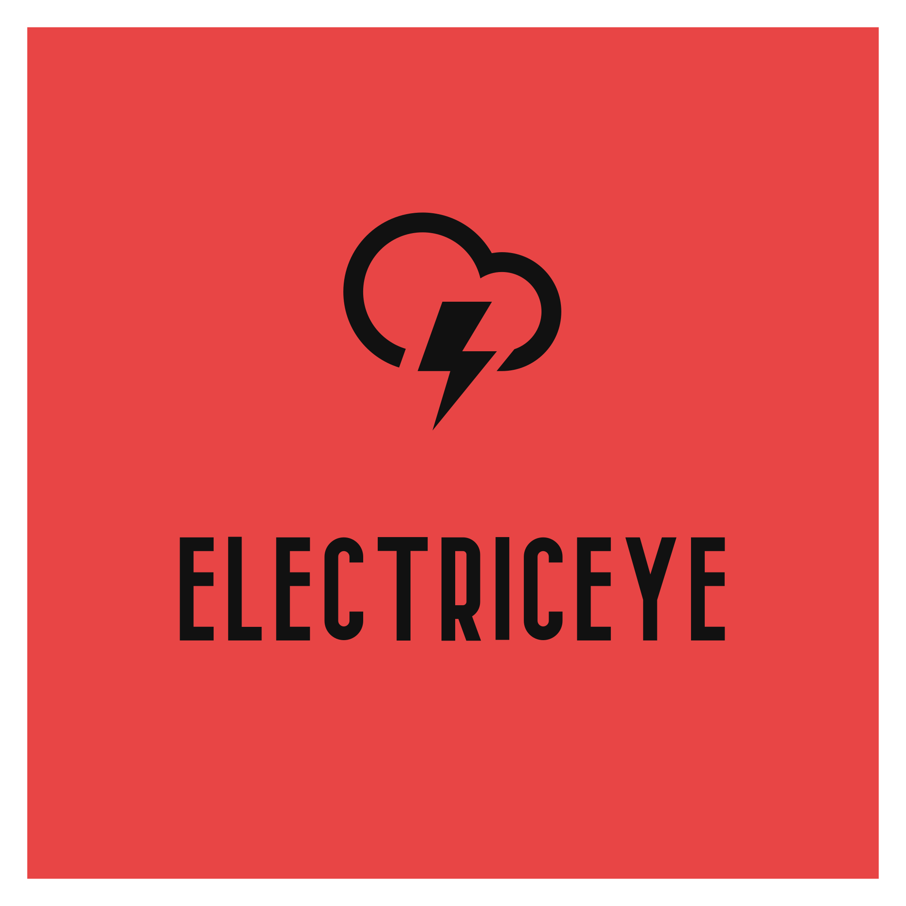
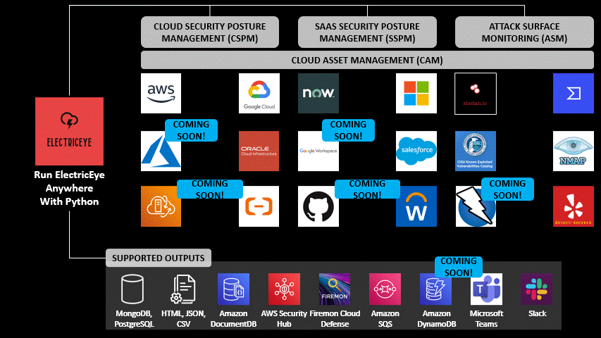

# ElectricEye

<p align="center">
  
</p>

ElectricEye is a multi-cloud, multi-SaaS Python CLI tool for Asset Management, Security Posture Management & Attack Surface Monitoring supporting 100s of services and evaluations to harden your CSP & SaaS environments with controls mapped to over 20 industry, regulatory, and best practice controls frameworks.

     

<p>
  <a href="https://hub.docker.com/r/electriceye/electriceye"></a>
  <a href="https://hub.docker.com/r/electriceye/electriceye"></a>
  <a href="https://github.com/jonrau1/ElectricEye"></a>
  <a href="https://github.com/jonrau1/ElectricEye/issues"></a>
  <a href="https://github.com/jonrau1/ElectricEye"></a>
  <a href="https://github.com/jonrau1/ElectricEye"></a>
</p>

<p align="center">
  <a href="https://gallery.ecr.aws/t4o3u7t2/electriceye"></a>
  <a href="https://hub.docker.com/r/electriceye/electriceye"></a>
</p>

***Up here in space***<br/>
***I'm looking down on you***<br/>
***My lasers trace***<br/>
***Everything you do***<br/>
<sub>*Judas Priest, 1982*</sub>

## Table of Contents

- [Workflow](#workflow)
- [Quick Run Down](#quick-run-down-running-running)
- [Configuring ElectricEye](#configuring-electriceye)
- [ElectricEye on Docker](#electriceye-on-docker)
- [Cloud Asset Management](#cloud-asset-management-cam)
- [Outputs](./docs/outputs/OUTPUTS.md)
- [FAQ](./docs/faq/FAQ.md)
- [Supported Services and Checks](#supported-services-and-checks)
- [Contributing](#contributing)
- [Developer & Testing Guide](./docs/new_checks/DEVELOPER_GUIDE.md)
- [Repository Security](#repository-security)
- [License](#license)

## Workflow



## Quick Run Down :running: :running:

- ElectricEye is a Python CLI tool that offers cross-Account, cross-Region, multi-Cloud & SaaS Asset Management, Security Posture Management, and Attack Surface Monitoring capabilities across [AWS, all Partitions supported!](https://aws.amazon.com/), [GCP](https://cloud.google.com/), [Oracle Cloud Infrastructure (OCI)](https://www.oracle.com/cloud/), [ServiceNow](https://www.servicenow.com/), [Microsoft 365 Enterprise (*M365*)](https://www.microsoft.com/en-us/microsoft-365/compare-microsoft-365-enterprise-plans), and [Salesforce (*SFDC*)](https://help.salesforce.com/s), *with more on the way*.

- ElectricEye offers over *1000* Checks against security, resilience, performance, and financial best practices across more than 100 CSP & SaaS services, including atypical services not supported by CSP/SaaS-native asset management tools/views or mainstream CSPM & CNAPP tools.

- Every single Check is mapped to over 20 controls frameworks covering general best practices, regulatory, industry-specific, and legal frameworks such as NIST CSF, AICPA TSCs (for SOC 2), the HIPAA Security Rule, NIST 800-171 Rev. 2, CMMC V2.0, European Central Bank's CROE Section 2, PCI-DSS V4.0, CIS Foundations Benchmarks, and more!

- Multi-faceted Attack Surface Monitoring uses tools such as VirusTotal, Nmap, Shodan.io, Detect-Secrets, and CISA's KEV to locate assets indexed on the internet, find exposed services, locate exploitable vulnerabilities, and malicious packages in artifact repositories, respectively.

- Outputs to [AWS Security Hub](https://aws.amazon.com/security-hub/), the [Open Cyber Security Framework (OCSF)](https://github.com/ocsf/) [V1.1.0](https://schema.ocsf.io/1.1.0/?extensions=) in JSON, [AWS DocumentDB](https://aws.amazon.com/documentdb/), JSON, CSV, HTML Reports, [MongoDB](https://www.mongodb.com/), [Amazon SQS](https://aws.amazon.com/sqs/), [PostgreSQL](https://www.postgresql.org/), [Slack](https://slack.com/) (via Slack App Bots), and [FireMon Cloud Defense](https://www.firemon.com/introducing-disruptops/).

ElectricEye's core concept is the **Auditor** which are sets of Python scripts that run **Checks** per Service dedicated to a specific SaaS vendor or public cloud service provider called an **Assessment Target**.  You can run an entire Assessment Target, a specific Auditor, or a specific Check within an Auditor. After ElectricEye is done with evaluations, it supports over a dozen types of **Outputs** ranging from an HTML executive report to AWS DocumentDB clusters - you can run multiple Outputs as you see fit.

ElectricEye also uses utilizes other tools such as [Shodan.io](https://www.shodan.io/), [Yelp's `detect-secrets`](https://pypi.org/project/detect-secrets/), [VirusTotal](https://www.virustotal.com/gui/home/upload), the [United States Cyber and Infrastructure Security Agency (CISA)](https://www.cisa.gov/) [Known Exploited Vulnerability (KEV)](https://www.cisa.gov/known-exploited-vulnerabilities-catalog) Catalog, and [NMAP](https://nmap.org/) for carrying out its Checks and enriching their findings.

1. First, clone this repository and install the requirements using `pip3`: `pip3 install -r requirements.txt`.

2. If you are evaluating anything other than your local AWS Account, modify the [TOML configuration](./eeauditor/external_providers.toml)  located in `ElectricEye/eeauditor/external_providers.toml`, or provide a path to your own with with `--toml-path`. The TOML file specifies multi-account, mulit-region, credential, and output specifics.

3. Finally, run the Controller to learn about the various Checks, Auditors, Assessment Targets, and Outputs.

```
python3 eeauditor/controller.py --help
Usage: controller.py [OPTIONS]

Options:
  -t, --target-provider [AWS|Azure|OCI|GCP|Servicenow|M365|Salesforce]        
                                  CSP or SaaS Vendor Assessment Target, ensure
                                  that any -a or -c arg maps to your target   
                                  provider e.g., -t AWS -a
                                  Amazon_APGIW_Auditor
  -a, --auditor-name TEXT         Specify which Auditor you want to run by    
                                  using its name NOT INCLUDING .py. Defaults  
                                  to ALL Auditors
  -c, --check-name TEXT           A specific Check in a specific Auditor you  
                                  want to run, this correlates to the function
                                  name. Defaults to ALL Checks
  -d, --delay INTEGER             Time in seconds to sleep between Auditors   
                                  being ran, defaults to 0
  -o, --outputs TEXT              A list of Outputs (files, APIs, databases,  
                                  ChatOps) to send ElectricEye Findings,      
                                  specify multiple with additional arguments: 
                                  -o csv -o postgresql -o slack  [default:    
                                  stdout]
  --output-file TEXT              For file outputs such as JSON and CSV, the  
                                  name of the file, DO NOT SPECIFY .file_type 
                                  [default: output]
  --list-options                  Lists all valid Output options
  --list-checks                   Prints a table of Auditors, Checks, and     
                                  Check descriptions to stdout - use this for 
                                  -a or -c args
  --create-insights               Create AWS Security Hub Insights for
                                  ElectricEye. This only needs to be done once
                                  per Account per Region for Security Hub
  --list-controls                 Lists all ElectricEye Controls (e.g. Check
                                  Titles) for an Assessment Target
  --toml-path TEXT                The full path to the TOML file used for
                                  configure e.g.,
                                  ~/path/to/mydir/external_providers.toml. If
                                  this value is not provided the default path
                                  of ElectricEye/eeauditor/external_providers.
                                  toml is used.
  --help                          Show this message and exit.
```

For more information see [here](#configuring-electricey), you can read the [FAQ here](./docs/faq/FAQ.md), information on [Outputs is here](./docs/outputs/OUTPUTS.md) or, if you want a more in-depth analysis of the control flow and concepts review [the Developer Guide](./docs/new_checks/DEVELOPER_GUIDE.md).

## Configuring ElectricEye

Refer to sub-headings for per-CSP or per-SaaS setup instructions. Go to [Outputs](./docs/outputs/OUTPUTS.md) to, well, learn about Outputs and examples.

### Public Cloud Service Providers

- [For Amazon Web Services (AWS)](./docs/setup/Setup_AWS.md)
- [For Google Cloud Platform (GCP)](./docs/setup/Setup_GCP.md)
- [For Oracle Cloud Infrastructure](./docs/setup/Setup_OCI.md)

The following Cloud Service Providers are on the Roadmap

- [For Microsoft Azure (*Coming Soon*)](./docs/setup/Setup_Azure.md)
- [For Alibaba Cloud (*Coming Soon*)](./docs/setup/Setup_AlibabaCloud.md)
- [For VMWare Cloud on AWS (*Coming Soon*)](./docs/setup/Setup_VMC.md)

### Software-as-a-Service (SaaS) Providers

- [For ServiceNow](./docs/setup/Setup_ServiceNow.md)
- [For Microsoft M365](./docs/setup/Setup_M365.md)
- [For Salesforce](./docs/setup/Setup_Salesforce.md)

The following SaaS Providers are on the Roadmap

- [For Workday ERP (*Coming Soon*)](./docs/setup/Setup_WorkDay.md)
- [For GitHub (*Coming Soon*)](./docs/setup/Setup_GitHub.md)
- [For Google Workspaces (*Coming Soon*)](./docs/setup/Setup_Google_Workspaces.md)

## ElectricEye on Docker

After configuring ElectricEye for your environment(s) using the [TOML configuration](./eeauditor/external_providers.toml), you can instead utilize Docker to run ElectricEye which have images maintained on ECR Public, Oracle Cloud Container Registry (OCR), and Docker Hub. You can read more about the security assurance activities [here](#repository-security), in the future more Registries and image signing will be utilized.

### Building Images

If you would rather build your own image use the following commands. Be sure to add `sudo` if you do not have a `docker` user properly setup in your system.

```bash
git clone https://github.com/jonrau1/ElectricEye.git
cd ElectricEye
docker build -t electriceye:local .
```

From here you can push to your repository of choice, be sure to change the tag from `local` to whichever tag your repository is expecting or whatever you prefer. Maybe just `latest`, like a decabillionaire sigma grindset gigachad?

### Pulling Images

You can also pull an ElectricEye image from the various repositories, a `latest` image tag will always be pushed alongside an image tagged with the SHA hash of the workflow `${{ github.sha }}` and can be viewed within the various GitHub Action Workflows within the `Print Image` step.

To pull from the various repositories, use these commands, you can replace `latest` as you see fit. The dependencies within ElectricEye stay relatively stable until a new cloud or major integration is added. Check the Pull Requests for more information to be sure.

- Amazon Elastic Container Registry (ECR) Public: `docker pull public.ecr.aws/t4o3u7t2/electriceye:latest` 

- Oracle Cloud Infrastructure Registry (OCIR): `docker pull iad.ocir.io/idudmagprsdi/electriceye:latest`

- Docker Hub: `docker pull electriceye/electriceye`

### Setting up a Session

#### NOTE!! You can skip this section if you are using hard-coded credentials in your TOML and if you will not be using any AWS Output or running any AWS Auditors

When interacting with AWS credential stores such as AWS Systems Manager, AWS Secrets Manager and Outputs such as AWS Security and for Role Assumption into the Role specified in the `aws_electric_eye_iam_role_name` TOML parameter, ElectricEye uses your current (default) Boto3 Session which is derived from your credentials.

Running ElectricEye from AWS Infrastructure that has an attached Role, or running from a location with `aws cli` credentials already instantiated, this is handled transparently. 

When using Docker, you will need to provide [Environment Variables](https://boto3.amazonaws.com/v1/documentation/api/latest/guide/configuration.html#using-environment-variables) directly to the Container.

Ensure that if you will be using AWS SSM (`ssm:GetParameter`), AWS Secrets Manager (`secretsmanager:GetSecretValue`), AWS Security Hub (`securityhub:BatchImportFindings`), Amazon SQS (`sqs:SendMessage`), and/or Amazon DynamoDB (`dynamodb:PutItem`) for credentials and Outputs that you have the proper permissions! You will likely also require `kms:Decrypt` depending if you are using AWS Key Management Service (KMS) Customer-managed Keys (CMKs) for your secrets/parameters encryption.

You will need `sts:AssumeRole` to assume into the Role specified in the `aws_electric_eye_iam_role_name` TOML parameter.

You will need to pass in your AWS Region, an AWS Access Key, and an AWS Secret Access Key. If you are NOT using an AWS IAM User with Access Keys you will need to also provide an AWS Session Token which is produced by temporary credentials such as an IAM Role or EC2 Instance Profile.

If you are using a User, proceed to the next step, you will need to have your credentials ready to copy. If you are using an EC2 Instance Profile or an additional IAM Role you will Assume, ensure you have `jq` installed: `apt install -y jq` or `yum install jq`.

> - To Assume an IAM Role and retrieve the temporary credentials

```bash
AWS_ACCOUNT_ID=$(aws sts get-caller-identity | jq -r '.Account')
MY_ROLE_NAME='iam-role-name'
TEMP_CREDS=$(aws sts assume-role --role-arn arn:aws:iam::$AWS_ACCOUNT_ID:role/$MY_ROLE_NAME --role-session-name ElectriceyeForDocker)
AWS_ACCESS_KEY=$(echo $TEMP_CREDS | jq -r '.Credentials.AccessKeyId')
AWS_SECRET_KEY=$(echo $TEMP_CREDS | jq -r '.Credentials.SecretAccessKey')
AWS_SESSION_TOKEN=$(echo $TEMP_CREDS | jq -r '.Credentials.SessionToken')
MY_REGION='aws-region-here'
```

> - To retrieve temporary credentials for an EC2 Instance Profile using Instance Metadata Service Version 1

```bash
MY_INSTANCE_PROFILE_ROLE_NAME="my_ec2_role_name"
IMDS_SECURITY_CREDENTIALS=$(curl http://169.254.169.254/latest/meta-data/iam/security-credentials/$MY_INSTANCE_PROFILE_ROLE_NAME)
MY_REGION='my_aws_region'
AWS_ACCESS_KEY=$(echo $IMDS_SECURITY_CREDENTIALS | jq -r '.AccessKeyId')
AWS_SECRET_KEY=$(echo $IMDS_SECURITY_CREDENTIALS | jq -r '.SecretAccessKey')
AWS_SESSION_TOKEN=$(echo $IMDS_SECURITY_CREDENTIALS | jq -r '.Token')
```

> - To retrieve temporary credentials for an EC2 Instance Profile using Instance Metadata Service Version 2

```bash
MY_INSTANCE_PROFILE_ROLE_NAME="my_ec2_role_name"
TOKEN=$(curl -X PUT "http://169.254.169.254/latest/api/token" -H "X-aws-ec2-metadata-token-ttl-seconds: 300")
IMDSV2_SECURITY_CREDENTIALS=$(curl -H "X-aws-ec2-metadata-token: $TOKEN" http://169.254.169.254/latest/meta-data/iam/security-credentials/$MY_INSTANCE_PROFILE_ROLE_NAME)
MY_REGION='my_aws_region'
AWS_ACCESS_KEY=$(echo $IMDSV2_SECURITY_CREDENTIALS | jq -r '.AccessKeyId')
AWS_SECRET_KEY=$(echo $IMDSV2_SECURITY_CREDENTIALS | jq -r '.SecretAccessKey')
AWS_SESSION_TOKEN=$(echo $IMDSV2_SECURITY_CREDENTIALS | jq -r '.Token')
```

You can also retrieve temporary credentials from Federated identities, read more at the links for [AssumeRoleWithWebIdentity](https://docs.aws.amazon.com/STS/latest/APIReference/API_AssumeRoleWithWebIdentity.html) or [AssumeRoleWithSAML](https://docs.aws.amazon.com/STS/latest/APIReference/API_AssumeRoleWithSAML.html) or refer to the larger temporary credential documentation [here](https://docs.aws.amazon.com/IAM/latest/UserGuide/id_credentials_temp_request.html#api_assumerole).

### Running ElectricEye Container

Run ElectricEye using the following commands, passing in your Session credentials. Change the commands within the container to evaluate different environments with ElectricEye. Change the value of `/path/to/my/external_providers.toml` to your exact path, such as `~/electriceye-docker/external_providers.toml` for example.

**IMPORTANT NOTE** If you are using an AWS IAM User with Access Keys, hardcode the values and omit the value for `AWS_SESSION_TOKEN`!! If you are running this container on an AWS container/Kubernetes service you do not need to provide these values!

```bash
sudo docker run \
    --user eeuser:eeuser \
    -e AWS_DEFAULT_REGION=$MY_REGION \
    -e AWS_ACCESS_KEY_ID=$AWS_ACCESS_KEY \
    -e AWS_SECRET_ACCESS_KEY=$AWS_SECRET_KEY \
    -e AWS_SESSION_TOKEN=$AWS_SESSION_TOKEN \
    -v /path/to/my/external_providers.toml:/eeauditor/external_providers.toml \
    electriceye /bin/bash -c "python3 eeauditor/controller.py --help"
```

To save a local file output such as `-o json`. `-o cam-json`, `-o csv`, or `-o html` and so on, ensure that you specify a file name that begins with `/eeauditor/` as the `eeuser` within the Docker Image only has permissions within that directory.

To remove the files you cannot use `docker cp` but you can submit the file to remote APIs you have control of by `base64` encoding the output or you can use the Session with AWS S3 permissions to upload the file to S3.

If you are evaluating Oracle Cloud or Google Cloud Platform, your credentials will be locally loaded and you can upload to Oracle Object Storage or Google Cloud Storage buckets, respectively.

```bash
BUCKET_NAME="your_s3_bucket_you_have_access_to"
sudo docker run \
    --user eeuser:eeuser \
    -e AWS_DEFAULT_REGION=$MY_REGION \
    -e AWS_ACCESS_KEY_ID=$AWS_ACCESS_KEY \
    -e AWS_SECRET_ACCESS_KEY=$AWS_SECRET_KEY \
    -e AWS_SESSION_TOKEN=$AWS_SESSION_TOKEN \
    -v /path/to/my/external_providers.toml:/eeauditor/external_providers.toml \
    electriceye /bin/bash -c "python3 eeauditor/controller.py -t AWS -o json --output-file /eeauditor/my-aws-findings \
    && aws s3 cp /eeauditor/my-aws-findings.json s3://$BUCKET_NAME/eefindings.json"
```

For more configuration information ensure you refer back to the per-Provider setup instructions.

## Cloud Asset Management (CAM)

For more information on ElectricEye's CAM concept of operations and schema, refer to [the Asset Management documentation](./docs/asset_management/ASSET_MANAGEMENT.md).

## Supported Services and Checks

In total there are:

- **4** Supported Public CSPs: `AWS`, `GCP`, `OCI`, and `Azure`
- **3** Supported SaaS Providers: `ServiceNow`, `M365`, and `Salesforce`
- **1055** ElectricEye Checks
- **161** Supported CSP & SaaS Asset Components across all Services
- **120** ElectricEye Auditors

The tables of supported Services and Checks have been migrated to the respective per-Provider setup documentation linked above in [Configuring ElectricEye](#configuring-electriceye).

## Contributing

Refer to the [Developer Guide](./docs/new_checks/DEVELOPER_GUIDE.md) for instructions on how to produce new checks, for new SaaS and CSP support please open an Issue.

Feel free to open PRs and Issues where syntax, grammatic, and implementation errors are encountered in the code base.

### ElectricEye is for sale

Hit me up at opensource@electriceye.cloud (I don't actually have a SaaS tool) and I'll gladly sell the rights to this repo and take it down and give you all of the domains and even the AWS Accounts that I use behind the scenes.

### Early Contributors

Quick shout-outs to the folks who answered the call early to test out ElectricEye and make it not-a-shit-sandwich.

##### Alpha Testing:

- [Mark Yancey](https://www.linkedin.com/in/mark-yancey-jr-aspiring-cloud-security-professional-a52bb9126/)

##### Beta Testing:

- [Martin Klie](https://www.linkedin.com/in/martin-klie-0600845/)
- [Joel Castillo](https://www.linkedin.com/in/joelbcastillo/)
- [Juhi Gupta](https://www.linkedin.com/in/juhi-gupta-09/)
- [Bulent Yidliz](https://www.linkedin.com/in/bulent-yildiz/)
- [Guillermo Ojeda](https://www.linkedin.com/in/guillermoojeda/)
- [Dhilip Anand Shivaji](https://www.linkedin.com/in/dhilipanand/)
- [Arek Bar](https://www.linkedin.com/in/arkadiuszbar/)
- [Ryan Russel](https://www.linkedin.com/in/pioneerrussell/)
- [Jonathan Nguyen](https://www.linkedin.com/in/jonanguyen/)
- [Jody Brazil](https://www.linkedin.com/in/jodybrazil/)
- [Dylan Shields](https://www.linkedin.com/in/dylan-shields-6802b1168/)
- [Manuel Leos Rivas](https://www.linkedin.com/in/manuel-lr/)
- [Andrew Alaniz](https://www.linkedin.com/in/andrewdalaniz/)
- [Christopher Childers](https://www.linkedin.com/in/christopher-childers-28950537/)

## Repository Security

Since ElectricEye is a security tool, it only makes sense to ensure a high-level of security of components are maintained. To that end the following tools are configured for usage. Refer to the build badges and Actions for detailed information about each run.

#### [`Syft`](https://github.com/anchore/syft)

See [results here](https://github.com/jonrau1/ElectricEye/actions/workflows/sbom-vulns.yml)!

A CLI tool and Go library for generating a Software Bill of Materials (SBOM) from container images and filesystems.

ElectricEye uses Syft to build an SBOM off of a built ElectricEye Docker Image in CycloneDX format and upload it as an artifact to every succesful GitHub Action run.

#### [`Grype`](https://github.com/anchore/grype)

See [results here](https://github.com/jonrau1/ElectricEye/actions/workflows/sbom-vulns.yml)!

A vulnerability scanner for container images and filesystems. Easily install the binary to try it out. Works with Syft, the powerful SBOM (software bill of materials) tool for container images and filesystems.

ElectricEye passes the CycloneDX SBOM from `Syft` to `Grype` to perform vulnerability scans on the built Docker image which combines all Python dependencies and built-in methods within the `alpine` Docker Image parent that ElectricEye uses. Builds with critical vulnerabilities are broken automatically. The results are posted to the GitHub Action and uploaded as `sarif` to GitHub Security

#### [`Dependabot`](https://github.com/dependabot)

Dependabot alerts tell you that your code depends on a package that is insecure. If your code depends on a package with a security vulnerability, this can cause a range of problems for your project or the people who use it. You should upgrade to a secure version of the package as soon as possible. If your code uses malware, you need to replace the package with a secure alternative.

ElectricEye uses Dependabot as a Software Composition Analysis (SCA) tool to run daily scans and open Pull Requests in the event that a Docker, Python, or GitHub-Action dependency requires a security patch.

#### [`CodeQL`](https://docs.github.com/en/code-security/code-scanning/automatically-scanning-your-code-for-vulnerabilities-and-errors/about-code-scanning-with-codeql)

See [results here](https://github.com/jonrau1/ElectricEye/actions/workflows/codeql-analysis.yml)!

CodeQL is the code analysis engine developed by GitHub to automate security checks. You can analyze your code using CodeQL and display the results as code scanning alerts.

ElectricEye uses `codeql` as a Static Application Security Testing (SAST) tool to scan all Auditors which are written in Python, `codeql` also looks for secrets in code. It is ran on push and on a schedule.

## License

This library is licensed under the Apache-2.0 License. See the LICENSE file.