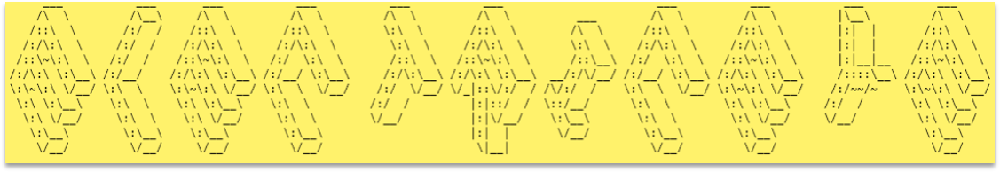
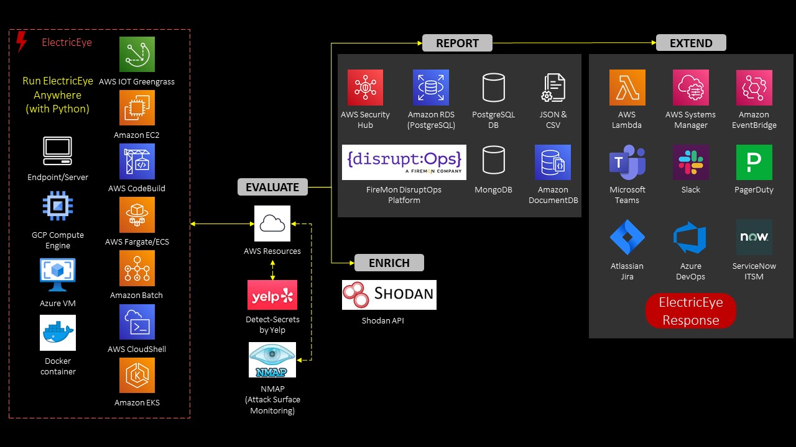
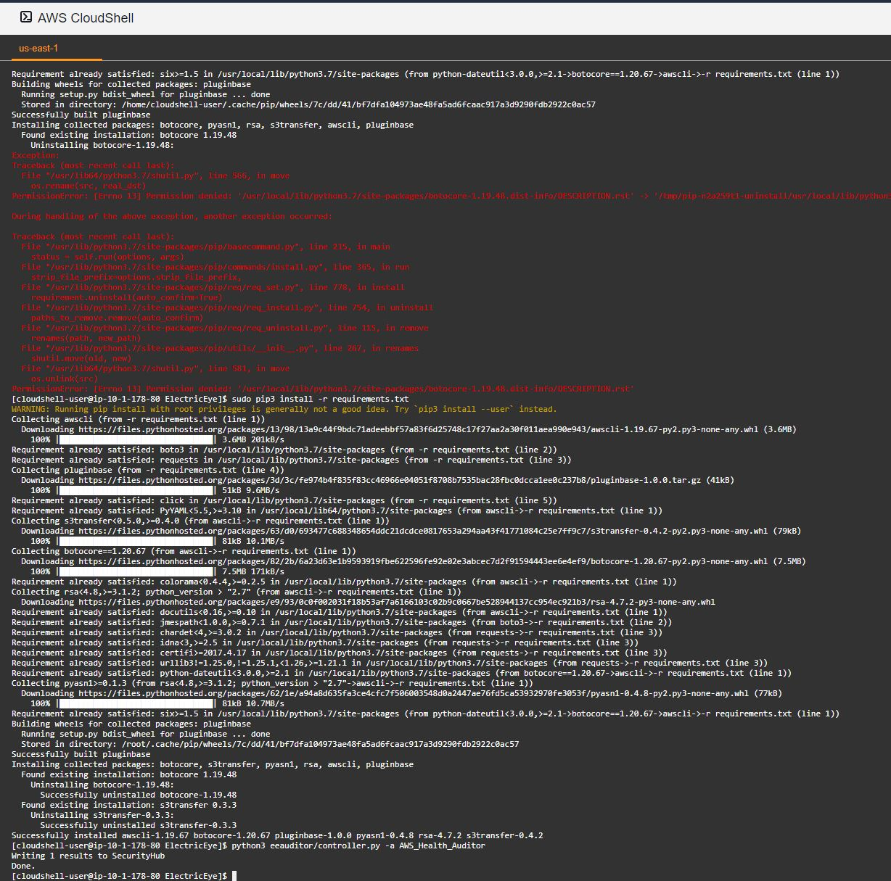

# ElectricEye



Continuously monitor your AWS services for configurations that can lead to degradation of confidentiality, integrity or availability. All results will be sent to Security Hub for further aggregation and analysis.

***Up here in space***<br/>
***I'm looking down on you***<br/>
***My lasers trace***<br/>
***Everything you do***<br/>
<sub>*Judas Priest, 1982*</sub>

## Table of Contents

- [Synopsis](#synopsis)
- [Description](#description)
- [Solution Architecture](#solution-architecture)
- [Running locally](#running-locally)
  - [ElectricEye and Custom Outputs](#electriceye-and-custom-outputs)
- [Setting Up on Fargate](#setting-up-electriceye-on-fargate)
  - [Solution Architecture for Fargate](#aws-fargate-solution-architecture)
  - [Build and push the Docker image](#build-and-push-the-docker-image)
  - [(OPTIONAL) Setup Shodan.io API Key](#optional-setup-shodanio-api-key)
  - [(OPTIONAL) Setup DisruptOps Client Id and API Key](#optional-setup-disruptops-client-id-and-api-key)
  - [Setup baseline infrastructure via Terraform](#setup-baseline-infrastructure-via-terraform)
  - [Setup baseline infrastructure via AWS CloudFormation](#setup-baseline-infrastructure-via-aws-cloudformation)
  - [Manually execute the ElectricEye ECS Task](#manually-execute-the-electriceye-ecs-task-you-only-need-to-do-this-once)
- [Supported Services and Checks](#supported-services-and-checks)
- [Add-on Modules](#add-on-modules)
  - [ElectricEye-Response](https://github.com/jonrau1/ElectricEye/blob/master/add-ons/electriceye-response)
  - [ElectricEye-ChatOps](https://github.com/jonrau1/ElectricEye/blob/master/add-ons/electriceye-chatops)
  - [ElectricEye-Pagerduty-Integration](https://github.com/jonrau1/ElectricEye/blob/master/add-ons/electriceye-pagerduty-integration)
  - [ElectricEye-Reports](https://github.com/jonrau1/ElectricEye/blob/master/add-ons/electriceye-reports)
- [Known Issues & Limitiations](#known-issues--limitations)
- [FAQ](./faq)
- [Contributing](#contributing)
- [Developing new Checks](#developer-guide)
- [Auditor testing](#auditor-testing)
- [License](#license)

## Synopsis

- **320+ security & AWS best practice detections** including services not covered by Security Hub/Config (MemoryDB, Cognito, EKS, ECR, DocDB, Amazon Managed Blockchain, etc.), all findings are **aligned to NIST CSF, NIST 800-53, AICPA TSC and ISO 27001:2013**

- Supports every **AWS Region and Partition**: Commercial (`aws`), AWS GovCloud (`aws-gov`), AWS China (`aws-cn`), AWS Secret (`aws-iso-b`) and AWS Top Secret (`aws-iso`). AWS Commercial partition supports selective muting of unsupported Regions for services supported by ElectricEye.

- Built with **full AWS Security Hub support** in mind, can optionally output to JSON or CSV. **Can run as a CLI tool, in Fargate, as a standalone Container, or anywhere else** you can run Python (K8s, Batch, CodeBuild, EC2, etc.)

- **Multiple add-ons enable automated remediation, ChatOps, and other integrations** with third-party tools such as [DisruptOps (a FireMon company)](https://www.firemon.com/products/disruptops/), [PagerDuty](https://www.pagerduty.com/), [Slack](https://slack.com/), [ServiceNow Incident Management](https://docs.servicenow.com/bundle/rome-it-service-management/page/product/incident-management/concept/c_IncidentManagement.html), [Atlassian Jira](https://www.atlassian.com/software/jira), [Azure DevOps Boards](https://azure.microsoft.com/en-us/services/devops/boards/), [Shodan](https://www.shodan.io/) and [Microsoft Teams](https://www.microsoft.com/en-us/microsoft-teams/group-chat-software)

## Description

ElectricEye is a set of Python scripts (affectionately called **Auditors**) that continuously monitor your AWS infrastructure looking for configurations related to confidentiality, integrity and availability that do not align with AWS best practices. All **Auditors** are controlled via a centralized controller in the CLI, and can be expanded to cover more services, new checks, or customization of the AWS Security Finding Format (ASFF). All findings from these scans will be sent to AWS Security Hub where you can perform basic correlation against other AWS and 3rd Party services that send findings to Security Hub (optionally you can send findings to DisruptOps, CSV, JSON or PostgreSQL). Security Hub also provides a centralized view from which account owners and other responsible parties can view and take action on findings. ElectricEye supports all AWS Partitions as well, even ones it is not in yet, like the Secret / Top Secret Regions.

ElectricEye was originally designed to run on AWS Fargate, which is a serverless container orchestration service, however you can also run it via a CLI anywhere you have the required dependencies installed and IAM Permissions. On a schedule, Fargate will download all of the auditor scripts from a S3 bucket, run the checks and send results to Security Hub. All infrastructure will be deployed via CloudFormation or Terraform to help you apply this solution to many accounts and/or regions. All findings (passed or failed) will contain AWS documentation references in the `Remediation.Recommendation` section of the ASFF (and the **Remediation** section of the Security Hub UI) to further educate yourself and others on.

ElectricEye comes with several add-on modules to extend the core model which provides dozens of detection-based controls. ElectricEye-Response provides a multi-account response and remediation platform (also known as SOAR), ElectricEye-ChatOps integrates with Slack/Pagerduty/Microsoft Teams, and ElectricEye-Reports integrates with QuickSight. All add-ons are supported by both CloudFormation and Terraform and can also be used independently of the core module itself. ElectricEye also serves an unofficial integration of sorts for other AWS Services who have not yet integrated with AWS Security Hub, such as AWS Health, AWS Trusted Advisor, AWS Shield Advanced, and AWS IOT Device Defender.

Numerous personas can make effective usage of ElectricEye such as: Security Operations (SecOps), DevOps, DevSecOps, IT Audit, Governance/Risk/Compliance (GRC) Analysts, Enterprise Architects, Security Architects, Cloud Center of Excellence (CCOE) Engineers, Software Development Engineers (SDEs) using Cloud-native services, Red Teamers, Purple Teamers, and Security Engineering.

**Note**: If you would like to use the "classic" version of ElectricEye it is available in [this branch](https://github.com/jonrau1/ElectricEye/tree/electriceye-classic), however, it will not include any new auditors for services such as QLDB, RAM, etc. Some screenshots may not work correctly due to the linking, sorry about that.

**Note:**: If you are working on another project whether open-source or commercial and want to include parts of ElectricEye (or the full thing) in your product / project, please contact me and at least give me credit. At the very least I can help you integrate and I'd appreciate any cool features you add being partially added back upstream!

## Solution Architecture

**Note:** This high level architecture shows potential places to run ElectricEye, as of V2.0 ElectricEye now uses a controller CLI mechanism that does not rely on running in Fargate (though you can still do that). Theoretically you should be able to run ElectricEye anywhere you have at least `Python 3.6` installed with access to required AWS credentials and Python dependencies.



> - You run ElectricEye anywhere you have AWS Credentials and the [required IAM Permissions](policies/Instance_Profile_IAM_Policy.json) - this can be on a Raspberry Pi, a Google Compute Engine instance, on AWS EKS or Amazon EC2.

> - ElectricEye will evaluate all resources in scope using **Auditors** and write the findings to a local cache

> - If supplied, ElectricEye will evaluate specific internet-facing AWS services against indexed results on Shodan.io as additional enrichment.

> - ElectricEye will report all findings to AWS Security Hub, if configured ElectricEye can also output to CSV and JSON files or to a PostgreSQL Database (hosted on AWS RDS, or otherwise). Finally (and optionally) you can report findings to the [DisruptOps](https://disruptops.com/electriceye-v2-0/) platform which also has its [own integration with Security Hub](https://disruptops.com/cloud-providers/aws/).

> - Using add-ons and native AWS Security Hub integrations, you can extend your findings into other workflows using tools such as Azure DevOps Boards, Slack, PagerDuty, Teams, or otherwise.

## Running locally

**NOTE:** While this section is titled "Running Locally" - you can use the following setup to run anywhere you can run Python such as EKS, Kubernetes, a self-managed Docker Container, AWS CloudShell, etc. The usage of `venv` for those utilities is optional, but strongly recommended.

1. Navigate to the IAM console and click on **Policies** under **Access management**. Select **Create policy** and under the JSON tab, copy and paste the contents [Instance Profile IAM Policy](policies/Instance_Profile_IAM_Policy.json). Click **Review policy**, create a name, and then click **Create policy**.

2. Have `Python 3` and `Pip(3)` installed and setup virtualenv

```bash
pip3 install virtualenv --user
virtualenv .venv
```

3. This will create a virtualenv directory called .venv which needs to be activated

```bash
#For macOS and Linux
. .venv/bin/activate

#For Windows
.venv\scripts\activate
```

4. Install all dependencies

```bash
pip3 install -r requirements.txt
```

**NOTE:** If using AWS CloudShell you will need to use `pip3` with `sudo`:

```bash
sudo pip3 install -r requirements.txt
```



5. Run the controller

```bash
python3 eeauditor/controller.py
```

Add the `--help` option for info on running individual checks and auditors and different outputs options. For instance, if you wanted to specify a specific Auditor use the following command to run it, specifiy the *name* of the Auditor **without** the `.py` ending.

```bash
python3 eeauditor/controller.py -a AWS_IAM_Auditor
```

You can get a full name of the auditors (as well as their checks within comments by using the following command).

```bash
python3 eeauditor/controller.py --list-checks
```

### ElectricEye and Custom Outputs

While running on AWS Fargate and creating the infrastructure with CloudFormation or Terraform gives you the benefits of encapsulating environment variables you need, you may need to do configurations of your own different outputs. Using these different outputs like PostgreSQL, JSON, or CSV is great for any downstream use cases such as SIEM-ingestion, external tool reporting, business intelligence, machine learning, or loading a graph. Outputs are subject to change by release and will be updated here.

To list all currently available outputs: `python3 eeauditor/controller.py --list-options`, it will return a list of valid output locations such as `['postgres', 'sechub', 'json', 'csv', 'json_normalized', 'dops']`, by default findings go to AWS Security Hub (`sechub`).

Some considerations...

- To output to JSON, add the following arguments to your call to `controller.py`: `-o json --output-file electriceye-findings` (**Note:** `.json` will be automatically appended)

  - Normalized / flatteneded JSON can output instead using `-o json_normalized`. This is better suited for sending findings to BI tools as the structure eliminates all nested lists and dicts.

- To output to CSV, add the following arguments to your call to `controller.py`: `-o csv --output-file electriceye-findings` (**Note:** `.csv` will be automatically appended)

- To output to a PostgreSQL database, add the following arguement to your call to `controller.py`: `-o postgres`. You will also need to ensure that your IP Address (or AWS Security Group ID, if using Amazon RDS/Aurora) is allowed to communicate with your database. Plaintext passwords are frowned upon, so create an AWS Systems Manager Parameter Store secure parameter with the below command.

```bash
aws ssm put-parameter \
    --name $PLACEHOLDER \
    --description 'PostgreSQL Database Password' \
    --type SecureString --value $PLACEHOLDER
```

- To configure your ENV to have the proper outputs for PostgreSQL (provided youre on a Linux system) use the below `EXPORT` commands and switch any value that says `$PLACEHOLDER`, but keep the double quotes (`"`).

```bash
export POSTGRES_USERNAME="$PLACEHOLDER"
export ELECTRICEYE_POSTGRESQL_DB_NAME="$PLACEHOLDER"
export POSTGRES_DB_ENDPOINT="$PLACEHOLDER"
export POSTGRES_DB_PORT="$PLACEHOLDER"
export POSTGRES_PASSWORD_SSM_PARAM_NAME="$PLACEHOLDER"
```

- To output to the DisruptOps Platform , add the following arguement to your call to `controller.py`: `-o dops`. You will need to create two AWS Systems Manager Parameter Store secure parameters for your API Key and Client ID within the DisruptOps platform, as shown below. Only change the `--value` entry for either, the names can stay the same.

```bash
aws ssm put-parameter \
    --name dops-client-id \
    --description 'DisruptOps client id' \
    --type SecureString \
    --value <CLIENT-ID-HERE>
```

```bash
aws ssm put-parameter \
    --name dops-api-key \
    --description 'DisruptOps api key' \
    --type SecureString \
    --value <API-KEY-HERE>
```

- To configure your ENV to have the proper outputs for DisruptOps (provided youre on a Linux system) use the below `EXPORT` commands.

```bash
export DOPS_CLIENT_ID_PARAM="dops-client-id"
export DOPS_API_KEY_PARAM="dops-api-key"
```

- To output to a AWS DocumentDB database, add the following arguement to your call to `controller.py`: `-o docdb`. You will also need to ensure that your DocDB security group allows you to communicate with your database. Plaintext passwords are frowned upon, so create an AWS Systems Manager Parameter Store secure parameter with the below command, switch any value that says `$PLACEHOLDER`, but keep the double quotes (`"`)..

```bash
aws ssm put-parameter \
    --name $PLACEHOLDER \
    --description 'AWS DocDB Database Password' \
    --type SecureString --value $PLACEHOLDER
```

- To configure your ENV to have the proper outputs for AWS DocumentDB use the below `EXPORT` commands and switch any value that says `$PLACEHOLDER`, but keep the double quotes (`"`).

```bash
export MONGODB_USERNAME="$PLACEHOLDER"
export MONGODB_HOSTNAME="$PLACEHOLDER"
export MONGODB_PASSWORD_PARAMETER="$PLACEHOLDER"
```

- If you will be using Shodan.io to gain information about your public facing assets, retrieve your API key [from your account here](https://developer.shodan.io/dashboard), and then create an AWS Systems Manager Parameter Store secure parameter with the below command. Only change the `--value` entry for either, the name can stay the same.

```bash
aws ssm put-parameter \
    --name electriceye-shodan-api-key \
    --description 'Shodan.io API Key' \
    --type SecureString \
    --value <API-KEY-HERE>
```

- To configure your ENV to have the proper values for Shodan (provided youre on a Linux system) use the below `EXPORT` commands.

```bash
export SHODAN_API_KEY_PARAM="electriceye-shodan-api-key"
```

## Setting Up ElectricEye on Fargate

### AWS Fargate Solution Architecture

This "old" architecture diagram represents what is deployed by CloudFormation and Terraform to use ElectricEye on Fargate with EventBridge Scheduled Rules. You can opt to use the CLI directly instead of this pattern.


1. A [time-based CloudWatch Event](https://docs.aws.amazon.com/AmazonCloudWatch/latest/events/ScheduledEvents.html) runs ElectricEye every 12 hours (default value).

2. The ElectricEye Task will pull the Docker image from [Elastic Container Registry (ECR)](https://aws.amazon.com/ecr/).

3. Systems Manager Parameter Store passes the bucket name from which Auditors are downloaded. Optionally, ElectricEye will retrieve you API key(s) for [DisruptOps](https://disruptops.com/features/) and [Shodan](https://www.shodan.io/explore), if those integrations are configured.

4. The ElectricEye task will execute all Auditors to scan your AWS infrastructure and deliver both passed and failed findings to Security Hub. **Note:** ElectricEye will query the Shodan APIs to see if there is a match against select internet-facing AWS resources if configured.

5. If configured, ElectricEye will send findings to DisruptOps. DisruptOps is also [integrated with Security Hub](https://disruptops.com/aws-security-management-with-securityhub/) and can optionally enforce guardrails and orchestrate security automation from within the platform.

Refer to the [Supported Services and Checks](#supported-services-and-checks) section for an up-to-date list of supported services and checks performed by the Auditors.

These steps are split across their relevant sections. All CLI commands are executed from an Ubuntu 18.04LTS [Cloud9 IDE](https://aws.amazon.com/cloud9/details/), modify them to fit your OS. 

**Note 1:** If you do use Cloud9, navigate to Settings (represented by a Gear icon) > AWS Settings and **unmark** the selection for `AWS managed temporary credentials` (move the toggle to your left-hand side) as shown below. If you do not, you instance profile will not apply properly.


**Note 2:** Ensure AWS Security Hub is enabled in the region you are attempting to run ElectricEye

**Note 3:** If you have never used ECS before you'll likely run into a problem with the service-linked role (SLR), or lack thereof, and you should follow the [instructions here](https://docs.aws.amazon.com/AmazonECS/latest/developerguide/using-service-linked-roles.html#service-linked-role-permissions) to have it created first


### Build and push the Docker image

**Note:** You must have [permissions to push images](https://docs.aws.amazon.com/AmazonECR/latest/userguide/docker-push-ecr-image.html) to ECR before performing this step. These permissions are not included in the instance profile example.

1. Update your machine and clone this repository

```bash
sudo apt update && sudo apt upgrade -y
sudo apt install -y unzip awscli docker.ce python3 python3-pip
pip3 install --upgrade pip
pip3 install --upgrade awscli
pip3 install --upgrade boto3
git clone https://github.com/jonrau1/ElectricEye.git
```

2. Create an ECR Repository with the AWS CLI

```bash
aws ecr create-repository \
    --repository-name electriceye \
    --image-scanning-configuration scanOnPush=true
```

3. Build and push the ElectricEye Docker image. Be sure to replace the values for your region, Account ID and name of the ECR repository

**Note**: If you are in GovCloud these commands are likely very different, please review for consistency (and open a PR if there is a better option for GovCloud)

```bash
cd ElectricEye
aws ecr get-login-password --region $AWS_REGION | sudo docker login --username AWS --password-stdin $AWS_ACCOUNT_ID.dkr.ecr.$AWS_REGION.amazonaws.com
```

**Note**: If you are using AWS CLI v1 use the following in place of the line above

```bash
sudo $(aws ecr get-login --no-include-email --region $AWS_REGION)
```

```bash
sudo docker build -t electriceye .
sudo docker tag electriceye:v1 $AWS_ACCOUNT_ID.dkr.ecr.$AWS_REGION.amazonaws.com/electriceye:v1
sudo docker push $AWS_ACCOUNT_ID.dkr.ecr.$AWS_REGION.amazonaws.com/electriceye:v1
```

4. Navigate to the ECR console and copy the `URI` of your Docker image. It will be in the format of **`$AWS_ACCOUNT_ID.dkr.ecr.<AWS_REGION.amazonaws.com/ElectricEye:latest`**. Save this as you will need it when configuring Terraform or CloudFormation.

### (OPTIONAL) Setup Shodan.io API Key

This is an **optional** step to setup a Shodan.io API key to determine if your internet-facing resources have been indexed. This is not an exact science as a lot of abstracted services (ES, RDS, ELB) share IP space with other resources and AWS addresses (non-EIP / BYOIP) are always change (such as when you have an EC2 instance shutoff for a prolonged period of time). You may end up having indexed resources that were indexed when someone else was using the IP space, you should still review it either way just to make sure.

1. Create a Shodan account and retrieve your Shodan.io API Key [from here](https://developer.shodan.io/dashboard).

2. Create a Systems Manager Parameter Store `SecureString` parameter for this API key:

```bash
aws ssm put-parameter \
    --name electriceye-shodan-api-key \
    --description 'Shodan.io API Key' \
    --type SecureString \
    --value <API-KEY-HERE>
```

In both the Terraform config files and CloudFormation templates the value for this key is prepopulated with the value `placeholder`, overwrite them with this parameter you just created to be able to use the Shodan checks.

### (OPTIONAL) Setup DisruptOps Client Id and API Key

This is an optional step to setup for sending findings to DisruptOps. 

1. Create a Systems Manager Parameter Store `SecureString` parameter for the client id: 

```bash
aws ssm put-parameter \
    --name dops-client-id \
    --description 'DisruptOps client id' \
    --type SecureString \
    --value <CLIENT-ID-HERE>
```

2. Create a Systems Manager Parameter Store `SecureString` parameter for this API key: 

```bash
aws ssm put-parameter \
    --name dops-api-key \
    --description 'DisruptOps api key' \
    --type SecureString \
    --value <API-KEY-HERE>
```

In both the Terraform config files and CloudFormation templates the value for this key is prepopulated with the value `placeholder`, overwrite them with this parameter you just created to be able to use DisruptOps.

### Setup baseline infrastructure via Terraform

Before starting [attach this IAM policy](https://github.com/jonrau1/ElectricEye/blob/master/policies/Instance_Profile_IAM_Policy.json) to your [Instance Profile](https://docs.aws.amazon.com/IAM/latest/UserGuide/id_roles_use_switch-role-ec2_instance-profiles.html) (if you are using Cloud9 or EC2).

**Important Note:** The policy for the instance profile is ***highly dangerous*** given the S3, VPC and IAM related permissions given to it, Terraform needs a wide swath of CRUD permissions and even permissions for things that aren't deployed by the config files. For rolling ElectricEye out in a Production or an otherwise highly regulated environment, consider adding [IAM Condition Keys](https://docs.aws.amazon.com/IAM/latest/UserGuide/reference_policies_actions-resources-contextkeys.html#context_keys_table), using CI/CD (no human access) and backing up your Terraform state files to a S3 backend to add guardrails around this deployment. I would avoid adding these permissions to an IAM user, and any roles that use this should only be assumable by where you are deploying it from, consider adding other Condition Keys to the Trust Policy.

In this stage we will install and deploy the ElectricEye infrastructure via Terraform. To securely backup your state file, you should explore the usage of a [S3 backend](https://www.terraform.io/docs/backends/index.html), this is also described in this [AWS Security Blog post](https://aws.amazon.com/blogs/security/how-use-ci-cd-deploy-configure-aws-security-services-terraform/).

1. Install the dependencies for Terraform.

**Note:** Ensure this is the latest version of Terraform, since authoring this tool, I do not make use of it anymore and rely on outside contributors to update the Configs.

```bash
wget https://releases.hashicorp.com/terraform/0.14.4/terraform_0.14.4_linux_amd64.zip
unzip terraform_0.14.4_linux_amd64.zip
sudo mv terraform /usr/local/bin/
terraform --version
```

2. Change directories and modify the `variables.tf` config file to include the URI of your Docker image and the name of your ECR Repository as shown in the screenshot below. Optionally replace the values of the Shodan API Key, DisruptOps Client Id, and DisruptOps API Key parameters with yours if you created them in the previous optional steps.

```bash
cd terraform-config-files
nano variables.tf
```


3. Initialize, plan and apply your state with Terraform, this step should not take too long.

```bash
terraform init
terraform plan
terraform apply -auto-approve
```

4. Navigate to the S3 console and locate the name of the S3 bucket created by Terraform for the next step. It should be in the format of `electriceye-artifact-bucket-(AWS_REGION)-(ACCOUNT-NUMBER)` if you left everything else default in `variables.tf`

5. Navigate to the `auditors` directory and upload the code base to your S3 bucket

```bash
cd -
cd eeauditor/auditors/aws
aws s3 sync . s3://<your-bucket-name>
```

6. Navigate to the `insights` directory and execute the Python script to have Security Hub Insights created. Insights are saved searches that can also be used as quick-view dashboards (though nowhere near the sophistication of a QuickSight dashboard)

```bash
cd -
cd insights
python3 electriceye-insights.py
```

In the next stage you will launch the ElectricEye ECS task manually because after Terraform deploys this solution it will automatically run, and it will fail due to a lack of Auditor scripts in the S3 bucket.

### Setup baseline infrastructure via AWS CloudFormation

1. Download the [CloudFormation template](https://github.com/jonrau1/ElectricEye/blob/master/cloudformation/ElectricEye_CFN.yaml) and create a Stack. Refer to the [Get Started](https://docs.aws.amazon.com/AWSCloudFormation/latest/UserGuide/GettingStarted.Walkthrough.html) section of the *AWS CloudFormation User Guide* if you have not done this before.

2. Enter the URI of the Docker image in the space for the parameter **ElectricEyeContainerInfo**. Leave all other parameters as the default value, unless you already used `10.77.0.0/16` as the CIDR for one of your VPCs and plan to attach this VPC to your [T-Gateway](https://aws.amazon.com/transit-gateway/). Optionally replace the values of the Shodan API Key, DisruptOps Client Id, and DisruptOps API Key parameters with yours if you created them in the previous optional steps and then create your stack.


**NOTE**: The Terraform implementation applies a resource-based repository policy that only allows access to the ElectricEye ECS IAM Roles (Execution & Task), if you want to apply something similar for CloudFormation you will need to issue the following ECR CLI command:

```bash
aws ecr set-repository-policy \
    --repository-name <ECR_REPO_NAME> \
    --policy-text file://my-policy.json
```

You can create `my-policy.json` with the below example, replace the values for `<Task_Execution_Role_ARN>` and `<Task_Role.arn>` as needed.

```json
{
  "Version": "2008-10-17",
  "Statement": [
    {
      "Sid": "new statement",
      "Effect": "Allow",
      "Principal": {
        "AWS": [
          "<Task_Execution_Role_ARN>",
          "<Task_Role.arn>"
        ],
        "Service": "ecs-tasks.amazonaws.com"
      },
      "Action": [
        "ecr:BatchCheckLayerAvailability",
        "ecr:BatchGetImage",
        "ecr:DescribeImages",
        "ecr:DescribeRepositories",
        "ecr:GetAuthorizationToken",
        "ecr:GetDownloadUrlForLayer",
        "ecr:GetRepositoryPolicy",
        "ecr:ListImages"
      ]
    }
  ]
}
```

3. Navigate to the S3 console and locate the name of the S3 bucket created by CloudFormation for the next step. It should be in the format of `electric-eye-artifact-bucket--(AWS_REGION)-(ACCOUNT-NUMBER)`

4. Navigate to the `auditors` directory and upload the code base to your S3 bucket

```bash
cd -
cd eeauditor/auditors/aws
aws s3 sync . s3://<your-bucket-name>
```

5. Navigate to the `insights` directory and execute the Python script to have Security Hub Insights created. Insights are saved searches that can also be used as quick-view dashboards (though nowhere near the sophistication of a QuickSight dashboard)

```bash
cd -
cd insights
python3 electriceye-insights.py
```

### Manually execute the ElectricEye ECS Task

In this stage we will use the console the manually run the ElectricEye ECS task, it is optional.

1. Navigate to the ECS Console, select **Task Definitions** and toggle the `electric-eye` task definition. Select the **Actions** dropdown menu and select **Run Task** as shown in the below screenshot.


2. Configure the following settings in the **Run Task** screen as shown in the screenshot below.

- Launch type: **Fargate**
- Platform version: **LATEST**
- Cluster: **electric-eye-vpc-ecs-cluster** (unless named otherwise)
- Number of tasks: **1**
- Task group: ***LEAVE THIS BLANK***
- Cluster VPC: **electric-eye-vpc**
- Subnets: ***any eletric eye Subnet***
- Security groups: **electric-eye-vpc-sec-group** (you will need to select **Modify** and choose from another menu)
- Auto-assign public IP: **ENABLED**


3. Select **Run task**, in the next screen select the hyperlink in the **Task** column and select the **Logs** tab to view the result of the logs. **Note** logs coming to this screen may be delayed, and you may have several auditors report failures due to the lack of in-scope resources.

## Supported Services and Checks

These are the following services and checks perform by each Auditor. There are currently **332** checks supported across **87** AWS services / components using **67** Auditors. There are currently **62** supported response and remediation Playbooks with coverage across **32** AWS services / components supported by [ElectricEye-Response](https://github.com/jonrau1/ElectricEye/blob/master/add-ons/electriceye-response).

**Regarding Shield Advanced, Health, and Trusted Advisor checks:** You must be subscribed to Shield Advanced, be on Business/Enterprise Support and be in `us-east-1` to perform all checks. The **AWS Shield Advanced**, **AWS Health** and **AWS Trusted Advisor** APIs only live in `us-east-1`, and to have the DRT look at your account you need Biz/Ent support, hence the pre-reqs.

| Auditor File Name                      | AWS Service                    | Auditor Scan Description                                                            |
|----------------------------------------|--------------------------------|-------------------------------------------------------------------------------------|
| Amazon_APIGW_Auditor.py                | API Gateway Stage              | Are stage metrics enabled                                                           |
| Amazon_APIGW_Auditor.py                | API Gateway Stage              | Is stage API logging enabled                                                        |
| Amazon_APIGW_Auditor.py                | API Gateway Stage              | Is stage caching enabled                                                            |
| Amazon_APIGW_Auditor.py                | API Gateway Stage              | Is cache encryption enabled                                                         |
| Amazon_APIGW_Auditor.py                | API Gateway Stage              | Is stage xray tracing configured                                                    |
| Amazon_APIGW_Auditor.py                | API Gateway Stage              | Is the stage protected by a WAF WACL                                                |
| Amazon_APIGW_Auditor.py                | API Gateway Rest API           | Do Rest APIs use Policies                                                           |
| Amazon_APIGW_Auditor.py                | API Gateway Rest API           | Do Rest APIs use Authorizers                                                        |
| Amazon_AppStream_Auditor.py            | AppStream 2.0 (Fleets)         | Do Fleets allow Default Internet Access                                             |
| Amazon_AppStream_Auditor.py            | AppStream 2.0 (Images)         | Are Images Public                                                                   |
| Amazon_AppStream_Auditor.py            | AppStream 2.0 (Users)          | Are users reported as Compromised                                                   |
| Amazon_AppStream_Auditor.py            | AppStream 2.0 (Users)          | Do users use SAML authentication                                                    |
| Amazon_CloudFront_Auditor.py           | CloudFront Distribution        | Does distribution have trusted signers with key pairs                               |
| Amazon_CloudFront_Auditor.py           | CloudFront Distribution        | Does distribution have Origin Shield enabled                                        |
| Amazon_CloudFront_Auditor.py           | CloudFront Distribution        | Does distribution have Geo Restriction enabled                                      |
| Amazon_CloudFront_Auditor.py           | CloudFront Distribution        | Does distribution have Default Viewer Certificate                                   |
| Amazon_CloudFront_Auditor.py           | CloudFront Distribution        | Does distribution have Field-Level Encryption enabled                               |
| Amazon_CloudFront_Auditor.py           | CloudFront Distribution        | Does distribution have WAF enabled                                                  |
| Amazon_CloudFront_Auditor.py           | CloudFront Distribution        | Does distribution use Default TLS                                                   |
| Amazon_CloudFront_Auditor.py           | CloudFront Distribution        | Does distribution use Custom Origin TLS                                             |
| Amazon_CloudSearch_Auditor.py          | CloudSearch Domain             | Do Domains enforce HTTPS-only                                                       |
| Amazon_CloudSearch_Auditor.py          | CloudSearch Domain             | Do Domains use TLS 1.2                                                              |
| Amazon_CognitoIdP_Auditor.py           | Cognito Identity Pool          | Does the Password policy comply with AWS CIS Foundations Benchmark                  |
| Amazon_CognitoIdP_Auditor.py           | Cognito Identity Pool          | Cognito Temporary Password Age                                                      |
| Amazon_CognitoIdP_Auditor.py           | Cognito Identity Pool          | Does the Identity pool enforce MFA                                                  |
| Amazon_DocumentDB_Auditor.py           | DocumentDB Instance            | Are Instances publicly accessible                                                   |
| Amazon_DocumentDB_Auditor.py           | DocumentDB Instance            | Are Instance encrypted                                                              |
| Amazon_DocumentDB_Auditor.py           | DocumentDB Instance            | Is audit logging enabled                                                            |
| Amazon_DocumentDB_Auditor.py           | DocumentDB Cluster             | Is the Cluster configured for HA                                                    |
| Amazon_DocumentDB_Auditor.py           | DocumentDB Cluster             | Is the Cluster deletion protected                                                   |
| Amazon_DocumentDB_Auditor.py           | DocumentDB Cluster             | Is cluster audit logging on                                                         |
| Amazon_DocumentDB_Auditor.py           | DocumentDB Cluster             | Is cluster TLS enforcement on                                                       |
| Amazon_DocumentDB_Auditor.py           | DocDB Snapshot                 | Are docdb cluster snapshots encrypted                                               |
| Amazon_DocumentDB_Auditor.py           | DocDB Snapshot                 | Are docdb cluster snapshots public                                                  |
| Amazon_DynamoDB_Auditor.py             | DynamoDB Table                 | Do tables use KMS CMK for encryption                                                |
| Amazon_DynamoDB_Auditor.py             | DynamoDB Table                 | Do tables have PITR enabled                                                         |
| Amazon_DynamoDB_Auditor.py             | DynamoDB Table                 | Do tables have TTL enabled                                                          |
| Amazon_EBS_Auditor.py                  | EBS Volume                     | Is the Volume attached                                                              |
| Amazon_EBS_Auditor.py                  | EBS Volume                     | Is the Volume configured to be deleted on instance termination                      |
| Amazon_EBS_Auditor.py                  | EBS Volume                     | Is the Volume encrypted                                                             |
| Amazon_EBS_Auditor.py                  | EBS Snapshot                   | Is the Snapshot encrypted                                                           |
| Amazon_EBS_Auditor.py                  | EBS Snapshot                   | Is the Snapshot public                                                              |
| Amazon_EBS_Auditor.py                  | Account                        | Is account level encryption by default enabled                                      |
| Amazon_EBS_Auditor.py                  | EBS Volume                     | Does the Volume have a snapshot                                                     |
| Amazon_EC2_Auditor.py                  | EC2 Instance                   | Is IMDSv2 enabled                                                                   |
| Amazon_EC2_Auditor.py                  | EC2 Instance                   | Is Secure Enclave used                                                              |
| Amazon_EC2_Auditor.py                  | EC2 Instance                   | Is the instance internet-facing                                                     |
| Amazon_EC2_Auditor.py                  | EC2 Instance                   | Is Source/Dest Check disabled                                                       |
| Amazon_EC2_Auditor.py                  | AWS Account                    | Is Serial Port Access restricted                                                    |
| Amazon_EC2_Auditor.py                  | EC2 Instance                   | Is instance using an AMI baked in last 3 months                                     |
| Amazon_EC2_Auditor.py                  | EC2 Instance                   | Is instance using a correctly registered AMI                                        |
| Amazon_EC2_Auditor.py                  | Account                        | Are instances spread across Multiple AZs                                            |
| Amazon_EC2_Image_Builder_Auditor.py    | Image Builder                  | Are pipeline tests enabled                                                          |
| Amazon_EC2_Image_Builder_Auditor.py    | Image Builder                  | Is EBS encrypted                                                                    |
| Amazon_EC2_Security_Group_Auditor.py   | Security Group                 | Are all ports (-1) open to the internet                                             |
| Amazon_EC2_Security_Group_Auditor.py   | Security Group                 | Is FTP (tcp20-21) open to the internet                                              |
| Amazon_EC2_Security_Group_Auditor.py   | Security Group                 | Is TelNet (tcp23) open to the internet                                              |
| Amazon_EC2_Security_Group_Auditor.py   | Security Group                 | Is WSDCOM-RPC (tcp135) open to the internet                                         |
| Amazon_EC2_Security_Group_Auditor.py   | Security Group                 | Is SMB (tcp445) open to the internet                                                |
| Amazon_EC2_Security_Group_Auditor.py   | Security Group                 | Is MSSQL (tcp1433) open to the internet                                             |
| Amazon_EC2_Security_Group_Auditor.py   | Security Group                 | Is OracleDB (tcp1521) open to the internet                                          |
| Amazon_EC2_Security_Group_Auditor.py   | Security Group                 | Is MySQL/MariaDB (tcp3306) open to the internet                                     |
| Amazon_EC2_Security_Group_Auditor.py   | Security Group                 | Is RDP (tcp3389) open to the internet                                               |
| Amazon_EC2_Security_Group_Auditor.py   | Security Group                 | Is PostgreSQL (tcp5432) open to the internet                                        |
| Amazon_EC2_Security_Group_Auditor.py   | Security Group                 | Is Kibana (tcp5601) open to the internet                                            |
| Amazon_EC2_Security_Group_Auditor.py   | Security Group                 | Is Redis (tcp6379) open to the internet                                             |
| Amazon_EC2_Security_Group_Auditor.py   | Security Group                 | Is Splunkd (tcp8089) open to the internet                                           |
| Amazon_EC2_Security_Group_Auditor.py   | Security Group                 | Is Elasticsearch (tcp9200) open to the internet                                     |
| Amazon_EC2_Security_Group_Auditor.py   | Security Group                 | Is Elasticsearch (tcp9300) open to the internet                                     |
| Amazon_EC2_Security_Group_Auditor.py   | Security Group                 | Is Memcached (udp11211) open to the internet                                        |
| Amazon_EC2_Security_Group_Auditor.py   | Security Group                 | Is Redshift (tcp5439) open to the internet                                          |
| Amazon_EC2_Security_Group_Auditor.py   | Security Group                 | Is DocDB (tcp27017) open to the internet                                            |
| Amazon_EC2_Security_Group_Auditor.py   | Security Group                 | Is Cassandra (tcp9142) open to the internet                                         |
| Amazon_EC2_Security_Group_Auditor.py   | Security Group                 | Is Kafka (tcp9092) open to the internet                                             |
| Amazon_EC2_Security_Group_Auditor.py   | Security Group                 | Is NFS (tcp2049) open to the internet                                               |
| Amazon_EC2_Security_Group_Auditor.py   | Security Group                 | Is Rsync (tcp873) open to the internet                                              |
| Amazon_EC2_Security_Group_Auditor.py   | Security Group                 | Is TFTP (udp69) open to the internet                                                |
| Amazon_EC2_Security_Group_Auditor.py   | Security Group                 | Is Docker API (tcp2375) open to the internet                                        |
| Amazon_EC2_SSM_Auditor.py              | EC2 Instance                   | Is the instance managed by SSM                                                      |
| Amazon_EC2_SSM_Auditor.py              | EC2 Instance                   | Does the instance have a successful SSM association                                 |
| Amazon_EC2_SSM_Auditor.py              | EC2 Instance                   | Is the SSM Agent up to date                                                         |
| Amazon_EC2_SSM_Auditor.py              | EC2 Instance                   | Is the Patch status up to date                                                      |
| Amazon_ECR_Auditor.py                  | ECR Registry (Account)         | Is there a registry access policy                                                   |
| Amazon_ECR_Auditor.py                  | ECR Registry (Account)         | Is image replication configured                                                     |
| Amazon_ECR_Auditor.py                  | ECR Repository                 | Does the repository support scan-on-push                                            |
| Amazon_ECR_Auditor.py                  | ECR Repository                 | Is there an image lifecycle policy                                                  |
| Amazon_ECR_Auditor.py                  | ECR Repository                 | Is there a repo access policy                                                       |
| Amazon_ECR_Auditor.py                  | Image (Container)              | Does the latest container have any vulns                                            |
| Amazon_ECS_Auditor.py                  | ECS Cluster                    | Is container insights enabled                                                       |
| Amazon_ECS_Auditor.py                  | ECS Cluster                    | Is a default cluster provider configured                                            |
| Amazon_ECS_Auditor.py                  | ECS Task Definition            | Is the Task Definition using a Privileged container                                 |
| Amazon_ECS_Auditor.py                  | ECS Task Definition            | Do EC2-ECS containers use SELinux or AppArmor                                       |
| Amazon_EFS_Auditor.py                  | EFS File System                | Are file systems encrypted                                                          |
| Amazon_EFS_Auditor.py                  | EFS File System                | Does the File system have a custom policy attached                                  |
| Amazon_EKS_Auditor.py                  | EKS Cluster                    | Is the API Server publicly accessible                                               |
| Amazon_EKS_Auditor.py                  | EKS Cluster                    | Is the latest K8s version used                                                      |
| Amazon_EKS_Auditor.py                  | EKS Cluster                    | Are auth or audit logs enabled                                                      |
| Amazon_EKS_Auditor.py                  | EKS Cluster                    | Is K8s Secrets envelope encryption used                                             |
| Amazon_Elasticache_Redis_Auditor.py    | Elasticache Redis Cluster      | Is an AUTH Token used                                                               |
| Amazon_Elasticache_Redis_Auditor.py    | Elasticache Redis Cluster      | Is the cluster encrypted at rest                                                    |
| Amazon_Elasticache_Redis_Auditor.py    | Elasticache Redis Cluster      | Does the cluster encrypt in transit                                                 |
| Amazon_ElasticsearchService_Auditor.py | ElasticSearch Domain           | Are dedicated masters used                                                          |
| Amazon_ElasticsearchService_Auditor.py | ElasticSearch Domain           | Is Cognito auth used                                                                |
| Amazon_ElasticsearchService_Auditor.py | ElasticSearch Domain           | Is encryption at rest used                                                          |
| Amazon_ElasticsearchService_Auditor.py | ElasticSearch Domain           | Is Node2Node encryption used                                                        |
| Amazon_ElasticsearchService_Auditor.py | ElasticSearch Domain           | Is HTTPS-only enforced                                                              |
| Amazon_ElasticsearchService_Auditor.py | ElasticSearch Domain           | Is a TLS 1.2 policy used                                                            |
| Amazon_ElasticsearchService_Auditor.py | ElasticSearch Domain           | Are there available version updates                                                 |
| Amazon_ElasticsearchService_Auditor.py | ElasticSearch Domain           | Is ES in a VPC                                                                      |
| Amazon_ElasticsearchService_Auditor.py | ElasticSearch Domain           | Is ES Publicly Accessible                                                           |
| Amazon_ELB_Auditor.py                  | ELB (Classic Load Balancer)    | Do internet facing ELBs have a secure listener                                      |
| Amazon_ELB_Auditor.py                  | ELB (Classic Load Balancer)    | Do secure listeners enforce TLS 1.2                                                 |
| Amazon_ELB_Auditor.py                  | ELB (Classic Load Balancer)    | Is cross zone load balancing enabled                                                |
| Amazon_ELB_Auditor.py                  | ELB (Classic Load Balancer)    | Is connection draining enabled                                                      |
| Amazon_ELB_Auditor.py                  | ELB (Classic Load Balancer)    | Is access logging enabled                                                           |
| Amazon_ELBv2_Auditor.py                | ELBv2 (ALB)                    | Is access logging enabled for ALBs                                                  |
| Amazon_ELBv2_Auditor.py                | ELBv2 (ALB/NLB)                | Is deletion protection enabled                                                      |
| Amazon_ELBv2_Auditor.py                | ELBv2 (ALB/NLB)                | Do internet facing ELBs have a secure listener                                      |
| Amazon_ELBv2_Auditor.py                | ELBv2 (ALB/NLB)                | Do secure listeners enforce TLS 1.2                                                 |
| Amazon_ELBv2_Auditor.py                | ELBv2 (ALB/NLB)                | Are invalid HTTP headers dropped                                                    |
| Amazon_ELBv2_Auditor.py                | ELBv2 (NLB)                    | Do NLBs with TLS listeners have access logging enabled                              |
| Amazon_ELBv2_Auditor.py                | ELBv2 (ALB)                    | Do ALBs have HTTP Desync protection enabled                                         |
| Amazon_ELBv2_Auditor.py                | ELBv2 (ALB)                    | Do ALBs SGs allow access to non-Listener ports                                      |
| Amazon_EMR_Auditor.py                  | EMR Cluster                    | Do clusters have a sec configuration attached                                       |
| Amazon_EMR_Auditor.py                  | EMR Cluster                    | Do cluster sec configs enforce encryption in transit                                |
| Amazon_EMR_Auditor.py                  | EMR Cluster                    | Do cluster sec configs enforce encryption at rest for EMRFS                         |
| Amazon_EMR_Auditor.py                  | EMR Cluster                    | Do cluster sec configs enforce encryption at rest for EBS                           |
| Amazon_EMR_Auditor.py                  | EMR Cluster                    | Do cluster sec configs enforce Kerberos authN                                       |
| Amazon_EMR_Auditor.py                  | EMR Cluster                    | Is cluster termination protection enabled                                           |
| Amazon_EMR_Auditor.py                  | EMR Cluster                    | Is cluster logging enabled                                                          |
| Amazon_EMR_Auditor.py                  | AWS Account                    | Is EMR public SG block configured for the Account in the region                     |
| Amazon_Kinesis_Analytics_Auditor.py    | Kinesis analytics application  | Does application log to CloudWatch                                                  |
| Amazon_Kinesis_Data_Streams_Auditor.py | Kinesis data stream            | Is stream encryption enabled                                                        |
| Amazon_Kinesis_Data_Streams_Auditor.py | Kinesis data stream            | Is enhanced monitoring enabled                                                      |
| Amazon_Kinesis_Firehose_Auditor.py     | Firehose delivery stream       | Is delivery stream encryption enabled                                               |
| Amazon_Managed_Blockchain_Auditor.py   | Fabric peer node               | Are chaincode logs enabled                                                          |
| Amazon_Managed_Blockchain_Auditor.py   | Fabric peer node               | Are peer node logs enabled                                                          |
| Amazon_Managed_Blockchain_Auditor.py   | Fabric member                  | Are member CA logs enabled                                                          |
| Amazon_MQ_Auditor.py                   | Amazon MQ message broker       | Message brokers should be encrypted with customer-managed KMS CMKs                  |
| Amazon_MQ_Auditor.py                   | Amazon MQ message broker       | Message brokers should have audit logging enabled                                   |
| Amazon_MQ_Auditor.py                   | Amazon MQ message broker       | Message brokers should have general logging enabled                                 |
| Amazon_MQ_Auditor.py                   | Amazon MQ message broker       | Message broker should not be publicly accessible                                    |
| Amazon_MQ_Auditor.py                   | Amazon MQ message broker       | Message brokers should be configured to auto upgrade to the latest minor version    |
| Amazon_MSK_Auditor.py                  | MSK Cluster                    | Is inter-cluster encryption used                                                    |
| Amazon_MSK_Auditor.py                  | MSK Cluster                    | Is client-broker communications TLS-only                                            |
| Amazon_MSK_Auditor.py                  | MSK Cluster                    | Is enhanced monitoring used                                                         |
| Amazon_MSK_Auditor.py                  | MSK Cluster                    | Is Private CA TLS auth used                                                         |
| Amazon_MWAA_Auditor.py                 | Airflow Environment            | Is a KMS CMK used for encryption                                                    |
| Amazon_MWAA_Auditor.py                 | Airflow Environment            | Is the Airflow URL Public                                                           |
| Amazon_MWAA_Auditor.py                 | Airflow Environment            | Are DAG Processing logs configured                                                  |
| Amazon_MWAA_Auditor.py                 | Airflow Environment            | Are Scheduler logs configured                                                       |
| Amazon_MWAA_Auditor.py                 | Airflow Environment            | Are Task logs configured                                                            |
| Amazon_MWAA_Auditor.py                 | Airflow Environment            | Are Webserver logs configured                                                       |
| Amazon_MWAA_Auditor.py                 | Airflow Environment            | Are Worker logs configured                                                          |
| Amazon_Neptune_Auditor.py              | Neptune instance               | Is Neptune configured for HA                                                        |
| Amazon_Neptune_Auditor.py              | Neptune instance               | Is Neptune storage encrypted                                                        |
| Amazon_Neptune_Auditor.py              | Neptune instance               | Does Neptune use IAM DB Auth                                                        |
| Amazon_Neptune_Auditor.py              | Neptune cluster                | Is SSL connection enforced                                                          |
| Amazon_Neptune_Auditor.py              | Neptune cluster                | Is audit logging enabled                                                            |
| Amazon_QLDB_Auditor.py                 | QLDB Ledger                    | Does ledger have deletion protection                                                |
| Amazon_QLDB_Auditor.py                 | QLDB Export                    | Is export encryption enabled                                                        |
| Amazon_RDS_Auditor.py                  | RDS DB Instance                | Is HA configured                                                                    |
| Amazon_RDS_Auditor.py                  | RDS DB Instance                | Are DB instances publicly accessible                                                |
| Amazon_RDS_Auditor.py                  | RDS DB Instance                | Is DB storage encrypted                                                             |
| Amazon_RDS_Auditor.py                  | RDS DB Instance                | Do supported DBs use IAM Authentication                                             |
| Amazon_RDS_Auditor.py                  | RDS DB Instance                | Are supported DBs joined to a domain                                                |
| Amazon_RDS_Auditor.py                  | RDS DB Instance                | Is performance insights enabled                                                     |
| Amazon_RDS_Auditor.py                  | RDS DB Instance                | Is deletion protection enabled                                                      |
| Amazon_RDS_Auditor.py                  | RDS DB Instance                | Is database CloudWatch logging enabled                                              |
| Amazon_RDS_Auditor.py                  | RDS Snapshot                   | Are snapshots encrypted                                                             |
| Amazon_RDS_Auditor.py                  | RDS Snapshot                   | Are snapshots public                                                                |
| Amazon_RDS_Auditor.py                  | RDS DB Cluster (Aurora)        | Is Database Activity Stream configured                                              |
| Amazon_RDS_Auditor.py                  | RDS DB Cluster (Aurora)        | Is the cluster encrypted                                                            |
| Amazon_RDS_Auditor.py                  | RDS DB Instance                | Does Instance have any snapshots                                                    |
| Amazon_RDS_Auditor.py                  | RDS DB Instance                | Does the instance security group allow risky access                                 |
| Amazon_RDS_Auditor.py                  | Event Subscription (Account)   | Does an Event Subscription to monitor DB instances exist                            |
| Amazon_RDS_Auditor.py                  | Event Subscription (Account)   | Does an Event Subscription to monitor paramter groups exist                         |
| Amazon_Redshift_Auditor.py             | Redshift cluster               | Is the cluster publicly accessible                                                  |
| Amazon_Redshift_Auditor.py             | Redshift cluster               | Is the cluster encrypted                                                            |
| Amazon_Redshift_Auditor.py             | Redshift cluster               | Is enhanced VPC routing enabled                                                     |
| Amazon_Redshift_Auditor.py             | Redshift cluster               | Is cluster audit logging enabled                                                    |
| Amazon_S3_Auditor.py                   | S3 Bucket                      | Is bucket encryption enabled                                                        |
| Amazon_S3_Auditor.py                   | S3 Bucket                      | Is a bucket lifecycle enabled                                                       |
| Amazon_S3_Auditor.py                   | S3 Bucket                      | Is bucket versioning enabled                                                        |
| Amazon_S3_Auditor.py                   | S3 Bucket                      | Does the bucket policy allow public access                                          |
| Amazon_S3_Auditor.py                   | S3 Bucket                      | Does the bucket have a policy                                                       |
| Amazon_S3_Auditor.py                   | S3 Bucket                      | Is server access logging enabled                                                    |
| Amazon_S3_Auditor.py                   | Account                        | Is account level public access block configured                                     |
| Amazon_SageMaker_Auditor.py            | SageMaker Notebook             | Is notebook encryption enabled                                                      |
| Amazon_SageMaker_Auditor.py            | SageMaker Notebook             | Is notebook direct internet access enabled                                          |
| Amazon_SageMaker_Auditor.py            | SageMaker Notebook             | Is the notebook in a vpc                                                            |
| Amazon_SageMaker_Auditor.py            | SageMaker Endpoint             | Is endpoint encryption enabled                                                      |
| Amazon_SageMaker_Auditor.py            | SageMaker Model                | Is model network isolation enabled                                                  |
| Amazon_Shield_Advanced_Auditor.py      | Route53 Hosted Zone            | Are Rt53 hosted zones protected by Shield Advanced                                  |
| Amazon_Shield_Advanced_Auditor.py      | Classic Load Balancer          | Are CLBs protected by Shield Adv                                                    |
| Amazon_Shield_Advanced_Auditor.py      | ELBv2 (ALB/NLB)                | Are ELBv2s protected by Shield Adv                                                  |
| Amazon_Shield_Advanced_Auditor.py      | Elastic IP                     | Are EIPs protected by Shield Adv                                                    |
| Amazon_Shield_Advanced_Auditor.py      | CloudFront Distribution        | Are CF Distros protected by Shield Adv                                              |
| Amazon_Shield_Advanced_Auditor.py      | Account (DRT IAM Role)         | Does the DRT have account authZ via IAM role                                        |
| Amazon_Shield_Advanced_Auditor.py      | Account (DRT S3 Access)        | Does the DRT have access to WAF logs S3 buckets                                     |
| Amazon_Shield_Advanced_Auditor.py      | Account (Shield subscription)  | Is Shield Adv subscription on auto renew                                            |
| Amazon_Shield_Advanced_Auditor.py      | Global Accelerator Accelerator | Are GA Accelerators protected by Shield Adv                                         |
| Amazon_Shield_Advanced_Auditor.py      | Account                        | Has Shield Adv mitigated any attacks in the last 7 days                             |
| Amazon_SNS_Auditor.py                  | SNS Topic                      | Is the topic encrypted                                                              |
| Amazon_SNS_Auditor.py                  | SNS Topic                      | Does the topic have plaintext (HTTP) subscriptions                                  |
| Amazon_SNS_Auditor.py                  | SNS Topic                      | Does the topic allow public access                                                  |
| Amazon_SNS_Auditor.py                  | SNS Topic                      | Does the topic allow cross-account access                                           |
| Amazon_SQS_Auditor.py                  | SQS Queue                      | Are there old messages                                                              |
| Amazon_SQS_Auditor.py                  | SQS Queue                      | Is Server Side Encryption Enabled                                                   |
| Amazon_SQS_Auditor.py                  | SQS Queue                      | Is the SQS Queue publically accessible                                              |
| Amazon_VPC_Auditor.py                  | VPC                            | Is the default VPC out and about                                                    |
| Amazon_VPC_Auditor.py                  | VPC                            | Is flow logging enabled                                                             |
| Amazon_VPC_Auditor.py                  | Subnet                         | Do subnets map public IPs                                                           |
| Amazon_VPC_Auditor.py                  | Subnet                         | Do subnets have available IP space                                                  |
| Amazon_WorkSpaces_Auditor.py           | Workspace                      | Is user volume encrypted                                                            |
| Amazon_WorkSpaces_Auditor.py           | Workspace                      | Is root volume encrypted                                                            |
| Amazon_WorkSpaces_Auditor.py           | Workspace                      | Is running mode set to auto-off                                                     |
| Amazon_WorkSpaces_Auditor.py           | DS Directory                   | Does directory allow default internet access                                        |
| Amazon_Xray_Auditor.py                 | XRay Encryption Config         | Is KMS CMK encryption used                                                          |
| AMI_Auditor.py                         | Amazon Machine Image (AMI)     | Are owned AMIs public                                                               |
| AMI_Auditor.py                         | Amazon Machine Image (AMI)     | Are owned AMIs encrypted                                                            |
| AWS_ACM_Auditor.py                     | ACM Certificate                | Are certificates revoked                                                            |
| AWS_ACM_Auditor.py                     | ACM Certificate                | Are certificates in use                                                             |
| AWS_ACM_Auditor.py                     | ACM Certificate                | Is certificate transparency logging enabled                                         |
| AWS_ACM_Auditor.py                     | ACM Certificate                | Have certificates been correctly renewed                                            |
| AWS_ACM_Auditor.py                     | ACM Certificate                | Are certificates correctly validated                                                |
| AWS_Amplify_Auditor.py                 | AWS Amplify                    | Does the app have basic auth enabled on the branches                                |
| AWS_Amplify_Auditor.py                 | AWS Amplify                    | Does the app have auto deletion for branches enabled                                |
| AWS_AppMesh_Auditor.py                 | App Mesh mesh                  | Does the mesh egress filter DROP_ALL                                                |
| AWS_AppMesh_Auditor.py                 | App Mesh virtual node          | Does the backend default client policy enforce TLS                                  |
| AWS_AppMesh_Auditor.py                 | App Mesh virtual node          | Do virtual node backends have STRICT TLS mode configured for inbound connections    |
| AWS_AppMesh_Auditor.py                 | App Mesh virtual node          | Do virtual nodes have an HTTP access log location defined                           |
| AWS_Backup_Auditor.py                  | EC2 Instance                   | Are EC2 instances backed up                                                         |
| AWS_Backup_Auditor.py                  | EBS Volume                     | Are EBS volumes backed up                                                           |
| AWS_Backup_Auditor.py                  | DynamoDB tables                | Are DynamoDB tables backed up                                                       |
| AWS_Backup_Auditor.py                  | RDS DB Instance                | Are RDS DB instances backed up                                                      |
| AWS_Backup_Auditor.py                  | EFS File System                | Are EFS file systems backed up                                                      |
| AWS_Cloud9_Auditor.py                  | Cloud9 Environment             | Are Cloud9 Envs using SSM for access                                                |
| AWS_CloudFormation_Auditor.py          | CloudFormation Stack           | Is drift detection enabled                                                          |
| AWS_CloudFormation_Auditor.py          | CloudFormation Stack           | Are stacks monitored                                                                |
| AWS_CloudHSM_Auditor.py                | CloudHSM Cluster               | Is the CloudHSM Cluster in a degraded state                                         |
| AWS_CloudHSM_Auditor.py                | CloudHSM HSM Module            | Is the CloudHSM hardware security module in a degraded state                        |
| AWS_CloudHSM_Auditor.py                | CloudHSM Backups               | Is there at least one backup in a READY state                                       |
| AWS_CloudTrail_Auditor.py              | CloudTrail                     | Is the trail multi-region                                                           |
| AWS_CloudTrail_Auditor.py              | CloudTrail                     | Does the trail send logs to CWL                                                     |
| AWS_CloudTrail_Auditor.py              | CloudTrail                     | Is the trail encrypted by KMS                                                       |
| AWS_CloudTrail_Auditor.py              | CloudTrail                     | Are global/management events logged                                                 |
| AWS_CloudTrail_Auditor.py              | CloudTrail                     | Is log file validation enabled                                                      |
| AWS_CodeArtifact_Auditor.py            | CodeArtifact Repo              | Does the CodeArtifact Repo have a least privilege resource policy attached          |
| AWS_CodeArtifact_Auditor.py            | CodeArtifact Domain            | Does the CodeArtifact Domain have a least privilege resource policy attached        |
| AWS_CodeBuild_Auditor.py               | CodeBuild project              | Is artifact encryption enabled                                                      |
| AWS_CodeBuild_Auditor.py               | CodeBuild project              | Is Insecure SSL enabled                                                             |
| AWS_CodeBuild_Auditor.py               | CodeBuild project              | Are plaintext environmental variables used                                          |
| AWS_CodeBuild_Auditor.py               | CodeBuild project              | Is S3 logging encryption enabled                                                    |
| AWS_CodeBuild_Auditor.py               | CodeBuild project              | Is CloudWatch logging enabled                                                       |
| AWS_Directory_Service_Auditor.py       | DS Directory                   | Is RADIUS enabled                                                                   |
| AWS_Directory_Service_Auditor.py       | DS Directory                   | Is CloudWatch log forwarding enabled                                                |
| AWS_DMS_Auditor.py                     | DMS Replication Instance       | Are DMS instances publicly accessible                                               |
| AWS_DMS_Auditor.py                     | DMS Replication Instance       | Is DMS multi-az configured                                                          |
| AWS_DMS_Auditor.py                     | DMS Replication Instance       | Are minor version updates configured                                                |
| AWS_Global_Accelerator_Auditor.py      | Global Accelerator Endpoint    | Is the endpoint healthy                                                             |
| AWS_Global_Accelerator_Auditor.py      | Global Accelerator Accelerator | Is flow logs enabled for accelerator                                                |
| AWS_Health_Auditor.py                  | AWS Health Event               | Are there active Security Events                                                    |
| AWS_Health_Auditor.py                  | AWS Health Event               | Are there active Abuse Events                                                       |
| AWS_Health_Auditor.py                  | AWS Health Event               | Are there active Risk Events                                                        |
| AWS_Glue_Auditor.py                    | Glue Crawler                   | Is S3 encryption configured for the crawler                                         |
| AWS_Glue_Auditor.py                    | Glue Crawler                   | Is CWL encryption configured for the crawler                                        |
| AWS_Glue_Auditor.py                    | Glue Crawler                   | Is job bookmark encryption configured for the crawler                               |
| AWS_Glue_Auditor.py                    | Glue Data Catalog              | Is data catalog encryption configured                                               |
| AWS_Glue_Auditor.py                    | Glue Data Catalog              | Is connection password encryption configured                                        |
| AWS_Glue_Auditor.py                    | Glue Data Catalog              | Is a resource policy configured                                                     |
| AWS_IAM_Auditor.py                     | IAM Access Key                 | Are access keys over 90 days old                                                    |
| AWS_IAM_Auditor.py                     | IAM User                       | Do users have permissions boundaries                                                |
| AWS_IAM_Auditor.py                     | IAM User                       | Do users have MFA                                                                   |
| AWS_IAM_Auditor.py                     | IAM User                       | Do users have in-line policies attached                                             |
| AWS_IAM_Auditor.py                     | IAM User                       | Do users have managed policies attached                                             |
| AWS_IAM_Auditor.py                     | Password policy (Account)      | Does the IAM password policy meet or exceed AWS CIS Foundations Benchmark standards |
| AWS_IAM_Auditor.py                     | Server certs (Account)         | Are they any Server certificates stored by IAM                                      |
| AWS_IAM_Auditor.py                     | IAM Policy                     | Do managed IAM policies adhere to least privilege principles                        |
| AWS_IAM_Auditor.py                     | IAM User                       | Do User IAM inline policies adhere to least privilege principles                    |
| AWS_IAM_Auditor.py                     | IAM Group                      | Do Group IAM inline policies adhere to least privilege principles                   |
| AWS_IAM_Auditor.py                     | IAM Role                       | Do Role IAM inline policies adhere to least privilege principles                    |
| AWS_KMS_Auditor.py                     | KMS key                        | Is key rotation enabled                                                             |
| AWS_KMS_Auditor.py                     | KMS key                        | Does the key allow public access                                                    |
| AWS_Lambda_Auditor.py                  | Lambda function                | Has function been used or updated in the last 30 days                               |
| AWS_Lambda_Auditor.py                  | Lambda function                | Is tracing enabled                                                                  |
| AWS_Lambda_Auditor.py                  | Lambda function                | Is code signing used                                                                |
| AWS_Lambda_Auditor.py                  | Lambda layer                   | Is the layer public                                                                 |
| AWS_License_Manager_Auditor            | License Manager configuration  | Do LM configurations enforce a hard limit on license consumption                    |
| AWS_License_Manager_Auditor            | License Manager configuration  | Do LM configurations enforce auto-disassociation                                    |
| AWS_MemoryDB_Auditor                   | MemoryDB Cluster               | Do clusters use TLS                                                                 |
| AWS_MemoryDB_Auditor                   | MemoryDB Cluster               | Do clusters use KMS CMK for encryption at rest                                      |
| AWS_MemoryDB_Auditor                   | MemoryDB Cluster               | Are clusters configured for auto minor version updates                              |
| AWS_MemoryDB_Auditor                   | MemoryDB Cluster               | Are cluster events monitored with SNS                                               |
| AWS_MemoryDB_Auditor                   | MemoryDB User                  | MemDB Admin users should be reviewed                                                |
| AWS_MemoryDB_Auditor                   | MemoryDB User                  | MemDB users should use passwords                                                    |
| AWS_RAM_Auditor.py                     | RAM Resource Share             | Is the resource share status not failed                                             |
| AWS_RAM_Auditor.py                     | RAM Resource Share             | Does the resource allow external principals                                         |
| AWS_Secrets_Manager_Auditor.py         | Secrets Manager secret         | Is the secret over 90 days old                                                      |
| AWS_Secrets_Manager_Auditor.py         | Secrets Manager secret         | Is secret auto-rotation enabled                                                     |
| AWS_Security_Hub_Auditor.py            | Security Hub (Account)         | Are there active high or critical findings in Security Hub                          |
| AWS_Security_Services_Auditor.py       | IAM Access Analyzer (Account)  | Is IAM Access Analyzer enabled                                                      |
| AWS_Security_Services_Auditor.py       | GuardDuty (Account)            | Is GuardDuty enabled                                                                |
| AWS_Security_Services_Auditor.py       | Detective (Account)            | Is Detective enabled                                                                |
| AWS_Security_Services_Auditor.py       | Macie2                         | Is Macie enabled                                                                    |
| AWS_Security_Services_Auditor.py       | AWS WAFv2 (Regional)           | Are Regional Web ACLs configured                                                    |
| AWS_Security_Services_Auditor.py       | AWS WAFv2 (Global)             | Are Global Web ACLs (for CloudFront) configured                                     |
| AWS_TrustedAdvisor_Auditor.py          | Trusted Advisor Check          | Is the Trusted Advisor check for MFA on Root Account failing                        |
| AWS_TrustedAdvisor_Auditor.py          | Trusted Advisor Check          | Is the Trusted Advisor check for ELB Listener Security failing                      |
| AWS_TrustedAdvisor_Auditor.py          | Trusted Advisor Check          | Is the Trusted Advisor check for CloudFront SSL Certs in IAM  Cert Store failing    |
| AWS_TrustedAdvisor_Auditor.py          | Trusted Advisor Check          | Is the Trusted Advisor check for CloudFront SSL Cert on Origin  Server failing      |
| AWS_TrustedAdvisor_Auditor.py          | Trusted Advisor Check          | Is the Trusted Advisor check for Exposed Access Keys failing                        |
| AWS_WAFv2_Auditor.py                   | AWS WAFv2 (Regional)           | Do Regional WAFs use Cloudwatch Metrics                                             |
| AWS_WAFv2_Auditor.py                   | AWS WAFv2 (Regional)           | Do Regional WAFs use Request Sampling                                               |
| AWS_WAFv2_Auditor.py                   | AWS WAFv2 (Regional)           | Do Regional WAFs have Logging enabled                                               |
| AWS_WAFv2_Auditor.py                   | AWS WAFv2 (Global)             | Do Global WAFs use Cloudwatch Metrics                                               |
| AWS_WAFv2_Auditor.py                   | AWS WAFv2 (Global)             | Do Global WAFs use Request Sampling                                                 |
| AWS_WAFv2_Auditor.py                   | AWS WAFv2 (Global)             | Do Global WAFs have Logging enabled                                                 |
| Secrets_Auditor.py                     | CodeBuild project              | Do CodeBuild projects have secrets in plaintext env vars                            |
| Secrets_Auditor.py                     | CloudFormation Stack           | Do CloudFormation Stacks have secrets in parameters                                 |
| Secrets_Auditor.py                     | ECS Task Definition            | Do ECS Task Definitions have secrets in env vars                                    |
| Secrets_Auditor.py                     | EC2 Instance                   | Do EC2 instances have secrets in User Data                                          |
| Shodan_Auditor.py                      | EC2 Instance                   | Are EC2 instances w/ public IPs indexed                                             |
| Shodan_Auditor.py                      | ELBv2 (ALB)                    | Are internet-facing ALBs indexed                                                    |
| Shodan_Auditor.py                      | RDS Instance                   | Are public accessible RDS instances indexed                                         |
| Shodan_Auditor.py                      | ElasticSearch Domain           | Are ES Domains outside a VPC indexed                                                |
| Shodan_Auditor.py                      | ELB (CLB)                      | Are internet-facing CLBs indexed                                                    |
| Shodan_Auditor.py                      | DMS Replication Instance       | Are public accessible DMS instances indexed                                         |
| Shodan_Auditor.py                      | Amazon MQ message broker       | Are public accessible message brokers indexed                                       |
| Shodan_Auditor.py                      | CloudFront Distribution        | Are CloudFront distros indexed                                                      |
| Shodan_Auditor.py                      | Global Accelerator Accelerator | Are Global Accelerator Accelerators indexed                                         |

## Add-on Modules

The following are optional add-on's to ElectricEye that will extend its functionality via reporting, alerting, enrichment and/or finding lifecycle management.

- [ElectricEye-Response](https://github.com/jonrau1/ElectricEye/blob/master/add-ons/electriceye-response)
  - ElectricEye-Response is a multi-account automation framework for response and remediation actions heavily influenced by [work I did when employed by AWS](https://aws.amazon.com/blogs/security/automated-response-and-remediation-with-aws-security-hub/). From your Security Hub Master, you can launch response and remediation actions by using CloudWatch Event rules, Lambda functions, Security Token Service (STS) and downstream services (such as Systems Manager Automation or Run Command). You can run these in a targetted manner (using Custom Actions) or fully automatically (using the CloudWatch detail type of `Security Hub Findings - Imported`).

- [ElectricEye-ChatOps](https://github.com/jonrau1/ElectricEye/blob/master/add-ons/electriceye-chatops)
  - ElectricEye-ChatOps utilizes EventBridge / CloudWatch Event Rules to consume `HIGH` and `CRITICAL` severity findings created by ElectricEye from Security Hub and route them to a Lambda function. Lambda will parse out certain elements from the Security Hub finding, create a message and post it to a Slack App's webhook for consumption by your security engineers or other personnel in a Slack channel.

- [ElectricEye-Reports](https://github.com/jonrau1/ElectricEye/blob/master/add-ons/electriceye-reports)
  - ElectricEye-Reports is an add-on that allows you the created detailed business intelligence (BI) reports from ElectricEye findings in Security Hub using [Amazon QuickSight](https://aws.amazon.com/quicksight/), a "...scalable, serverless, embeddable, machine learning-powered business intelligence (BI) service built for the cloud." Using QuickSight, you can create detailed reports that breakdown all of your ElectricEye findings by Severity, Region, Resource Type, as well as breakout by-Compliance Control reporting and further enrich the dataset in this solution with business-context such as Cost Center, Division, Business Owner, and other metadata. With this data you can create visualizations that can be used by a many Personas across Information Security, IT Audit, IT Operations, Product Development, and Risk functions - such as tracking compliance with specific controls, measuring Key Risk Indicators (KRIs), or preparing evidence for a formal audit certification/attestation/examination.

- [ElectricEye-Pagerduty-Integration](https://github.com/jonrau1/ElectricEye/blob/master/add-ons/electriceye-pagerduty-integration)
  - The Pagerduty integration for ElectricEye, like ElectricEye-ChatOps, utilizes EventBridge / CloudWatch Event Rules to consume `HIGH` and `CRITICAL` severity findings created by ElectricEye from Security Hub and route them to a Lambda function. Lambda will parse out certain elements from the Security Hub finding such as the title, remediation information and resource information and to form a Pagerduty Incident to be sent using the EventsV2 API. Pagerduty is an on-call management / incident management tool that has built-in intelligence and automation to route escalations, age-off incidents and can be integrated downstream with other tools.

## Known Issues & Limitations

This section is likely to wax and wane depending on future releases, PRs and changes to AWS APIs.

- If you choose to build and run ElectricEye without the IAC on your own and use an existing VPC or, in the future, decide to build internet-facing services in the ElectricEye VPC you may run into Shodan.io false positives. The `socket` python module will use the DNS servers available to them; getting the IPv4 address for a DNS name (from RDS or ES endpoints for example) in your VPC will return the private IP address and lead to false positives with Shodan

- No tag-based scoping or exemption process out of the box. You will need to manually archive these, remove checks not pertinent to you and/or create your own automation to automatically archive findings for resources that shouldn't be in-scope.

- Some resources, such as Elasticsearch Service or Elastic File System, cannot be changed after creation for some checks and will continue to show as non-compliant until you manually migrate them, or create automation to auto-archive these findings.

- If Shodan is not working you may be getting throttled, the free tier is supposed to be 1 TPS (I've definitely hit closer to 20 TPS without issue), but it may happen. Or, you didn't rebuild the Docker image which has included `requests` since 12 MAR 2020. Pass a `--no-cache` flag if you're rebuilding on the same machine.

- Sometimes copy and pasting the Auditors and `script.sh` to a S3 bucket via console from a Windows machine will carry over the bad line endings I sometimes accidently include from my own dirty Windows machine. Use the AWS CLI to copy over the files after a cloning / pulling this repo to avoid that, if you've already cloned do this:

```bash
cd ElectricEye
git pull
cd auditors
aws s3 sync . s3://<my-bucket-full-o-auditors>
```

## Developer Guide

1. Naming an auditor: To keep naming consistent auditor names are based on the name of the service from the [AWS Documentation](https://docs.aws.amazon.com/index.html) and are named after the service being audited.

2. Necessary Imports and Intro: At the top of the auditor insert the following intro and imports (although other imports may be needed)

```python
# This file is part of ElectricEye.

# ElectricEye is free software: you can redistribute it and/or modify
# it under the terms of the GNU General Public License as published by
# the Free Software Foundation, either version 3 of the License, or
# (at your option) any later version.

# ElectricEye is distributed in the hope that it will be useful,
# but WITHOUT ANY WARRANTY; without even the implied warranty of
# MERCHANTABILITY or FITNESS FOR A PARTICULAR PURPOSE.  See the
# GNU General Public License for more details.

# You should have received a copy of the GNU General Public License along with ElectricEye.
# If not, see https://github.com/jonrau1/ElectricEye/blob/master/LICENSE.

import boto3
import datetime
from check_register import CheckRegister

registry = CheckRegister()
```

The boto3 client will also need imported for whichever service is being audited. You can get these from the `Boto3` Documentation website, but for example, the client for EC2 Image Build is below. To match the style of other Auditors, the variable name should closely (preferably, exactly) match the name of the Client.

```python
imagebuilder = boto3.client("imagebuilder")
```

**NOTE** If a boto call is used multiple times within an auditor and could be put in the global space it should be cached. For example in Amazon_SNS_Auditor list_topics is used for every function so it is cached like this:

```python
def list_topics(cache):
    response = cache.get("list_topics")
    if response:
        return response
    cache["list_topics"] = sns.list_topics()
    return cache["list_topics"]
```

**NOTE 2:** For Auditors that expect to scan dozens or hundreds of potential resources, it is apt to use a Paginator instead of the standard Describe call due to upper limits (usually 100-500 per "regular" call). The below example is a cached Paginator from the EC2 Auditor with filters.

```python
def paginate(cache):
    response = cache.get("paginate")
    if response:
        return response
    get_paginators = ec2.get_paginator("describe_instances")
    if get_paginators:
        cache["paginate"] = get_paginators.paginate(Filters=[{'Name': 'instance-state-name','Values': ['running','stopped']}])
        return cache["paginate"]
```

3. Registering and Defining Checks: All checks are registered by the same tag and checks should describe what is being checked with the word check at the end. Example from ImageBuilder. Directly underneath the `function` that defines the Check should be a single-line, double-quoted comment which contains the **`Title`** of the Check. This is outputted by the `--list-checks` flag in the **Controller**.

```python
@registry.register_check("imagebuilder")
def imagebuilder_pipeline_tests_enabled_check(cache: dict, awsAccountId: str, awsRegion: str, awsPartition: str) -> dict:
"""[ImageBuilder.1] Image pipeline tests should be enabled"""
```

4. Formatting Findings: Findings will be formatted for AWS Security Hub, [ASSF](https://docs.aws.amazon.com/securityhub/latest/userguide/securityhub-findings-format.html). Look to other auditors findings format for more specifics on ElectricEye formatting. Parts that will stay consistent across checks are: `SchemaVersion`, `ProductArn`, `AwsAccountId`, `FirstObservedAt`, `CreatedAt`, `UpdatedAt`, `ProductFields.Product Name` (ElectricEye), and the `Resources` array. Example finding formatting from Amazon_EC2_Auditor's IMDSv2 Check:

**NOTE:** While not required by ASFF, it is required by ElectricEye that all checks are mapped to the supported compliance standards. It is recommended to use the mapped `Compliance.Requirements` from an existing Check within an Auditor that is similar to yours - for instance - if you are developing a check around TLS, look for an example of a Check for encryption in transit. If you are developing a check to enable Logging, look for a Check that deals with Logging.

**NOTE 2:** The `Resources.Id` should **ALWAYS** be an ARN, not every Boto3 Client nor Function within will return an ARN and you may need to look up what the ARN looks like, refer to the **[Actions, resources, and condition keys for AWS services](https://docs.aws.amazon.com/service-authorization/latest/reference/reference_policies_actions-resources-contextkeys.html)** section of the Service Authorization Reference.

**NOTE 3:** When possible, **ALWAYS** use the AWS Documentation for the `Remediation.Recommendation.Text` and `Remediation.Recommendation.Url` sections of the ASFF. You should include a short description and note what Section and which Guide you are using. This additional meta-descriptiveness sould also be applied to the `Description` of a *failing* finding, as demonstrated below.

```python
finding = {
    "SchemaVersion": "2018-10-08",
    "Id": instanceArn + "/ec2-imdsv2-check",
    "ProductArn": f"arn:{awsPartition}:securityhub:{awsRegion}:{awsAccountId}:product/{awsAccountId}/default",
    "GeneratorId": instanceArn,
    "AwsAccountId": awsAccountId,
    "Types": [
        "Software and Configuration Checks/AWS Security Best Practices",
        "Effects/Data Exposure"
    ],
    "FirstObservedAt": iso8601Time,
    "CreatedAt": iso8601Time,
    "UpdatedAt": iso8601Time,
    "Severity": {"Label": "MEDIUM"},
    "Confidence": 99,
    "Title": "[EC2.1] EC2 Instances should be configured to use instance metadata service V2 (IMDSv2)",
    "Description": "EC2 Instance "
    + instanceId
    + " is not configured to use instance metadata service V2 (IMDSv2). IMDSv2 adds new “belt and suspenders” protections for four types of vulnerabilities that could be used to try to access the IMDS. These new protections go well beyond other types of mitigations, while working seamlessly with existing mitigations such as restricting IAM roles and using local firewall rules to restrict access to the IMDS. Refer to the remediation instructions if this configuration is not intended",
    "Remediation": {
        "Recommendation": {
            "Text": "To learn how to configure IMDSv2 refer to the Transitioning to Using Instance Metadata Service Version 2 section of the Amazon EC2 User Guide",
            "Url": "https://docs.aws.amazon.com/AWSEC2/latest/UserGuide/configuring-instance-metadata-service.html#instance-metadata-transition-to-version-2",
        }
    },
    "ProductFields": {"Product Name": "ElectricEye"},
    "Resources": [
        {
            "Type": "AwsEc2Instance",
            "Id": instanceArn,
            "Partition": awsPartition,
            "Region": awsRegion,
            "Details": {
                "AwsEc2Instance": {
                    "Type": instanceType,
                    "ImageId": instanceImage,
                    "VpcId": vpcId,
                    "SubnetId": subnetId,
                    "LaunchedAt": parse(instanceLaunchedAt).isoformat(),
                }
            },
        }
    ],
    "Compliance": {
        "Status": "FAILED",
        "RelatedRequirements": [
            "NIST CSF PR.AC-4",
            "NIST SP 800-53 AC-1",
            "NIST SP 800-53 AC-2",
            "NIST SP 800-53 AC-3",
            "NIST SP 800-53 AC-5",
            "NIST SP 800-53 AC-6",
            "NIST SP 800-53 AC-14",
            "NIST SP 800-53 AC-16",
            "NIST SP 800-53 AC-24",
            "AICPA TSC CC6.3",
            "ISO 27001:2013 A.6.1.2",
            "ISO 27001:2013 A.9.1.2",
            "ISO 27001:2013 A.9.2.3",
            "ISO 27001:2013 A.9.4.1",
            "ISO 27001:2013 A.9.4.4",
            "ISO 27001:2013 A.9.4.5"
        ]
    },
    "Workflow": {"Status": "NEW"},
    "RecordState": "ACTIVE"
}
yield finding
```

5. Creating Tests: For each check within an auditor there should be a corresponding test for each case the check could come across, often times a pass and fail but sometimes more. A stubber is used to give the auditor the desired responses for testing. Necessary imports are:

```python
import datetime
import os
import pytest
import sys

from botocore.stub import Stubber, ANY
```

6. Update the three IAM Permissions documents within `policies/ElectricEye_ECS_Task_Role_Policy.json`, `cloudformation/ElectricEye_CFN.yaml` (in the **`ElectricEyeTaskRole`** Logical ID), and `terraform-config-files/electric_eye.tf` (in the **`Electric_Eye_Task_Role_Policy`** Resource).

7. Update the Table within the [Supported Services and Checks](#supported-services-and-checks) section and its above description above for total count of auditors/checks and the new checks are added to the list. It is recommended to use [Markdown Tables generator](https://www.tablesgenerator.com/markdown_tables) by copying and pasting the current table into the website's UI (underneath the `File/Paste table data...` dropdown menu) and remove the whitespace / added columns for this task.

## Auditor testing

1. Install dependencies

```bash
pip3 install -r requirements-dev.txt
```

2. Run pytest

```bash
pytest
```
Tests are located in the [eeauditor tests folder](eeauditor/tests) and individual test can be run by adding the path with the name of the file after pytest.

## Contributing

I am very happy to accept PR's for the following:

- Adding new Auditors
- Adding new checks to existing Auditors
- Adding new ElectricEye-Response playbooks
- Adding new Event Patterns for ElectricEye-ChatOps
- Fixing my stupid grammar errors, spelling errors and inconsistencies
- Removing any unused IAM permissions that may have popped up
- ~~Adding Terraform `v0.12.x` support~~

### Early Contributors

Quick shout-outs to the folks who answered the call early to test out ElectricEye and make it not-a-shit-sandwich.

##### Alpha Testing:

- [Mark Yancey](https://www.linkedin.com/in/mark-yancey-jr-aspiring-cloud-security-professional-a52bb9126/)

##### Beta Testing:

- [Martin Klie](https://www.linkedin.com/in/martin-klie-0600845/)
- [Joel Castillo](https://www.linkedin.com/in/joelbcastillo/)
- [Juhi Gupta](https://www.linkedin.com/in/juhi-gupta-09/)
- [Bulent Yidliz](https://www.linkedin.com/in/bulent-yildiz/)
- [Guillermo Ojeda](https://www.linkedin.com/in/guillermoojeda/)
- [Dhilip Anand Shivaji](https://www.linkedin.com/in/dhilipanand/)
- [Arek Bar](https://www.linkedin.com/in/arkadiuszbar/)
- [Ryan Russel](https://www.linkedin.com/in/pioneerrussell/)
- [Jonathan Nguyen](https://www.linkedin.com/in/jonanguyen/)
- [Jody Brazil](https://www.linkedin.com/in/jodybrazil/)
- [Dylan Shields](https://www.linkedin.com/in/dylan-shields-6802b1168/)
- [Manuel Leos Rivas](https://www.linkedin.com/in/manuel-lr/)
- [Andrew Alaniz](https://www.linkedin.com/in/andrewdalaniz/)
- [Christopher Childers](https://www.linkedin.com/in/christopher-childers-28950537/)

### To-Do

As of 12 MAR 2020, most of these items will be tracked on the [roadmap project board](https://github.com/jonrau1/ElectricEye/projects/1)

- [X] Create an ElectricEye Logo
- [X] Add in Shodan.io checks for internet-facing resources (RDS, Redshift, DocDB, Elasticsearch, EC2, ELBv2, etc)
- [X] Upload response and remediation playbooks and IAC for them - Custom Action Version (Semi Auto)
- [X] Upload response and remediation playbooks and IAC for them - Imported Findings (Full Auto)
- [X] Create an Alerting framework with ~~ChatBot~~ Slack for Critical findings
- [X] Create a Reporting module for use with QuickSight

## License

This library is licensed under the Apache-2.0 License. See the LICENSE file.