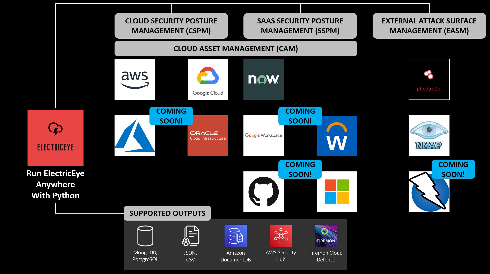

# ElectricEye


ElectricEye is a multi-cloud, multi-SaaS Python CLI tool for Cloud Asset Management (CAM), Cloud Security Posture Management (CSPM), SaaS Security Posture Management (SSPM), and External Attack Surface Management (EASM) supporting 100s of services and evaluations to harden your public cloud & SaaS environments.

***Up here in space***<br/>
***I'm looking down on you***<br/>
***My lasers trace***<br/>
***Everything you do***<br/>
<sub>*Judas Priest, 1982*</sub>

## Super Quick Start :triangular_flag_on_post: :triangular_flag_on_post:

```bash
git clone https://github.com/jonrau1/ElectricEye.git
cd ElectricEye
pip3 install -r requirements.txt
python3 eeauditor/controller.py -t AWS -o stdout
```

## Table of Contents

- [Architecture](#architecture)
- [Quick Run Down](#quick-run-down-running-running)
- [Tell me more!](#tell-me-more-raised_eyebrow-raised_eyebrow)
- [Over-explain it!](#electriceye-except-over-explained-round_pushpin-round_pushpin)
- [Using ElectricEye](#using-electriceye)
- [Cloud Asset Management](./docs/asset_management/ASSET_MANAGEMENT.md)
- [Custom Outputs](#custom-outputs)
- [Supported Services and Checks](#supported-services-and-checks)
  - [AWS Checks & Services](#aws-checks--services)
  - [GCP Checks & Services](#gcp-checks--services)
  - [Azure Checks & Services (*Coming Soon*)](#azure-checks--services)
  - [SSPM: GitHub Checks & Services (*Coming Soon*)](#sspm-github-checks--services)
  - [SSPM: ServiceNow Checks & Services](#sspm-servicenow-checks--services)
  - [SSPM: M365 Checks & Services (*Coming Soon*)](#sspm-m365-checks--services)
- [Contributing](#contributing)
- [Developer Guide](./docs/new_checks/DEVELOPER_GUIDE.md)
    - [Auditor testing](./docs/new_checks/DEVELOPER_GUIDE.md#auditor-testing)
- [License](#license)

## Architecture



## Quick Run Down :running: :running:

- ElectricEye is a Python CLI tool that offers cross-Account, cross-Region, multi-Cloud CAM, CSPM, SSPM, and EASM capabilities across AWS, GCP, and ServiceNow (*with more on the way!*). All Partitions are supported for AWS!

- ElectricEye offers over 500 checks for security, reliability, monitoring, and exposure across 100 CSP & SaaS services, including atypical services not supported by AWS Config/Google Cloud Asset API or mainstream CSPM & CNAPP tools.

- All checks are currently mapped to NIST Cybersecurity Framework V1.1, NIST Special Publication 800-53 Revision 4, AICPA 2020 Trust Service Criteria (TSCs), and ISO 27001:2013 ISMS controls.

- The EASM module uses NMAP for service discovery and reachability assessment of over 20 highly-dangerous ports and protocols for nearly every public-facing CSP service

- Outputs to AWS Security Hub, AWS DocumentDB, JSON files, CSV files, MongoDB, PostgreSQL, and [**FireMon Cloud Defense**](https://www.firemon.com/introducing-disruptops/).

## Tell Me More! :raised_eyebrow: :raised_eyebrow:

First, clone this repository and install the requirements using `pip3`: `pip3 install -r requirements.txt`.

Then, modify the [TOML file](./eeauditor/external_providers.toml) located in `ElectricEye/eeauditor/external_providers.toml` to specify various configurations for the CSP(s) and SaaS Provider(s) you want to assess.

Finally, run the Controller to learn about the various Checks, Auditors, Assessment Targets, and Output.

```bash
python3 eeauditor/controller.py --help
Usage: controller.py [OPTIONS]

Options:
  -t, --target-provider [AWS|GCP|GitHub|Servicenow]
                                  CSP or SaaS Vendor to perform assessments
                                  against and load specific plugins, ensure
                                  that any -a or -c arg maps to your target
                                  provider e.g., -t AWS -a
                                  Amazon_APGIW_Auditor
  -a, --auditor-name TEXT         Specify which Auditor you want to run by
                                  using its name NOT INCLUDING .py. Defaults
                                  to ALL Auditors
  -c, --check-name TEXT           Specify which specific Check in a speciifc
                                  Auditor you want to run. Defaults to ALL
                                  Checks
  -d, --delay INTEGER             Time in seconds to sleep between Auditors
                                  being ran, defaults to 0
  -o, --outputs TEXT              Where to send the findings to (another
                                  platform or to file)  [default: stdout]
  --output-file TEXT              Name of the file for output, if using
                                  anything other than SecHub or Dops
                                  [default: output]
  --list-options                  Lists all valid Output options
  --list-checks                   List all Checks within every Auditor
  --create-insights               Create SecurityHub insights for ElectricEye.
                                  This only needs to be done once per Security
                                  Hub instance
  --help                          Show this message and exit.
```

For more information see [here](#using-electriceye).

## ElectricEye, except over-explained :round_pushpin: :round_pushpin:

ElectricEye was created in early 2019 as an extension to [AWS Security Hub](https://aws.amazon.com/security-hub/), AWS Cloud's native Cloud Security Posture Management (CSPM) solution, with the goal to extend beyond only AWS Config-supported Services and add extra checks and Audit Readiness Standards (AKA "Compliance Standards") to support Cloud Security, DevOps, IT, and Risk teams running workloads on AWS. ElectricEye's AWS "pedigree" is most evident in the developer experience as it utilizes AWS credentials natively and expects other credentials to be stored in AWS Systems Manager ([SSM](https://aws.amazon.com/systems-manager/)) [Parameter Store](https://docs.aws.amazon.com/systems-manager/latest/userguide/systems-manager-parameter-store.html).

Since then, ElectricEye has continued to expand into the most comprehensive AWS CSPM tool from a service support and check support perspective, adding additional functionality such as Secrets Management (powered by Yelp's **Detect-Secrets**), External Attack Surface Management (EASM, powered by **NMAP** and **Shodan.io**), Cloud Asset Management (CAM, see [here](#cloud-asset-management-cam) for more details) and integration into multiple downstream data formats, databases, as well as AWS Security Hub itself. All findings are mapped to the [AWS Security Finding Format (ASFF)](https://docs.aws.amazon.com/securityhub/latest/userguide/securityhub-findings-format.html) for portability into [Amazon Security Lake](https://aws.amazon.com/security-lake/) and AWS Security Hub, and can be further parsed by supported outputs.

A majority of evaluations performed by ElectricEye against public cloud and SaaS providers are aligned to security best practices such as ensuring secure configurations, encryption, logging & monitoring, and resilience. However, ElectricEye also supports use cases such as operational monitoring, high availability, patching, software asset management, sustainability, and performance configurations to broaden the appeal to users. ElectricEye can be used for cloud inventory management via its Cloud Asset Management (CAM) reporting outputs (`cam-json`) which records every unique asset scanned in an environment together with a service hierarchy for ingestion into other IT and security use cases.

ElectricEye's terminology is as follows: the "entrypoint" into the evaluation logic of the tool is contained within the aptly named **Controller** (seen in [`controller.py`](./eeauditor/controller.py)) where all arguments are parsed and credentials are prepared. Command-line arguments are provided and parsed using [`click`](https://click.palletsprojects.com/en/8.1.x/) which is an alternative to [`argparse`](https://docs.python.org/3/library/argparse.html) to direct the evaluation logic of ElectricEye. The "top-level" concept within ElectricEye is the **Assessment Target** (sometimes referenced as **Target** or **AT** in other documentation & code targets) which corresponds to a single public Cloud Service Provider (CSP) - such as Amazon Web Services (AWS) - or to a single Software-as-a-Service (SaaS) provider - such as ServiceNow or GitHub.

Every Assessment Target has a corresponding set of (aptly named) **Auditors** which are individual Python scripts that encapsulate discrete logic to evaluate the overall posture of a specific Cloud resource or component called a **Check**. In some cases an Auditor can contain Checks for multiple services where it makes sense to do so, such as within the EASM Auditors or within the [Shodan Auditor](./eeauditor/auditors/aws/Amazon_Shodan_Auditor.py) for AWS. 

While ElectricEye is primarily a security posture management (SPM) tool, some Checks align to performance, resilience, and optimization best practices which in turn are aligned to **Compliance Standards** or have some secondary or tertiary benefit. Compliance Standards are a term borrowed from the ASFF that refer to any regulatory, industry, and/or "best practice" frameworks which define **Controls** which in turn define People, Process, and/or Technology configurations or outcomes which must be met to abide by or otherwise comply with a Control. ElectricEye solely deals at the infrastructure layer of CSPs and SaaS and thus only supports Technology-relevant controls in these various standards/frameworks/laws that define these Controls.

Currently, all Checks are currently mapped to [**NIST Cybersecurity Framework V1.1**](https://doi.org/10.6028/NIST.CSWP.04162018), [**NIST Special Publication 800-53 Revision 4**](https://csrc.nist.gov/publications/detail/sp/800-53/rev-4/archive/2015-01-22), [**American Institute of Certified Public Accountants (AICPA) Trust Service Criteria (TSCs)**](https://us.aicpa.org/content/dam/aicpa/interestareas/frc/assuranceadvisoryservices/downloadabledocuments/trust-services-criteria-2020.pdf) which can be used for SOC2 Type I and SOC2 Type II, and [**ISO 27001:2013**](https://www.iso.org/standard/27001) ISMS controls for Audit Readiness and internal GRC requirements. In the future, more control mapping will be provided as well as a more generic "ElectricEye Controls" library.

As to the rest of ElectricEye's control flow, besides the arguments from the Controller (via `click`), it also uses a [Tom's Obvious Markup Language (TOML)](https://toml.io/en/) file (a `.toml`) - named [`external_providers.toml`](./eeauditor/external_providers.toml). This `.toml` specifies non-AWS CSPs and SaaS Provider information such as GCP Project IDs, ServiceNow Instance URLs, and takes references for API Keys, Passwords, and other sensitive information as SSM Parameters - in the future this may change to support local vaulting & Privileged Access Management (PAM)/Privileged Identity Management (PIM) tools for non-AWS versions of ElectricEye. 

The `click` and `.toml` arguments and values are passed off the "brain" of ElectricEye which is contained in [`eeauditor.py`](./eeauditor/eeauditor.py) - this Python file will load all Auditors using [`pluginbase`](http://pluginbase.pocoo.org/) and [Decorators](https://znasibov.info/posts/2017/01/22/the_ultimate_guide_to_python_decorators.html), will run the Auditors (or specific Checks) and `yield` back the results to be sent to Security Hub or other locations instrumented by the **Outputs Processor** (defined, partially, in [`processor/main.py`](./eeauditor/processor/main.py)).

As of April 2023 ElectricEye supports the following CAM, CSPM, EASM, and SSPM capabilities. More SaaS Providers and CSPs - as well as expanded service & capability coverage - is under active development.

- **CAM**: AWS, GCP, ServiceNow

- **CSPM**: AWS, GCP

- **SSPM**: ServiceNow

- **EASM**: AWS, GCP

## Using ElectricEye

Refer to sub-headings for per-CSP or per-SaaS setup instructions.

### Public Cloud Service Providers

- [For Amazon Web Services (AWS)](./docs/setup/Setup_AWS.md)
- [For Google Cloud Platform (GCP)](./docs/setup/Setup_GCP.md)
- [For Microsoft Azure (*Coming Soon*)](./docs/setup/Setup_Azure.md)
- [For Oracle Cloud Infrastructure (*Coming Soon*)](./docs/setup/Setup_OCI.md)

### Software-as-a-Service (SaaS) Providers

- [For ServiceNow](./docs/setup/Setup_ServiceNow.md)
- [For Microsoft M365 (E5) (*Coming Soon*)](./docs//Setup_M365.md)
- [For Workday ERP (*Coming Soon*)](./docs/setup/Setup_WorkDay.md)
- [For GitHub (*Coming Soon*)](./docs/setup/Setup_GitHub.md)

## Cloud Asset Management (CAM)

For more information on ElectricEye's CAM concept of operations and output, refer to [the Asset Management documentation](./docs/asset_management/ASSET_MANAGEMENT.md)

Individual information is located at:

- [CAM Concept of Operations](./docs/asset_management/ASSET_MANAGEMENT.md#cam-concept-of-operations-conops)
- [CAM Reporting](./docs/asset_management/ASSET_MANAGEMENT.md#cloud-asset-management-cam-reporting)
- [Asset Class Mapping](./docs/asset_management/ASSET_MANAGEMENT.md#asset-class-mapping)

## Custom Outputs

By default ElectricEye will send all evaluation results from Auditors to AWS Security Hub, however, several outputs are also possible.

**Note**: This section will be replaced at a later date.

To list all currently available outputs: `python3 eeauditor/controller.py --list-options`, it will return a list of valid output locations such as `['postgres', 'sechub', 'json', 'csv', 'json_normalized', 'dops']`, by default findings go to AWS Security Hub (`sechub`).

Some considerations...

- To output to JSON, add the following arguments to your call to `controller.py`: `-o json --output-file electriceye-findings` (**Note:** `.json` will be automatically appended)

- Normalized / flatteneded JSON can output instead using `-o json_normalized`. This is better suited for sending findings to BI tools as the structure eliminates all nested lists and dicts.

- To output to CSV, add the following arguments to your call to `controller.py`: `-o csv --output-file electriceye-findings` (**Note:** `.csv` will be automatically appended)

- To output to a PostgreSQL database, add the following arguement to your call to `controller.py`: `-o postgres`. You will also need to ensure that your IP Address (or AWS Security Group ID, if using Amazon RDS/Aurora) is allowed to communicate with your database. Plaintext passwords are frowned upon, so create an AWS Systems Manager Parameter Store secure parameter with the below command.

```bash
aws ssm put-parameter \
    --name $PLACEHOLDER \
    --description 'PostgreSQL Database Password' \
    --type SecureString --value $PLACEHOLDER
```

- To configure your ENV to have the proper outputs for PostgreSQL (provided youre on a Linux system) use the below `EXPORT` commands and switch any value that says `$PLACEHOLDER`, but keep the double quotes (`"`).

```bash
export POSTGRES_USERNAME="$PLACEHOLDER"
export ELECTRICEYE_POSTGRESQL_DB_NAME="$PLACEHOLDER"
export POSTGRES_DB_ENDPOINT="$PLACEHOLDER"
export POSTGRES_DB_PORT="$PLACEHOLDER"
export POSTGRES_PASSWORD_SSM_PARAM_NAME="$PLACEHOLDER"
```

- To output to the DisruptOps Platform , add the following arguement to your call to `controller.py`: `-o dops`. You will need to create two AWS Systems Manager Parameter Store secure parameters for your API Key and Client ID within the DisruptOps platform, as shown below. Only change the `--value` entry for either, the names can stay the same.

```bash
aws ssm put-parameter \
    --name dops-client-id \
    --description 'DisruptOps client id' \
    --type SecureString \
    --value <CLIENT-ID-HERE>
```

```bash
aws ssm put-parameter \
    --name dops-api-key \
    --description 'DisruptOps api key' \
    --type SecureString \
    --value <API-KEY-HERE>
```

- To configure your ENV to have the proper outputs for DisruptOps (provided youre on a Linux system) use the below `EXPORT` commands.

```bash
export DOPS_CLIENT_ID_PARAM="dops-client-id"
export DOPS_API_KEY_PARAM="dops-api-key"
```

- To output to a AWS DocumentDB database, add the following arguement to your call to `controller.py`: `-o docdb`. You will also need to ensure that your DocDB security group allows you to communicate with your database. Plaintext passwords are frowned upon, so create an AWS Systems Manager Parameter Store secure parameter with the below command, switch any value that says `$PLACEHOLDER`, but keep the double quotes (`"`)..

```bash
aws ssm put-parameter \
    --name $PLACEHOLDER \
    --description 'AWS DocDB Database Password' \
    --type SecureString --value $PLACEHOLDER
```

- To configure your ENV to have the proper outputs for AWS DocumentDB use the below `EXPORT` commands and switch any value that says `$PLACEHOLDER`, but keep the double quotes (`"`).

```bash
export MONGODB_USERNAME="$PLACEHOLDER"
export MONGODB_HOSTNAME="$PLACEHOLDER"
export MONGODB_PASSWORD_PARAMETER="$PLACEHOLDER"
```

- If you will be using Shodan.io to gain information about your public facing assets, retrieve your API key [from your account here](https://developer.shodan.io/dashboard), and then create an AWS Systems Manager Parameter Store secure parameter with the below command. Only change the `--value` entry for either, the name can stay the same.

```bash
aws ssm put-parameter \
    --name electriceye-shodan-api-key \
    --description 'Shodan.io API Key' \
    --type SecureString \
    --value <API-KEY-HERE>
```

- To configure your ENV to have the proper values for Shodan (provided youre on a Linux system) use the below `EXPORT` commands.

```bash
export SHODAN_API_KEY_PARAM="electriceye-shodan-api-key"
```

- If you will be outputting to Amazon DynamoDB use the below `EXPORT` commands and switch any value that says `$PLACEHOLDER`, but keep the double quotes (`"`) along with the output of `-o ddb_backend`.

```bash
export DYNAMODB_TABLE_NAME="$PLACEHOLDER"
```

#### Setting up Shodan
___

This is an **optional** step to setup a Shodan.io API key to determine if your internet-facing resources have been indexed. This is not an exact science as a lot of abstracted services (ES, RDS, ELB) share IP space with other resources and AWS addresses (non-EIP / BYOIP) are always change (such as when you have an EC2 instance shutoff for a prolonged period of time). You may end up having indexed resources that were indexed when someone else was using the IP space, you should still review it either way just to make sure.

1. Create a Shodan account and retrieve your Shodan.io API Key [from here](https://developer.shodan.io/dashboard).

2. Create a Systems Manager Parameter Store `SecureString` parameter for this API key:

```bash
aws ssm put-parameter \
    --name electriceye-shodan-api-key \
    --description 'Shodan.io API Key' \
    --type SecureString \
    --value <API-KEY-HERE>
```

## Supported Services and Checks

In total there are:

> - **2** Supported Public CSPs

> - **1** Supported SaaS Provider

> - **693** Security & Resilience Best Practice Checks supported across all Public CSPs & SaaS Providers

> - **105** Supported CSP & SaaS Resources / Asset Types

> - **89** Auditor Plugins

### AWS Checks & Services
___

These are the following services and checks perform by each Auditor, there are currently...

- :boom: **548 Checks** :boom:
- :exclamation: **100 supported AWS services/components** :exclamation:
- :fire: **77 Auditors** :fire:

**Regarding AWS ElasticSearch Service/OpenSearch Service:** AWS has stopped supporting Elastic after Version 7.10 and released a new service named OpenSearch. The APIs/SDKs/CLI are interchangable. Only ASFF metadata has changed to reflect this, the Auditor Names, Check Names, and ASFF ID's have stayed the same.

**Regarding AWS Shield Advanced:** You must be actively subscribed to Shield Advanced with at least one Protection assigned to assess this Service.

**Regarding AWS Trusted Advisor:** You must be on AWS Business or Enterprise Support to interact with the `support` API for Trusted Advisor.

**Regarding AWS Health:** You must be on AWS Business or Enterprise Support to interact with the `support` API for Health.


| Auditor File Name | Scanned Resource Name | Auditor Scan Description |
|---|---|---|
| Amazon_APIGW_Auditor | API Gateway Stage | Are stage metrics enabled |
| Amazon_APIGW_Auditor | API Gateway Stage | Is stage API logging enabled |
| Amazon_APIGW_Auditor | API Gateway Stage | Is stage caching enabled |
| Amazon_APIGW_Auditor | API Gateway Stage | Is cache encryption enabled |
| Amazon_APIGW_Auditor | API Gateway Stage | Is stage xray tracing configured |
| Amazon_APIGW_Auditor | API Gateway Stage | Is the stage protected by a WAF WACL |
| Amazon_APIGW_Auditor | API Gateway Rest API | Do Rest APIs use Policies |
| Amazon_APIGW_Auditor | API Gateway Rest API | Do Rest APIs use Authorizers |
| Amazon_AppStream_Auditor | AppStream 2.0 (Fleets) | Do Fleets allow Default Internet Access |
| Amazon_AppStream_Auditor | AppStream 2.0 (Images) | Are Images Public |
| Amazon_AppStream_Auditor | AppStream 2.0 (Users) | Are users reported as Compromised |
| Amazon_AppStream_Auditor | AppStream 2.0 (Users) | Do users use SAML authentication |
| Amazon_Athena_Auditor | Athena workgroup | Do workgroups enforce query result encryption |
| Amazon_Athena_Auditor | Athena workgroup | Do workgroups with query result encryption override client settings |
| Amazon_Athena_Auditor | Athena workgroup | Do workgroups publish metrics |
| Amazon_Athena_Auditor | Athena workgroup | Do workgroups auto-update the Athena engine version |
| Amazon_Autoscaling_Auditor | Autoscaling groups | Do ASGs protect instances from scale-in |
| Amazon_Autoscaling_Auditor | Autoscaling groups | Do ASGs with ELB or Target Groups use ELB health checks |
| Amazon_Autoscaling_Auditor | Autoscaling groups | Do ASGs use at least half or more of a Region's open AZs |
| Amazon_CloudFront_Auditor | CloudFront Distribution | Do distros with trusted signers use key pairs |
| Amazon_CloudFront_Auditor | CloudFront Distribution | Do distro origins have Origin Shield enabled |
| Amazon_CloudFront_Auditor | CloudFront Distribution | Do distros use the default viewer certificate |
| Amazon_CloudFront_Auditor | CloudFront Distribution | Do distros have Georestriction enabled |
| Amazon_CloudFront_Auditor | CloudFront Distribution | Do distros have Field-Level Encryption enabled |
| Amazon_CloudFront_Auditor | CloudFront Distribution | Do distros have WAF enabled |
| Amazon_CloudFront_Auditor | CloudFront Distribution | Do distros enforce Default Viewer TLS 1.2 |
| Amazon_CloudFront_Auditor | CloudFront Distribution | Do distros enforce Custom Origin TLS 1.2 |
| Amazon_CloudFront_Auditor | CloudFront Distribution | Do distros enforce Custom Origin HTTPS-only connections |
| Amazon_CloudFront_Auditor | CloudFront Distribution | Do distros enforce Default Viewer HTTPS with SNI |
| Amazon_CloudFront_Auditor | CloudFront Distribution | Do distros have logging enabled |
| Amazon_CloudFront_Auditor | CloudFront Distribution | Do distros have default root objects |
| Amazon_CloudFront_Auditor | CloudFront Distribution | Do distros enforce Default Viewer HTTPS-only connections |
| Amazon_CloudFront_Auditor | CloudFront Distribution | Do distros enforce S3 Origin Object Access Identity |
| Amazon_CloudSearch_Auditor | CloudSearch Domain | Do Domains enforce HTTPS-only |
| Amazon_CloudSearch_Auditor | CloudSearch Domain | Do Domains use TLS 1.2 |
| Amazon_CognitoIdP_Auditor | Cognito Identity Pool | Does the Password policy comply with AWS CIS Foundations Benchmark |
| Amazon_CognitoIdP_Auditor | Cognito Identity Pool | Cognito Temporary Password Age |
| Amazon_CognitoIdP_Auditor | Cognito Identity Pool | Does the Identity pool enforce MFA |
| Amazon_CognitoIdP_Auditor | Cognito Identity Pool | Is the Identity pool protected by WAF |
| Amazon_DocumentDB_Auditor | DocumentDB Instance | Are Instances publicly accessible |
| Amazon_DocumentDB_Auditor | DocumentDB Instance | Are Instance encrypted |
| Amazon_DocumentDB_Auditor | DocumentDB Instance | Is audit logging enabled |
| Amazon_DocumentDB_Auditor | DocumentDB Cluster | Is the Cluster configured for HA |
| Amazon_DocumentDB_Auditor | DocumentDB Cluster | Is the Cluster deletion protected |
| Amazon_DocumentDB_Auditor | DocumentDB Cluster | Is cluster audit logging on |
| Amazon_DocumentDB_Auditor | DocumentDB Cluster | Is cluster TLS enforcement on |
| Amazon_DocumentDB_Auditor | DocDB Snapshot | Are docdb cluster snapshots encrypted |
| Amazon_DocumentDB_Auditor | DocDB Snapshot | Are docdb cluster snapshots public |
| Amazon_DynamoDB_Auditor | DynamoDB Table | Do tables use KMS CMK for encryption |
| Amazon_DynamoDB_Auditor | DynamoDB Table | Do tables have PITR enabled |
| ~~Amazon_DynamoDB_Auditor~~ | ~~DynamoDB Table~~ | ~~Do tables have TTL enabled~~ **THIS FINDING HAS BEEN RETIRED** |
| Amazon_DAX_Auditor | DAX Cluster | Do clusters encrypt data at rest |
| Amazon_DAX_Auditor | DAX Cluster | Do clusters encrypt data in transit |
| Amazon_DAX_Auditor | DAX Cluster | Do clusters have cache item TTL defined |
| Amazon_EBS_Auditor | EBS Volume | Is the Volume attached |
| Amazon_EBS_Auditor | EBS Volume | Is the Volume configured to be deleted on instance termination |
| Amazon_EBS_Auditor | EBS Volume | Is the Volume encrypted |
| Amazon_EBS_Auditor | EBS Snapshot | Is the Snapshot encrypted |
| Amazon_EBS_Auditor | EBS Snapshot | Is the Snapshot public |
| Amazon_EBS_Auditor | Account | Is account level encryption by default enabled |
| Amazon_EBS_Auditor | EBS Volume | Does the Volume have a snapshot |
| Amazon_EC2_Auditor | EC2 Instance | Is IMDSv2 enabled |
| Amazon_EC2_Auditor | EC2 Instance | Is Secure Enclave used |
| Amazon_EC2_Auditor | EC2 Instance | Is the instance internet-facing |
| Amazon_EC2_Auditor | EC2 Instance | Is Source/Dest Check disabled |
| Amazon_EC2_Auditor | AWS Account | Is Serial Port Access restricted |
| Amazon_EC2_Auditor | EC2 Instance | Is instance using an AMI baked in last 3 months |
| Amazon_EC2_Auditor | EC2 Instance | Is instance using a correctly registered AMI |
| Amazon_EC2_Auditor | Account | Are instances spread across Multiple AZs |
| Amazon_EC2_Image_Builder_Auditor | Image Builder | Are pipeline tests enabled |
| Amazon_EC2_Image_Builder_Auditor | Image Builder | Is EBS encrypted |
| Amazon_EC2_Security_Group_Auditor | Security Group | Are all ports (-1) open to the internet |
| Amazon_EC2_Security_Group_Auditor | Security Group | Is FTP (tcp20-21) open to the internet |
| Amazon_EC2_Security_Group_Auditor | Security Group | Is TelNet (tcp23) open to the internet |
| Amazon_EC2_Security_Group_Auditor | Security Group | Is WSDCOM-RPC (tcp135) open to the internet |
| Amazon_EC2_Security_Group_Auditor | Security Group | Is SMB (tcp445) open to the internet |
| Amazon_EC2_Security_Group_Auditor | Security Group | Is MSSQL (tcp1433) open to the internet |
| Amazon_EC2_Security_Group_Auditor | Security Group | Is OracleDB (tcp1521) open to the internet |
| Amazon_EC2_Security_Group_Auditor | Security Group | Is MySQL/MariaDB (tcp3306) open to the internet |
| Amazon_EC2_Security_Group_Auditor | Security Group | Is RDP (tcp3389) open to the internet |
| Amazon_EC2_Security_Group_Auditor | Security Group | Is PostgreSQL (tcp5432) open to the internet |
| Amazon_EC2_Security_Group_Auditor | Security Group | Is Kibana (tcp5601) open to the internet |
| Amazon_EC2_Security_Group_Auditor | Security Group | Is Redis (tcp6379) open to the internet |
| Amazon_EC2_Security_Group_Auditor | Security Group | Is Splunkd (tcp8089) open to the internet |
| Amazon_EC2_Security_Group_Auditor | Security Group | Is Elasticsearch (tcp9200) open to the internet |
| Amazon_EC2_Security_Group_Auditor | Security Group | Is Elasticsearch (tcp9300) open to the internet |
| Amazon_EC2_Security_Group_Auditor | Security Group | Is Memcached (udp11211) open to the internet |
| Amazon_EC2_Security_Group_Auditor | Security Group | Is Redshift (tcp5439) open to the internet |
| Amazon_EC2_Security_Group_Auditor | Security Group | Is DocDB (tcp27017) open to the internet |
| Amazon_EC2_Security_Group_Auditor | Security Group | Is Cassandra (tcp9142) open to the internet |
| Amazon_EC2_Security_Group_Auditor | Security Group | Is Kafka (tcp9092) open to the internet |
| Amazon_EC2_Security_Group_Auditor | Security Group | Is NFS (tcp2049) open to the internet |
| Amazon_EC2_Security_Group_Auditor | Security Group | Is Rsync (tcp873) open to the internet |
| Amazon_EC2_Security_Group_Auditor | Security Group | Is TFTP (udp69) open to the internet |
| Amazon_EC2_Security_Group_Auditor | Security Group | Is Docker API (tcp2375) open to the internet |
| Amazon_EC2_Security_Group_Auditor | Security Group | Is K8s API (tcp10250) open to the internet |
| Amazon_EC2_Security_Group_Auditor | Security Group | Is SMTP (tcp25) open to the internet |
| Amazon_EC2_Security_Group_Auditor | Security Group | Is NetBioas (tcp137-139) open to the internet |
| Amazon_EC2_Security_Group_Auditor | Security Group | Is OpenVPN (udp1194) open to the internet |
| Amazon_EC2_Security_Group_Auditor | Security Group | Is RabbitMQ (tcp5672) open to the internet |
| Amazon_EC2_Security_Group_Auditor | Security Group | Is Spark WebUI (tcp4040) open to the internet |
| Amazon_EC2_Security_Group_Auditor | Security Group | Is POP3 (tcp110) open to the internet |
| Amazon_EC2_Security_Group_Auditor | Security Group | Is VMWare ESXi (tcp8182) open to the internet |
| Amazon_EC2_SSM_Auditor | EC2 Instance | Is the instance managed by SSM |
| Amazon_EC2_SSM_Auditor | EC2 Instance | Does the instance have a successful SSM association |
| Amazon_EC2_SSM_Auditor | EC2 Instance | Is the SSM Agent up to date |
| Amazon_EC2_SSM_Auditor | EC2 Instance | Is the Patch status up to date |
| Amazon_ECR_Auditor | ECR Registry (Account) | Is there a registry access policy |
| Amazon_ECR_Auditor | ECR Registry (Account) | Is image replication configured |
| Amazon_ECR_Auditor | ECR Repository | Does the repository support scan-on-push |
| Amazon_ECR_Auditor | ECR Repository | Is there an image lifecycle policy |
| Amazon_ECR_Auditor | ECR Repository | Is there a repo access policy |
| Amazon_ECR_Auditor | Image (Container) | Does the latest container have any vulns |
| Amazon_ECS_Auditor | ECS Cluster | Is container insights enabled |
| Amazon_ECS_Auditor | ECS Cluster | Is a default cluster provider configured |
| Amazon_ECS_Auditor | ECS Task Definition | Is the Task Definition using a Privileged container |
| Amazon_ECS_Auditor | ECS Task Definition | Do EC2-ECS containers use SELinux or AppArmor |
| Amazon_ECS_Auditor | ECS Task Definition | Do containers use a Root user |
| Amazon_EFS_Auditor | EFS File System | Are file systems encrypted |
| Amazon_EFS_Auditor | EFS File System | Does the File system have a custom policy attached |
| Amazon_EKS_Auditor | EKS Cluster | Is the API Server publicly accessible |
| Amazon_EKS_Auditor | EKS Cluster | Are one of the *three* latest K8s version used |
| Amazon_EKS_Auditor | EKS Cluster | Are auth or audit logs enabled |
| Amazon_EKS_Auditor | EKS Cluster | Is K8s Secrets envelope encryption used |
| Amazon_EKS_Auditor | EKS Cluster | Is a deprecated K8s version used |
| Amazon_Elasticache_Redis_Auditor | Elasticache Redis Cluster | Is an AUTH Token used |
| Amazon_Elasticache_Redis_Auditor | Elasticache Redis Cluster | Is the cluster encrypted at rest |
| Amazon_Elasticache_Redis_Auditor | Elasticache Redis Cluster | Does the cluster encrypt in transit |
| Amazon_ElasticBeanstalk_Auditor | Elastic Beanstalk environment | Is IMDSv1 disabled |
| Amazon_ElasticBeanstalk_Auditor | Elastic Beanstalk environment | Is platform auto-update and instance refresh enabled |
| Amazon_ElasticBeanstalk_Auditor | Elastic Beanstalk environment | Is enhanced health reporting enabled |
| Amazon_ElasticBeanstalk_Auditor | Elastic Beanstalk environment | Is CloudWatch log streaming enabled |
| Amazon_ElasticBeanstalk_Auditor | Elastic Beanstalk environment | Is AWS X-Ray tracing enabled |
| Amazon_ElasticsearchService_Auditor | OpenSearch domain | Are dedicated masters used |
| Amazon_ElasticsearchService_Auditor | OpenSearch domain | Is Cognito auth used |
| Amazon_ElasticsearchService_Auditor | OpenSearch domain | Is encryption at rest used |
| Amazon_ElasticsearchService_Auditor | OpenSearch domain | Is Node2Node encryption used |
| Amazon_ElasticsearchService_Auditor | OpenSearch domain | Is HTTPS-only enforced |
| Amazon_ElasticsearchService_Auditor | OpenSearch domain | Is a TLS 1.2 policy used |
| Amazon_ElasticsearchService_Auditor | OpenSearch domain | Are there available version updates |
| Amazon_ElasticsearchService_Auditor | OpenSearch domain | Is ES in a VPC |
| Amazon_ElasticsearchService_Auditor | OpenSearch domain | Is ES Publicly Accessible |
| Amazon_ELB_Auditor | ELB (Classic Load Balancer) | Do internet facing ELBs have a secure listener |
| Amazon_ELB_Auditor | ELB (Classic Load Balancer) | Do secure listeners enforce TLS 1.2 |
| Amazon_ELB_Auditor | ELB (Classic Load Balancer) | Is cross zone load balancing enabled |
| Amazon_ELB_Auditor | ELB (Classic Load Balancer) | Is connection draining enabled |
| Amazon_ELB_Auditor | ELB (Classic Load Balancer) | Is access logging enabled |
| Amazon_ELBv2_Auditor | ELBv2 (ALB) | Is access logging enabled for ALBs |
| Amazon_ELBv2_Auditor | ELBv2 (ALB/NLB) | Is deletion protection enabled |
| Amazon_ELBv2_Auditor | ELBv2 (ALB/NLB) | Do internet facing ELBs have a secure listener |
| Amazon_ELBv2_Auditor | ELBv2 (ALB/NLB) | Do secure listeners enforce TLS 1.2 |
| Amazon_ELBv2_Auditor | ELBv2 (ALB/NLB) | Are invalid HTTP headers dropped |
| Amazon_ELBv2_Auditor | ELBv2 (NLB) | Do NLBs with TLS listeners have access logging enabled |
| Amazon_ELBv2_Auditor | ELBv2 (ALB) | Do ALBs have HTTP Desync protection enabled |
| Amazon_ELBv2_Auditor | ELBv2 (ALB) | Do ALBs SGs allow access to non-Listener ports |
| Amazon_ELBv2_Auditor | ELBv2 (ALB) | Ares ALBs protected by WAF |
| Amazon_EMR_Auditor | EMR Cluster | Do clusters have a sec configuration attached |
| Amazon_EMR_Auditor | EMR Cluster | Do cluster sec configs enforce encryption in transit |
| Amazon_EMR_Auditor | EMR Cluster | Do cluster sec configs enforce encryption at rest for EMRFS |
| Amazon_EMR_Auditor | EMR Cluster | Do cluster sec configs enforce encryption at rest for EBS |
| Amazon_EMR_Auditor | EMR Cluster | Do cluster sec configs enforce Kerberos authN |
| Amazon_EMR_Auditor | EMR Cluster | Is cluster termination protection enabled |
| Amazon_EMR_Auditor | EMR Cluster | Is cluster logging enabled |
| Amazon_EMR_Auditor | AWS Account | Is EMR public SG block configured for the Account in the region |
| Amazon_Kinesis_Analytics_Auditor | Kinesis analytics application | Does application log to CloudWatch |
| Amazon_Kinesis_Data_Streams_Auditor | Kinesis data stream | Is stream encryption enabled |
| Amazon_Kinesis_Data_Streams_Auditor | Kinesis data stream | Is enhanced monitoring enabled |
| Amazon_Kinesis_Firehose_Auditor | Firehose delivery stream | Is delivery stream encryption enabled |
| Amazon_Managed_Blockchain_Auditor | Fabric peer node | Are chaincode logs enabled |
| Amazon_Managed_Blockchain_Auditor | Fabric peer node | Are peer node logs enabled |
| Amazon_Managed_Blockchain_Auditor | Fabric member | Are member CA logs enabled |
| Amazon_MQ_Auditor | Amazon MQ message broker | Message brokers should be encrypted with customer-managed KMS CMKs |
| Amazon_MQ_Auditor | Amazon MQ message broker | Message brokers should have audit logging enabled |
| Amazon_MQ_Auditor | Amazon MQ message broker | Message brokers should have general logging enabled |
| Amazon_MQ_Auditor | Amazon MQ message broker | Message broker should not be publicly accessible |
| Amazon_MQ_Auditor | Amazon MQ message broker | Message brokers should be configured to auto upgrade to the latest minor version |
| Amazon_MSK_Auditor | MSK Cluster | Is inter-cluster encryption used |
| Amazon_MSK_Auditor | MSK Cluster | Is client-broker communications TLS-only |
| Amazon_MSK_Auditor | MSK Cluster | Is enhanced monitoring used |
| Amazon_MSK_Auditor | MSK Cluster | Is Private CA TLS auth used |
| Amazon_MWAA_Auditor | Airflow Environment | Is a KMS CMK used for encryption |
| Amazon_MWAA_Auditor | Airflow Environment | Is the Airflow URL Public |
| Amazon_MWAA_Auditor | Airflow Environment | Are DAG Processing logs configured |
| Amazon_MWAA_Auditor | Airflow Environment | Are Scheduler logs configured |
| Amazon_MWAA_Auditor | Airflow Environment | Are Task logs configured |
| Amazon_MWAA_Auditor | Airflow Environment | Are Webserver logs configured |
| Amazon_MWAA_Auditor | Airflow Environment | Are Worker logs configured |
| Amazon_Neptune_Auditor | Neptune instance | Is Neptune instance configured for HA |
| Amazon_Neptune_Auditor | Neptune instance | Is Neptune instance storage encrypted |
| Amazon_Neptune_Auditor | Neptune instance | Does Neptune instance use IAM DB Auth |
| Amazon_Neptune_Auditor | Neptune cluster | Is SSL connection enforced |
| ~~Amazon_Neptune_Auditor~~ | ~~Neptune cluster~~ | ~~Is audit logging enabled~~ **THIS FINDING HAS BEEN RETIRED** |
| Amazon_Neptune_Auditor | Neptune instance | Does Neptune instance export audit logs |
| Amazon_Neptune_Auditor | Neptune instance | Is Neptune instance deletion protected |
| Amazon_Neptune_Auditor | Neptune instance | Does Neptune instance automatically update minor versions |
| Amazon_Neptune_Auditor | Neptune cluster | Are Neptune clusters configured to auto-scale |
| Amazon_Neptune_Auditor | Neptune cluster | Are Neptune clusters configured to cache query results |
| Amazon_QLDB_Auditor | QLDB Ledger | Does ledger have deletion protection |
| Amazon_QLDB_Auditor | QLDB Export | Is export encryption enabled |
| Amazon_RDS_Auditor | RDS DB Instance | Is HA configured |
| Amazon_RDS_Auditor | RDS DB Instance | Are DB instances publicly accessible |
| Amazon_RDS_Auditor | RDS DB Instance | Is DB storage encrypted |
| Amazon_RDS_Auditor | RDS DB Instance | Do supported DBs use IAM Authentication |
| Amazon_RDS_Auditor | RDS DB Instance | Are supported DBs joined to a domain |
| Amazon_RDS_Auditor | RDS DB Instance | Is performance insights enabled |
| Amazon_RDS_Auditor | RDS DB Instance | Is deletion protection enabled |
| Amazon_RDS_Auditor | RDS DB Instance | Is database CloudWatch logging enabled |
| Amazon_RDS_Auditor | RDS Snapshot | Are snapshots encrypted |
| Amazon_RDS_Auditor | RDS Snapshot | Are snapshots public |
| Amazon_RDS_Auditor | RDS DB Cluster (Aurora) | Is Database Activity Stream configured |
| Amazon_RDS_Auditor | RDS DB Cluster (Aurora) | Is the cluster encrypted |
| Amazon_RDS_Auditor | RDS DB Instance | Does Instance have any snapshots |
| Amazon_RDS_Auditor | RDS DB Instance | Does the instance security group allow risky access |
| Amazon_RDS_Auditor | Event Subscription (Account) | Does an Event Subscription to monitor DB instances exist |
| Amazon_RDS_Auditor | Event Subscription (Account) | Does an Event Subscription to monitor paramter groups exist |
| Amazon_RDS_Auditor | RDS DB Instance | Do PostgreSQL instances use a version susceptible to Lightspin "log_fwd" attack |
| Amazon_RDS_Auditor | RDS DB Instance | Do Aurora PostgreSQL instances use a version susceptible to Lightspin "log_fwd" attack |
| Amazon_Redshift_Auditor | Redshift cluster | Is the cluster publicly accessible |
| Amazon_Redshift_Auditor | Redshift cluster | Is the cluster encrypted at rest |
| Amazon_Redshift_Auditor | Redshift cluster | Is enhanced VPC routing enabled |
| Amazon_Redshift_Auditor | Redshift cluster | Is cluster audit logging enabled |
| Amazon_Redshift_Auditor | Redshift cluster | Does the cluster use the default Admin username |
| Amazon_Redshift_Auditor | Redshift cluster | Is cluster user activity logging enabled |
| Amazon_Redshift_Auditor | Redshift cluster | Does the cluster enforce encrypted in transit |
| Amazon_Redshift_Auditor | Redshift cluster | Does the cluster take automated snapshots |
| Amazon_Redshift_Auditor | Redshift cluster | Is the cluster configured for automated major version upgrades |
| Amazon_Route53_Auditor | Route53 Hosted Zone | Do Hosted Zones have Query Logging enabled |
| Amazon_Route53_Auditor | Route53 Hosted Zone | Do Hosted Zones have traffic policies associated |
| Amazon_Route53_Resolver_Auditor | VPC | Do VPCs have Query Logging enabled |
| Amazon_Route53_Resolver_Auditor | VPC | Do VPCs have DNS Firewalls associated |
| Amazon_Route53_Resolver_Auditor | VPC | Do VPCs enabled DNSSEC resolution |
| Amazon_Route53_Resolver_Auditor | VPC | Do VPCs with DNS Firewall fail open |
| Amazon_S3_Auditor | S3 Bucket | Is bucket encryption enabled |
| Amazon_S3_Auditor | S3 Bucket | Is a bucket lifecycle enabled |
| Amazon_S3_Auditor | S3 Bucket | Is bucket versioning enabled |
| Amazon_S3_Auditor | S3 Bucket | Does the bucket policy allow public access |
| Amazon_S3_Auditor | S3 Bucket | Does the bucket have a policy |
| Amazon_S3_Auditor | S3 Bucket | Is server access logging enabled |
| Amazon_S3_Auditor | Account | Is account level public access block configured |
| Amazon_SageMaker_Auditor | SageMaker Notebook | Is notebook encryption enabled |
| Amazon_SageMaker_Auditor | SageMaker Notebook | Is notebook direct internet access enabled |
| Amazon_SageMaker_Auditor | SageMaker Notebook | Is the notebook in a vpc |
| Amazon_SageMaker_Auditor | SageMaker Endpoint | Is endpoint encryption enabled |
| Amazon_SageMaker_Auditor | SageMaker Model | Is model network isolation enabled |
| Amazon_Shield_Advanced_Auditor | Route53 Hosted Zone | Are Rt53 hosted zones protected by Shield Advanced |
| Amazon_Shield_Advanced_Auditor | Classic Load Balancer | Are CLBs protected by Shield Adv |
| Amazon_Shield_Advanced_Auditor | ELBv2 (ALB/NLB) | Are ELBv2s protected by Shield Adv |
| Amazon_Shield_Advanced_Auditor | Elastic IP | Are EIPs protected by Shield Adv |
| Amazon_Shield_Advanced_Auditor | CloudFront Distribution | Are CF Distros protected by Shield Adv |
| Amazon_Shield_Advanced_Auditor | Account (DRT IAM Role) | Does the DRT have account authZ via IAM role |
| Amazon_Shield_Advanced_Auditor | Account (DRT S3 Access) | Does the DRT have access to WAF logs S3 buckets |
| Amazon_Shield_Advanced_Auditor | Account (Shield subscription) | Is Shield Adv subscription on auto renew |
| Amazon_Shield_Advanced_Auditor | Global Accelerator Accelerator | Are GA Accelerators protected by Shield Adv |
| Amazon_Shield_Advanced_Auditor | Account | Has Shield Adv mitigated any attacks in the last 7 days |
| Amazon_SNS_Auditor | SNS Topic | Is the topic encrypted |
| Amazon_SNS_Auditor | SNS Topic | Does the topic have plaintext (HTTP) subscriptions |
| Amazon_SNS_Auditor | SNS Topic | Does the topic allow public access |
| Amazon_SNS_Auditor | SNS Topic | Does the topic allow cross-account access |
| Amazon_SQS_Auditor | SQS Queue | Are there old messages |
| Amazon_SQS_Auditor | SQS Queue | Is Server Side Encryption Enabled |
| Amazon_SQS_Auditor | SQS Queue | Is the SQS Queue publically accessible |
| Amazon_VPC_Auditor | VPC | Is the default VPC out and about |
| Amazon_VPC_Auditor | VPC | Is flow logging enabled |
| Amazon_VPC_Auditor | Subnet | Do subnets map public IPs |
| Amazon_VPC_Auditor | Subnet | Do subnets have available IP space |
| Amazon_WorkSpaces_Auditor | Workspace | Is user volume encrypted |
| Amazon_WorkSpaces_Auditor | Workspace | Is root volume encrypted |
| Amazon_WorkSpaces_Auditor | Workspace | Is running mode set to auto-off |
| Amazon_WorkSpaces_Auditor | DS Directory | Does directory allow default internet access |
| Amazon_Xray_Auditor | XRay Encryption Config | Is KMS CMK encryption used |
| AMI_Auditor | Amazon Machine Image (AMI) | Are owned AMIs public |
| AMI_Auditor | Amazon Machine Image (AMI) | Are owned AMIs encrypted |
| AWS_ACM_Auditor | ACM Certificate | Are certificates revoked |
| AWS_ACM_Auditor | ACM Certificate | Are certificates in use |
| AWS_ACM_Auditor | ACM Certificate | Is certificate transparency logging enabled |
| AWS_ACM_Auditor | ACM Certificate | Have certificates been correctly renewed |
| AWS_ACM_Auditor | ACM Certificate | Are certificates correctly validated |
| AWS_Amplify_Auditor | AWS Amplify | Does the app have basic auth enabled on the branches |
| AWS_Amplify_Auditor | AWS Amplify | Does the app have auto deletion for branches enabled |
| AWS_AppMesh_Auditor | App Mesh mesh | Does the mesh egress filter DROP_ALL |
| AWS_AppMesh_Auditor | App Mesh virtual node | Does the backend default client policy enforce TLS |
| AWS_AppMesh_Auditor | App Mesh virtual node | Do virtual node backends have STRICT TLS mode configured for inbound connections |
| AWS_AppMesh_Auditor | App Mesh virtual node | Do virtual nodes have an HTTP access log location defined |
| AWS_Backup_Auditor | EC2 Instance | Are EC2 instances backed up |
| AWS_Backup_Auditor | EBS Volume | Are EBS volumes backed up |
| AWS_Backup_Auditor | DynamoDB tables | Are DynamoDB tables backed up |
| AWS_Backup_Auditor | RDS DB Instance | Are RDS DB instances backed up |
| AWS_Backup_Auditor | EFS File System | Are EFS file systems backed up |
| AWS_Backup_Auditor | Neptune cluster | Are Neptune clusters backed up |
| AWS_Backup_Auditor | DocumentDB cluster | Are DocumentDB clusters backed up |
| AWS_Cloud9_Auditor | Cloud9 Environment | Are Cloud9 Envs using SSM for access |
| AWS_CloudFormation_Auditor | CloudFormation Stack | Is drift detection enabled |
| AWS_CloudFormation_Auditor | CloudFormation Stack | Are stacks monitored |
| AWS_CloudHSM_Auditor | CloudHSM Cluster | Is the CloudHSM Cluster in a degraded state |
| AWS_CloudHSM_Auditor | CloudHSM HSM Module | Is the CloudHSM hardware security module in a degraded state |
| AWS_CloudHSM_Auditor | CloudHSM Backups | Is there at least one backup in a READY state |
| AWS_CloudTrail_Auditor | CloudTrail | Is the trail multi-region |
| AWS_CloudTrail_Auditor | CloudTrail | Does the trail send logs to CWL |
| AWS_CloudTrail_Auditor | CloudTrail | Is the trail encrypted by KMS |
| AWS_CloudTrail_Auditor | CloudTrail | Are global/management events logged |
| AWS_CloudTrail_Auditor | CloudTrail | Is log file validation enabled |
| AWS_CodeArtifact_Auditor | CodeArtifact Repo | Does the CodeArtifact Repo have a least privilege resource policy attached |
| AWS_CodeArtifact_Auditor | CodeArtifact Domain | Does the CodeArtifact Domain have a least privilege resource policy attached |
| AWS_CodeBuild_Auditor | CodeBuild project | Is artifact encryption enabled |
| AWS_CodeBuild_Auditor | CodeBuild project | Is Insecure SSL enabled |
| AWS_CodeBuild_Auditor | CodeBuild project | Are plaintext environmental variables used |
| AWS_CodeBuild_Auditor | CodeBuild project | Is S3 logging encryption enabled |
| AWS_CodeBuild_Auditor | CodeBuild project | Is CloudWatch logging enabled |
| AWS_CodeBuild_Auditor | CodeBuild project | Does CodeBuild store PATs or Basic Auth creds |
| AWS_CodeBuild_Auditor | CodeBuild project | Is the CodeBuild project public |
| AWS_CodeBuild_Auditor | CodeBuild project | Are CodeBuild projects using privileged containers |
| AWS_Directory_Service_Auditor | DS Directory | Is RADIUS enabled |
| AWS_Directory_Service_Auditor | DS Directory | Is CloudWatch log forwarding enabled |
| AWS_DMS_Auditor | DMS Replication Instance | Are DMS instances publicly accessible |
| AWS_DMS_Auditor | DMS Replication Instance | Is DMS multi-az configured |
| AWS_DMS_Auditor | DMS Replication Instance | Are minor version updates configured |
| AWS_Global_Accelerator_Auditor | Global Accelerator Endpoint | Is the endpoint healthy |
| AWS_Global_Accelerator_Auditor | Global Accelerator Accelerator | Are flow logs enabled for accelerator |
| AWS_Health_Auditor | AWS Health Event | Are there active Security Events |
| AWS_Health_Auditor | AWS Health Event | Are there active Abuse Events |
| AWS_Health_Auditor | AWS Health Event | Are there active Risk Events |
| AWS_Glue_Auditor | Glue Crawler | Is S3 encryption configured for the crawler |
| AWS_Glue_Auditor | Glue Crawler | Is CWL encryption configured for the crawler |
| AWS_Glue_Auditor | Glue Crawler | Is job bookmark encryption configured for the crawler |
| AWS_Glue_Auditor | Glue Data Catalog | Is data catalog encryption configured |
| AWS_Glue_Auditor | Glue Data Catalog | Is connection password encryption configured |
| AWS_Glue_Auditor | Glue Data Catalog | Is a resource policy configured |
| AWS_IAM_Auditor | IAM Access Key | Are access keys over 90 days old |
| AWS_IAM_Auditor | IAM User | Do users have permissions boundaries |
| AWS_IAM_Auditor | IAM User | Do users have MFA |
| AWS_IAM_Auditor | IAM User | Do users have in-line policies attached |
| AWS_IAM_Auditor | IAM User | Do users have managed policies attached |
| AWS_IAM_Auditor | Password policy (Account) | Does the IAM password policy meet or exceed AWS CIS Foundations Benchmark standards |
| AWS_IAM_Auditor | Server certs (Account) | Are they any Server certificates stored by IAM |
| AWS_IAM_Auditor | IAM Policy | Do managed IAM policies adhere to least privilege principles |
| AWS_IAM_Auditor | IAM User | Do User IAM inline policies adhere to least privilege principles |
| AWS_IAM_Auditor | IAM Group | Do Group IAM inline policies adhere to least privilege principles |
| AWS_IAM_Auditor | IAM Role | Do Role IAM inline policies adhere to least privilege principles |
| AWS_IAMRA_Auditor | IAMRA Trust Anchor | Do Trust Anchors contain self-signed certificates |
| AWS_IAMRA_Auditor | IAMRA Trust Anchor | Do Trust Anchors use a Certificate Revocation List (CRL) |
| AWS_IAMRA_Auditor | IAMRA Profile | Do IAMRA Profiles specify a Session Policy |
| AWS_IAMRA_Auditor | IAMRA Profile | Do IAMRA Profiles specify a Permission Boundary |
| AWS_IAMRA_Auditor | IAM Role | Do IAM Roles associated with IAMRA use Condition statements in the Trust Policy |
| AWS_Keyspaces_Auditor | Keyspaces table | Are Keyspaces Tables encrypted with a KMS CMK |
| AWS_Keyspaces_Auditor | Keyspaces table | Do Keyspaces Tables have PTR enabled |
| AWS_Keyspaces_Auditor | Keyspaces table | Are Keyspaces Tables in an unusable state |
| AWS_KMS_Auditor | KMS key | Is key rotation enabled |
| AWS_KMS_Auditor | KMS key | Does the key allow public access |
| AWS_Lambda_Auditor | Lambda function | Has function been used or updated in the last 30 days |
| AWS_Lambda_Auditor | Lambda function | Is tracing enabled |
| AWS_Lambda_Auditor | Lambda function | Is code signing used |
| AWS_Lambda_Auditor | Lambda layer | Is the layer public |
| AWS_Lambda_Auditor | Lambda function | Is the function public |
| AWS_Lambda_Auditor | Lambda function | Is the function using a supported runtime |
| AWS_Lambda_Auditor | Lambda function | Are functions in VPCs highly available in at least 2 AZs |
| AWS_License_Manager_Auditor | License Manager configuration | Do LM configurations enforce a hard limit on license consumption |
| AWS_License_Manager_Auditor | License Manager configuration | Do LM configurations enforce auto-disassociation |
| AWS_MemoryDB_Auditor | MemoryDB Cluster | Do clusters use TLS |
| AWS_MemoryDB_Auditor | MemoryDB Cluster | Do clusters use KMS CMK for encryption at rest |
| AWS_MemoryDB_Auditor | MemoryDB Cluster | Are clusters configured for auto minor version updates |
| AWS_MemoryDB_Auditor | MemoryDB Cluster | Are cluster events monitored with SNS |
| AWS_MemoryDB_Auditor | MemoryDB User | MemDB Admin users should be reviewed |
| AWS_MemoryDB_Auditor | MemoryDB User | MemDB users should use passwords |
| AWS_RAM_Auditor | RAM Resource Share | Is the resource share status not failed |
| AWS_RAM_Auditor | RAM Resource Share | Does the resource allow external principals |
| AWS_Secrets_Manager_Auditor | Secrets Manager secret | Is the secret over 90 days old |
| AWS_Secrets_Manager_Auditor | Secrets Manager secret | Is secret auto-rotation enabled |
| AWS_Security_Hub_Auditor | Security Hub (Account) | Are there active high or critical findings in Security Hub |
| AWS_Security_Services_Auditor | IAM Access Analyzer (Account) | Is IAM Access Analyzer enabled |
| AWS_Security_Services_Auditor | GuardDuty (Account) | Is GuardDuty enabled |
| AWS_Security_Services_Auditor | Detective (Account) | Is Detective enabled |
| AWS_Security_Services_Auditor | Macie2 | Is Macie enabled |
| ~~AWS_Security_Services_Auditor~~ | ~~AWS WAFv2 (Regional)~~ | ~~Are Regional Web ACLs configured~~ **THIS FINDING HAS BEEN RETIRED** |
| ~~AWS_Security_Services_Auditor~~ | ~~AWS WAFv2 (Global)~~ | ~~Are Global Web ACLs (for CloudFront) configured~~ **THIS FINDING HAS BEEN RETIRED** |
| AWS_Systems_Manager_Auditor | SSM Document | Are self owned SSM Documents publicly shared |
| AWS_Systems_Manager_Auditor | SSM Association | Does an SSM Association that targets all Instances conduct SSM Agent updates |
| AWS_Systems_Manager_Auditor | SSM Association | Does an SSM Association that targets all Instances conduct patching |
| AWS_Systems_Manager_Auditor | SSM Association | Does an SSM Association that targets all Instances conduct inventory gathering |
| AWS_TrustedAdvisor_Auditor | Trusted Advisor Check | Is the Trusted Advisor check for MFA on Root Account failing |
| AWS_TrustedAdvisor_Auditor | Trusted Advisor Check | Is the Trusted Advisor check for ELB Listener Security failing |
| AWS_TrustedAdvisor_Auditor | Trusted Advisor Check | Is the Trusted Advisor check for CloudFront SSL Certs in IAM Cert Store failing |
| AWS_TrustedAdvisor_Auditor | Trusted Advisor Check | Is the Trusted Advisor check for CloudFront SSL Cert on Origin Server failing |
| AWS_TrustedAdvisor_Auditor | Trusted Advisor Check | Is the Trusted Advisor check for Exposed Access Keys failing |
| AWS_WAFv2_Auditor | AWS WAFv2 (Regional) | Do Regional WAFs use Cloudwatch Metrics |
| AWS_WAFv2_Auditor | AWS WAFv2 (Regional) | Do Regional WAFs use Request Sampling |
| AWS_WAFv2_Auditor | AWS WAFv2 (Regional) | Do Regional WAFs have Logging enabled |
| AWS_WAFv2_Auditor | AWS WAFv2 (Global) | Do Global WAFs use Cloudwatch Metrics |
| AWS_WAFv2_Auditor | AWS WAFv2 (Global) | Do Global WAFs use Request Sampling |
| AWS_WAFv2_Auditor | AWS WAFv2 (Global) | Do Global WAFs have Logging enabled |
| ElectricEye_AttackSurface_Auditor | EC2 instance | Is a FTP service publicly accessible |
| ElectricEye_AttackSurface_Auditor | EC2 instance | Is a SSH service publicly accessible |
| ElectricEye_AttackSurface_Auditor | EC2 instance | Is a Telnet service publicly accessible |
| ElectricEye_AttackSurface_Auditor | EC2 instance | Is a SMTP service publicly accessible |
| ElectricEye_AttackSurface_Auditor | EC2 instance | Is a HTTP service publicly accessible |
| ElectricEye_AttackSurface_Auditor | EC2 instance | Is a POP3 service publicly accessible |
| ElectricEye_AttackSurface_Auditor | EC2 instance | Is a Win NetBIOS service publicly accessible |
| ElectricEye_AttackSurface_Auditor | EC2 instance | Is a SMB service publicly accessible |
| ElectricEye_AttackSurface_Auditor | EC2 instance | Is a RDP service publicly accessible |
| ElectricEye_AttackSurface_Auditor | EC2 instance | Is a MSSQL service publicly accessible |
| ElectricEye_AttackSurface_Auditor | EC2 instance | Is a MySQL/MariaDB service publicly accessible |
| ElectricEye_AttackSurface_Auditor | EC2 instance | Is a NFS service publicly accessible |
| ElectricEye_AttackSurface_Auditor | EC2 instance | Is a Docker API service publicly accessible |
| ElectricEye_AttackSurface_Auditor | EC2 instance | Is a OracleDB service publicly accessible |
| ElectricEye_AttackSurface_Auditor | EC2 instance | Is a PostgreSQL service publicly accessible |
| ElectricEye_AttackSurface_Auditor | EC2 instance | Is a Kibana service publicly accessible |
| ElectricEye_AttackSurface_Auditor | EC2 instance | Is a VMWARE ESXi service publicly accessible |
| ElectricEye_AttackSurface_Auditor | EC2 instance | Is a HTTP Proxy service publicly accessible |
| ElectricEye_AttackSurface_Auditor | EC2 instance | Is a SplunkD service publicly accessible |
| ElectricEye_AttackSurface_Auditor | EC2 instance | Is a Kubernetes API Server service publicly accessible |
| ElectricEye_AttackSurface_Auditor | EC2 instance | Is a Redis service publicly accessible |
| ElectricEye_AttackSurface_Auditor | EC2 instance | Is a Kafka service publicly accessible |
| ElectricEye_AttackSurface_Auditor | EC2 instance | Is a MongoDB/DocDB service publicly accessible |
| ElectricEye_AttackSurface_Auditor | EC2 instance | Is a Rabbit/AmazonMQ service publicly accessible |
| ElectricEye_AttackSurface_Auditor | EC2 instance | Is a SparkUI service publicly accessible |
| ElectricEye_AttackSurface_Auditor | Application load balancer | Is a FTP service publicly accessible |
| ElectricEye_AttackSurface_Auditor | Application load balancer | Is a SSH service publicly accessible |
| ElectricEye_AttackSurface_Auditor | Application load balancer | Is a Telnet service publicly accessible |
| ElectricEye_AttackSurface_Auditor | Application load balancer | Is a SMTP service publicly accessible |
| ElectricEye_AttackSurface_Auditor | Application load balancer | Is a HTTP service publicly accessible |
| ElectricEye_AttackSurface_Auditor | Application load balancer | Is a POP3 service publicly accessible |
| ElectricEye_AttackSurface_Auditor | Application load balancer | Is a Win NetBIOS service publicly accessible |
| ElectricEye_AttackSurface_Auditor | Application load balancer | Is a SMB service publicly accessible |
| ElectricEye_AttackSurface_Auditor | Application load balancer | Is a RDP service publicly accessible |
| ElectricEye_AttackSurface_Auditor | Application load balancer | Is a MSSQL service publicly accessible |
| ElectricEye_AttackSurface_Auditor | Application load balancer | Is a MySQL/MariaDB service publicly accessible |
| ElectricEye_AttackSurface_Auditor | Application load balancer | Is a NFS service publicly accessible |
| ElectricEye_AttackSurface_Auditor | Application load balancer | Is a Docker API service publicly accessible |
| ElectricEye_AttackSurface_Auditor | Application load balancer | Is a OracleDB service publicly accessible |
| ElectricEye_AttackSurface_Auditor | Application load balancer | Is a PostgreSQL service publicly accessible |
| ElectricEye_AttackSurface_Auditor | Application load balancer | Is a Kibana service publicly accessible |
| ElectricEye_AttackSurface_Auditor | Application load balancer | Is a VMWARE ESXi service publicly accessible |
| ElectricEye_AttackSurface_Auditor | Application load balancer | Is a HTTP Proxy service publicly accessible |
| ElectricEye_AttackSurface_Auditor | Application load balancer | Is a SplunkD service publicly accessible |
| ElectricEye_AttackSurface_Auditor | Application load balancer | Is a Kubernetes API Server service publicly accessible |
| ElectricEye_AttackSurface_Auditor | Application load balancer | Is a Redis service publicly accessible |
| ElectricEye_AttackSurface_Auditor | Application load balancer | Is a Kafka service publicly accessible |
| ElectricEye_AttackSurface_Auditor | Application load balancer | Is a MongoDB/DocDB service publicly accessible |
| ElectricEye_AttackSurface_Auditor | Application load balancer | Is a Rabbit/AmazonMQ service publicly accessible |
| ElectricEye_AttackSurface_Auditor | Application load balancer | Is a SparkUI service publicly accessible |
| ElectricEye_AttackSurface_Auditor | Classic load balancer | Is a FTP service publicly accessible |
| ElectricEye_AttackSurface_Auditor | Classic load balancer | Is a SSH service publicly accessible |
| ElectricEye_AttackSurface_Auditor | Classic load balancer | Is a Telnet service publicly accessible |
| ElectricEye_AttackSurface_Auditor | Classic load balancer | Is a SMTP service publicly accessible |
| ElectricEye_AttackSurface_Auditor | Classic load balancer | Is a HTTP service publicly accessible |
| ElectricEye_AttackSurface_Auditor | Classic load balancer | Is a POP3 service publicly accessible |
| ElectricEye_AttackSurface_Auditor | Classic load balancer | Is a Win NetBIOS service publicly accessible |
| ElectricEye_AttackSurface_Auditor | Classic load balancer | Is a SMB service publicly accessible |
| ElectricEye_AttackSurface_Auditor | Classic load balancer | Is a RDP service publicly accessible |
| ElectricEye_AttackSurface_Auditor | Classic load balancer | Is a MSSQL service publicly accessible |
| ElectricEye_AttackSurface_Auditor | Classic load balancer | Is a MySQL/MariaDB service publicly accessible |
| ElectricEye_AttackSurface_Auditor | Classic load balancer | Is a NFS service publicly accessible |
| ElectricEye_AttackSurface_Auditor | Classic load balancer | Is a Docker API service publicly accessible |
| ElectricEye_AttackSurface_Auditor | Classic load balancer | Is a OracleDB service publicly accessible |
| ElectricEye_AttackSurface_Auditor | Classic load balancer | Is a PostgreSQL service publicly accessible |
| ElectricEye_AttackSurface_Auditor | Classic load balancer | Is a Kibana service publicly accessible |
| ElectricEye_AttackSurface_Auditor | Classic load balancer | Is a VMWARE ESXi service publicly accessible |
| ElectricEye_AttackSurface_Auditor | Classic load balancer | Is a HTTP Proxy service publicly accessible |
| ElectricEye_AttackSurface_Auditor | Classic load balancer | Is a SplunkD service publicly accessible |
| ElectricEye_AttackSurface_Auditor | Classic load balancer | Is a Kubernetes API Server service publicly accessible |
| ElectricEye_AttackSurface_Auditor | Classic load balancer | Is a Redis service publicly accessible |
| ElectricEye_AttackSurface_Auditor | Classic load balancer | Is a Kafka service publicly accessible |
| ElectricEye_AttackSurface_Auditor | Classic load balancer | Is a MongoDB/DocDB service publicly accessible |
| ElectricEye_AttackSurface_Auditor | Classic load balancer | Is a Rabbit/AmazonMQ service publicly accessible |
| ElectricEye_AttackSurface_Auditor | Classic load balancer | Is a SparkUI service publicly accessible |
| ElectricEye_AttackSurface_Auditor | Elastic IP | Is a FTP service publicly accessible |
| ElectricEye_AttackSurface_Auditor | Elastic IP | Is a SSH service publicly accessible |
| ElectricEye_AttackSurface_Auditor | Elastic IP | Is a Telnet service publicly accessible |
| ElectricEye_AttackSurface_Auditor | Elastic IP | Is a SMTP service publicly accessible |
| ElectricEye_AttackSurface_Auditor | Elastic IP | Is a HTTP service publicly accessible |
| ElectricEye_AttackSurface_Auditor | Elastic IP | Is a POP3 service publicly accessible |
| ElectricEye_AttackSurface_Auditor | Elastic IP | Is a Win NetBIOS service publicly accessible |
| ElectricEye_AttackSurface_Auditor | Elastic IP | Is a SMB service publicly accessible |
| ElectricEye_AttackSurface_Auditor | Elastic IP | Is a RDP service publicly accessible |
| ElectricEye_AttackSurface_Auditor | Elastic IP | Is a MSSQL service publicly accessible |
| ElectricEye_AttackSurface_Auditor | Elastic IP | Is a MySQL/MariaDB service publicly accessible |
| ElectricEye_AttackSurface_Auditor | Elastic IP | Is a NFS service publicly accessible |
| ElectricEye_AttackSurface_Auditor | Elastic IP | Is a Docker API service publicly accessible |
| ElectricEye_AttackSurface_Auditor | Elastic IP | Is a OracleDB service publicly accessible |
| ElectricEye_AttackSurface_Auditor | Elastic IP | Is a PostgreSQL service publicly accessible |
| ElectricEye_AttackSurface_Auditor | Elastic IP | Is a Kibana service publicly accessible |
| ElectricEye_AttackSurface_Auditor | Elastic IP | Is a VMWARE ESXi service publicly accessible |
| ElectricEye_AttackSurface_Auditor | Elastic IP | Is a HTTP Proxy service publicly accessible |
| ElectricEye_AttackSurface_Auditor | Elastic IP | Is a SplunkD service publicly accessible |
| ElectricEye_AttackSurface_Auditor | Elastic IP | Is a Kubernetes API Server service publicly accessible |
| ElectricEye_AttackSurface_Auditor | Elastic IP | Is a Redis service publicly accessible |
| ElectricEye_AttackSurface_Auditor | Elastic IP | Is a Kafka service publicly accessible |
| ElectricEye_AttackSurface_Auditor | Elastic IP | Is a MongoDB/DocDB service publicly accessible |
| ElectricEye_AttackSurface_Auditor | Elastic IP | Is a Rabbit/AmazonMQ service publicly accessible |
| ElectricEye_AttackSurface_Auditor | Elastic IP | Is a SparkUI service publicly accessible |
| ElectricEye_AttackSurface_Auditor | CloudFront Distribution | Is a FTP service publicly accessible |
| ElectricEye_AttackSurface_Auditor | CloudFront Distribution | Is a SSH service publicly accessible |
| ElectricEye_AttackSurface_Auditor | CloudFront Distribution | Is a Telnet service publicly accessible |
| ElectricEye_AttackSurface_Auditor | CloudFront Distribution | Is a SMTP service publicly accessible |
| ElectricEye_AttackSurface_Auditor | CloudFront Distribution | Is a HTTP service publicly accessible |
| ElectricEye_AttackSurface_Auditor | CloudFront Distribution | Is a POP3 service publicly accessible |
| ElectricEye_AttackSurface_Auditor | CloudFront Distribution | Is a Win NetBIOS service publicly accessible |
| ElectricEye_AttackSurface_Auditor | CloudFront Distribution | Is a SMB service publicly accessible |
| ElectricEye_AttackSurface_Auditor | CloudFront Distribution | Is a RDP service publicly accessible |
| ElectricEye_AttackSurface_Auditor | CloudFront Distribution | Is a MSSQL service publicly accessible |
| ElectricEye_AttackSurface_Auditor | CloudFront Distribution | Is a MySQL/MariaDB service publicly accessible |
| ElectricEye_AttackSurface_Auditor | CloudFront Distribution | Is a NFS service publicly accessible |
| ElectricEye_AttackSurface_Auditor | CloudFront Distribution | Is a Docker API service publicly accessible |
| ElectricEye_AttackSurface_Auditor | CloudFront Distribution | Is a OracleDB service publicly accessible |
| ElectricEye_AttackSurface_Auditor | CloudFront Distribution | Is a PostgreSQL service publicly accessible |
| ElectricEye_AttackSurface_Auditor | CloudFront Distribution | Is a Kibana service publicly accessible |
| ElectricEye_AttackSurface_Auditor | CloudFront Distribution | Is a VMWARE ESXi service publicly accessible |
| ElectricEye_AttackSurface_Auditor | CloudFront Distribution | Is a HTTP Proxy service publicly accessible |
| ElectricEye_AttackSurface_Auditor | CloudFront Distribution | Is a SplunkD service publicly accessible |
| ElectricEye_AttackSurface_Auditor | CloudFront Distribution | Is a Kubernetes API Server service publicly accessible |
| ElectricEye_AttackSurface_Auditor | CloudFront Distribution | Is a Redis service publicly accessible |
| ElectricEye_AttackSurface_Auditor | CloudFront Distribution | Is a Kafka service publicly accessible |
| ElectricEye_AttackSurface_Auditor | CloudFront Distribution | Is a MongoDB/DocDB service publicly accessible |
| ElectricEye_AttackSurface_Auditor | CloudFront Distribution | Is a Rabbit/AmazonMQ service publicly accessible |
| ElectricEye_AttackSurface_Auditor | CloudFront Distribution | Is a SparkUI service publicly accessible |
| ElectricEye_AttackSurface_Auditor | Route53 Hosted Zone | Is a FTP service publicly accessible |
| ElectricEye_AttackSurface_Auditor | Route53 Hosted Zone | Is a SSH service publicly accessible |
| ElectricEye_AttackSurface_Auditor | Route53 Hosted Zone | Is a Telnet service publicly accessible |
| ElectricEye_AttackSurface_Auditor | Route53 Hosted Zone | Is a SMTP service publicly accessible |
| ElectricEye_AttackSurface_Auditor | Route53 Hosted Zone | Is a HTTP service publicly accessible |
| ElectricEye_AttackSurface_Auditor | Route53 Hosted Zone | Is a POP3 service publicly accessible |
| ElectricEye_AttackSurface_Auditor | Route53 Hosted Zone | Is a Win NetBIOS service publicly accessible |
| ElectricEye_AttackSurface_Auditor | Route53 Hosted Zone | Is a SMB service publicly accessible |
| ElectricEye_AttackSurface_Auditor | Route53 Hosted Zone | Is a RDP service publicly accessible |
| ElectricEye_AttackSurface_Auditor | Route53 Hosted Zone | Is a MSSQL service publicly accessible |
| ElectricEye_AttackSurface_Auditor | Route53 Hosted Zone | Is a MySQL/MariaDB service publicly accessible |
| ElectricEye_AttackSurface_Auditor | Route53 Hosted Zone | Is a NFS service publicly accessible |
| ElectricEye_AttackSurface_Auditor | Route53 Hosted Zone | Is a Docker API service publicly accessible |
| ElectricEye_AttackSurface_Auditor | Route53 Hosted Zone | Is a OracleDB service publicly accessible |
| ElectricEye_AttackSurface_Auditor | Route53 Hosted Zone | Is a PostgreSQL service publicly accessible |
| ElectricEye_AttackSurface_Auditor | Route53 Hosted Zone | Is a Kibana service publicly accessible |
| ElectricEye_AttackSurface_Auditor | Route53 Hosted Zone | Is a VMWARE ESXi service publicly accessible |
| ElectricEye_AttackSurface_Auditor | Route53 Hosted Zone | Is a HTTP Proxy service publicly accessible |
| ElectricEye_AttackSurface_Auditor | Route53 Hosted Zone | Is a SplunkD service publicly accessible |
| ElectricEye_AttackSurface_Auditor | Route53 Hosted Zone | Is a Kubernetes API Server service publicly accessible |
| ElectricEye_AttackSurface_Auditor | Route53 Hosted Zone | Is a Redis service publicly accessible |
| ElectricEye_AttackSurface_Auditor | Route53 Hosted Zone | Is a Kafka service publicly accessible |
| ElectricEye_AttackSurface_Auditor | Route53 Hosted Zone | Is a MongoDB/DocDB service publicly accessible |
| ElectricEye_AttackSurface_Auditor | Route53 Hosted Zone | Is a Rabbit/AmazonMQ service publicly accessible |
| ElectricEye_AttackSurface_Auditor | Route53 Hosted Zone | Is a SparkUI service publicly accessible |
| Amazon_Secrets_Auditor | CodeBuild project | Do CodeBuild projects have secrets in plaintext env vars |
| Amazon_Secrets_Auditor | CloudFormation Stack | Do CloudFormation Stacks have secrets in parameters |
| Amazon_Secrets_Auditor | ECS Task Definition | Do ECS Task Definitions have secrets in env vars |
| Amazon_Secrets_Auditor | EC2 Instance | Do EC2 instances have secrets in User Data |
| Amazon_Shodan_Auditor | EC2 Instance | Are EC2 instances w/ public IPs indexed |
| Amazon_Shodan_Auditor | ELBv2 (ALB) | Are internet-facing ALBs indexed |
| Amazon_Shodan_Auditor | RDS Instance | Are public accessible RDS instances indexed |
| Amazon_Shodan_Auditor | OpenSearch domain | Are ES Domains outside a VPC indexed |
| Amazon_Shodan_Auditor | ELB (CLB) | Are internet-facing CLBs indexed |
| Amazon_Shodan_Auditor | DMS Replication Instance | Are public accessible DMS instances indexed |
| Amazon_Shodan_Auditor | Amazon MQ message broker | Are public accessible message brokers indexed |
| Amazon_Shodan_Auditor | CloudFront Distribution | Are CloudFront distros indexed |
| Amazon_Shodan_Auditor | Global Accelerator Accelerator | Are Global Accelerator Accelerators indexed |

### GCP Checks & Services
___

These are the following services and checks perform by each Auditor, there are currently...
- :boom: **53 Checks** :boom:
- :exclamation: **2 supported GCP services/components** :exclamation:
- :fire: **3 Auditors** :fire:


| Auditor File Name | Scanned Resource Name | Auditor Scan Description |
|---|---|---|
| GCP_ComputeEngine_Auditor | GCE VM Instance | Is deletion protection enabled |
| GCP_ComputeEngine_Auditor | GCE VM Instance | Is IP forwarding disabled |
| GCP_ComputeEngine_Auditor | GCE VM Instance | Is auto-restart enabled |
| GCP_ComputeEngine_Auditor | GCE VM Instance | Is Secure Boot enabled |
| GCP_ComputeEngine_Auditor | GCE VM Instance | Is Virtual Trusted Platform Module enabled |
| GCP_ComputeEngine_Auditor | GCE VM Instance | Is Instance Integrity Monitoring enabled |
| GCP_ComputeEngine_Auditor | GCE VM Instance | Is Secure Integrity Monitoring Auto-learning Policy set to Update |
| GCP_ComputeEngine_Auditor | GCE VM Instance | Is Serial Port access disabled |
| GCP_ComputeEngine_Auditor | GCE VM Instance | Are Linux VM Instances access with OS Logon |
| GCP_ComputeEngine_Auditor | GCE VM Instance | Are Linux VM Instances acessed with OS Logon using 2FA/MFA |
| GCP_ComputeEngine_Auditor | GCE VM Instance | Are project-wide SSH keys blocked from access VM instances |
| GCP_ComputeEngine_Auditor | GCE VM Instance | Are instances publicly facing |
| GCP_CloudSQL_Auditor | CloudSQL Instance | Are instances publicly facing |
| GCP_CloudSQL_Auditor | CloudSQL Instance | Do DB instances enabled auto-backup |
| GCP_CloudSQL_Auditor | CloudSQL Instance | Do MySQL instances enable PITR |
| GCP_CloudSQL_Auditor | CloudSQL Instance | Do PostgreSQL instances enable PITR |
| GCP_CloudSQL_Auditor | CloudSQL Instance | Do DB instances have a private network enabled |
| GCP_CloudSQL_Auditor | CloudSQL Instance | Do DB instances allowe GCP services connectivity |
| GCP_CloudSQL_Auditor | CloudSQL Instance | Do DB instances have a password policy enabled |
| GCP_CloudSQL_Auditor | CloudSQL Instance | Do DB instances have a password min length |
| GCP_CloudSQL_Auditor | CloudSQL Instance | Do DB instances have a password reuse check |
| GCP_CloudSQL_Auditor | CloudSQL Instance | Do DB instances have a configuration to disallow usernames in the password |
| GCP_CloudSQL_Auditor | CloudSQL Instance | Do DB instances have a password change interval check |
| GCP_CloudSQL_Auditor | CloudSQL Instance | Do DB instances have storage auto-resize enabled |
| GCP_CloudSQL_Auditor | CloudSQL Instance | Do DB instances have deletion protection enabled |
| GCP_CloudSQL_Auditor | CloudSQL Instance | Do DB instances have query insights enabled |
| GCP_CloudSQL_Auditor | CloudSQL Instance | Do DB instances have SSL/TLS Enforcement enabled |
| ElectricEye_AttackSurface_GCP_Auditor | GCE VM Instance | Is a FTP service publicly accessible |
| ElectricEye_AttackSurface_GCP_Auditor | GCE VM Instance | Is a SSH service publicly accessible |
| ElectricEye_AttackSurface_GCP_Auditor | GCE VM Instance | Is a Telnet service publicly accessible |
| ElectricEye_AttackSurface_GCP_Auditor | GCE VM Instance | Is a SMTP service publicly accessible |
| ElectricEye_AttackSurface_GCP_Auditor | GCE VM Instance | Is a HTTP service publicly accessible |
| ElectricEye_AttackSurface_GCP_Auditor | GCE VM Instance | Is a POP3 service publicly accessible |
| ElectricEye_AttackSurface_GCP_Auditor | GCE VM Instance | Is a Win NetBIOS service publicly accessible |
| ElectricEye_AttackSurface_GCP_Auditor | GCE VM Instance | Is a SMB service publicly accessible |
| ElectricEye_AttackSurface_GCP_Auditor | GCE VM Instance | Is a RDP service publicly accessible |
| ElectricEye_AttackSurface_GCP_Auditor | GCE VM Instance | Is a MSSQL service publicly accessible |
| ElectricEye_AttackSurface_GCP_Auditor | GCE VM Instance | Is a MySQL/MariaDB service publicly accessible |
| ElectricEye_AttackSurface_GCP_Auditor | GCE VM Instance | Is a NFS service publicly accessible |
| ElectricEye_AttackSurface_GCP_Auditor | GCE VM Instance | Is a Docker API service publicly accessible |
| ElectricEye_AttackSurface_GCP_Auditor | GCE VM Instance | Is a OracleDB service publicly accessible |
| ElectricEye_AttackSurface_GCP_Auditor | GCE VM Instance | Is a PostgreSQL service publicly accessible |
| ElectricEye_AttackSurface_GCP_Auditor | GCE VM Instance | Is a Kibana service publicly accessible |
| ElectricEye_AttackSurface_GCP_Auditor | GCE VM Instance | Is a VMWARE ESXi service publicly accessible |
| ElectricEye_AttackSurface_GCP_Auditor | GCE VM Instance | Is a HTTP Proxy service publicly accessible |
| ElectricEye_AttackSurface_GCP_Auditor | GCE VM Instance | Is a SplunkD service publicly accessible |
| ElectricEye_AttackSurface_GCP_Auditor | GCE VM Instance | Is a Kubernetes API Server service publicly accessible |
| ElectricEye_AttackSurface_GCP_Auditor | GCE VM Instance | Is a Redis service publicly accessible |
| ElectricEye_AttackSurface_GCP_Auditor | GCE VM Instance | Is a Kafka service publicly accessible |
| ElectricEye_AttackSurface_GCP_Auditor | GCE VM Instance | Is a MongoDB/DocDB service publicly accessible |
| ElectricEye_AttackSurface_GCP_Auditor | GCE VM Instance | Is a Rabbit/AmazonMQ service publicly accessible |
| ElectricEye_AttackSurface_GCP_Auditor | GCE VM Instance | Is a SparkUI service publicly accessible |


### Azure Checks & Services
___

*Coming Soon!*

### SSPM: GitHub Checks & Services
___

*Coming Soon!*

### SSPM: Servicenow Checks & Services
___

These are the following services and checks perform by each Auditor, there are currently...
- :boom: **92 Checks** :boom:
- :exclamation: **3 supported ServiceNow services/components** :exclamation:
- :fire: **9 Auditors** :fire:

| Auditor File Name | Scanned Resource Name | Auditor Scan Description |
|---|---|---|
| Servicenow_Users_Auditor | Servicenow User | Do active users have MFA enabled |
| Servicenow_Users_Auditor | Servicenow User | Audit active users for {X} failed login attempts |
| Servicenow_Users_Auditor | Servicenow User | Audit active users that are locked out |
| Servicenow_AccessControl_Auditor | System Property | Access Control: Does the instance block unsanitized messages |
| Servicenow_AccessControl_Auditor | System Property | Access Control: Does the instance specify a script execution role |
| Servicenow_AccessControl_Auditor | System Property | Access Control: Does the instance enforce basic AuthN for JSONv2 API |
| Servicenow_AccessControl_Auditor | System Property | Access Control: Does the instance enforce basic AuthN for SOAP API |
| Servicenow_AccessControl_Auditor | System Property | Access Control: Does instance block delegated developer grant roles |
| Servicenow_AccessControl_Auditor | System Property | Access Control: Does the instance enforce basic AuthN for CSV API |
| Servicenow_AccessControl_Auditor | System Property | Access Control: Does the instance enforce default deny |
| Servicenow_AccessControl_Auditor | System Property | Access Control: Does the instance double-check inbound form transactions |
| Servicenow_AccessControl_Auditor | System Property | Access Control: Does the instance control live profile details |
| Servicenow_AccessControl_Auditor | System Property | Access Control: Does the instance enforce basic AuthN for GlideAjax API |
| Servicenow_AccessControl_Auditor | System Property | Access Control: Does the instance enforce basic AuthN for Excel API |
| Servicenow_AccessControl_Auditor | System Property | Access Control: Does the instance enforce basic AuthN for the import API |
| Servicenow_AccessControl_Auditor | System Property | Access Control: Does the instance enforce basic AuthN for PDF API |
| Servicenow_AccessControl_Auditor | System Property | Access Control: Does the instance protect performance monitoring for unauthorized access |
| Servicenow_AccessControl_Auditor | System Property | Access Control: Does the instance restrict performance monitoring to specific IP |
| Servicenow_AccessControl_Auditor | System Property | Access Control: Does the instance enable privacy control for client-callable scripts |
| Servicenow_AccessControl_Auditor | System Property | Access Control: Does the instance restrict Favorites access |
| Servicenow_AccessControl_Auditor | System Property | Access Control: Does the instance have an IP Allowlist |
| Servicenow_AccessControl_Auditor | System Property | Access Control: Does the instance enforce basic AuthN for RSS API |
| Servicenow_AccessControl_Auditor | System Property | Access Control: Does the instance enforce basic AuthN for Script Requests API |
| Servicenow_AccessControl_Auditor | System Property | Access Control: Does the instance perform validation for SOAP requests |
| Servicenow_AccessControl_Auditor | System Property | Access Control: Does the instance restrict ServiceNow employee access
| Servicenow_AccessControl_Auditor | System Property | Access Control: Does the instance enforce basic AuthN for Unload API |
| Servicenow_AccessControl_Auditor | System Property | Access Control: Does the instance enforce basic AuthN for WSDL API |
| Servicenow_AccessControl_Auditor | System Property | Access Control: Does the instance enforce basic AuthN for XML API |
| Servicenow_AccessControl_Auditor | System Property | Access Control: Does the instance enforce basic AuthN for XSD API |
| Servicenow_Attachments_Auditor | System Property | Attachments: Does the instance restrict files from being rendered in the browser |
| Servicenow_Attachments_Auditor | System Property | Attachments: Instance should restrict questionable file attachments |
| Servicenow_Attachments_Auditor | System Property | Attachments: Instance should configure file download restrictions |
| Servicenow_Attachments_Auditor | System Property | Attachments: Instance should enable access control for profile pictures |
| Servicenow_Attachments_Auditor | System Property | Attachments: Instance should enforce downloading of attachments |
| Servicenow_Attachments_Auditor | System Property | Attachments: Instance should define file type allowlist for uploads |
| Servicenow_Attachments_Auditor | System Property | Attachments: Instance should prevent unauthorized access to attachments |
| Servicenow_Attachments_Auditor | System Property | Attachments: Instance should prevent specific file extensions upload |
| Servicenow_Attachments_Auditor | System Property | Attachments: Instance should prevent specific file type upload |
| Servicenow_Attachments_Auditor | System Property | Attachments: Instance should prevent specific file type download |
| Servicenow_Attachments_Auditor | System Property | Attachments: Instance should enable MIME type validation |
| Servicenow_EmailSecurity_Auditor | System Property | Email Security: Instance should restrict email HTML bodies from rendering |
| Servicenow_EmailSecurity_Auditor | System Property | Email Security: Instance should restrict acccess to emails with empty target tables |
| Servicenow_EmailSecurity_Auditor | System Property | Email Security: Instance should specify trusted domain allowlists |
| Servicenow_InputValidation_Auditor | System Property | Input Validation: Instance should disallow embedded HTML code |
| Servicenow_InputValidation_Auditor | System Property | Input Validation: Instance should disallow JavaScript in embedded HTML |
| Servicenow_InputValidation_Auditor | System Property | Input Validation: Instance should check unsanitized HTML |
| Servicenow_InputValidation_Auditor | System Property | Input Validation: Instance should enable script sandboxing |
| Servicenow_InputValidation_Auditor | System Property | Input Validation: Instance should disable AJAXEvaluate |
| Servicenow_InputValidation_Auditor | System Property | Input Validation: Instance should escape Excel formula injection |
| Servicenow_InputValidation_Auditor | System Property | Input Validation: Instance should escape HTML |
| Servicenow_InputValidation_Auditor | System Property | Input Validation: Instance should escape JavaScript |
| Servicenow_InputValidation_Auditor | System Property | Input Validation: Instance should escape Jelly |
| Servicenow_InputValidation_Auditor | System Property | Input Validation: Instance should escape XML |
| Servicenow_InputValidation_Auditor | System Property | Input Validation: Instance should sanitize HTML |
| Servicenow_InputValidation_Auditor | System Property | Input Validation: Instance should prevent JavaScript injection with Jelly interpolation |
| Servicenow_InputValidation_Auditor | System Property | Input Validation: Instance should enable SOAP request strict security |
| Servicenow_SecureCommunications_Auditor | System Property | Secure Communications: Instance should enable certficate validation on outbound connections |
| Servicenow_SecureCommunications_Auditor | System Property | Secure Communications: Instance should disable SSLv2 & SSLv3 |
| Servicenow_SecureCommunications_Auditor | System Property | Secure Communications: Instance should verify HTTP client hostnames |
| Servicenow_SecureCommunications_Auditor | System Property | Secure Communications: Instance should check revoked certificate status |
| Servicenow_SecurityInclusionListing_Auditor | System Property | Security Inclusion Listing: Instance should enable URL allow list for cross-origin iframe communication |
| Servicenow_SecurityInclusionListing_Auditor | System Property | Security Inclusion Listing: Instance should enforce relative links |
| Servicenow_SecurityInclusionListing_Auditor | System Property | Security Inclusion Listing: Instance should specify URL allow list for cross-origin iframe communication |
| Servicenow_SecurityInclusionListing_Auditor | System Property | Security Inclusion Listing: Instance should specify URL allow list for logout redirects |
| Servicenow_SecurityInclusionListing_Auditor | System Property | Security Inclusion Listing: Instance should set virtual agent embedded client content security policy |
| Servicenow_SecurityInclusionListing_Auditor | System Property | Security Inclusion Listing: Instance should set virtual agent embedded client X-Frame-Options |
| Servicenow_SecurityInclusionListing_Auditor | System Property | Security Inclusion Listing: Instance should set X-Frame-Options: SAMEORIGIN |
| Servicenow_SecurityInclusionListing_Auditor | System Property | Security Inclusion Listing: Instance should set XXE entity expansion threshold |
| Servicenow_SecurityInclusionListing_Auditor | System Property | Security Inclusion Listing: Instance should set XMLdoc/XMLUtil entity validation allow list |
| Servicenow_SecurityInclusionListing_Auditor | System Property | Security Inclusion Listing: Instance should disable XXE entity expansion |
| Servicenow_SecurityInclusionListing_Auditor | System Property | Security Inclusion Listing: Instance should set XMLdoc2 entity validation allow list |
| Servicenow_SecurityInclusionListing_Auditor | System Property | Security Inclusion Listing: Instance should enable XML external entity processing allow lists |
| Servicenow_SessionManagement_Auditor | System Property | Session Management: Instance should set absolute session timeouts |
| Servicenow_SessionManagement_Auditor | System Property | Session Management: Instance should set an Anti-CSRF token |
| Servicenow_SessionManagement_Auditor | System Property | Session Management: Instance should set the HTTPOnly property for sensitive cookies |
| Servicenow_SessionManagement_Auditor | System Property | Session Management: Instance should enable Anti-CSRF token strict validation |
| Servicenow_SessionManagement_Auditor | System Property | Session Management: Instance should disable passwordless authentication |
| Servicenow_SessionManagement_Auditor | System Property | Session Management: Instance should globally enable MFA |
| Servicenow_SessionManagement_Auditor | System Property | Session Management: Instance should enforce password change validation |
| Servicenow_SessionManagement_Auditor | System Property | Session Management: Instance should disable password autocompletes |
| Servicenow_SessionManagement_Auditor | System Property | Session Management: Instance should disable Remember Me checkboxes |
| Servicenow_SessionManagement_Auditor | System Property | Session Management: Instance should rotate HTTP SessionIDs |
| Servicenow_SessionManagement_Auditor | System Property | Session Management: Instance should validate session cookies |
| Servicenow_SessionManagement_Auditor | System Property | Session Management: Instance should set a strong security reference policy |
| Servicenow_SessionManagement_Auditor | System Property | Session Management: Instance should set a strong session activity timeout |
| Servicenow_SessionManagement_Auditor | System Property | Session Management: If using Remember Me, instance should set a strong rotation timeout |
| Servicenow_SecurityPlugins_Auditor | Plugin | Plugins: Instance should have the Contextual Security: Role Management Plugin intalled and active |
| Servicenow_SecurityPlugins_Auditor | Plugin | Plugins: Instance should have the Explicit Role Plugin intalled and active |
| Servicenow_SecurityPlugins_Auditor | Plugin | Plugins: Instance should have the SAML 2.0 SSO Plugin intalled and active |
| Servicenow_SecurityPlugins_Auditor | Plugin | Plugins: Instance should have the Security Jump Start Plugin intalled and active |
| Servicenow_SecurityPlugins_Auditor | Plugin | Plugins: Instance should have the SNC Access Control Plugin intalled and active |
| Servicenow_SecurityPlugins_Auditor | Plugin | Plugins: Instance should have the Email Filters Plugin intalled and active |

### SSPM: M365 Checks & Services
___

*Coming Soon!*

## Contributing

Refer to the [Developer Guide](./docs/new_checks/DEVELOPER_GUIDE.md) for instructions on how to produce new checks, for new SaaS and CSP support please open an Issue.

Feel free to open PRs and Issues where syntax, grammatic, and implementation errors are encountered in the code base.

**ElectricEye is for sale**: contact the maintainer for more imformation!

### Early Contributors

Quick shout-outs to the folks who answered the call early to test out ElectricEye and make it not-a-shit-sandwich.

##### Alpha Testing:

- [Mark Yancey](https://www.linkedin.com/in/mark-yancey-jr-aspiring-cloud-security-professional-a52bb9126/)

##### Beta Testing:

- [Martin Klie](https://www.linkedin.com/in/martin-klie-0600845/)
- [Joel Castillo](https://www.linkedin.com/in/joelbcastillo/)
- [Juhi Gupta](https://www.linkedin.com/in/juhi-gupta-09/)
- [Bulent Yidliz](https://www.linkedin.com/in/bulent-yildiz/)
- [Guillermo Ojeda](https://www.linkedin.com/in/guillermoojeda/)
- [Dhilip Anand Shivaji](https://www.linkedin.com/in/dhilipanand/)
- [Arek Bar](https://www.linkedin.com/in/arkadiuszbar/)
- [Ryan Russel](https://www.linkedin.com/in/pioneerrussell/)
- [Jonathan Nguyen](https://www.linkedin.com/in/jonanguyen/)
- [Jody Brazil](https://www.linkedin.com/in/jodybrazil/)
- [Dylan Shields](https://www.linkedin.com/in/dylan-shields-6802b1168/)
- [Manuel Leos Rivas](https://www.linkedin.com/in/manuel-lr/)
- [Andrew Alaniz](https://www.linkedin.com/in/andrewdalaniz/)
- [Christopher Childers](https://www.linkedin.com/in/christopher-childers-28950537/)

## License

This library is licensed under the Apache-2.0 License. See the LICENSE file.