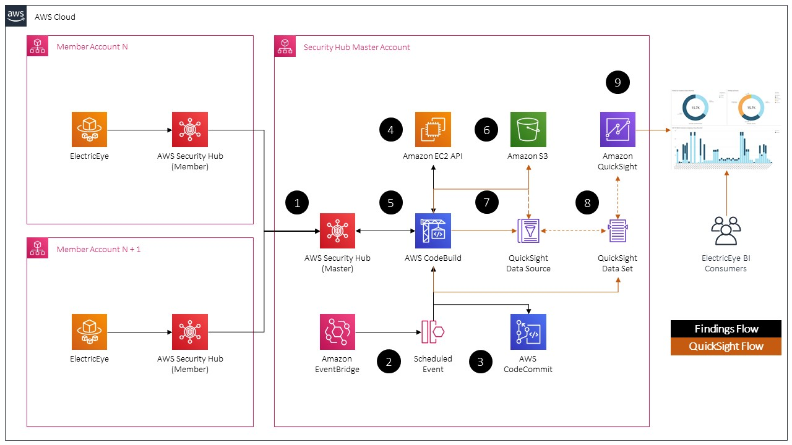

# ElectricEye-Reports

ElectricEye-Reports is an add-on that allows you the created detailed business intelligence (BI) reports from ElectricEye findings in Security Hub using [Amazon QuickSight](https://aws.amazon.com/quicksight/), a "...scalable, serverless, embeddable, machine learning-powered business intelligence (BI) service built for the cloud." Using QuickSight, you can create detailed reports that breakdown all of your ElectricEye findings by Severity, Region, Resource Type, as well as breakout by-Compliance Control reporting and further enrich the dataset in this solution with business-context such as Cost Center, Division, Business Owner, and other metadata. With this data you can create visualizations that can be used by a many Personas across Information Security, IT Audit, IT Operations, Product Development, and Risk functions - such as tracking compliance with specific controls, measuring Key Risk Indicators (KRIs), or preparing evidence for a formal audit certification/attestation/examination.


This solution will utilize AWS Serverless technologies such as AWS CodeBuild, Amazon S3, and QuickSight to create a Minimal Viable Product (MVP) for the purpose of collecting multi-Account and multi-Region ElectricEye findings and populating the necessary "primitives" within QuickSight to create visualizations (also known as [Analyses](https://docs.aws.amazon.com/quicksight/latest/user/working-with-analyses.html) and [Dashboards](https://docs.aws.amazon.com/quicksight/latest/user/working-with-dashboards.html)). Due to the hands-on nature of QuickSight and the necessity of utilizing Security Hub's AWS Organizations integration, there will be some prerequisites to the usage of this solution. Additionally, being a MVP, any modification of the data extracted from Security Hub may negatively impact the successful execution of this add-on's codebase.

## Prerequisites

- ElectricEye is creating findings in Security Hub, lol.

- All Member Accounts are sending findings to Security Hub via the AWS Organizations integration. (**Note** This will need to be setup once per AWS Region)

- An Amazon QuickSight Subscription is setup in the Region you will run this solution. For more information on setting up a Subscription, and the types of Subscriptions, see [here](https://docs.aws.amazon.com/quicksight/latest/user/signing-up.html).

- Access to a S3 Bucket that you can upload a ZIP file (used for CodeCommit Repo creation by [AWS CloudFormation](https://docs.aws.amazon.com/AWSCloudFormation/latest/UserGuide/aws-properties-codecommit-repository-s3.html)) and JSON files to for this Add-on.

## Solution Architecture



1. Findings from all Member Accounts are sent to the Security Hub Master across every Region the Organizations integration is enabled in.

2. An[ Amazon EventBridge](https://docs.aws.amazon.com/eventbridge/latest/userguide/what-is-amazon-eventbridge.html) [Scheduled Rule](https://docs.aws.amazon.com/eventbridge/latest/userguide/scheduled-events.html#rate-expressions) (Rate-based) will trigger an [AWS CodeBuild Project](https://docs.aws.amazon.com/codebuild/latest/userguide/concepts.html#concepts-how-it-works) over a desired time-period (hourly, daily, weekly, etc.)

3. Upon initialization, CodeBuild will retreive the necessary code artifacts (a Python script and a [Build specification ](https://docs.aws.amazon.com/codebuild/latest/userguide/build-spec-ref.html)) from [AWS CodeCommit](https://docs.aws.amazon.com/codecommit/latest/userguide/welcome.html), a managed Git-based repository.

4. A list of all opted-in AWS Regions for your Account is retrieved from the [AWS EC2 DescribeRegions](https://docs.aws.amazon.com/cli/latest/reference/ec2/describe-regions.html) API.

5. The list of Regions is iterated through, creating a [Regionally-aware Boto3 Session](https://boto3.amazonaws.com/v1/documentation/api/latest/reference/core/session.html) for every iteration, this Session is used to [retrieve all ElectricEye findings](https://boto3.amazonaws.com/v1/documentation/api/latest/reference/services/securityhub.html#SecurityHub.Paginator.GetFindings) from the trailing week from Security Hub and is written to a JSON file. The contents of the finding will look like this in their final form:

```json
[
  {
    "Finding Type": "Software and Configuration Checks/AWS Security Best Practices",
    "Account ID": "0000000",
    "Severity": "INFORMATIONAL",
    "Title": "[ShieldAdvanced.8] Shield Advanced subscription should be set to auto-renew",
    "Resource Type": "AwsAccount",
    "Resource ID": "AWS::::Account:0000000",
    "Region": "us-east-1",
    "Compliance Status": "PASSED",
    "Workflow State": "RESOLVED",
    "Compliance Control": "NIST CSF ID.AM-2"
  }
]
```

6. The JSON file is [GZIP'ed](https://www.gzip.org/) and uploaded to Amazon S3 along with an uncompressed [JSON Manifest file](https://docs.aws.amazon.com/quicksight/latest/user/supported-manifest-file-format.html) used by QuickSight to create [Data Sources from S3-hosted data](https://docs.aws.amazon.com/quicksight/latest/user/working-with-data-sources.html).

7. A QuickSight Data Source is created from the JSON Manifest which references the GZIP'ed JSON file we created in Step 5.

8. A QuickSight Data Set is [prepared](https://docs.aws.amazon.com/quicksight/latest/user/preparing-data.html) from the Data Source in Step 7. This Data Set will perform transformations of the raw JSON file, load it into QuickSight's [SPICE Engine](https://docs.aws.amazon.com/quicksight/latest/user/how-quicksight-works.html), and be used for the creation of an [Analysis](https://docs.aws.amazon.com/quicksight/latest/user/working-with-analyses.html).

9. (Manual Step) an Analysis is created from the Data Set from Step 8 that will contain [Visualizations](https://docs.aws.amazon.com/quicksight/latest/user/working-with-visuals.html) and [Insights](https://docs.aws.amazon.com/quicksight/latest/user/making-data-driven-decisions-with-ml-in-quicksight.html). These can be saved into a [Dashboard](https://docs.aws.amazon.com/quicksight/latest/user/working-with-dashboards.html) which can be shared, [emailed](https://docs.aws.amazon.com/quicksight/latest/user/sending-reports.html), [printed](https://docs.aws.amazon.com/quicksight/latest/user/printing1.html), or [embedded](https://docs.aws.amazon.com/quicksight/latest/user/embedded-analytics-dashboards-for-everyone.html) into downstream enterprise applications.

## Setting Up


## License
This library is licensed under the GNU General Public License v3.0 (GPL-3.0) License. See the LICENSE file.