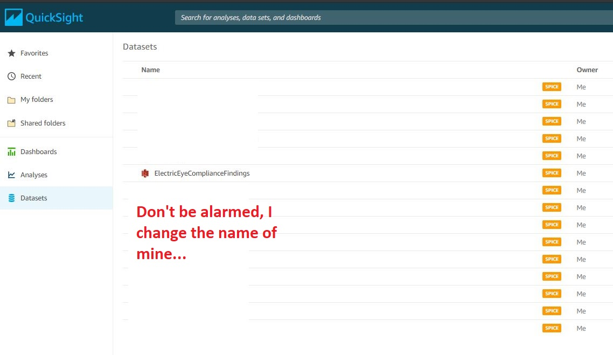

# ElectricEye-Reports

ElectricEye-Reports is an add-on that allows you the created detailed business intelligence (BI) reports from ElectricEye findings in Security Hub using [Amazon QuickSight](https://aws.amazon.com/quicksight/), a "...scalable, serverless, embeddable, machine learning-powered business intelligence (BI) service built for the cloud." Using QuickSight, you can create detailed reports that breakdown all of your ElectricEye findings by Severity, Region, Resource Type, as well as breakout by-Compliance Control reporting and further enrich the dataset in this solution with business-context such as Cost Center, Division, Business Owner, and other metadata. With this data you can create visualizations that can be used by a many Personas across Information Security, IT Audit, IT Operations, Product Development, and Risk functions - such as tracking compliance with specific controls, measuring Key Risk Indicators (KRIs), or preparing evidence for a formal audit certification/attestation/examination.


This solution will utilize AWS Serverless technologies such as AWS CodeBuild, Amazon S3, and QuickSight to create a Minimal Viable Product (MVP) for the purpose of collecting multi-Account and multi-Region ElectricEye findings and populating the necessary "primitives" within QuickSight to create visualizations (also known as [Analyses](https://docs.aws.amazon.com/quicksight/latest/user/working-with-analyses.html) and [Dashboards](https://docs.aws.amazon.com/quicksight/latest/user/working-with-dashboards.html)). Due to the hands-on nature of QuickSight and the necessity of utilizing Security Hub's AWS Organizations integration, there will be some prerequisites to the usage of this solution. Additionally, being an MVP, any modification of the data extracted from Security Hub may negatively impact the successful execution of this add-on's codebase.

## Prerequisites

- ElectricEye is creating findings in Security Hub, lol.

- All Member Accounts are sending findings to Security Hub via the AWS Organizations integration. (**Note** This will need to be setup once per AWS Region)

- An Amazon QuickSight Subscription is setup in the Region you will run this solution. For more information on setting up a Subscription, and the types of Subscriptions, see [here](https://docs.aws.amazon.com/quicksight/latest/user/signing-up.html).

- Access to a S3 Bucket that you can upload a ZIP file (used for CodeCommit Repo creation by [AWS CloudFormation](https://docs.aws.amazon.com/AWSCloudFormation/latest/UserGuide/aws-properties-codecommit-repository-s3.html)) and JSON files to for this Add-on.

- Access to a workstation / server with the AWS CLI installed and necessary IAM Permissions.

## Solution Architecture


1. Findings from all Member Accounts are sent to the Security Hub Master across every Region the Organizations integration is enabled in.

2. An[ Amazon EventBridge](https://docs.aws.amazon.com/eventbridge/latest/userguide/what-is-amazon-eventbridge.html) [Scheduled Rule](https://docs.aws.amazon.com/eventbridge/latest/userguide/scheduled-events.html#rate-expressions) (Rate-based) will trigger an [AWS CodeBuild Project](https://docs.aws.amazon.com/codebuild/latest/userguide/concepts.html#concepts-how-it-works) over a desired time-period (hourly, daily, weekly, etc.)

3. Upon initialization, CodeBuild will retrieve the necessary code artifacts (a Python script and a [Build specification ](https://docs.aws.amazon.com/codebuild/latest/userguide/build-spec-ref.html)) from [AWS CodeCommit](https://docs.aws.amazon.com/codecommit/latest/userguide/welcome.html), a managed Git-based repository.

4. A list of all opted-in AWS Regions for your Account is retrieved from the [AWS EC2 DescribeRegions](https://docs.aws.amazon.com/cli/latest/reference/ec2/describe-regions.html) API.

5. The list of Regions is iterated through, creating a [Regionally-aware Boto3 Session](https://boto3.amazonaws.com/v1/documentation/api/latest/reference/core/session.html) for every iteration, this Session is used to [retrieve all ElectricEye findings](https://boto3.amazonaws.com/v1/documentation/api/latest/reference/services/securityhub.html#SecurityHub.Paginator.GetFindings) from the trailing week from Security Hub and is written to a JSON file. The contents of the finding will look like this in their final form:

```json
[
  {
    "Finding Type": "Software and Configuration Checks/AWS Security Best Practices",
    "Account ID": "0000000",
    "Severity": "INFORMATIONAL",
    "Title": "[ShieldAdvanced.8] Shield Advanced subscription should be set to auto-renew",
    "Resource Type": "AwsAccount",
    "Resource ID": "AWS::::Account:0000000",
    "Region": "us-east-1",
    "Compliance Status": "PASSED",
    "Workflow State": "RESOLVED",
    "Compliance Control": "NIST CSF ID.AM-2"
  }
]
```

6. The JSON file is [GZIP'ed](https://www.gzip.org/) and uploaded to Amazon S3 along with an uncompressed [JSON Manifest file](https://docs.aws.amazon.com/quicksight/latest/user/supported-manifest-file-format.html) used by QuickSight to create [Data Sources from S3-hosted data](https://docs.aws.amazon.com/quicksight/latest/user/working-with-data-sources.html).

7. A QuickSight Data Source is created from the JSON Manifest which references the GZIP'ed JSON file we created in Step 5.

8. A QuickSight Data Set is [prepared](https://docs.aws.amazon.com/quicksight/latest/user/preparing-data.html) from the Data Source in Step 7. This Data Set will perform transformations of the raw JSON file, load it into QuickSight's [SPICE Engine](https://docs.aws.amazon.com/quicksight/latest/user/how-quicksight-works.html), and be used for the creation of an [Analysis](https://docs.aws.amazon.com/quicksight/latest/user/working-with-analyses.html).

9. (Manual Step) an Analysis is created from the Data Set from Step 8 that will contain [Visualizations](https://docs.aws.amazon.com/quicksight/latest/user/working-with-visuals.html) and [Insights](https://docs.aws.amazon.com/quicksight/latest/user/making-data-driven-decisions-with-ml-in-quicksight.html). These can be saved into a [Dashboard](https://docs.aws.amazon.com/quicksight/latest/user/working-with-dashboards.html) which can be shared, [emailed](https://docs.aws.amazon.com/quicksight/latest/user/sending-reports.html), [printed](https://docs.aws.amazon.com/quicksight/latest/user/printing1.html), or [embedded](https://docs.aws.amazon.com/quicksight/latest/user/embedded-analytics-dashboards-for-everyone.html) into downstream enterprise applications.

**Important Note:** While not shown this solution will also create a Group comprised of every user within your QuickSight Subscription in the [Default Namespace](https://docs.aws.amazon.com/quicksight/latest/user/namespaces.html) which will have full permissions to the Data Sources and Data Sets.

## Setting Up

### Running via Automation (AWS CodeBuild)

This section details the steps to setup ElectricEye-Reports via Automation. This will use a CloudFormation template and does not currently support Terraform.

1. Clone this repo and upload the ZIP Archive containing the code for CodeBuild to an Amazon S3 Bucket.

```bash
git clone https://github.com/jonrau1/ElectricEye.git
cd ElectricEye/add-ons/electriceye-reports/automation
aws s3 cp codecommit-archive.zip s3://$YOUR_BUCKET_HERE/codecommit-archive.zip
```

2. Create and Deploy a CloudFormation Stack (**ElectricEyeReports_CloudFormation.yaml**) from the `ElectricEye/add-ons/electriceye-reports/automation` directory.

3. EventBridge may not start your CodeBuild Project right away, to force the execution use the following AWS CLI command.

```bash
aws codebuild start-build \
    --project-name ElectricEyeReports
```

4. To ensure the Data Set created succesfully navigate to your QuickSight console and look for the `ElectricEyeComplianceFindingsDataset` Data Set, if you see it you're good to go!



### Running locally

TODO

## Creating Visualizations

This section will provide a brief walkthrough of creating a new Analysis with some Visualizations you can use to get started.

## FAQ

#### 1. What information is extracted from the ElectricEye findings?

Only certain elements are parsed from the [AWS Security Finding Format](https://docs.aws.amazon.com/securityhub/latest/userguide/securityhub-findings-format.html) (ASFF), this is primarily due to the fact that the Resource-level information greatly varies by Finding and would not be feasible to collect efficiently. Secondarily, only certain information makes sense to gather for the purpose of a BI report such as the finding's title, the related compliance controls, severity, status, and ownership (Account and Region) of the finding. The full data schema is included under Step 5 within the Solution Architecture Section.

#### 2. How are the related compliance controls extracted from the findings in a way that can be individually reported on?

The object shape for the related compliance controls is a nested array of strings underneath the [`Compliance`](https://docs.aws.amazon.com/securityhub/latest/userguide/securityhub-findings-format-attributes.html#asff-compliance) object within the ASFF. Due to the inability for QuickSight to deconstruct a List / Array, it will be iterated through using a Python `for` loop and written to it's own individual object within the overall JSON schema. This will artificially inflate the total amount of findings that are written to a JSON file for the [Finding ID](https://docs.aws.amazon.com/securityhub/latest/userguide/securityhub-findings-format-attributes.html#asff-top-level-attributes) is recorded to provide a unique counter for the breakout of compliance controls within QuickSight. For more information on how I mapped the compliance controls see the [top-level README starting at FAQ#17](https://github.com/jonrau1/ElectricEye#17-at-a-high-level-how-did-you-map-the-electriceye-auditors-into-these-compliance-frameworks).

#### 3. How long does it take the parse the ElectricEye findings and their compliance controls?

It varies and is directly dependent on the amount of resources in-scope for ElectricEye checks, how many Regions ElectricEye is ran in, and how many Accounts are onboarded to your AWS Security Hub Master. For a single account with several hundred findings per Region this can take 2 -3 minutes, for a large organization with at least 100 accounts and 1000s of findings per Region this can possibly take in excess of an hour. As a quick benchmark, it takes 15 seconds to parse 1300 findings into 15.7K individual control-level findings for a single account with findings in 3 Regions.

#### 4. Can I change the scope of information parsed from the ASFF?

Yes. However, the data preparation of the QuickSight Data Set is directly dependent on the JSON schema for this Add-on remaining the same. If you change the format or shape of the JSON schema you will likely break the Data Set and will need to add any additional transformations or data column mappings.

#### 5. What sort of data preparation for the QuickSight Data Set is done in this Add-on?

Transformation all of the data points in Strings and ensuring that the JSON Keys are properly mapped into Column Names. If you were to create a Data Set direclty from the Data Source the column names are mapped correctly but some data types are not mapped to Strings, for instance the Account ID is transformed into an Integer and the Workflow State and AWs Region are mapped into Geolocation Types (due to their name).

#### 6. Why can you not create an Analysis?

The creation of an Analysis in the API is dependent on a Template being created from an existing Analysis in your own QuickSight Subscription. Unlike something like a CloudWatch Dashboard which has a consumable JSON schema, that is not possible to create nor share across Accounts.

#### 7. Will this solution ever include example embedding?

Yes, eventually. The QuickSight Embedded Analytics SDK is only available in JavaScript, which I am not proficient in, so I will need to explore how to use this and create a way to host the Dashboard.

#### 8. I have other datasets I want to merge with this one, how can I do that in QuickSight?

QuickSight has a native workflow tool within the Data Set Editing view that allows you to perform SQL-Like JOINS across datasets. If you had a dataset that mapped your AWS Accounts into business lines for instance, you can perform an INNER or LEFT Join form the Data Set created in this Add-on with that one. This new Data Set can be saved as its own Data Set and not affect the downstream solution for this Add-on.

#### 9. Why use QuickSight? Why not another BI / Visualization tool such as Kibana or PowerBI?

QuickSight offers direct APIs to prepapre and transform the data, is more cost effective than hosting your own Elasticsearch/Kibana server, way more cost effective than using Amazon Elasticsearch Service, and PowerBI is a silly Microsoft tool.

#### 10. Why is the Default Namespace used for the creation of the QuickSight Group?

The default namespace supports password-based logins for members of the QuickSight Subscription that do not have AWS Accounts (they also support AD Creds). Custom namespaces can only be accessed using Identity Federation/SSO - that makes sense for a multi-tenant SaaS App but not for a central security team accessing the visualizations.

## License
This library is licensed under the GNU General Public License v3.0 (GPL-3.0) License. See the LICENSE file.