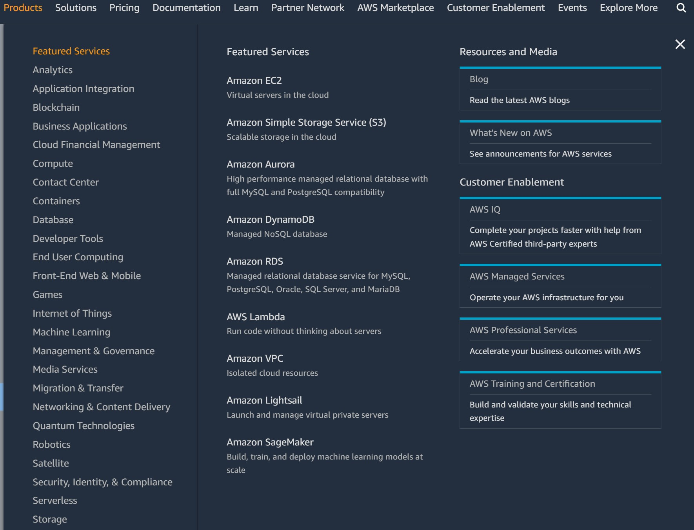

## ElectricEye for Cloud Asset Management (CAM)

### Table of Contents

zonk

### CAM Concept of Operations (CONOPs)

The CONOPS for the CAM capabilities of ElectricEye largely lay within the evaluation logic provided by ElectricEye. All ElectricEye findings created by its checks are mapped to the [AWS Security Finding Format (ASFF)](https://docs.aws.amazon.com/securityhub/latest/userguide/securityhub-findings-format.html) which supports up to 50 key-value pairs within its `ProductFields` object in the schema.

ElectricEye utilizes the `ProductFields` object to record information about the Assessment Target - the Cloud Service Provider (CSP) or Software-as-a-Service (SaaS) vendor - that is being evaluated in two distinct ways. Any key with `Provider` in its name corresponds to information about the Assessment Target itself and any key with `Asset` in its name corresponds to whatever discrete component or sub-service is being evaluated by an ElectricEye Check such as an AWS EC2 Instance or a ServiceNow Plugin.

The following CAM-related `ProductFields` keys are provided per Check within ElectricEye:

#### `Provider` 

This key contains the name of the Assessment Target that that Auditor corresponds to such as AWS, GCP, OCI, ServiceNow, M365, or otherwise.

#### `ProviderType`

This key corresponds to the cloud offering of the Assessment Target, either `CSP` for public cloud service providers or `SaaS` for Software-as-a-Service vendors and providers. In the future, this may be further expanded as ElectricEye expands in its service coverage.

#### `ProviderAccountId`

This key contains the unique identifier of the specific Assessment Target being evaluated such as a ServiceNow Instance Name, a M365 Tenant Identifier, an Oracle Cloud Infrastrucute Tenancy ID, an AWS Account ID, and so on. Only the value will be provided and it will always correspond to `Provider`.

#### `AssetRegion`

This key contains information about the specific asset's (what the Check is evalauting against) geographic region, if known. In some cases this may correspond to a smaller geographical infrastructure repesentation such as a Google Cloud Platform `zone` and may be omitted completely if deducing the location is not known (such as from a Workday ERP or ServiceNow instance). Best effort is made to parse this information from information returned by a CSP or SaaS Provider API such as an AWS `region` or a GCP `zone`.

#### `AssetDetails`

This key contains the JSON payload returned by the CSP or SaaS provider's API relative to the specific Asset being evaluated by an ElectricEye Check. The entire schema is captured in `AssetDetails` and will only appear in `json`, `stdout`, and `cam_json` ElectricEye Outputs.

#### `AssetClass`

This key contains information about the high level category a specific Asset maps into, this is derived from the Product offerings from AWS and how they are categorized, the intent is to use this to monitor or review all offerings within a specific IT vertical such as databases or analytics services. See the [Asset Class Mapping section](#asset-class-mapping) for more information on how these `AssetClass` types are used.

#### `AssetService`

This key contains the information about the specific CSP or SaaS service offering that an Asset belongs to, for instance, Amazon API Gateway or Google CloudSQL. For SaaS Providers which lack the specificity of an asset management hierarchy, best effort is taken to give a descriptive name or title for `AssetService` such as **"Plugin"** for entries in the `v_plugin` or `sys_plugins` tables within ServiceNow or **"Data Loss Prevention"** for settings pertaining to M365 Defender for Cloud Apps or Google WorkSpaces DLP configurations.

#### `AssetComponent`

This key contains the information about what the actual Asset is, this can also be known as a "type" or "sub-service" in other asset management hierarchies. This is the logical entity in which an ElectricEye Check is directly evaluating such as an Amazon EC2 *Instance* or a Google CloudSQL *Database Instance* or a ServiceNow *System Property*. `AssetComponent` will be as simplistic as possible to describe the asset itself and will attempt to use the CSP or SaaS provider's own terminology when it makes sense to.

In some cases the `AssetComponent` doesn't refer to a "thing" but it may refer to a shared fact or attribute about a `Provider` itself such as different "Account-level" or "Project-level" settings within the Public CSPs. An example of this includes AWS EC2 Serial Port Console Access, Google Cloud Project Instance Connection Settings, or AWS X-Ray Encryption Configurations. It can also show up for ElectricEye Checks that are assessing the overall posture of multiple services such as checking if Subnets within AWS have remaining capacity or if Instances have Systems Manager State Manager Associations associated with them to apply patches or collect software assets.

### CAM Reporting


### Asset Class Mapping

For the purpose of ElectricEye CAM, the [AWS Product Categories](https://aws.amazon.com/products/?nc2=h_ql_prod&aws-products-all.sort-by=item.additionalFields.productNameLowercase&aws-products-all.sort-order=asc&awsf.re%3AInvent=*all&awsf.Free%20Tier%20Type=*all&awsf.tech-category=*all) which are shown below are the guidepost for the `AssetClass` entry.



The following mapping is used, where the entry for "ElectricEye CAM `AssetClass`" is `NOT_MAPPED` that means that category is not used.

| AWS Product Category Name | ElectricEye CAM `AssetClass` | Extra Notes |
|---|---|---|
| Analytics | Analytics | Mapped 1:1 |
| Application Integration | Application Integration | Mapped 1:1 for all messaging, queuing, and brokerage services |
| Blockchain | Blockchain | Mapped 1:1 |
| Business Applications | **NOT_MAPPED** | Not currently used |
| Cloud Financial Management | **NOT_MAPPED** | Not currently used |
| Compute | Compute | Mapped 1:1 |
| Contact Center | **NOT_MAPPED** | Not currently used |
| Containers | Containers | Will be prioritized over `Compute`, `Networking`, and `Developer Tools` for container/Docker/Kubernetes-related offerings such as Amazon ECR, Google Container Registry, and AWS AppMesh |
| Database | Database | Mapped 1:1 |
| Developer Tools | Developer Tools | Some services are recategorized to `Developer Tools` such as Amazon EC2 Image Builder and AWS Amplify |
| End User Computing | End User Computing | Mapped 1:1 |
| Front-End Web & Mobile | **NOT_MAPPED** | Front-End Web & Mobile is not used to differentiate across the offerings, only the "base" service is used, for instance Amazon API Gateway is mapped to `Networking` and AWS Amplify is mapped to `Developer Tools` |
| Games | **NOT_MAPPED** | Not currently used |
| Internet of Things | **NOT_MAPPED** | Not currently used |
| Machine Learning | Machine Learning | Mapped 1:1 |
| Management & Governance | Management & Governance | Management, IT Operations, and GRC tools (such as AWS Audit Manager) which map here - this also includes security ***configurations*** and other "account-wide" or "project-wide" settings, plugins, and properties |
| Media Services | **NOT_MAPPED** | Not currently used |
| Migration & Transfer | Migration & Transfer | Mapped 1:1 |
| Networking & Content Delivery | Networking | "Content Delivery" is removed from this `AssetClass` but CDNs such as Amazon CloudFront and Google Cloud Armor will map to `Networking` as will API-related services such as AWS AppSync or Google Apigee |
| Quantum Technologies | **NOT_MAPPED** | Not currently used |
| Robotics | **NOT_MAPPED** | Not currently used |
| Satellite | **NOT_MAPPED** | Not currently used |
| Security, Identity, & Compliance | Security Services | The `Security Services` is used as `AssetClass` for generic security offerings and not for configurations - for instance, Azure WAF, AWS WAFv2, Amazon GuardDuty, AWS Trusted Advisor, etc. |
| Security, Identity, & Compliance | Identity & Access Management | Any cloud identity or identity service such as AWS Directory Services or Amazon Cognito maps into `Identity & Access Management` |
| Serverless | **NOT_MAPPED** | Serverless is not used to differentiate across the offerings, for instance GCP Cloud Functions and AWS Lambda map to `Compute` and Amazon DynamoDB and GCP AlloyDB map to `Database`. |
| Storage | Storage | In some cases, `Storage` is used in lieu of `Compute` such as with Disks and AMIs |

### Example Output

This is the expected output from `-o stdout`, in this case it is an AWS Assessment Target & IAM Auditor.

```json
{
  "SchemaVersion": "2018-10-08",
  "Id": "arn:aws-isob:iam::123456123456:role/exampleRoleName123456/role_policy_least_priv",
  "ProductArn": "arn:aws-isob:securityhub:us-isob-east-1:123456123456:product/123456123456/default",
  "GeneratorId": "arn:aws-isob:iam::123456123456:role/exampleRoleName123456",
  "AwsAccountId": "123456123456",
  "Types": [
    "Software and Configuration Checks/AWS Security Best Practices"
  ],
  "FirstObservedAt": "2021-04-02T20:34:28.840122+00:00",
  "CreatedAt": "2021-04-02T20:34:28.840122+00:00",
  "UpdatedAt": "2021-04-02T20:34:28.840122+00:00",
  "Severity": {
    "Label": "INFORMATIONAL"
  },
  "Confidence": 99,
  "Title": "[IAM.11] Role inline policies should follow least privilege principles",
  "Description": "The role exampleRoleName123456 inline policy exampleScaryPolicy is following least privilege principles.",
  "Remediation": {
    "Recommendation": {
      "Text": "For information on IAM least privilege refer to the inline policy section of the AWS IAM User Guide",
      "Url": "https://docs.aws.amazon.com/IAM/latest/UserGuide/access_policies_managed-vs-inline.html#inline-policies"
    }
  },
  "ProductFields": {
    "ProductName": "ElectricEye",
    "Provider": "AWS",
    "ProviderType": "CSP",
    "ProviderAccountId": "123456123456",
    "AssetRegion": "us-isob-east-1",
    "AssetDetails": {
      "Path": "/",
      "RoleName": "exampleRoleName123456",
      "RoleId": "AROA3TX2ECB4SEKQKIHFB",
      "Arn": "arn:aws-isob:iam::123456123456:role/exampleRoleName123456",
      "CreateDate": "2021-04-08 20:38:25+00:00",
      "AssumeRolePolicyDocument": {
        "Version": "2012-10-17",
        "Statement": [
          {
            "Effect": "Allow",
            "Principal": {
              "Service": "appsync.amazonaws.com"
            },
            "Action": "sts:AssumeRole"
          }
        ]
      },
      "Description": "",
      "MaxSessionDuration": 3600
    },
    "AssetClass": "Identity & Access Management",
    "AssetService": "AWS IAM",
    "AssetComponent": "Role"
  },
  "Resources": [
    {
      "Type": "AwsIamRole",
      "Id": "arn:aws-isob:iam::123456123456:role/exampleRoleName123456",
      "Partition": "aws",
      "Region": "us-isob-east-1",
      "Details": {
        "AwsIamRole": {
          "RolePolicyList": [
            {
              "PolicyName": "exampleScaryPolicy"
            }
          ],
          "RoleName": "exampleRoleName123456"
        }
      }
    }
  ],
  "Compliance": {
    "Status": "PASSED",
    "RelatedRequirements": [
      "NIST CSF V1.1 PR.AC-3",
      "NIST SP 800-53 Rev. 4 AC-1",
      "NIST SP 800-53 Rev. 4 AC-17",
      "NIST SP 800-53 Rev. 4 AC-19",
      "NIST SP 800-53 Rev. 4 AC-20",
      "NIST SP 800-53 Rev. 4 SC-15",
      "AICPA TSC CC6.6",
      "ISO 27001:2013 A.6.2.1",
      "ISO 27001:2013 A.6.2.2",
      "ISO 27001:2013 A.11.2.6",
      "ISO 27001:2013 A.13.1.1",
      "ISO 27001:2013 A.13.2.1"
    ]
  },
  "Workflow": {
    "Status": "RESOLVED"
  },
  "RecordState": "ARCHIVED"
}
```