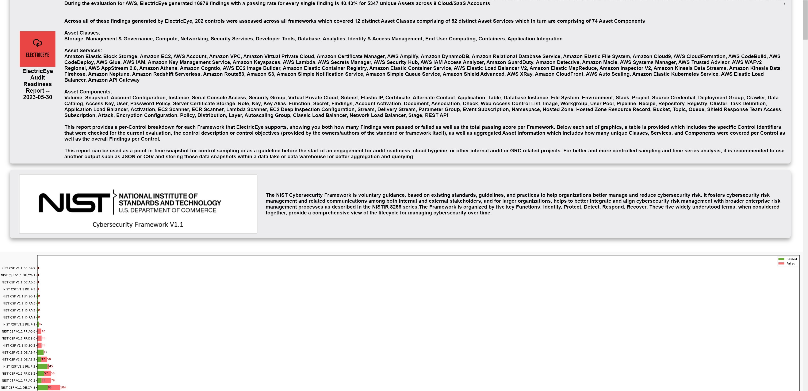
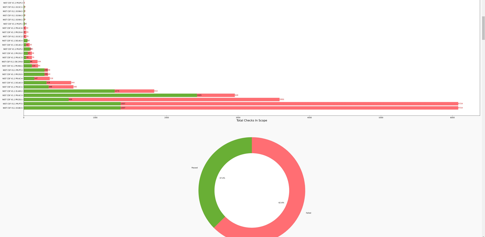
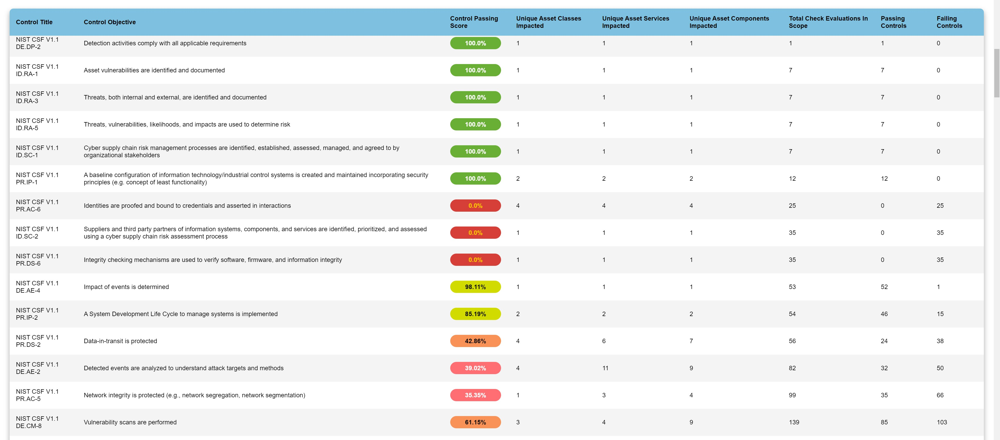
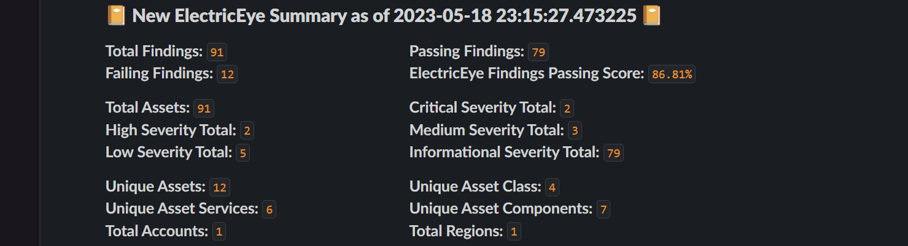
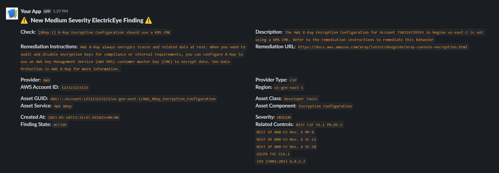

# ElectricEye Outputs

This documentation is all about Outputs supported by ElectricEye and how to configure them with the Command-line and/or TOML configuration file.

## Table of Contents

- [Key Considerations](#key-considerations)
- [`stdout` Output](#stdout-output)
- [JSON Output](#json-output)
- [HTML Output](#html-output)
- [HTML Compliance Output](#html-compliance-output)
- [Normalized JSON Output](#json-normalized-output)
- [Cloud Asset Management JSON Output](#json-cloud-asset-management-cam-output)
- [Open Cyber Security Format (OCSF) V1.1.0 Output](#open-cyber-security-format-ocsf-v110-output)
- [CSV Output](#csv-output)
- [AWS Security Hub Output](#aws-security-hub-output)
- [MongoDB & AWS DocumentDB Output](#mongodb--aws-documentdb-output)
- [Cloud Asset Management MongoDB & AWS DocumentDB Output](#mongodb--aws-documentdb-cloud-asset-management-cam-output)
- [PostgreSQL Output](#postgresql-output)
- [Cloud Asset Management PostgreSQL Output](#postgresql-cloud-asset-management-cam-output)
- [Firemon Cloud Defense (DisruptOps) Output](#firemon-cloud-defense-disruptops-output)
- [Amazon Simple Queue Service (SQS) Output](#amazon-simple-queue-service-sqs-output)
- [Slack Output](#slack-output)
- [AWS Security Finding Format (ASFF) -> Amazon Kinesis Data Firehose](#aws-security-finding-format-asff---amazon-kinesis-data-firehose)
- [Open Cybersecurity Format (OCSF) -> Amazon Kinesis Data Firehose](#open-cybersecurity-format-ocsf---amazon-kinesis-data-firehose)

## Key Considerations

ElectricEye supports several cloud-native, open-source, and file-based Outputs and can process one or more different Output providers to support multi-reporting use cases. Best effort is made to implement best-practices per-provider such as setting Primary Keys in MongoDB and PostgreSQL, using Upserts, exponetial backoffs, batch writing, and/or graceful exception handling when possible.

As these outputs contain sensitive values such as API Keys, Tenant IDs, Passwords, and similar credentials it is always a best practice to use AWS Systems Manager Parameter Store SecureString Parameters or AWS Secrets Manager. In the future, other password vaults and Privileged Identity Management (PIM) solutions will be supported.

To review the list of possible Output providers, use the following ElectricEye command.

```bash
$ python3 eeauditor/controller.py --list-options
['amazon_sqs', 'cam_json', 'cam_mongodb', 'cam_postgresql', 'csv', 'ddb_backend', 'firemon_cloud_defense', 'html', 'html_compliance', 'json', 'json_normalized', 'mongodb', 'postgresql', 'sechub', 'slack', 'stdout']
```

#### IMPORTANT NOTE!! You can specify multiple Outputs by providing the `-o` or `--outputs` argument multiple times, for instance: `python3 eeauditor/controller.py -t AWS -o json -o csv -o postgresql`

For ***file-based Ouputs*** such as JSON or CSV, the filename is controlled using the `--output-file` argument, if provided for other Outputs it will be ignored. Note that you do not need to specify a MIME type (e.g., `.csv`, `.json`), this will be handled by the Output Processor

```bash
$ python3 eeauditor/controller.py --output-file my_important_file -o json -t AWS -a Amazon_EC2_Auditor
```

All other Output attributes are controlled in the [TOML Configuration File](../../eeauditor/external_providers.toml) underneath the `[Outputs]` heading, ensure that any sensitive values you provide match the selection within `[global.credentials_location]`. At this time, it is **NOT POSSIBLE** to mix-and-match credential locations between local files, SSM, ASM, or otherwise.


```toml

# This TOML document provides configuration for all of ElectricEye, from credentials to regions to accounts 
# as well as global settings, filenames, and other directives that can be used by ElectricEye

title = "ElectricEye Configuration"

[global]

    ...

    # Specifies the location of where credentials are stored and will be retrieved from
    # if you specify "CONFIG_FILE" that means you can provide the value within the option itself

    credentials_location = "AWS_SSM" # VALID CHOICES: AWS_SSM | AWS_SECRETS_MANAGER | CONFIG_FILE

```

Each Output Processor will raise an `Exception` if there are missing or conflicting values, ensure you review the instructions within this documentation or within the TOML file commentary. For a better user experience, it is recommended to view the TOML file within an Integrated Development Environment (IDE) such as VSCode with a .TOML parsing extension.

It is important to note that outside of `json`, `stdout` and AWS Security Hub, the full ASFF Finding generated by ElectricEye Auditors are selectively processed to better fit the Output selection, example outputs are provided within each section header.

## `stdout` Output

This is the default Output of ElectricEye, all ElectricEye findings (including `AssetDetails`) are printed out to your terminal using `print(json.dumps(findings,default=str))`. As these are raw JSON objects, it can be used in conjunction with a `grep` statement as well as `jq` to query out specific keys within the ASFF as required.

For example, if you just want to have a "pretty-printed" JSON output you could use the following command, the `grep 'SchemaVersion'` pipe ensures that only JSON objects from the findings are piped to `jq` and not the logging and exception information that is produced by Electriceye.

```bash
$ python3 eeauditor/controller.py -t AWS -c ebs_volume_encryption_check -o stdout | grep 'SchemaVersion' | jq . -r
```

This Output will provide the `ProductFields.AssetDetails` information.

To use this Output include the following arguments in your ElectricEye CLI: `python3 eeauditor/controller.py {..args..} -o stdout` you can also choose to *not* specify `-o` at all as it is the default Output.

### Sample `stdout` Output

```bash
$ python3 eeauditor/controller.py -t AWS -c ebs_volume_encryption_check -o stdout | grep 'SchemaVersion'

{"SchemaVersion": "2018-10-08", "Id": "arn:aws-iso:ec2:us-iso-west-1:111111111111:volume/vol-0istateintotheabyss2/ebs-volume-encryption-check", "ProductArn": "arn:aws-iso:securityhub:us-iso-west-1:111111111111:product/111111111111/default", "GeneratorId": "arn:aws-iso:ec2:us-iso-west-1:111111111111:volume/vol-0istateintotheabyss2", "AwsAccountId": "111111111111", "Types": ["Software and Configuration Checks/AWS Security Best Practices", "Effects/Data Exposure"], "FirstObservedAt": "1977-06-02T122:29:47.694473+00:00", "CreatedAt": "1977-06-02T12:39:57.694473+00:00", "UpdatedAt": "1977-06-02T12:29:47.694473+00:00", "Severity": {"Label": "INFORMATIONAL"}, "Confidence": 99, "Title": "[EBS.3] EBS Volumes should be encrypted", "Description": "EBS Volume vol-0istateintotheabyss2 is encrypted.", "Remediation": {"Recommendation": {"Text": "If your EBS volume should be encrypted refer to the Amazon EBS Encryption section of the Amazon Elastic Compute Cloud User Guide", "Url": "https://docs.aws.amazon.com/AWSEC2/latest/UserGuide/EBSEncryption.html"}}, "ProductFields": {"ProductName": "ElectricEye", "Provider": "AWS", "ProviderType": "CSP", "ProviderAccountId": "111111111111", "AssetRegion": "us-iso-west-1", "AssetDetails": {"Attachments": [{"AttachTime": "2013-04-08 17:28:08+00:00", "Device": "/dev/xvda", "InstanceId": "i-123456abc", "State": "attached", "VolumeId": "vol-0istateintotheabyss2", "DeleteOnTermination": true}], "AvailabilityZone": "us-iso-west-1a", "CreateTime": "2023-04-08 17:28:08.422000+00:00", "Encrypted": true, "Size": 10, "SnapshotId": "snap-123456abc", "State": "in-use", "VolumeId": "vol-0istateintotheabyss2", "Iops": 100, "VolumeType": "gp2", "MultiAttachEnabled": false}, "AssetClass": "Storage", "AssetService": "Amazon Elastic Block Storage", "AssetComponent": "Volume"}, "Resources": [{"Type": "AwsEc2Volume", "Id": "arn:aws-iso:ec2:us-iso-west-1:111111111111:volume/vol-0istateintotheabyss2", "Partition": "aws", "Region": "us-iso-west-1", "Details": {"AwsEc2Volume": {"Encrypted": true}}}], "Compliance": {"Status": "PASSED", "RelatedRequirements": ["NIST CSF V1.1 PR.DS-1", "NIST SP 800-53 Rev. 4 MP-8", "NIST SP 800-53 Rev. 4 SC-12", "NIST SP 800-53 Rev. 4 SC-28", "AICPA TSC CC6.1", "ISO 27001:2013 A.8.2.3"]}, "Workflow": {"Status": "RESOLVED"}, "RecordState": "ARCHIVED"}
```

## HTML Output

The HTML Output selection writes a selective cross-section of ElectricEye findings to an HTML file for viewing in a browser and conversion to PDF and other reporting medium. An "executive report" format is created and forward text is dynamically generated to provide high-level statistics such as a failing percentage, passing and failing checks, number of unique resources, total resources, a breakdown of severity, and the amount of Accounts, Regions, `AssetService`, and `AssetComponents` scanned.

This Output will provide the `ProductFields.AssetDetails` information.

The generated Table supports dyanmic scrolling, hidden scroll bars, and will use [iconography.yaml](../../eeauditor/processor/outputs/iconography.yaml) to generate in-line `` tags for each `AssetService`.

The Table format follows this schema in HTML

```html
<thead>
    <tr>
        <th>Finding ID</th>
        <th>Created At</th>
        <th>Severity</th>
        <th>Title</th>
        <th>Description</th>
        <th>Provider</th>
        <th>Provider Account ID</th>
        <th>Asset Region</th>
        <th>Asset Class</th>
        <th>Asset Service</th>
        <th>Asset Component</th>
        <th>Resource ID</th>
        <th>Finding State</th>
        <th>Compliance Status</th>
    </tr>
</thead>
```

To use this Output include the following arguments in your ElectricEye CLI: `python3 eeauditor/controller.py {..args..} -o html --output-file my_file_name_here`

### Example HTML Report

**NOTE** This was screen-captured on a 3840x2160 screen at 67% zoom, so it looks like shit, sorry.


## HTML Compliance Output

The HTML "Compliance" Output produces a graphical HTML report consisting of `matplotlib` horizontal bar charts and pie charts which denote the pass vs. fail of each major compliance/best practice framework covered by ElectricEye as well as a per-control status per Framework. In addition, each control status is enriched with aggregated asset data including how many resources in total were assessed for a control, how many unique Asset Classes, Services, and Components, and the control objectives from the framework/standard authors is also provided. This report will provide a high-level summary of what was scanned which goes into much further detail than the regular `html` output while sacrificing per-Asset and per-Finding granularity.

The generated Table supports dyanmic scrolling, hidden scroll bars, and will use [iconography.yaml](../../eeauditor/processor/outputs/iconography.yaml) to generate in-line `` tags for each Framework and will also use several JSON files locally saved within this repository to populate the control objectives such as [this one for AICPA TSCs](../../eeauditor/processor/outputs/aicpa_tscs.json).

The Table format follows this schema in HTML

```html
<thead>
    <tr>
        <th>Control Title</th>
        <th>Control Objective</th>
        <th>Control Passing Score</th>
        <th>Unique Asset Classes Impacted</th>
        <th>Unique Asset Services Impacted</th>
        <th>Unique Asset Components Impacted</th>
        <th>Total Check Evaluations in Scope</th>
        <th>Passing Controls</th>
        <th>Failing Controls</th>
    </tr>
</thead>
```

To use this Output include the following arguments in your ElectricEye CLI: `python3 eeauditor/controller.py {..args..} -o html_compliance --output-file my_file_name_here`

### Example HTML Compliance Report







## JSON Output

The JSON Output selection will write all ElectricEye findings to a JSON file using Python's `json.dump()`. All non-JSON supported values are written as strings using the `default=str` argument.

This Output will provide the `ProductFields.AssetDetails` information.

To use this Output include the following arguments in your ElectricEye CLI: `python3 eeauditor/controller.py {..args..} -o json --output-file my_file_name_here`

### Example JSON Output

```json
{
    "SchemaVersion": "2018-10-08",
    "Id": "arn:aws-iso:lambda:us-iso-west-1:111111111111:function:national-security-lambda/lambda-function-unused-check",
    "ProductArn": "arn:aws-iso:securityhub:us-iso-west-1:111111111111:product/111111111111/default",
    "GeneratorId": "arn:aws-iso:lambda:us-iso-west-1:111111111111:function:national-security-lambda",
    "AwsAccountId": "111111111111",
    "Types": [
        "Software and Configuration Checks/AWS Security Best Practices"
    ],
    "FirstObservedAt": "2021-05-04T19:19:29.301081+00:00",
    "CreatedAt": "2021-05-04T19:19:29.301081+00:00",
    "UpdatedAt": "2021-05-04T19:19:29.301081+00:00",
    "Severity": {
        "Label": "INFORMATIONAL"
    },
    "Confidence": 99,
    "Title": "[Lambda.1] Lambda functions should be deleted after 30 days of no use",
    "Description": "Lambda function national-security-lambda has seen activity within the last 30 days.",
    "Remediation": {
        "Recommendation": {
            "Text": "For more information on best practices for lambda functions refer to the Best Practices for Working with AWS Lambda Functions section of the Amazon Lambda Developer Guide",
            "Url": "https://docs.aws.amazon.com/lambda/latest/dg/best-practices.html#function-configuration"
        }
    },
    "ProductFields": {
        "ProductName": "ElectricEye",
        "Provider": "AWS",
        "ProviderType": "CSP",
        "ProviderAccountId": "111111111111",
        "AssetRegion": "us-iso-west-1",
        "AssetDetails": {
            "FunctionName": "national-security-lambda",
            "FunctionArn": "arn:aws-iso:lambda:us-iso-west-1:111111111111:function:national-security-lambda",
            "Runtime": "nodejs16.x",
            "Role": "arn:aws-iso:iam::111111111111:role/national-security-lambda-95bace58",
            "Handler": "index.handler",
            "CodeSize": 1770,
            "Description": "",
            "Timeout": 15,
            "MemorySize": 256,
            "LastModified": "2021-04-08T20:27:14.689+0000",
            "CodeSha256": "LHEff1QkGl1nrFoAB8saiLzuxkQ=",
            "Version": "$LATEST",
            "TracingConfig": {
                "Mode": "PassThrough"
            },
            "RevisionId": "d9942d9c3d12",
            "PackageType": "Zip",
            "Architectures": [
                "x86_64"
            ],
            "EphemeralStorage": {
                "Size": 512
            },
            "your-internet-historyStart": {
                "ApplyOn": "None",
                "OptimizationStatus": "Off"
            }
        },
        "AssetClass": "Compute",
        "AssetService": "AWS Lambda",
        "AssetComponent": "Function"
    },
    "Resources": [
        {
            "Type": "AwsLambdaFunction",
            "Id": "arn:aws-iso:lambda:us-iso-west-1:111111111111:function:national-security-lambda",
            "Partition": "aws-iso",
            "Region": "us-iso-west-1",
            "Details": {
                "AwsLambdaFunction": {
                    "FunctionName": "national-security-lambda"
                }
            }
        }
    ],
    "Compliance": {
        "Status": "PASSED",
        "RelatedRequirements": [
            "NIST CSF V1.1 ID.AM-2",
            "NIST SP 800-53 Rev. 4 CM-8",
            "NIST SP 800-53 Rev. 4 PM-5",
            "AICPA TSC CC3.2",
            "AICPA TSC CC6.1",
            "ISO 27001:2013 A.8.1.1",
            "ISO 27001:2013 A.8.1.2",
            "ISO 27001:2013 A.12.5.1"
        ]
    },
    "Workflow": {
        "Status": "RESOLVED"
    },
    "RecordState": "ARCHIVED"
}
```

## JSON "Normalized" Output

The Normalized JSON Output selection will write all ElectricEye findings to a JSON file using Python's `json.dump()`. This is a "flattened" JSON schema that only contains the bare necessary details from within the ASFF, as shown in the example output. Every single value is written as a String, if this file is used downstream for BI reporting or querying ensure you are converting back to native types.

This Output will *not* provide the `ProductFields.AssetDetails` information.

To use this Output include the following arguments in your ElectricEye CLI: `python3 eeauditor/controller.py {..args..} -o json_normalized --output-file my_file_name_here`

### Example JSON "Normalized" Output

```json
{
    "SchemaVersion": "2018-10-08",
    "Id": "arn:aws-iso:lambda:us-iso-west-1:111111111111:function:national-security-lambda/lambda-function-unused-check",
    "ProductArn": "arn:aws-iso:securityhub:us-iso-west-1:111111111111:product/111111111111/default",
    "GeneratorId": "arn:aws-iso:lambda:us-iso-west-1:111111111111:function:national-security-lambda",
    "AwsAccountId": "111111111111",
    "Types": "['Software and Configuration Checks/AWS Security Best Practices']",
    "FirstObservedAt": "2021-05-04T19:31:56.263352+00:00",
    "CreatedAt": "2021-05-04T19:31:56.263352+00:00",
    "UpdatedAt": "2021-05-04T19:31:56.263352+00:00",
    "SeverityLabel": "INFORMATIONAL",
    "Confidence": 99,
    "Title": "[Lambda.1] Lambda functions should be deleted after 30 days of no use",
    "Description": "Lambda function national-security-lambda has seen activity within the last 30 days.",
    "RecommendationText": "For more information on best practices for lambda functions refer to the Best Practices for Working with AWS Lambda Functions section of the Amazon Lambda Developer Guide",
    "RecommendationUrl": "https://docs.aws.amazon.com/lambda/latest/dg/best-practices.html#function-configuration",
    "ProductFields": "{'ProductName': 'ElectricEye', 'Provider': 'AWS', 'ProviderType': 'CSP', 'ProviderAccountId': '111111111111', 'AssetRegion': 'us-iso-west-1', 'AssetClass': 'Compute', 'AssetService': 'AWS Lambda', 'AssetComponent': 'Function'}",
    "ResourceType": "AwsLambdaFunction",
    "ResourceId": "arn:aws-iso:lambda:us-iso-west-1:111111111111:function:national-security-lambda",
    "ResourcePartition": "aws",
    "ResourceRegion": "us-iso-west-1",
    "ResourceDetails": "{'AwsLambdaFunction': {'FunctionName': 'national-security-lambda'}}",
    "ComplianceStatus": "PASSED",
    "ComplianceRelatedRequirements": "['NIST CSF V1.1 ID.AM-2', 'NIST SP 800-53 Rev. 4 CM-8', 'NIST SP 800-53 Rev. 4 PM-5', 'AICPA TSC CC3.2', 'AICPA TSC CC6.1', 'ISO 27001:2013 A.8.1.1', 'ISO 27001:2013 A.8.1.2', 'ISO 27001:2013 A.12.5.1']",
    "WorkflowStatus": "RESOLVED",
    "RecordState": "ARCHIVED"
}
```

## JSON Cloud Asset Management (CAM) Output

The Cloud Asset Management (CAM) JSON Output selection will write unique per-asset data derived from ElectricEye findings to a JSON file using Python's `json.dump()`. The CAM JSON Output is meant for collecting the Asset information from each Check, and thus most of the security-specific details as well as most native ASFF data is stripped out. The CAM finding types will provide an aggregated finding count of each severity label per asset as well, this is the only type of Output that type of information can be found.

This Output will provide the `ProductFields.AssetDetails` information.

To use this Output include the following arguments in your ElectricEye CLI: `python3 eeauditor/controller.py {..args..} -o cam_json --output-file my_file_name_here`

### Example JSON Cloud Asset Management (CAM) Output

```json
{
    "AssetId": "arn:aws-iso:lambda:us-iso-west-1:111111111111:function:national-security-lambda",
    "FirstObservedAt": "2021-05-04T19:38:02.783669+00:00",
    "Provider": "AWS",
    "ProviderType": "CSP",
    "ProviderAccountId": "111111111111",
    "AssetRegion": "us-iso-west-1",
    "AssetDetails": {
        "FunctionName": "national-security-lambda",
        "FunctionArn": "arn:aws-iso:lambda:us-iso-west-1:111111111111:function:national-security-lambda",
        "Runtime": "nodejs16.x",
        "Role": "arn:aws-iso:iam::111111111111:role/national-security-lambda-95bace58",
        "Handler": "index.handler",
        "CodeSize": 2256,
        "Description": "",
        "Timeout": 15,
        "MemorySize": 256,
        "LastModified": "2021-04-08T20:27:14.770+0000",
        "CodeSha256": "aaaa/2222/5rResssatXHc=",
        "Version": "$LATEST",
        "TracingConfig": {
            "Mode": "PassThrough"
        },
        "RevisionId": "bd-4fac-asssdas",
        "PackageType": "Zip",
        "Architectures": [
            "x86_64"
        ],
        "EphemeralStorage": {
            "Size": 512
        },
        "your-internet-historyStart": {
            "ApplyOn": "None",
            "OptimizationStatus": "Off"
        }
    },
    "AssetClass": "Compute",
    "AssetService": "AWS Lambda",
    "AssetComponent": "Function",
    "InformationalSeverityFindings": 1,
    "LowSeverityFindings": 0,
    "MediumSeverityFindings": 0,
    "HighSeverityFindings": 0,
    "CriticalSeverityFindings": 0
}
```

## CSV Output

The CSV Output selection will write all ElectricEye findings to a CSV file using Python's `csv.writer()`. Due to using CSV, complex data types cannot be captured and only minimal details are provided to the CSV file.

This Output will *not* provide the `ProductFields.AssetDetails` information.

To use this Output include the following arguments in your ElectricEye CLI: `python3 eeauditor/controller.py {..args..} -o csv --output-file my_file_name_here`

### Example CSV Output

```csv
Id,Title,ProductArn,AwsAccountId,Severity,Confidence,Description,RecordState,Compliance Status,Remediation Recommendation,Remediation Recommendation Link
arn:aws-iso:ec2:us-iso-west-1:111111111111:volume/vol-123456abcdef/ebs-volume-encryption-check,[EBS.3] EBS Volumes should be encrypted,arn:aws-iso:securityhub:us-iso-west-1:111111111111:product/111111111111/default,111111111111,HIGH,99,EBS Volume vol-123456abcdef is not encrypted. Refer to the remediation instructions if this configuration is not intended,ACTIVE,FAILED,If your EBS volume should be encrypted refer to the Amazon EBS Encryption section of the Amazon Elastic Compute Cloud User Guide,https://docs.aws.amazon.com/AWSEC2/latest/UserGuide/EBSEncryption.html
```

## AWS Security Hub Output

**IMPORTANT NOTE**: This requires `securityhub:BatchImportFindings` IAM permissions!

The AWS Security Hub Output selection will write all ElectricEye findings into AWS Security Hub using the BatchImportFindings API in chunks of 100. All ElectricEye findings are already in ASFF, so no other processing is done to them, besides removing `ProductFields.AssetDetails` as Security Hub *cannot* support dicts or other complex types within `ProductFields`.

This Output will *not* provide the `ProductFields.AssetDetails` information.

To use this Output include the following arguments in your ElectricEye CLI: `python3 eeauditor/controller.py {..args..} -o sechub`

### Example AWS Security Hub Output

```json
{
  "SchemaVersion": "2018-10-08",
  "Id": "national-security-project-id/us-central1-a/123456/gce-instance-del-protection-check",
  "ProductArn": "arn:aws-iso:securityhub:us-iso-west-1:111111111111:product/111111111111/default",
  "ProductName": "Default",
  "CompanyName": "Personal",
  "Region": "us-iso-west-1",
  "GeneratorId": "national-security-project-id/us-central1-a/123456/gce-instance-del-protection-check",
  "AwsAccountId": "111111111111",
  "Types": [
    "Software and Configuration Checks"
  ],
  "FirstObservedAt": "2021-05-01T13:55:09.692022+00:00",
  "CreatedAt": "2021-05-01T13:55:09.692022+00:00",
  "UpdatedAt": "2021-05-01T13:55:09.692022+00:00",
  "Severity": {
    "Label": "LOW",
    "Normalized": 1
  },
  "Confidence": 99,
  "Title": "[GCP.GCE.1] Google Compute Engine VM instances should have deletion protection enabled",
  "Description": "Google Compute Engine instance instance-1 in us-central1-a does not have deletion protection enabled. As part of your workload, there might be certain VM instances that are critical to running your application or services, such as an instance running a SQL server, a server used as a license manager, and so on. These VM instances might need to stay running indefinitely so you need a way to protect these VMs from being deleted. With Deletion Protection enabled, you have the guarantee that your VM instances cannot be accidentally deleted. Refer to the remediation instructions if this configuration is not intended.",
  "Remediation": {
    "Recommendation": {
      "Text": "If your GCE VM instance should have deletion protection enabled refer to the Prevent accidental VM deletion section of the GCP Compute Engine guide.",
      "Url": "https://cloud.google.com/compute/docs/instances/preventing-accidental-vm-deletion"
    }
  },
  "ProductFields": {
    "ProductName": "ElectricEye",
    "Provider": "GCP",
    "ProviderType": "CSP",
    "ProviderAccountId": "national-security-project-id",
    "AssetRegion": "us-central1-a",
    "AssetClass": "Compute",
    "AssetService": "Google Compute Engine",
    "AssetComponent": "Instance",
    "aws/securityhub/FindingId": "arn:aws-iso:securityhub:us-iso-west-1:111111111111:product/111111111111/default/national-security-project-id/us-central1-a/123456/gce-instance-del-protection-check",
    "aws/securityhub/ProductName": "Default",
    "aws/securityhub/CompanyName": "Personal"
  },
  "Resources": [
    {
      "Type": "GcpGceVmInstance",
      "Id": "national-security-project-id/us-central1-a/123456",
      "Partition": "aws-iso",
      "Region": "us-iso-west-1",
      "Details": {
        "Other": {
          "GcpProjectId": "national-security-project-id",
          "Zone": "us-central1-a",
          "Name": "instance-1",
          "Id": "123456",
          "Description": "",
          "MachineType": "e2-medium",
          "CreatedAt": "2021-05-01T06:40:45.351-07:00",
          "LastStartedAt": "2021-05-01T06:40:50.829-07:00",
          "Status": "RUNNING"
        }
      }
    }
  ],
  "Compliance": {
    "Status": "FAILED",
    "RelatedRequirements": [
      "NIST CSF V1.1 ID.BE-5",
      "NIST CSF V1.1 PR.PT-5",
      "NIST SP 800-53 Rev. 4 CP-2",
      "NIST SP 800-53 Rev. 4 CP-11",
      "NIST SP 800-53 Rev. 4 SA-13",
      "NIST SP 800-53 Rev. 4 SA14",
      "AICPA TSC CC3.1",
      "AICPA TSC A1.2",
      "ISO 27001:2013 A.11.1.4",
      "ISO 27001:2013 A.17.1.1",
      "ISO 27001:2013 A.17.1.2",
      "ISO 27001:2013 A.17.2.1"
    ]
  },
  "WorkflowState": "NEW",
  "Workflow": {
    "Status": "NEW"
  },
  "RecordState": "ACTIVE",
  "FindingProviderFields": {
    "Confidence": 99,
    "Severity": {
      "Label": "LOW"
    },
    "Types": [
      "Software and Configuration Checks"
    ]
  },
  "ProcessedAt": "2021-05-01T13:55:19.617Z"
}
```

## Open Cyber Security Format (OCSF) V1.1.0 Output

The OCSF V1.1.0 Output selection will convert all ElectricEye findings into the OCSF format (in JSON) which is a normalized and standardized security-centric data model, well-suited to ingestion in Data Lakes and Data Lake Houses built upon Amazon Security Lake, AWS Glue Data Catalog, Snowflake, Apache Iceberg, Google BigQuery, and more. The Event Class used for this finding is [`compliance_finding [2003]`](https://schema.ocsf.io/1.1.0/classes/compliance_finding?extensions=)

This Output will provide the `ProductFields.AssetDetails` information, it is mapped within `resource.data`.

To use this Output include the following arguments in your ElectricEye CLI: `python3 eeauditor/controller.py {..args..} -o ocsf_v1_1_0`

### Example Open Cyber Security Format (OCSF) V1.1.0 Output

```json
{
    "activity_id": 1,
    "activity_name": "Create",
    "category_name": "Findings",
    "category_uid": 2,
    "class_name": "Compliance Finding",
    "class_uid": 2003,
    "confidence_score": 99,
    "severity": "Informational",
    "severity_id": 99,
    "status": "New",
    "status_id": 1,
    "time": 1706990423,
    "type_name": "Compliance Finding: Create",
    "type_uid": 200301,
    "metadata": {
        "uid": "arn:aws:lambda:us-isob-east-1:123456789012:function:super_secret_squirrel_serverless/public-lambda-function-check",
        "correlation_uid": "arn:aws:lambda:us-isob-east-1:123456789012:function:super_secret_squirrel_serverless",
        "version": "1.1.0",
        "product": {
            "name": "ElectricEye",
            "version": "3.0",
            "url_string": "https://github.com/jonrau1/ElectricEye",
            "vendor_name": "ElectricEye"
        },
        "profiles": [
            "cloud"
        ]
    },
    "cloud": {
        "provider": "AWS",
        "project_uid": "123456789012",
        "region": "us-isob-east-1",
        "account": {
            "uid": "123456789012",
            "type": "AWS Account",
            "type_uid": 10
        }
    },
    "observables": [
        {
            "name": "cloud.project_uid",
            "type": "Resource UID",
            "type_id": 10,
            "value": "123456789012"
        },
        {
            "name": "resource.uid",
            "type": "Resource UID",
            "type_id": 10,
            "value": "arn:aws:lambda:us-isob-east-1:123456789012:function:super_secret_squirrel_serverless"
        }
    ],
    "compliance": {
        "requirements": [
            "NIST CSF V1.1 PR.AC-3",
            "NIST SP 800-53 Rev. 4 AC-1",
            "NIST SP 800-53 Rev. 4 AC-17",
            "NIST SP 800-53 Rev. 4 AC-19",
            "NIST SP 800-53 Rev. 4 AC-20",
            "NIST SP 800-53 Rev. 4 SC-15",
            "AICPA TSC CC6.6",
            "ISO 27001:2013 A.6.2.1",
            "ISO 27001:2013 A.6.2.2",
            "ISO 27001:2013 A.11.2.6",
            "ISO 27001:2013 A.13.1.1",
            "ISO 27001:2013 A.13.2.1",
            "CIS Critical Security Controls V8 4.11",
            "NIST SP 800-53 Rev. 5 AC-19",
            "CSA Cloud Controls Matrix V4.0 UEM-13",
            "CMMC 2.0 AC.L2-3.1.18",
            "UK NCSC Cyber Assessment Framework V3.1 B3.d",
            "NZISM V3.5 21.1.20. Emergency destruction (CID:4519)",
            "ISO 27001:2022 A8.1",
            "ECB CROE 2.3.2.1-13",
            "Critical Risk Profile V1.2 PR.IP-1.2",
            "ISO 27001:2022 A8.10",
            "NZISM V3.5 21.4.11. BYOD Infrastructure and System Controls (CID:4666)",
            "NIST SP 800-53 Rev. 5 AC-20",
            "CIS Critical Security Controls V8 6.4",
            "NIST SP 800-171 Rev. 2 3.1.12",
            "CSA Cloud Controls Matrix V4.0 HRS-04",
            "CMMC 2.0 AC.L2-3.1.12",
            "UK NCSC Cyber Essentials V2.2 Key Control",
            "FFIEC Cybersecurity Assessment Tool D3.PC.Am.B.9",
            "NERC Critical Infrastructure Protection CIP-005-7, Requirement R2 Part 2.3",
            "NYDFS 23 NYCRR Part 500 500.12 (b)",
            "UK NCSC Cyber Assessment Framework V3.1 B2.a",
            "PCI-DSS V4.0 8.4.3",
            "NZISM V3.5 19.1.20. System user authentication (CID:3686)",
            "ISO 27001:2022 A6.7",
            "FFIEC Cybersecurity Assessment Tool D3.PC.Am.B.15",
            "UK NCSC Cyber Essentials V2.2 A4.10",
            "CMMC 2.0 AC.L2-3.1.15",
            "CMMC 2.0 IA.L2-3.5.3",
            "CMMC 2.0 MA.L2-3.7.5",
            "NIST SP 800-171 Rev. 2 3.1.18",
            "NIST SP 800-171 Rev. 2 3.5.3",
            "NIST SP 800-53 Rev. 5 IA-2(1)",
            "NIST SP 800-53 Rev. 5 IA-2(2)",
            "CIS Critical Security Controls V8 6.6",
            "NIST SP 800-53 Rev. 5 CM-8",
            "CSA Cloud Controls Matrix V4.0 IAM-01",
            "FFIEC Cybersecurity Assessment Tool D3.PC.Am.B.6",
            "PCI-DSS V4.0 12.5.2",
            "ISO 27001:2022 A8.5",
            "NIST SP 800-53 Rev. 5 IA-8(2)",
            "CIS Critical Security Controls V8 12.7",
            "NIST SP 800-53 Rev. 5 AC-17",
            "NZISM V3.5 16.5.10. Authentication (CID:1973)",
            "ECB CROE 2.3.2.1-15",
            "Critical Risk Profile V1.2 PR.AC-3.1",
            "NZISM V3.5 16.5.12. VPNs (CID:1982)",
            "NZISM V3.5 21.4.13. BYOD Device Controls (CID:4689)",
            "NERC Critical Infrastructure Protection CIP-010-4, Requirement R4",
            "CMMC 2.0 AC.L2-3.1.14",
            "CMMC 2.0 AC.L2-3.1.13",
            "CSA Cloud Controls Matrix V4.0 IAM-14",
            "NIST SP 800-171 Rev. 2 3.1.14",
            "NIST SP 800-53 Rev. 5 AC-17(1)",
            "NIST SP 800-53 Rev. 5 AC-17(3)",
            "CIS Critical Security Controls V8 13.5",
            "NERC Critical Infrastructure Protection CIP-003-8, Requirement R2",
            "ISO 27001:2022 A8.3",
            "NERC Critical Infrastructure Protection CIP-005-7, Requirement R1 Part 1.4",
            "NIST SP 800-53 Rev. 5 SI-4",
            "NIST SP 800-53 Rev. 5 SC-7",
            "Equifax SCF V1.0 NI-CS-11",
            "Equifax SCF V1.0 NI-CS-3",
            "FBI CJIS Security Policy V5.9 5.6.2.2.1",
            "FBI CJIS Security Policy V5.9 5.6.2.2.2",
            "FBI CJIS Security Policy V5.9 5.13.7",
            "FBI CJIS Security Policy V5.9 5.10.1",
            "FBI CJIS Security Policy V5.9 5.13.7.2.1",
            "FBI CJIS Security Policy V5.9 5.6.2.1.2",
            "FBI CJIS Security Policy V5.9 5.10.3.1",
            "FBI CJIS Security Policy V5.9 5.13.3",
            "FBI CJIS Security Policy V5.9 5.5.6.1",
            "FBI CJIS Security Policy V5.9 5.13.6",
            "FBI CJIS Security Policy V5.9 5.4.1.1",
            "FBI CJIS Security Policy V5.9 5.6.2.1.3",
            "FBI CJIS Security Policy V5.9 5.6.2.2",
            "FBI CJIS Security Policy V5.9 5.5.6.2",
            "FBI CJIS Security Policy V5.9 5.6.4",
            "FBI CJIS Security Policy V5.9 5.10.1.2.3",
            "FBI CJIS Security Policy V5.9 5.10.1.3",
            "FBI CJIS Security Policy V5.9 5.10.1.1",
            "FBI CJIS Security Policy V5.9 5.4.1",
            "FBI CJIS Security Policy V5.9 5.10.4.1",
            "FBI CJIS Security Policy V5.9 5.13.2",
            "FBI CJIS Security Policy V5.9 5.5.6",
            "FBI CJIS Security Policy V5.9 5.7.2",
            "FBI CJIS Security Policy V5.9 5.13.7.2",
            "FBI CJIS Security Policy V5.9 5.10.1.5"
        ],
        "control": "Lambda.5",
        "standards": [
            "NIST Cybersecurity Framework Version 1.1",
            "NIST Special Publication 800-53 Revision 4",
            "NIST Special Publication 800-53 Revision 5",
            "NIST Special Publication 800-171 Revision 2",
            "American Institute of Certified Public Accountants (AICPA) Trust Service Criteria (TSC) 2017/2020 for SOC 2",
            "ISO/IEC 27001:2013/2017 Annex A",
            "ISO/IEC 27001:2022 Annex A",
            "Center for Internet Security (CIS) Critical Security Controls Version 8",
            "Cloud Security Alliance (CSA) Cloud Controls Matrix (CCM) Version 4.0",
            "United States Department of Defense Cybersecurity Maturity Model Certification (CMMC) Version 2.0",
            "United States Federal Bureau of Investigation (FBI) Criminal Justice Information System (CJIS) Security Policy Version 5.9",
            "United Kingdom National Cybercrime Security Center (NCSC) Cyber Essentials Version 2.2",
            "United Kingdom National Cybercrime Security Center (NCSC) Assessment Framework Version 3.1",
            "HIPAA 'Security Rule' U.S. Code 45 CFR Part 164 Subpart C",
            "Federal Financial Institutions Examination Council (FFIEC) Cybersecurity Assessment Tool (CAT)",
            "North American Electric Reliability Corporation (NERC) Critical Infrastructure Protection (CIP) Standard",
            "New Zealand Information Security Manual Version 3.5",
            "New York Department of Financial Services (NYDFS) Series 23 NYCRR Part 500; AKA NYDFS500",
            "Critical Risk Institute (CRI) Critical Risk Profile Version 1.2",
            "European Central Bank (ECB) Cyber Resilience Oversight Expectations (CROEs)",
            "Equifax Security Controls Framework Version 1.0",
            "Payment Card Industry (PCI) Data Security Standard (DSS) Version 4.0"
        ],
        "status": "Pass",
        "status_id": 1
    },
    "finding_info": {
        "created_time": 1706990423,
        "desc": "Lambda function super_secret_squirrel_serverless is not allowed to be publicly invoked due to not having an invocation policy and is thus exempt from this check.",
        "first_seen_time": 1706990423,
        "modified_time": 1706990423,
        "product_uid": "arn:aws:securityhub:us-isob-east-1:123456789012:product/123456789012/default",
        "title": "[Lambda.5] Lambda functions should not be publicly shared",
        "types": [
            "Software and Configuration Checks/AWS Security Best Practices",
            "Effects/Data Exposure"
        ],
        "uid": "arn:aws:lambda:us-isob-east-1:123456789012:function:super_secret_squirrel_serverless/public-lambda-function-check"
    },
    "remediation": {
        "desc": "For more information on Lambda function resource-based policies and modifiying their permissions refer to the Using resource-based policies for AWS Lambda section of the Amazon Lambda Developer Guide",
        "references": [
            "https://docs.aws.amazon.com/lambda/latest/dg/access-control-resource-based.html"
        ]
    },
    "resource": {
        "data": {
            "FunctionName": "super_secret_squirrel_serverless",
            "FunctionArn": "arn:aws:lambda:us-isob-east-1:123456789012:function:super_secret_squirrel_serverless",
            "Runtime": "python3.9",
            "Role": "arn:aws:iam::123456789012:role/SecretSquirrelAdmin",
            "Handler": "lambda_handler.lambda_handler",
            "CodeSize": 3199,
            "Description": "",
            "Timeout": 45,
            "MemorySize": 3008,
            "LastModified": "2023-09-22T22:33:45.693+0000",
            "CodeSha256": "KCDZzRVjonhasalongmustacheLueX9fI=",
            "Version": "$LATEST",
            "Environment": {
                "Variables": {
                    "SPY_ARRAY": "nsa_001",
                    "TARGET": "voldermort_zelensky"
                }
            },
            "TracingConfig": {
                "Mode": "PassThrough"
            },
            "RevisionId": "872121f4-the-chair-is-cn-the-w2ll-a",
            "PackageType": "Zip",
            "Architectures": [
                "x86_64"
            ],
            "EphemeralStorage": {
                "Size": 512
            },
            "SnapStart": {
                "ApplyOn": "None",
                "OptimizationStatus": "Off"
            },
            "LoggingConfig": {
                "LogFormat": "Text",
                "LogGroup": "/aws/lambda/super_secret_squirrel_serverless"
            }
        },
        "cloud_partition": "aws",
        "region": "us-isob-east-1",
        "type": "AWS Lambda",
        "uid": "arn:aws:lambda:us-isob-east-1:123456789012:function:super_secret_squirrel_serverless"
    },
    "unmapped": {
        "provide_type": "CSP",
        "asset_class": "Compute",
        "asset_service": "AWS Lambda",
        "asset_component": "Function",
        "workflow_status": "RESOLVED",
        "record_state": "ARCHIVED"
    }
}
```

## MongoDB & AWS DocumentDB Output

The MongoDB Output selection will write all ElectricEye findings to a MongoDB database or to an AWS DocumentDB Instance/Cluster along with the `ProductFields.AssetDetails` using `pymongo`. To facilitate mutable records being written to a Collection, ElectricEye will duplicate the ASFF `Id` (the finding's GUID) into the MongoDB `_id` field and write all records sequentially using the `update_one(upsert=True)` method within `pymongo`. This is written with a filter to replace the entire record where and existing `_id` is located.

This Output will provide the `ProductFields.AssetDetails` information.

To use this Output include the following arguments in your ElectricEye CLI: `python3 eeauditor/controller.py {..args..} -o mongodb`

#### NOTE! This Output used to be `-o docdb` which has been replaced fully with `-o mongodb`

Additionally, values within the `[outputs.mongodb]` section of the TOML file *must be provided* for this integration to work. This is where you can differentiate between AWS DocumentDB and non-AWS MongoDB databases being used, enable TLS for AWS DocumentDB, and specify the names of the database and Collection for ElectricEye.

- **`mongodb_password_in_use`**: A boolean variable that indicates whether or not you are using a password for your MongoDB deployment. If you are using AWS DocumentDB, this *must* be set to `true`.

- **`mongodb_using_aws_documentdb`**: A boolean variable that indicates whether you are using AWS DocumentDB (`true`) or a self-hosted or other MongoDB deployment (`false`).

- **`mongodb_aws_documentdb_tls_enabled`**: A boolean variable that indicates whether you are using AWS DocumentDB with TLS-enabled (`true`) or TLS-disabled (`false`). If this is set to `true`, ElectricEye will locally download the global-bundle.pem from https://truststore.pki.rds.amazonaws.com/global/global-bundle.pem.

- **`mongodb_username`**: The MongoDB username. If you are utilizing Mongo Role-based Access Control (RBAC), ensure the user has the proper permissions to write to Databases such as `readWrite` or `readWriteAnyDatabase`. If you are not using a Password then you can leave this value blank, ElectricEye will overwrite the value here to ensure the "pre-flight" check for blank values won't fail it.

- **`mongodb_endpoint`**: The hostname or IP address of your MongoDB / AWS DocumentDB instance. This could be "192.1.2.40", "localhost", or an AWS Doc DB cluster endpoint "sample-cluster.node.us-isob-east-1.docdb.amazonaws.com".

- **`mongodb_port`**: The port number for your MongoDB / AWS DocumentDB deployment. Defaults to 27017.

- **`mongodb_password_value`**: The location (or actual contents) of the Password for the User specified in mongodb_username. This location must match the value of `global.credentials_location`. For example, if you specify `"AWS_SSM"`, then the value for this variable should be the name of the AWS Systems Manager Parameter Store SecureString Parameter. Leave this value blank if you do not have one.

- **`mongodb_database_name`**: The name you want given to your Database that will be created in MongoDB. Database names are case-sensitive, so MongoDB recommends using snake_case or all lowercases.

- **`mongodb_collection_name`**: The name you want given to the Collection within your Database that will be created in MongoDB. Database names are case-sensitive, so MongoDB recommends using snake_case or all lowercases. Please note that Cloud Asset Management (CAM) output will append _cam to the collection name. For example, if you name your Collection "electriceye_stuff", CAM will name it "electriceye_stuff_cam".

You can run a local MongoDB container for testing on Docker.

```bash
docker run --name my-mongo -p 27017:27017 -e MONGO_INITDB_ROOT_USERNAME=admin -e MONGO_INITDB_ROOT_PASSWORD=password -d mongo
```

### Sample MongoDB & AWS DocumentDB Output

**NOTE!** This is how it is returned from `pymongo`

```python
{'_id': 'arn:aws-iso:ec2:us-iso-west-1:111111111111:instance/i-123456aab/ec2-source-dest-verification-check', 'AwsAccountId': '111111111111', 'Compliance': {'Status': 'PASSED', 'RelatedRequirements': ['NIST CSF V1.1 PR.AC-3', 'NIST SP 800-53 Rev. 4 AC-1', 'NIST SP 800-53 Rev. 4 AC-17', 'NIST SP 800-53 Rev. 4 AC-19', 'NIST SP 800-53 Rev. 4 AC-20', 'NIST SP 800-53 Rev. 4 SC-15', 'AICPA TSC CC6.6', 'ISO 27001:2013 A.6.2.1', 'ISO 27001:2013 A.6.2.2', 'ISO 27001:2013 A.11.2.6', 'ISO 27001:2013 A.13.1.1', 'ISO 27001:2013 A.13.2.1']}, 'Confidence': 99, 'CreatedAt': '2021-05-04T15:47:49.036592+00:00', 'Description': 'EC2 Instance i-123456aab has the Source-Destination Check enabled.', 'FirstObservedAt': '2021-05-04T15:47:49.036592+00:00', 'GeneratorId': 'arn:aws-iso:ec2:us-iso-west-1:111111111111:instance/i-123456aab', 'Id': 'arn:aws-iso:ec2:us-iso-west-1:111111111111:instance/i-123456aab/ec2-source-dest-verification-check', 'ProductArn': 'arn:aws-iso:securityhub:us-iso-west-1:111111111111:product/111111111111/default', 'ProductFields': {'ProductName': 'ElectricEye', 'Provider': 'AWS', 'ProviderType': 'CSP', 'ProviderAccountId': '111111111111', 'AssetRegion': 'us-iso-west-1', 'AssetDetails': {'AmiLaunchIndex': 1, 'ImageId': 'ami-124314asdasd', 'InstanceId': 'i-123456aab', 'InstanceType': 't2.large', 'KeyName': 'your-internet-history-scanner', 'LaunchTime': '2021-05-04 11:52:11+00:00', 'Monitoring': {'State': 'disabled'}, 'Placement': {'AvailabilityZone': 'us-iso-west-1a', 'GroupName': '', 'Tenancy': 'default'}, 'PrivateDnsName': 'ip-172-16-227-7.us-iso-west-1.compute.internal', 'PrivateIpAddress': '1.1.1.1', 'ProductCodes': [], 'PublicDnsName': '', 'PublicIpAddress': '8.8.8.8', 'State': {'Code': 16, 'Name': 'running'}, 'StateTransitionReason': '', 'SubnetId': 'subnet-a12s3dg567', 'VpcId': 'vpc-1123123aaaa', 'Architecture': 'x86_64', 'BlockDeviceMappings': [{'DeviceName': '/dev/sda1', 'Ebs': {'AttachTime': '2021-05-04 11:52:12+00:00', 'DeleteOnTermination': True, 'Status': 'attached', 'VolumeId': 'vol-0b5ff2ea277d2da63'}}, {'DeviceName': '/dev/sdm', 'Ebs': {'AttachTime': '2021-05-04 15:42:48+00:00', 'DeleteOnTermination': False, 'Status': 'attached', 'VolumeId': 'vol-124314asdasd'}}], 'ClientToken': 'aaaaaaaa1111111', 'EbsOptimized': False, 'EnaSupport': True, 'Hypervisor': 'xen', 'IamInstanceProfile': {'Arn': 'arn:aws-iso:iam::111111111111:instance-profile/natsec-your-internet-history-scan', 'Id': 'abcs12312'}, 'InstanceLifecycle': 'spot', 'NetworkInterfaces': [{'Association': {'IpOwnerId': 'amazon', 'PublicDnsName': '', 'PublicIp': '8.8.8.8'}, 'Attachment': {'AttachTime': '2021-05-04 11:52:11+00:00', 'AttachmentId': 'eni-attach-1123123aaaa', 'DeleteOnTermination': True, 'DeviceIndex': 0, 'Status': 'attached', 'NetworkCardIndex': 0}, 'Description': '', 'Groups': [{'GroupName': 'allow_ssh', 'GroupId': 'sg-124314asdasd'}], 'Ipv6Addresses': [], 'MacAddress': '02:aaa:sss:82:0f:d1', 'NetworkInterfaceId': 'eni-124314asdasd', 'OwnerId': '111111111111', 'PrivateIpAddress': '1.1.1.1', 'PrivateIpAddresses': [{'Association': {'IpOwnerId': 'amazon', 'PublicDnsName': '', 'PublicIp': '8.8.8.8'}, 'Primary': True, 'PrivateIpAddress': '1.1.1.1'}], 'SourceDestCheck': True, 'Status': 'in-use', 'SubnetId': 'subnet-a12s3dg567', 'VpcId': 'vpc-1123123aaaa', 'InterfaceType': 'interface'}], 'RootDeviceName': '/dev/sda1', 'RootDeviceType': 'ebs', 'SecurityGroups': [{'GroupName': 'allow_ssh', 'GroupId': 'sg-124314asdasd'}], 'SourceDestCheck': True, 'SpotInstanceRequestId': 'sir-squileum', 'Tags': [{'Key': 'aws:ec2:fleet-id', 'Value': 'fleet-a-6e94-4f60-c-v'}, {'Key': 'Name', 'Value': 'light-your-internet-history-scanner'}, {'Key': 'aws:ec2launchtemplate:version', 'Value': '3807'}, {'Key': 'aws:ec2launchtemplate:id', 'Value': 'lt-a12s3dg567'}, {'Key': 'used_by', 'Value': 'natsec - ec2 scan'}], 'VirtualizationType': 'hvm', 'CpuOptions': {'CoreCount': 2, 'ThreadsPerCore': 1}, 'CapacityReservationSpecification': {'CapacityReservationPreference': 'open'}, 'HibernationOptions': {'Configured': False}, 'MetadataOptions': {'State': 'applied', 'HttpTokens': 'optional', 'HttpPutResponseHopLimit': 1, 'HttpEndpoint': 'enabled', 'HttpProtocolIpv6': 'disabled', 'InstanceMetadataTags': 'disabled'}, 'EnclaveOptions': {'Enabled': False}, 'PlatformDetails': 'Linux/UNIX', 'UsageOperation': 'RunInstances', 'UsageOperationUpdateTime': '2021-05-04 11:52:11+00:00', 'PrivateDnsNameOptions': {'HostnameType': 'ip-name', 'EnableResourceNameDnsARecord': False, 'EnableResourceNameDnsAAAARecord': False}, 'MaintenanceOptions': {'AutoRecovery': 'default'}}, 'AssetClass': 'Compute', 'AssetService': 'Amazon EC2', 'AssetComponent': 'Instance'}, 'RecordState': 'ARCHIVED', 'Remediation': {'Recommendation': {'Text': 'To learn more about Source/destination checking refer to the Elastic network interfaces section of the Amazon Elastic Compute Cloud User Guide', 'Url': 'https://docs.aws.amazon.com/AWSEC2/latest/UserGuide/using-eni.html#eni-basics'}}, 'Resources': [{'Type': 'AwsEc2Instance', 'Id': 'arn:aws-iso:ec2:us-iso-west-1:111111111111:instance/i-123456aab', 'Partition': 'aws', 'Region': 'us-iso-west-1', 'Details': {'AwsEc2Instance': {'Type': 't2.large', 'ImageId': 'ami-124314asdasd', 'VpcId': 'vpc-1123123aaaa', 'SubnetId': 'subnet-a12s3dg567', 'LaunchedAt': '2021-05-04T11:52:12+00:00'}}}], 'SchemaVersion': '2018-10-08', 'Severity': {'Label': 'INFORMATIONAL'}, 'Title': '[EC2.4] EC2 Instances should use Source-Destination checks unless absolutely not required', 'Types': ['Software and Configuration Checks/AWS Security Best Practices'], 'UpdatedAt': '2021-05-04T15:47:49.036592+00:00', 'Workflow': {'Status': 'RESOLVED'}}
```

## MongoDB & AWS DocumentDB Cloud Asset Management (CAM) Output

The Cloud Asset Management (CAM) MongoDB Output selection will write unique per-asset data derived from ElectricEye findings to a MongoDB database or to an AWS DocumentDB Instance/Cluster along with the `ProductFields.AssetDetails` using `pymongo`. The CAM Output is meant for collecting the Asset information from each Check, and thus most of the security-specific details as well as most native ASFF data is stripped out. The CAM finding types will provide an aggregated finding count of each severity label per asset as well, this is the only type of Output that type of information can be found.

This Output will provide the `ProductFields.AssetDetails` information.

To use this Output include the following arguments in your ElectricEye CLI: `python3 eeauditor/controller.py {..args..} -o cam_mongodb`

Note that the TOML configurations are exactly the same as the normal [MongoDB & AWS DocumentDB Output](#mongodb--aws-documentdb-output)

### Sample MongoDB & AWS DocumentDB Cloud Asset Management (CAM) Output

**NOTE!** This is how it is returned from `pymongo`

```python
{'_id': 'arn:aws-iso:s3:::national-security-secret-bucket123', 'AssetClass': 'Storage', 'AssetComponent': 'Bucket', 'AssetDetails': {'Name': 'national-security-secret-bucket123', 'CreationDate': '2021-09-27 18:16:25+00:00'}, 'AssetId': 'arn:aws-iso:s3:::national-security-secret-bucket123', 'AssetRegion': 'us-iso-west-1', 'AssetService': 'Amazon S3', 'CriticalSeverityFindings': 0, 'FirstObservedAt': '2023-05-05T16:56:28.215324+00:00', 'HighSeverityFindings': 0, 'InformationalSeverityFindings': 2, 'LowSeverityFindings': 2, 'MediumSeverityFindings': 1, 'Provider': 'AWS', 'ProviderAccountId': '111111111111', 'ProviderType': 'CSP'}
```

## PostgreSQL Output

The PostgreSQL Output selection will write a modified schema of all ElectricEye findings to a PostgreSQL database using `psycopg2`, this will include a blend of the finding's security & compliance readiness context as well as all asset data except for the specific details. Native PostgreSQL types will be used, any lists of strings (e.g., `Compliance.RelatedRequirements`, `Types`) are written to `TEXT[]` columns, Python dictionaries (`Resources.[0]`) as JSON bytes (`JSONB`), all timestamps as `TIMESTAMP WITH TIME ZONE`, and everything else as `TEXT`. The following SQL Statement mirrors this creation process.

```sql
CREATE TABLE IF NOT EXISTS table_name (
    id TEXT PRIMARY KEY,
    product_arn TEXT,
    types TEXT[],
    first_observed_at TIMESTAMP WITH TIME ZONE,
    created_at TIMESTAMP WITH TIME ZONE,
    updated_at TIMESTAMP WITH TIME ZONE,
    severity_label TEXT,
    title TEXT,
    description TEXT,
    remediation_recommendation_text TEXT,
    remediation_recommendation_url TEXT,
    product_name TEXT,
    provider TEXT,
    provider_type TEXT,
    provider_account_id TEXT,
    asset_region TEXT,
    asset_class TEXT,
    asset_service TEXT,
    asset_component TEXT,
    resource_id TEXT,
    resource JSONB,
    compliance_status TEXT,
    compliance_related_requirements TEXT[],
    workflow_status TEXT,
    record_state TEXT
);
```

To facilitate "upserts", the ASFF `Id` is set as the `PRIMARY KEY` within the `id` column and all findings are written as `INSERT` statements with `ON CONFLICT (id) DO UPDATE` to overwrite all columns on matched findings except for `CreatedAt` and `FirstObservedAt` to mimic the indexing behavior of AWS Security Hub and track the provenance (or at least the age) of a specific finding. The following SQL Statement mirrors this logic. (Just review [the damn code](../../eeauditor/processor/outputs/postgresql.py) to see!)

```sql
INSERT INTO table_name (
    id, product_arn, types, first_observed_at, created_at, updated_at, severity_label, 
    title, description, remediation_recommendation_text, remediation_recommendation_url, 
    product_name, provider, provider_type, provider_account_id, asset_region, asset_class, 
    asset_service, asset_component, resource_id, resource, compliance_status, 
    compliance_related_requirements, workflow_status, record_state
)
VALUES (
    %s, %s, %s, %s, %s, %s, %s, %s, %s, %s, %s, %s, %s, %s, %s, %s, %s, %s, %s, %s, 
    %s, %s, %s, %s, %s
)
ON CONFLICT (id) DO UPDATE SET 
    product_arn = excluded.product_arn,
    types = excluded.types,
    updated_at = excluded.updated_at,
    severity_label = excluded.severity_label,
    title = excluded.title,
    description = excluded.description,
    remediation_recommendation_text = excluded.remediation_recommendation_text,
    remediation_recommendation_url = excluded.remediation_recommendation_url,
    product_name = excluded.product_name,
    provider = excluded.provider,
    provider_type = excluded.provider_type,
    provider_account_id = excluded.provider_account_id,
    asset_region = excluded.asset_region,
    asset_class = excluded.asset_class,
    asset_service = excluded.asset_service,
    asset_component = excluded.asset_component,
    resource_id = excluded.resource_id,
    resource = excluded.resource,
    compliance_status = excluded.compliance_status,
    compliance_related_requirements = excluded.compliance_related_requirements,
    workflow_status = excluded.workflow_status,
    record_state = excluded.record_state,
    first_observed_at = CASE
        WHEN table_name.first_observed_at < excluded.first_observed_at 
            THEN table_name.first_observed_at
        ELSE excluded.first_observed_at
    END,
    created_at = CASE
        WHEN table_name.created_at < excluded.created_at 
            THEN table_name.created_at
        ELSE excluded.created_at
    END;
```

This Output *will not* provide the `ProductFields.AssetDetails` information.

To use this Output include the following arguments in your ElectricEye CLI: `python3 eeauditor/controller.py {..args..} -o postgresql`

#### NOTE! This Output used to be `-o postgres` which has been replaced fully with `-o postgresql`

Additionally, values within the `[outputs.postgresql]` section of the TOML file *must be provided* for this integration to work.

- **`postgresql_table_name`**: The name given to the table that will contain ElectricEye findings. Note that for Cloud Asset Management (CAM) outputs, the value `_cam` will be appended to it. Also, any value here will be turned into all lowercase.

- **`postgresql_username`**: The PostgreSQL username, either the "master username" or a user that has the ability to create and insert records into tables.

- **`postgresql_password_value`**: The location (or actual contents) of the Password for the User specified in postgresql_username. This location must match the value of `global.credentials_location`. For example, if you specify `"AWS_SSM"` then the value for this variable should be the name of the AWS Systems Manager Parameter Store SecureString Parameter.

- **`postgresql_database_name`**: The name of the PostgreSQL Database you want to connect to and create your Tables within.

- **`postgresql_endpoint`**: The endpoint, either an IP address or hostname, of your PostgreSQL database. You can also specify "localhost" for locally running databases or databases running on local containers. If you use a cloud-managed DB such as AWS RDS or GCP CloudSQL, ensure that you have connectivity to it via a VPN or otherwise.

- **`postgresql_port`**: The Port that your PostgreSQL database is running on, which defaults to 5432.

You can run a local PostgreSQL container for testing using Docker - the database name and username are `postgres`

```bash
mkdir ~/postgres-data
docker run -d --name my-postgres -e POSTGRES_PASSWORD=mysecretpassword -v ~/postgres-data:/var/lib/postgresql/data -p 5432:5432 postgres
```

### Example PostgreSQL Output

**NOTE!** This is how it is returned from `psycopg2`

```python
['id', 'product_arn', 'types', 'first_observed_at', 'created_at', 'updated_at', 'severity_label', 'title', 'description', 'remediation_recommendation_text', 'remediation_recommendation_url', 'product_name', 'provider', 'provider_type', 'provider_account_id', 'asset_region', 'asset_class', 'asset_service', 'asset_component', 'resource_id', 'resource', 'compliance_status', 'compliance_related_requirements', 'workflow_status', 'record_state']
(
  'arn:aws-iso:s3:::national-security-bucket/s3-bucket-encryption-check',
  'arn:aws-iso:securityhub:us-iso-west-1:111111111111:product/111111111111/default',
  [
    'Software and Configuration Checks/AWS Security Best Practices',
    'Effects/Data Exposure'
  ],
  datetime.datetime(2023, 5, 5, 16, 20, 41, 117287, tzinfo=datetime.timezone.utc),
  datetime.datetime(2023, 5, 5, 16, 20, 41, 117287, tzinfo=datetime.timezone.utc),
  datetime.datetime(2023, 5, 5, 16, 20, 41, 117287, tzinfo=datetime.timezone.utc),
  'INFORMATIONAL',
  '[S3.1] S3 Buckets should be encrypted',
  'S3 bucket national-security-bucket is encrypted using AES256.',
  'For more information on Bucket Encryption and how to configure it refer to the Amazon S3 Default Encryption for S3 Buckets section of the Amazon Simple Storage Service Developer Guide',
  'https://docs.aws.amazon.com/AmazonS3/latest/dev/bucket-encryption.html',
  'ElectricEye',
  'AWS',
  'CSP',
  '111111111111',
  'us-iso-west-1',
  'Storage',
  'Amazon S3',
  'Bucket',
  'arn:aws-iso:s3:::national-security-bucket',
  {
    'Id': 'arn:aws-iso:s3:::national-security-bucket',
    'Type': 'AwsS3Bucket',
    'Region': 'us-iso-west-1',
    'Partition': 'aws'
  },
  'PASSED',
  [
    'NIST CSF V1.1 PR.DS-1',
    'NIST SP 800-53 Rev. 4 MP-8',
    'NIST SP 800-53 Rev. 4 SC-12',
    'NIST SP 800-53 Rev. 4 SC-28',
    'AICPA TSC CC6.1',
    'ISO 27001:2013 A.8.2.3'
  ],
  'RESOLVED',
  'ARCHIVED'
)
```

## PostgreSQL Cloud Asset Management (CAM) Output

The Cloud Asset Management (CAM) PostgreSQL Output selection will write unique per-asset data derived from ElectricEye findings to a PostgreSQL along with the `ProductFields.AssetDetails` using `psycopg2`. The CAM Output is meant for collecting the Asset information from each Check, and thus most of the security-specific details as well as most native ASFF data is stripped out. The CAM finding types will provide an aggregated finding count of each severity label per asset as well, this is the only type of Output that type of information can be found.

The Table is created with this SQL Statement (implemented in `psycopg2`)

```sql
CREATE TABLE IF NOT EXISTS <tableName>_cam (
    asset_id TEXT PRIMARY KEY,
    first_observed_at TIMESTAMP WITH TIME ZONE,
    provider TEXT,
    provider_type TEXT,
    provider_account_id TEXT,
    asset_region TEXT,
    asset_details JSONB,
    asset_class TEXT,
    asset_service TEXT,
    asset_component TEXT,
    informational_severity_findings INTEGER,
    low_severity_findings INTEGER,
    medium_severity_findings INTEGER,
    high_severity_findings INTEGER,
    critical_severity_findings INTEGER
);
```

To facilitate "upserts", the ASFF `Resources.[*].Id` is set as the `PRIMARY KEY` within the `asset_id` column and all findings are written as `INSERT` statements with `ON CONFLICT (asset_id) DO UPDATE` to overwrite all columns on matched findings except for `FirstObservedAt` to mimic the indexing behavior of AWS Security Hub and track the provenance (or at least the age) of a specific finding. The following SQL Statement mirrors this logic.

```sql
INSERT INTO tableName_cam (
    asset_id, 
    first_observed_at, 
    provider, 
    provider_type, 
    provider_account_id, 
    asset_region, 
    asset_details, 
    asset_class, 
    asset_service, 
    asset_component, 
    informational_severity_findings, 
    low_severity_findings, 
    medium_severity_findings, 
    high_severity_findings, 
    critical_severity_findings
)
VALUES (
    %s, %s, %s, %s, %s, %s, %s, %s, %s, %s, %s, %s, %s, %s, %s
)
ON CONFLICT (asset_id) DO UPDATE SET 
    provider = excluded.provider,
    provider_type = excluded.provider_type,
    provider_account_id = excluded.provider_account_id,
    asset_region = excluded.asset_region,
    asset_details = excluded.asset_details,
    asset_class = excluded.asset_class,
    asset_service = excluded.asset_service,
    asset_component = excluded.asset_component,
    informational_severity_findings = excluded.informational_severity_findings,
    low_severity_findings = excluded.low_severity_findings,
    medium_severity_findings = excluded.medium_severity_findings,
    high_severity_findings = excluded.high_severity_findings,
    critical_severity_findings = excluded.critical_severity_findings,
    first_observed_at = CASE
        WHEN tableName_cam.first_observed_at < excluded.first_observed_at 
        THEN tableName_cam.first_observed_at
        ELSE excluded.first_observed_at
    END;
```

This Output will provide the `ProductFields.AssetDetails` information.

To use this Output include the following arguments in your ElectricEye CLI: `python3 eeauditor/controller.py {..args..} -o cam_postgresql`

Note that the TOML configurations are exactly the same as the normal [PostgreSQL Output](#postgresql-output)

### Sample PostgreSQL Cloud Asset Management (CAM) Output

**NOTE!** This is how it is returned from `psycopg2`

```python
['asset_id', 'first_observed_at', 'provider', 'provider_type', 'provider_account_id', 'asset_region', 'asset_details', 'asset_class', 'asset_service', 'asset_component', 'informational_severity_findings', 'low_severity_findings', 'medium_severity_findings', 'high_severity_findings', 'critical_severity_findings']
(
    'arn:aws-iso:athena:us-iso-west-1:111111111111:workgroup/primary',
    datetime.datetime(
        2023, 5, 4, 17, 3, 15, 86896, tzinfo=datetime.timezone.utc
    ),
    'AWS',
    'CSP',
    '111111111111',
    'us-iso-west-1',
    {
        'Name': 'primary',
        'State': 'ENABLED',
        'Description': '',
        'CreationTime': '1997-05-04 5:03:12.333333+00:00',
        'EngineVersion': {
            'SelectedEngineVersion': 'AUTO',
            'EffectiveEngineVersion': 'Athena engine version 69-420'
        }
    },
    'Analytics',
    'Amazon Athena',
    'Workgroup',
    3,
    1,
    0,
    0,
    0
)
```

## Firemon Cloud Defense (DisruptOps) Output

The Firemon Cloud Defense Output selection will all ElectricEye findings to a Cloud Defense (DisruptOps) endpoint using `requests`, the `AssetDetails` will be stripped off. A Pro license for Cloud Defense is required for API Access, best effort is made to respect throttling limitations and `4xx` HTTP Codes. ElectricEye will sleep on `429` and will raise an `Exception` on other `4xx` codes.

This Output *will not* provide the `ProductFields.AssetDetails` information.

To use this Output include the following arguments in your ElectricEye CLI: `python3 eeauditor/controller.py {..args..} -o postgresql`

#### NOTE! This Output used to be `-o dops` which has been replaced fully with `-o firemon_cloud_defense`

Additionally, values within the `[outputs.postgresql]` section of the TOML file *must be provided* for this integration to work.

- **`firemon_cloud_defense_client_id_value`**: This variable should be set to the Client ID for your FireMon Cloud Defense tenant. This ID is used to authenticate with the FireMon Cloud Defense API. The location where these credentials are stored should match the value of the `global.credentials_location` variable, which specifies the location of the credentials for all integrations.

- **`firemon_cloud_defense_api_key_value`**: This variable should be set to the API Key for your FireMon Cloud Defense tenant. This key is used to authenticate with the FireMon Cloud Defense API. The location where these credentials are stored should match the value of the `global.credentials_location` variable, which specifies the location of the credentials for all integrations.

## Amazon Simple Queue Service (SQS) Output

**IMPORTANT NOTE**: This requires `sqs:SendMessage` IAM permissions!

The Amazon SQS Output selection will write all ElectricEye findings to an Amazon Simple Queue Service (SQS) queue by using `json.dumps()` to insert messages into the queue with a one-second delay. To make use of the messages in the queue, ensure you are parsing the `["body"]` using `json.loads()`, or using another library in your preferred language to load the stringified JSON back into a proper JSON object. Using Amazon SQS is a great way to distribute ElectricEye findings to many other locations using various messaging service architectures with Lambda or Amazon Simple Notification Service (SNS) topics.

This Output will provide the `ProductFields.AssetDetails` information.

To use this Output include the following arguments in your ElectricEye CLI: `python3 eeauditor/controller.py {..args..} -o amazon_sqs`

### Example Amazon Simple Queue Service (SQS) Output

**NOTE**: The schema will look exactly like the [JSON Output Example](#example-json-output), however, the below example shows how it would look like to an AWS Lambda function that subscribes to the SQS queue.

```
{
    "Records": [
        {
            "messageId": "7e23824d-EXAMPLEEXAMPLE-895f18577f72",
            "receiptHandle": "AQEBOduIJm5ObZao9VF9aPM66S1AvbRIh5JhrEXAMPLEEXAMPLEfbqsfCFQfLDMn2GcE4LG1Y49+fQL8hZDxrE6UT3mS8fDfpfM6IEXz2/ez9ud9Y3qT0JTGjr4NWJscGHauEKnHxxjhPzVgygcPjcAXw+ylbyrTbqLpeUpoW/ZNw7SvmCO59t841J3vM2MkSmg0PKr7IpMVd0cJAyqUMuU652dcYVghkeqCB1J9UECIk+9f8RzLI9OESsch9KSAyiEWMTvxW6WtHbwXbeePn/JJBxDEXAMPLEEXAMPLEoRmej5STwkpZG64en4B1KWrw==",
            "body": "{\"SchemaVersion\": \"2018-10-08\", \"Id\": \"arn:aws-cn:ec2:cn-northwest-1:456456456456:instance/i-04f4EXAMPLEEXAMPLEa9f186/ec2-public-facing-check\", \"ProductArn\": \"arn:aws-cn:securityhub:cn-northwest-1:456456456456:product/456456456456/default\", \"GeneratorId\": \"arn:aws-cn:ec2:cn-northwest-1:456456456456:instance/i-04f4EXAMPLEEXAMPLEa9f186\", \"AwsAccountId\": \"456456456456\", \"Types\": [\"Software and Configuration Checks/AWS Security Best Practices\", \"Effects/Data Exposure\"], \"Compliance\": {\"Status\": \"PASSED\", \"RelatedRequirements\": [\"NIST CSF V1.1 PR.AC-3\", \"NIST SP 800-53 Rev. 4 AC-1\", \"NIST SP 800-53 Rev. 4 AC-17\", \"NIST SP 800-53 Rev. 4 AC-19\", \"NIST SP 800-53 Rev. 4 AC-20\", \"NIST SP 800-53 Rev. 4 SC-15\", \"AICPA TSC CC6.6\", \"ISO 27001:2013 A.6.2.1\", \"ISO 27001:2013 A.6.2.2\", \"ISO 27001:2013 A.11.2.6\", \"ISO 27001:2013 A.13.1.1\", \"ISO 27001:2013 A.13.2.1\"]}, \"Workflow\": {\"Status\": \"RESOLVED\"}, \"RecordState\": \"ARCHIVED\"}",
            "attributes": {
                "ApproximateReceiveCount": "1",
                "SentTimestamp": "16855989149",
                "SenderId": "ARRRRRRRRRRRRRRRRR:i-123412341234",
                "ApproximateFirstReceiveTimestamp": "16855989149"
            },
            "messageAttributes": {},
            "md5OfBody": "16bb6daEXAMPLEEXAMPLE65a6dfc4e9",
            "eventSource": "aws:sqs",
            "eventSourceARN": "arn:aws-cn:sqs:cn-northwest-1:123412341234:EXAMPLEEXAMPLE",
            "awsRegion": "cn-northwest-1"
        },
        {...}
    ]
}

```

## Slack Output

The Slack output will use a Bot Token of a Slack App you have added to your Workspace to write findings using the [`chat.PostMessage`](https://api.slack.com/methods/chat.postMessage) API Endpoint to your Channel which has your App added to it. There are two modes that you can send Findings to slack, you can either choose to send an aggregated message that contains the amount of findings, assets, providers, and passing percentage or you can send a pre-filtered list of findings which will contain a snapshot of important information per finding. 

Since ElectricEye does not track state, the integration will not be about to use the [`chat.update`](https://api.slack.com/methods/chat.update) or [`chat.delete`](https://api.slack.com/methods/chat.delete) APIs to update or delete findings. For more information on creating a Slack App Bot, refer to [Slack's documentation](https://api.slack.com/tutorials/tracks/create-bot-to-welcome-users), at the minimum you will need [`chat:write`](https://api.slack.com/scopes/chat:write) Scopes and to generate a Bot Token to authenticate against the `chat.PostMessage` API.

This Output will *not* provide the `ProductFields.AssetDetails` information.

To use this Output include the following arguments in your ElectricEye CLI: `python3 eeauditor/controller.py {..args..} -o slack`

Additionally, values within the `[outputs.slack]` section of the TOML file *must be provided* for this integration to work.

- **`slack_app_bot_token_value`**: The location (or actual contents) of the Slack Bot Token associated with your Slack App - ensure that your App is added into the Channel you will specify and that it has "chat:write" Bot Token Scopes. This location must match the value of `global.credentials_location` e.g., if you specify "AWS_SSM" then the value for this variable should be the name of the AWS Systems Manager Parameter Store SecureString Parameter.

- **`slack_channel_identifier`**: The name or identifier for your Slack Channel you want ElectricEye to send findings to. Ensure that you Slack App has been added to this channel as well.

- **`electric_eye_slack_message_type`**: Specify either `Summary` to send a Summary / aggregation of ElectricEye findings in a single message or use `Findings` partnered with the two other TOML parameters to send individual findings-per-message that match your state and severity criteria. This defaults to `Summary`.

- **`electric_eye_slack_severity_filter`**: A list of `Severity.Label` values from the ASFF that you want included in findings that are sent to Slack if you chose `Findings` for the value of `electric_eye_slack_message_type`. These can include "INFORMATIONAL", "LOW", "MEDIUM", "HIGH", "CRITICAL" but defaults to HIGH and CRITICAL. These values are case sensitive and default to `["HIGH", "CRITICAL"]`.

- **`electric_eye_slack_finding_state_filter`**: A list of `RecordState` values from the ASFF that you want included in findings that are sent to Slack if you chose `Findings` for the value of `electric_eye_slack_message_type`. This is a list of one or both of "ACTIVE" and "ARCHIVED" and defaults to `["ACTIVE"] `.

The "Summary" output will contain the following values:
- Total Findings Count
- Total Passed Findings Count
- Total Failed Findings Count
- Total Passing Percentage
- Total Findings broken down per Severity
- Total Assets (should reflect Findings)
- Unique Asset Count
- Unique Asset Classes
- Unique Asset Services
- Unique Asset Components
- Total unique Accounts/Tenancies/Projects/Instances/Subscriptions/etc. covered
- Total unique Regions/Zones covered

An example of the "Summary" output.



The "Findings" output will contain the follow values from the ElectricEye ASFF:
- `Title`
- `Description`
- `Remediation.Recommendation.Text`
- `Remediation.Recommendation.Url`
- `Severity.Label`
- `ProductFields.Provider`
- `ProductFields.ProviderAccountId`
- `ProductFields.ProviderType`
- `ProductFields.AssetRegion`
- `ProductFields.AssetClass`
- `ProductFields.AssetService`
- `ProductFields.AssetComponent`
- `Resources.[].Id` (`AssetId`)
- `CreatedAt`
- `Compliance.RelatedRequirements`
- `RecordState`

An example of the "Findings" output.



## AWS Security Finding Format (ASFF) -> Amazon Kinesis Data Firehose

**IMPORTANT NOTE**: This requires `firehose:PutRecordBatch` IAM permissions!

This output will send the default AWS Security Finding Format (ASFF) records to Kinesis Data Firehose. Kinesis Data Firehouse is an extremely high-throughput data streaming service on AWS that allows you to batch several 100 events per second to select locations such as Snowflake, Splunk, Amazon S3, Datadog, OpenSearch Service, and more. You can configure buffering which allows your records to be batch-written to locations, this is helpful for building data lakes on AWS as you can ensure you have as big as a file as you can to keep the overall amount of files low. Additionally, you can configure dynamic partitioning in certain platforms to craft Hive-like partitions (e.g., `year=YYYY/month=MM/day=DD` and so on), additionally for certain locations you can automatically transform the data into the Apache Parquet columnar binary format or use AWS Lambda to perform Extraction-Loading-Transformation (ELT) to the records.

This Output will *not* provide the `ProductFields.AssetDetails` information.

To use this Output include the following arguments in your ElectricEye CLI: `python3 eeauditor/controller.py {..args..} -o asff_kdf`

Additionally, values within the `[outputs.firehose]` section of the TOML file *must be provided* for this integration to work.

## Open Cybersecurity Format (OCSF) -> Amazon Kinesis Data Firehose

**IMPORTANT NOTE**: This requires `firehose:PutRecordBatch` IAM permissions!

This output will send whichever the most up-to-date version of OCSF that ElectricEye supports to Kinesis Data Firehose, as of 4 FEB 2024 that is OCSF V1.1.0 mapped into Compliance Findings. Kinesis Data Firehouse is an extremely high-throughput data streaming service on AWS that allows you to batch several 100 events per second to select locations such as Snowflake, Splunk, Amazon S3, Datadog, OpenSearch Service, and more. You can configure buffering which allows your records to be batch-written to locations, this is helpful for building data lakes on AWS as you can ensure you have as big as a file as you can to keep the overall amount of files low. Additionally, you can configure dynamic partitioning in certain platforms to craft Hive-like partitions (e.g., `year=YYYY/month=MM/day=DD` and so on), additionally for certain locations you can automatically transform the data into the Apache Parquet columnar binary format or use AWS Lambda to perform Extraction-Loading-Transformation (ELT) to the records.

As an added bonus, this is well suited for adding a custom CSPM, EASM & SSPM source into your Amazon Security Lake or Snowflake Data Cloud!

This Output will provide the `ProductFields.AssetDetails` information.

To use this Output include the following arguments in your ElectricEye CLI: `python3 eeauditor/controller.py {..args..} -o ocsf_kdf`

Additionally, values within the `[outputs.firehose]` section of the TOML file *must be provided* for this integration to work.