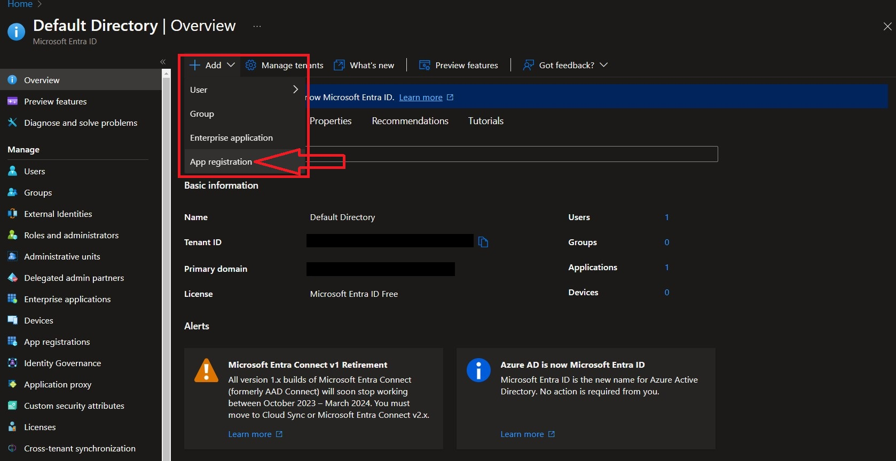
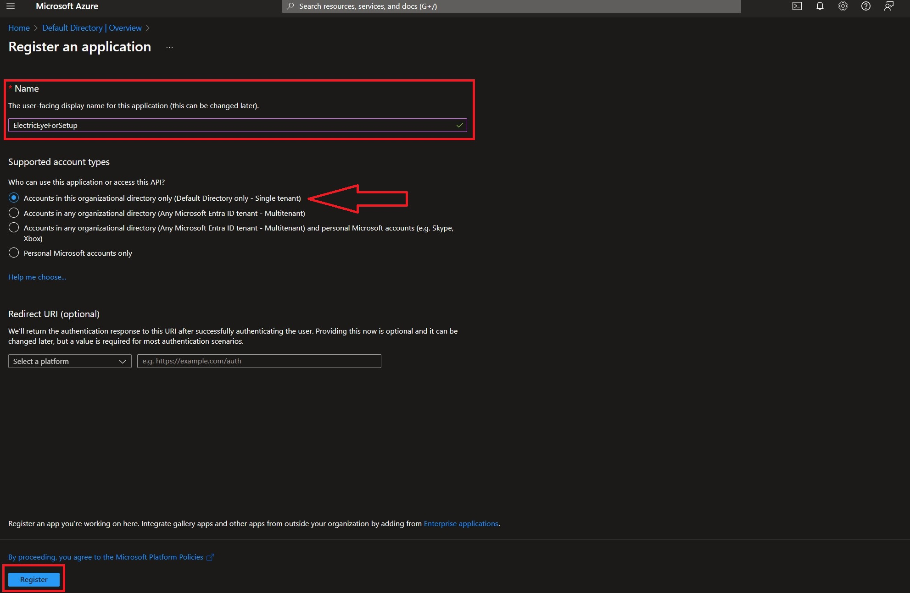
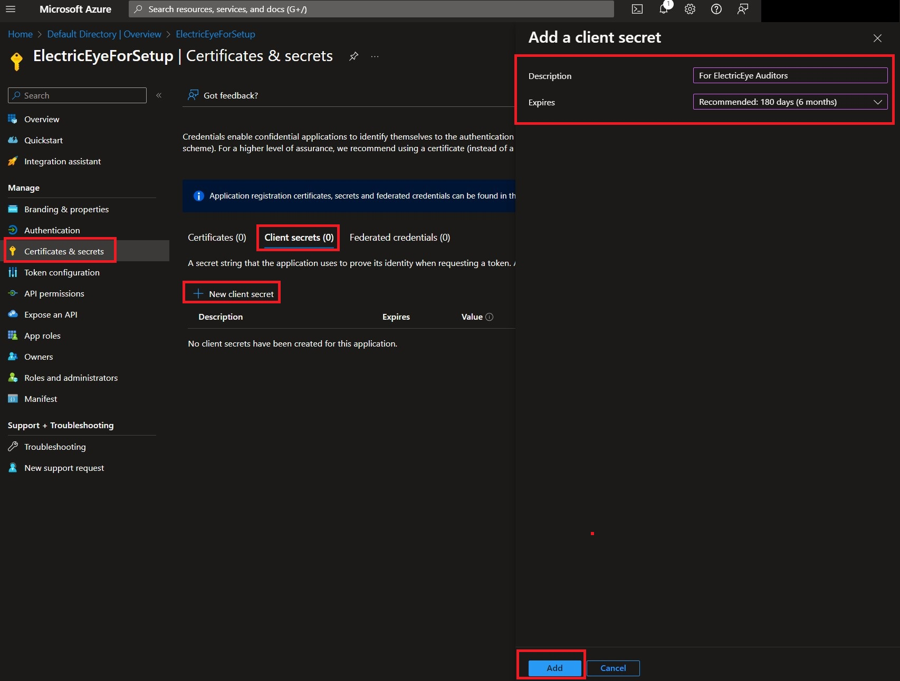
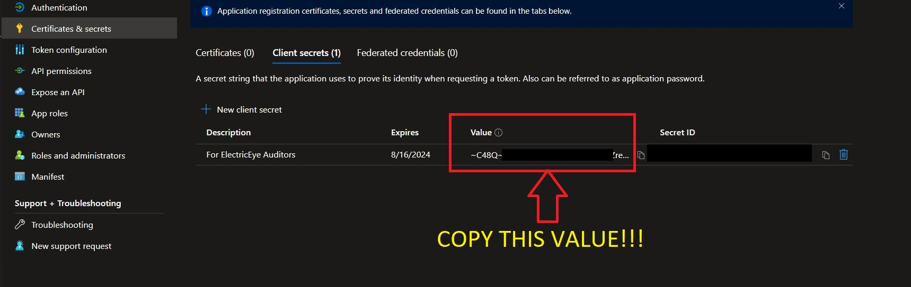
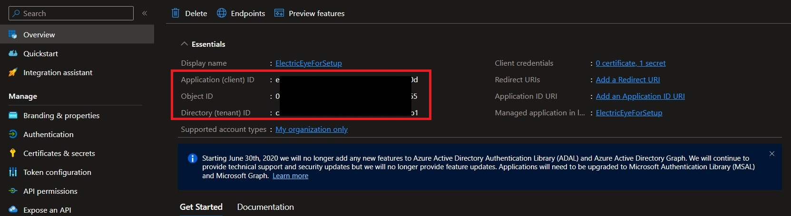
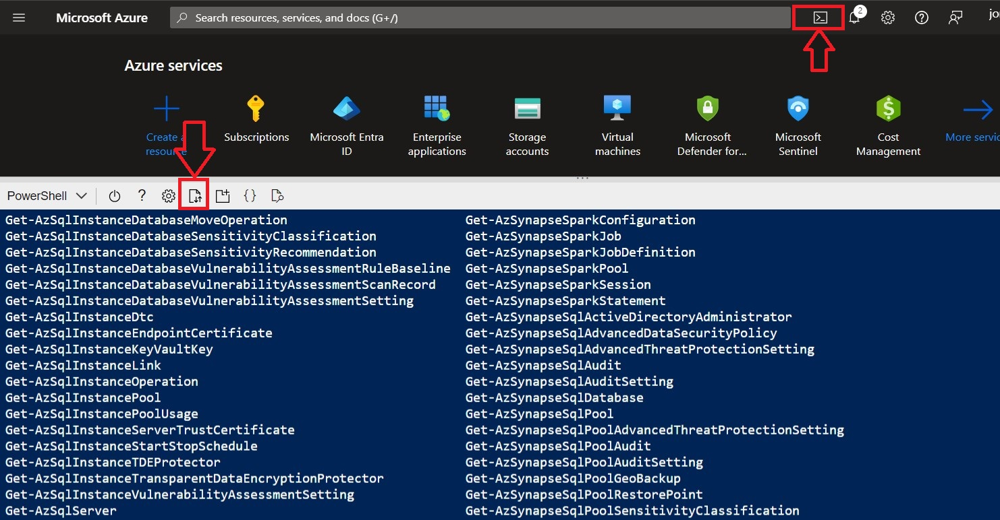
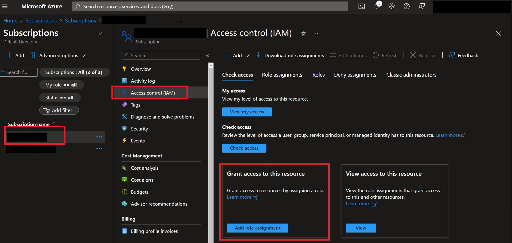
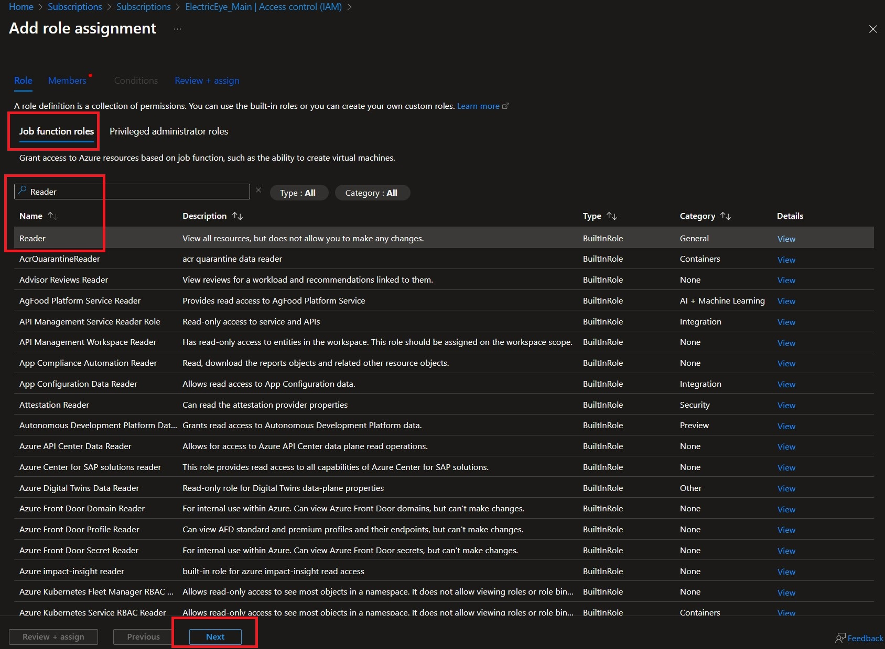
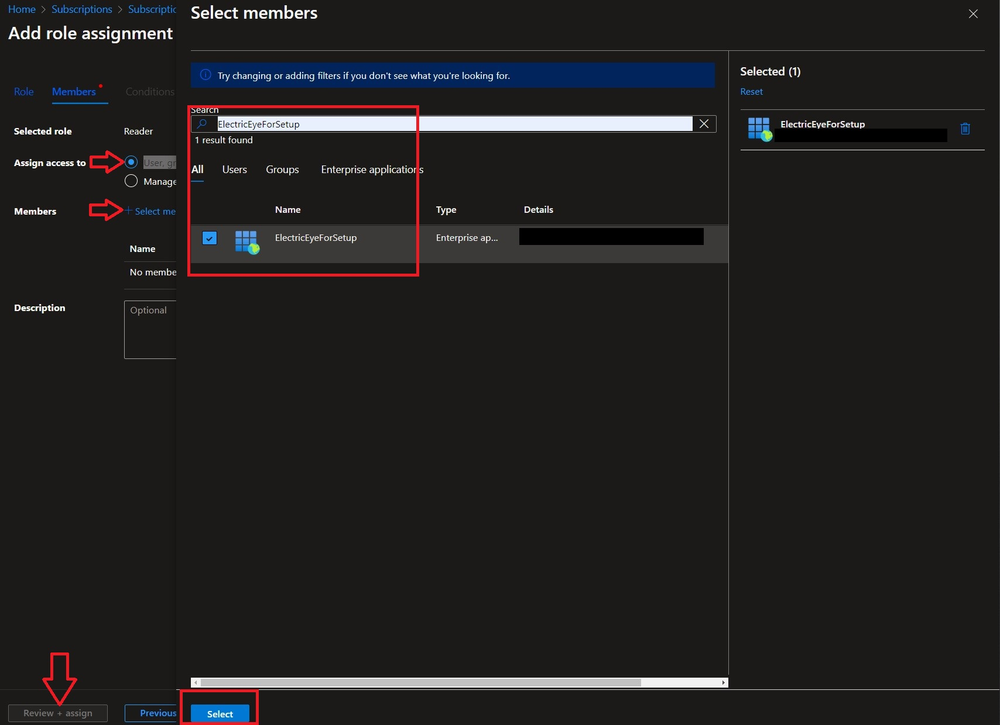
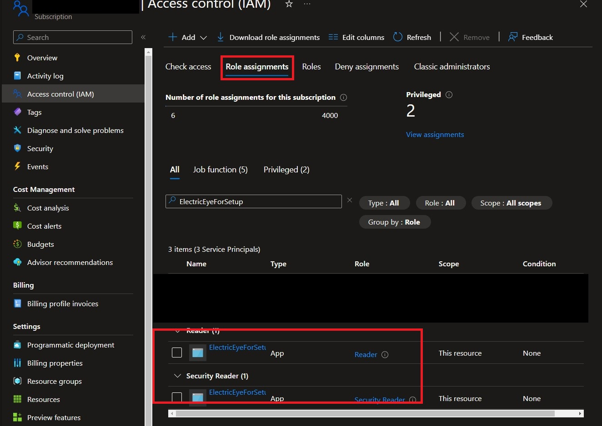

# ElectricEye Cloud Security Posture Management for Azure

This documentation is dedicated to using ElectricEye for evaluation of Azure Environments using CSPM and Attack Surface Monitoring capabilities.

## Setting up Azure Permissions

For every Azure Subscription that is setup, an Entra ID Tenant (formerly known as Azure Active Directory or Azure AD) is setup to administer access to all Subscriptions attached to the Entra ID Tenant. While Azure does provide default credentials via the CLI, ElectricEye uses Enterprise Applications which are created via Application Registrations in Entra ID.

Client Secrets are generated for the Enterprise Application that can be provisioned for as short as a few days or as long as 2 years, depending on your security policy. From there, you add the Enterprise Application as a trusted Service Principal to each Azure Subscription you wish to assess with ElectricEye and assign it pre-configured roles.

1. In the Microsoft Azure portal navigate to **Microsoft Entra ID** -> **Add** -> **App Registration** as shown below.



2. Populate a **Name** for the application, leave the **Supported account types** option as the default (`Accounts in this organizational directory only (Default Directory only - Single tenant)`) ***UNLESS YOU HAVE MULTIPLE TENANTS*** then select `Accounts in any organizational directory (Any Microsoft Entra ID tenant - Multitenant)` then select **Register** as shown below.



3. By default you will be taken to the **Overview** screen of your new application. Navigate to **Certificates & Secrets** -> **Client Secrets** -> **New client secret**. Enter a **Description**, choose an **Expires** data from the selector, and finally choose **Add** as shown below.



4. **Before navigating away** copy the **Value** entry and save it somewhere secure, this is the **Client Secret Value** required to perform authentication into your Azure Subscriptions. If you did not copy it, no big deal, just delete the Client Secret and create another - but remember to copy the **Value** that time.



5. Navigate to the **Overview** screen and copy the values for the **Application (client) ID**, **Object ID**, and **Directory (tenant ID)** as shown below. The **App ID** and **Tenant ID** are also required to perform authentication into your Azure subscriptions, the **Object ID** is used for the PowerShell script in the next few steps to authorize the application into your Azure subscriptions and provide the required permissions.



> **Important Note**: The following steps require the usage of a Global Administrator within your Directory logged into the Azure portal to execute a PowerShell script in Azure Cloud Shell. If you do not have access to a Global Administrator account, or do not wish to use Cloud Shell, feel free to bypass some / all of these steps. Starting at **Step 8**, instructions are provided for how to perform these steps manually. 

6. Copy and modify the following PowerShell script and save it to your filesystem as `ee_multi_sub_app_access.ps1` (or another name, doesn't matter). Ensure you replace the value of **`YOUR_APP_OBJECT_ID_HERE`** with the **Object ID** you copied in Step 5. 

This script will add the application as a Service Principal into every Subscription within your Tenant and provide it with `Reader` and `Security Reader` scopes. Feel free to modify this will with your own minimum necessary scope(s).

```ps1
$servicePrincipalObjectId = "YOUR_APP_OBJECT_ID_HERE"
$subscriptions = Get-AzSubscription
foreach ($subscription in $subscriptions) {
    Set-AzContext -SubscriptionId $subscription.Id
    New-AzRoleAssignment -ObjectId $servicePrincipalObjectId -RoleDefinitionName "Reader" -Scope "/subscriptions/$($subscription.Id)"
    New-AzRoleAssignment -ObjectId $servicePrincipalObjectId -RoleDefinitionName "Security Reader" -Scope "/subscriptions/$($subscription.Id)"
    Write-Output "Assigned roles for subscription: $($subscription.Name)"
}
```

7. In the Azure portal select the **Azure Cloud Shell**, if this is your first time you will be prompted to create an Azure Storage Account and have to wait for it to load. Once the session is ready select the **Upload/download files** and upload the script from Step 6 and execute it: `./ee_multi_sub_app_access.ps1`. This should only take a few seconds, depending how many Subscriptions exist in your Tenant.



> **Important Note** The following steps are to manually add the application as a Service Principal into your Azure Subscriptions with the `Reader` and `Security Reader` scopes. If you completed Steps 6 and 7, you can skip this section entirely, or proceed to Step 11 if you want to verify that your application was granted permissions as performeed by the PowerShell script. You will have to repeat Steps 8 through 10 for each Subscription.

8. In the Microsoft Azure portal navigate to **Subscriptions** -> choose a Subscription name -> **Access control (IAM)** -> **Add role assignment** as shown below.



> **NOTE** You will need to repeat Step 9 & 10 twice, once for `Reader` and once for `Security Reader`

9. Choose one of `Reader` or `Security Reader` from the **Job function roles** tab (use the search bar to make that easier) and choose **Next** as shwon below.



10. In the following screen, ensure `User, group, or service principal` is higlighted for **Assign access to** and select **Select members**. In the pop-up window type the name of the application from Step 2, toggle the checkbox, choose **Select** as shown below. Then choose **Review + assign** (twice!) to proceed.



11. To confirm that permissions for your application have been granted, in the Azure portal navigate to **Subscriptions** -> choose a Subscription name -> **Access control (IAM)** -> **View access to this resource (View)**. Enter the name of the application in step 2 and confirm that both `Reader` and `Security Reader` are granted. Repeat this for however many Subscriptions you wish to audit.



12. Finally, save the values of your **Client Secret Value**, **Application (client) ID**, and **Directory (tenant ID)** to either Systems Manager Parameter Store or AWS Secrets Manager, or optionally, paste them directly in the TOML (you probably shouldn't do that!). Ensure you replace the values of `APP_TENANT_ID`, `APP_CLIENT_ID`, and `APP_CLIENT_SECRET_VALUE`.

```bash
export EE_APP_PARAMTER_PREFIX="electriceye-enterprise-app"
export APP_TENANT_ID="`<tenant_id_here>`"
export APP_CLIENT_ID="`<client_id_here>`"
export APP_CLIENT_SECRET_VALUE="`<secret_value_here>`"

aws ssm put-parameter \
    --name $EE_APP_PARAMTER_PREFIX-tenant-id \
    --description 'Tenant ID of Microsoft Enterprise App with Azure Subscription access for ElectricEye' \
    --type SecureString \
    --value $APP_TENANT_ID
aws ssm put-parameter \
    --name $EE_APP_PARAMTER_PREFIX-client-id \
    --description 'Client ID of Microsoft Enterprise App with Azure Subscription access for ElectricEye' \
    --type SecureString \
    --value $APP_CLIENT_ID
aws ssm put-parameter \
    --name $EE_APP_PARAMTER_PREFIX-client-secret \
    --description 'Secret Value of Microsoft Enterprise App with Azure Subscription access for ElectricEye' \
    --type SecureString \
    --value $APP_CLIENT_SECRET_VALUE
```

> **IMPORTANT NOTE**: You can also create an AWS Secrets Manager Secret to store these values. Whatever you ultimately name the Paramters or Secrets, ensure you remember or copy their names to populate in the TOML file to configure ElectricEye to assess Azure.

## Configuring TOML

This section explains how to configure ElectricEye using a TOML configuration file. The configuration file contains settings for credentials, regions, accounts, and global settings and is located [here](../../eeauditor/external_providers.toml).

To configure the TOML file, you need to modify the values of the variables in the `[global]`, `[regions_and_accounts.azure]`, and `[credentials.azure]` sections of the file. Here's an overview of the key variables you need to configure:

#### `credentials_location`

Set this variable to specify the location of where credentials are stored and will be retrieved from. You can choose from AWS Systems Manager Parameter Store (`AWS_SSM`), AWS Secrets Manager (`AWS_SECRETS_MANAGER`), or from the TOML file itself (`CONFIG_FILE`) which is **NOT** recommended.

> **NOTE** When retrieving from SSM or Secrets Manager, your current Profile / Boto3 Session is used and *NOT* the ElectricEye Role that is specified in `aws_electric_eye_iam_role_name`. Ensure you have `ssm:GetParameter`, `secretsmanager:GetSecretValue`, and relevant `kms` permissions as needed to retrieve your stored secrets.

#### `regions_and_accounts.azure.azure_subscription_ids`

Provide a list of Azure Subscription ID's that you want to run ElectricEye against. This application registration you created added to each account as a trusted Service Principal with `Reader` and `Security Reader` roles assigned. If you do not provide any values, ElectricEye will attempt to determine which Subscriptions are available to the Application Registration.

#### `credentials.azure.azure_ent_app_client_id_value`

The location (or actual contents) of your Azure Application Registration's Client ID this location must match the value of `global.credentials_location` e.g., if you specify "AWS_SSM" then the value for this variable should  be the name of the AWS Systems Manager Parameter Store SecureString Parameter.

#### `credentials.azure.azure_ent_app_client_secret_id_value`

The location (or actual contents) of your Azure Application Registration's credential Secret Value this location must match the value of `global.credentials_location` e.g., if you specify "AWS_SSM" then the value for this variable should  be the name of the AWS Systems Manager Parameter Store SecureString Parameter.

#### `credentials.azure.azure_ent_app_tenant_id_value`

The location (or actual contents) of your Azure Entra ID tenant ID this location must match the value of `global.credentials_location` e.g., if you specify "AWS_SSM" then the value for this variable should be the name of the AWS Systems Manager Parameter Store SecureString Parameter

## Use ElectricEye for Azure

1. With >=Python 3.9 installed, install and upgrade `pip3` and setup `virtualenv`.

```bash
sudo apt install -y python3-pip
pip3 install --upgrade pip
pip3 install virtualenv --user
virtualenv .venv
```

2. This will create a virtualenv directory called `.venv` which needs to be activated.

```bash
#For macOS and Linux
. .venv/bin/activate

#For Windows
.venv\scripts\activate
```

3. Clone the repo and install all dependencies.

```bash
git clone https://github.com/jonrau1/ElectricEye.git
cd ElectricEye
pip3 install -r requirements.txt

# if using AWS CloudShell
pip3 install --user -r requirements.txt
```

4. Use the Controller to conduct different kinds of Assessments.

    - 4A. Retrieve all options for the Controller.

    ```bash
    python3 eeauditor/controller.py --help
    ```

    - 4B. Evaluate all Azure Subscriptions you configured access for.

    ```bash
    python3 eeauditor/controller.py -t Azure
    ```

    - 4C. Evaluate your Azure subscriptions against a specifc Auditor (runs all Checks within the Auditor).

    ```bash
    python3 eeauditor/controller.py -t Azure -a Azure_StorageAccounts_Auditor
    ```

    - 4D. Evaluate your Azure subscriptions against a specific Check within any Auditor, it is ***not required*** to specify the Auditor name as well. The below examples runs the `[Azure.StorageAccount.2] Azure Storage Accounts should have infrastructure encryption enabled` check.

    ```bash
    python3 eeauditor/controller.py -t Azure -c azure_storage_acct_infrastructure_encryption_enabled_check
    ```

## Configuring Network Security Group Auditors

Todo...

## Azure Checks & Services

These are the following services and checks perform by each Auditor, there are currently **47 Checks** across **5 Auditors** that support the secure configuration of **8 services/components**

| Auditor File Name | Scanned Resource Name | Auditor Scan Description |
|---|---|---|
| Azure_VirtualMachine_Auditor | Azure Virtual Network | VNETs should have Azure Bastion deployed in them |
| Azure_VirtualMachine_Auditor | Azure Virtual Machine | Azure VMs should use Managed Disks (not VHDs) |
| Azure_VirtualMachine_Auditor | Azure Virtual Machine | Azure VMs should encrypted OS and Data disks with CMKs |
| Azure_VirtualMachine_Auditor | Azure Disk Storage Disks | Unattached storage disks should be encrypted with CMKs |
| Azure_VirtualMachine_Auditor | Azure Virtual Machine | Azure VMs should have the Azure Monitor agent installed |
| Azure_VirtualMachine_Auditor | Azure Virtual Machine | Azure VMs should be covered by Azure Vault backups |
| Azure_StorageAccounts_Auditor | Azure Storage Account | Storage Accts should require secure transfer (HTTPS) |
| Azure_StorageAccounts_Auditor | Azure Storage Account | Storage Accts should enable infrastructure encryption (AES256) |
| Azure_StorageAccounts_Auditor | Azure Storage Account | Storage Accts with SAS Policies should be reviewed to ensure hourly rotation |
| Azure_StorageAccounts_Auditor | Azure Storage Account | Storage Accts with blob containers should disable public access |
| Azure_StorageAccounts_Auditor | Azure Storage Account | Storage Accts should have network access set to deny |
| Azure_StorageAccounts_Auditor | Azure Storage Account | Storage Accts allowed access to Azure services on trusted list |
| Azure_StorageAccounts_Auditor | Azure Storage Account | Storage Accts should use private VNET endpoints for access |
| Azure_StorageAccounts_Auditor | Azure Storage Account | Storage Accts should enable soft delete for blob services |
| Azure_StorageAccounts_Auditor | Azure Storage Account | Storage Accts should enforce TLS 1.2 as a minimum version for HTTPS connectivity |
| Azure_StorageAccounts_Auditor | Azure Storage Account | Storage Accts access keys (both of them) should be rotated every 90 days |
| Azure_SQLServer_Auditor | Azure SQL Server | Azure SQL Servers should have auditing enabled |
| Azure_SQLServer_Auditor | Azure SQL Server | Azure SQL Servers should not allow access from the internet |
| Azure_SQLServer_Auditor | Azure SQL Server | Azure SQL Servers should use CMKs for Transparent Data Encryption (TDE) |
| Azure_SQLServer_Auditor | Azure SQL Server | Azure SQL Servers should enabled Entra ID/AAD admin authentication |
| Azure_SQLServer_Auditor | Azure SQL Database | Azure SQL Databases should enable Transparent Data Encryption (TDE) |
| Azure_SQLServer_Auditor | Azure SQL Database | Azure SQL Databases should consider enabling Read Scale Out |
| Azure_SQLServer_Auditor | Azure SQL Database | Azure SQL Databases with regulated workloads should consider using double encryption |
| Azure_SQLServer_Auditor | Azure SQL Database | Azure SQL Databases with regulated workloads should consider using Azure SQL Ledger |
| Azure_SQLServer_Auditor | Azure SQL Server | Azure SQL Servers should enabled log retention and retain them for at least 90 days |
| Azure_SQLServer_Auditor | Azure SQL Server | Azure SQL Servers should enforce a minimum TLS version of TLS_v1.2 |
| Azure_SQLServer_Auditor | Azure SQL Server | Azure SQL Servers should not have public internet access enabled |
| Azure_SQLServer_Auditor | Azure SQL Server | Azure SQL Servers should not have outbound network access enabled |
| Azure_Database_MySQL_Auditor | Azure Database for MySQL Server | Azure MySQL Flexible Servers should enforce secure connectivity (SSL/TLS-only) |
| Azure_Database_MySQL_Auditor | Azure Database for MySQL Server | Azure MySQL Flexible Servers should enforce TLS 1.2 minimum ciphersuiters for TLS connectivity |
| Azure_Database_MySQL_Auditor | Azure Database for MySQL Server | Azure MySQL Flexible Servers should enforce TLS 1.2 minimum ciphersuiters for TLS connectivity for admins |
| Azure_Database_MySQL_Auditor | Azure Database for MySQL Server | Azure MySQL Flexible Servers should enable audit logging |
| Azure_Database_MySQL_Auditor | Azure Database for MySQL Server | Azure MySQL Flexible Servers audit logs should include "CONNECTION" events |
| Azure_Database_MySQL_Auditor | Azure Database for MySQL Server | Azure MySQL Flexible Servers should use AES256 for block encryption |
| Azure_Database_MySQL_Auditor | Azure Database for MySQL Server | Azure MySQL Flexible Servers have storage auto-growth enabled |
| Azure_Database_MySQL_Auditor | Azure Database for MySQL Server | Azure MySQL Flexible Servers have server high availability configured |
| Azure_Database_MySQL_Auditor | Azure Database for MySQL Server | Azure MySQL Flexible Servers should not allow public network access |
| Azure_Database_PostgreSQL_Auditor | Azure Database for PostgreSQL Server | Azure PostgreSQL Flexible Servers should enforce secure connectivity (SSL/TLS-only) |
| Azure_Database_PostgreSQL_Auditor | Azure Database for PostgreSQL Server | Azure PostgreSQL Flexible Servers should enforce TLS 1.2 minimum ciphersuiters for TLS connectivity |
| Azure_Database_PostgreSQL_Auditor | Azure Database for PostgreSQL Server | Azure PostgreSQL Flexible Servers should enable checkpoint logging |
| Azure_Database_PostgreSQL_Auditor | Azure Database for PostgreSQL Server | Azure PostgreSQL Flexible Servers should enable connection logging |
| Azure_Database_PostgreSQL_Auditor | Azure Database for PostgreSQL Server | Azure PostgreSQL Flexible Servers should disconnection logging |
| Azure_Database_PostgreSQL_Auditor | Azure Database for PostgreSQL Server | Azure PostgreSQL Flexible Servers should enable connection throttling |
| Azure_Database_PostgreSQL_Auditor | Azure Database for PostgreSQL Server | Azure PostgreSQL Flexible Servers should retain logs for at least 3 days |
| Azure_Database_PostgreSQL_Auditor | Azure Database for PostgreSQL Server | Azure PostgreSQL Flexible Servers should not allow access to all Azure services |
| Azure_Database_PostgreSQL_Auditor | Azure Database for PostgreSQL Server | Azure PostgreSQL Flexible Servers should not allow public network access |
| Azure_Database_PostgreSQL_Auditor | Azure Database for PostgreSQL Server | Azure PostgreSQL Flexible Servers running regulated workloads should consider using double encryption |

Continue to check this section for information on active, retired, and renamed checks or using the `--list-checks` command in the CLI!