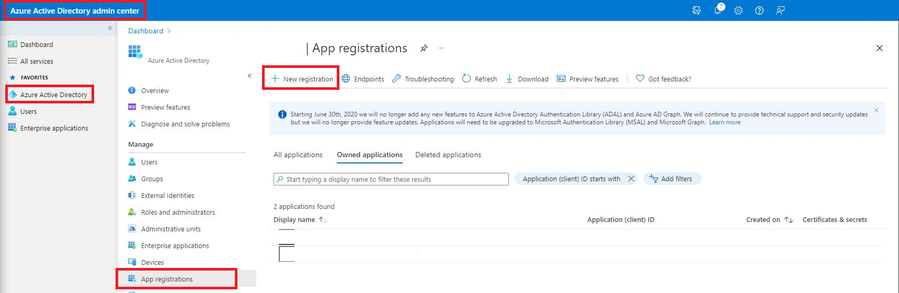

# ElectricEye SaaS Security Posture Management (SSPM) for Microsoft M365

This documentation is dedicated to using ElectricEye for evaluation of Microsoft M365 (E5 & ESM) tenants using SSPM capabilities.

## Table of Contents

- [Setting up M365 Permissions](#setting-up-m365-permissions)
- [Configuring TOML](#configuring-toml)
- [Use ElectricEye for M365](#use-electriceye-for-m365)

## Setting up M365 Permissions

ElectricEye utilizes Enterprise Applications with Application-scoped permissions (and Admin Consent, where required) to grant permissions to access a variety of M365 APIs across Security Center, Microsoft Graph, and Windows Graph. Client Secrets are used as the authorization mechanism and will be exchanged for OAuth tokens with the proper scope as needed by ElectricEye. When auditing the usage, the Enterprise Application appears within `Service principal sign-ins`, keep this in mind if you want to setup Conditional Access Policies (or exempt it) within your environment.

**IMPORTANT NOTE** Due to the tightly-coupled nature of the Tenant (Directory) identification with the fact that you cannot choose the Client ID nor the Client Secret Value for an Enterprise Application, you are only able to assess one Tenant at a time using ElectricEye. Consider setting up multiple [TOML configuration files](../../eeauditor/external_providers.toml) and using multiple [Docker deployments](../../README.md#electriceye-on-docker) to parallelize assessments across different Tenants.

To create an Enterprise Application you will require a **Global Administrator** Role assignment, if you are not one, ensure that your team provisions you through Privileged Identity Management (PIM) to do so properly. Provided you have the Role assignment, proceed to the next steps.

1. Navigate to the **Azure Active Directory admin center** and in the navigation panel select **Azure Active Directory** --> **App registrations** --> **New registration** as shown below.



TO BE CONTINUED...

## Configuring TOML

This section explains how to configure ElectricEye using a TOML configuration file. The configuration file contains settings for credentials, regions, accounts, and global settings and is located [here](../../eeauditor/external_providers.toml).

To configure the TOML file, you need to modify the values of the variables in the `[global]` and `[credentials.m365]` sections of the file. Here's an overview of the key variables you need to configure:

- `credentials_location`: Set this variable to specify the location of where credentials are stored and will be retrieved from. You can choose from AWS Systems Manager Parameter Store (`AWS_SSM`), AWS Secrets Manager (`AWS_SECRETS_MANAGER`), or from the TOML file itself (`CONFIG_FILE`) which is **NOT** recommended.

**NOTE** When retrieving from SSM or Secrets Manager, your current Profile / Boto3 Session is used and *NOT* the ElectricEye Role that is specified in `aws_electric_eye_iam_role_name`. Ensure you have `ssm:GetParameter`, `secretsmanager:GetSecretValue`, and relevant `kms` permissions as needed to retrieve your stored secrets.

- `m365_ent_app_client_id_value`

- `m365_ent_app_client_secret_id_value`

- `m365_ent_app_tenant_id_value`

- `m365_tenant_location`

## Use ElectricEye for M365

1. With >=Python 3.7 installed, install and upgrade `pip3` and setup `virtualenv`.

```bash
sudo apt install -y python3-pip
pip3 install --upgrade pip
pip3 install virtualenv --user
virtualenv .venv
```

2. This will create a virtualenv directory called `.venv` which needs to be activated.

```bash
#For macOS and Linux
. .venv/bin/activate

#For Windows
.venv\scripts\activate
```

3. Clone the repo and install all dependencies.

```bash
git clone https://github.com/jonrau1/ElectricEye.git
cd ElectricEye
pip3 install -r requirements.txt

# if use AWS CloudShell
pip3 install --user -r requirements.txt
```

4. Use the Controller to conduct different kinds of Assessments.

    - 4A. Retrieve all options for the Controller.

    ```bash
    python3 eeauditor/controller.py --help
    ```

    - 4B. Evaluate your entire M365 Tenant.

    ```bash
    python3 eeauditor/controller.py -t M365
    ```

    - 4C. Evaluate your M365 environment against a specifc Auditor (runs all Checks within the Auditor).

    ```bash
    python3 eeauditor/controller.py -t M365 -a M365_MDE_Auditor
    ```

    - 7D. Evaluate your M365 environment against a specific Check within any Auditor, it is ***not required*** to specify the Auditor name as well. The below examples runs the "[M365.DefenderRecommendations.1] Microsoft 365 Defender recommendations for MacOS Security Controls should be implemented" check.

    ```bash
    python3 eeauditor/controller.py -t M365 -c m365_security_center_recommendations_security_controls_for_macos_check
    ```

## M365 Checks & Services

These are the following services and checks perform by each Auditor, there are currently **000 Checks** across **00 Auditors** that support the secure configuration of **000 services/components**

| Auditor File Name | Scanned Resource Name | Auditor Scan Description |
|---|---|---|
| M365_ConditionalAccess_Auditor | M365 Conditional Access policy | TODO_FIX_ME_PLZ |
| M365_ConditionalAccess_Auditor | M365 Conditional Access policy | TODO_FIX_ME_PLZ |
| M365_ConditionalAccess_Auditor | M365 Conditional Access policy | TODO_FIX_ME_PLZ |
| M365_ConditionalAccess_Auditor | M365 Conditional Access policy | TODO_FIX_ME_PLZ |
| M365_ConditionalAccess_Auditor | M365 Conditional Access policy | TODO_FIX_ME_PLZ |
| M365_ConditionalAccess_Auditor | M365 Conditional Access policy | TODO_FIX_ME_PLZ |
| M365_ConditionalAccess_Auditor | M365 Conditional Access policy | TODO_FIX_ME_PLZ |
| M365_ConditionalAccess_Auditor | M365 Conditional Access policy | TODO_FIX_ME_PLZ |
| M365_ConditionalAccess_Auditor | M365 Conditional Access policy | TODO_FIX_ME_PLZ |
| M365_DefenderRecommendations_Auditor | Defender for Endpoint recommendations | TODO_FIX_ME_PLZ |
| M365_DefenderRecommendations_Auditor | Defender for Endpoint recommendations | TODO_FIX_ME_PLZ |
| M365_DefenderRecommendations_Auditor | Defender for Endpoint recommendations | TODO_FIX_ME_PLZ |
| M365_DefenderRecommendations_Auditor | Defender for Endpoint recommendations | TODO_FIX_ME_PLZ |
| M365_DefenderRecommendations_Auditor | Defender for Endpoint recommendations | TODO_FIX_ME_PLZ |
| M365_MDE_Auditor | Defender for Endpoint devices (machines) | TODO_FIX_ME_PLZ |
| M365_MDE_Auditor | Defender for Endpoint devices (machines) | TODO_FIX_ME_PLZ |
| M365_MDE_Auditor | Defender for Endpoint devices (machines) | TODO_FIX_ME_PLZ |
| M365_MDE_Auditor | Defender for Endpoint devices (machines) | TODO_FIX_ME_PLZ |
| M365_MDE_Auditor | Defender for Endpoint devices (machines) | TODO_FIX_ME_PLZ |