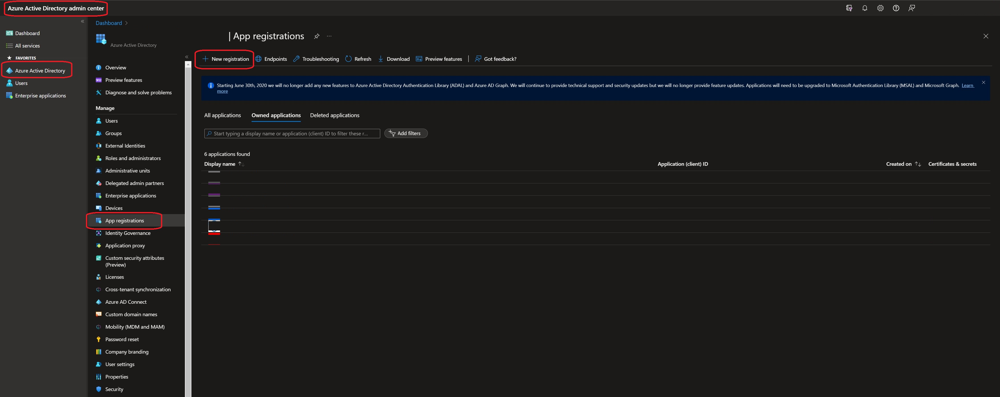
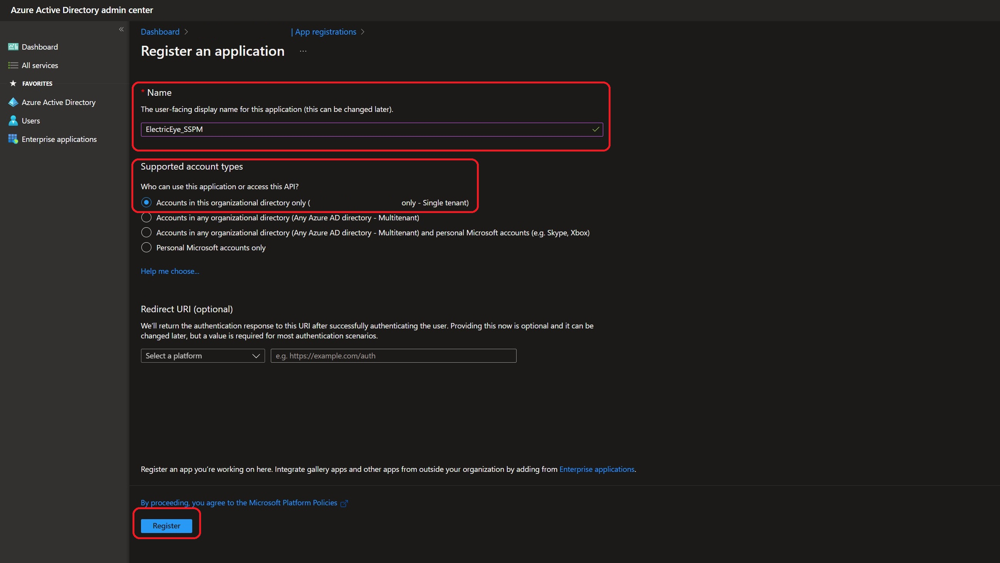
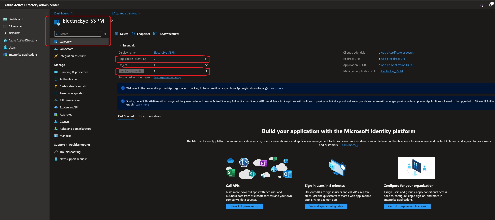
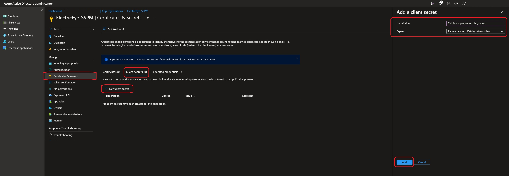
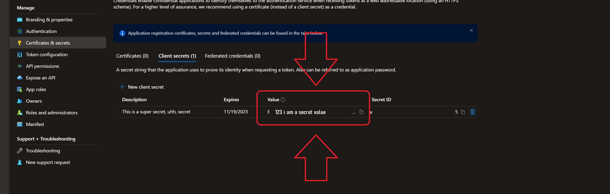
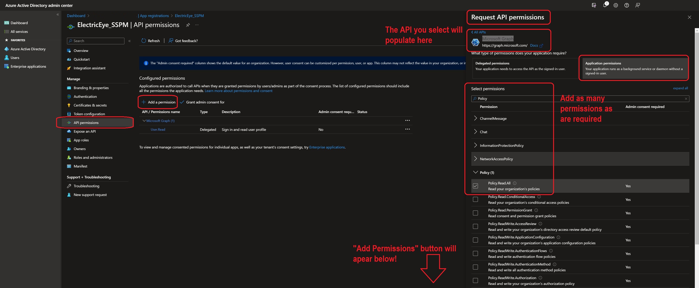
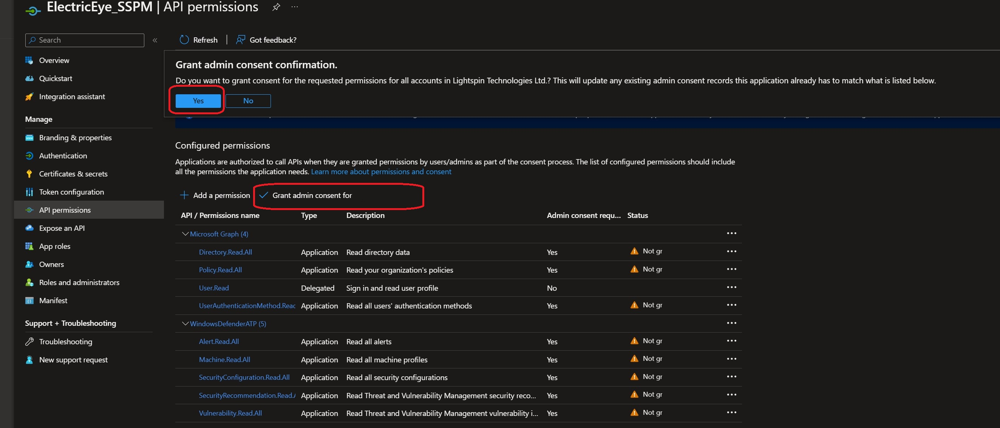
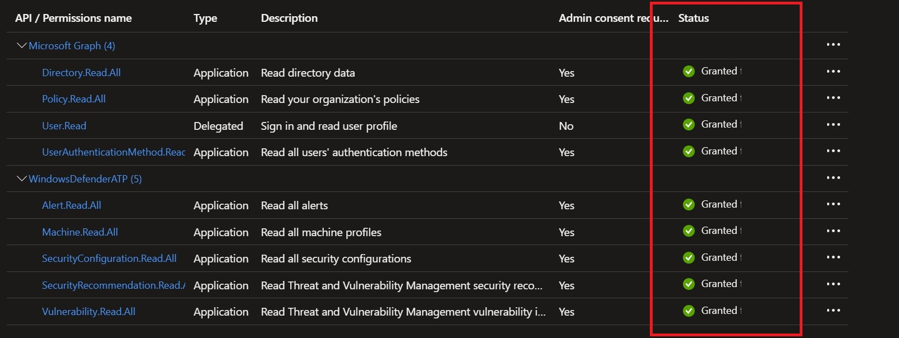

# ElectricEye SaaS Security Posture Management (SSPM) for Microsoft M365

This documentation is dedicated to using ElectricEye for evaluation of Microsoft M365 (E5 & ESM) tenants using SSPM capabilities.

## Table of Contents

- [Setting up Enterprise Application for ElectricEye](#setting-up-enterprise-application-for-electriceye)
- [Required Permissions & Subscription/License Tier for ElectricEye Auditors](#required-permissions--subscriptionlicense-tier-for-electriceye-auditors)
- [Configuring TOML](#configuring-toml)
- [Use ElectricEye for M365](#use-electriceye-for-m365)

## Setting up Enterprise Application for ElectricEye

ElectricEye utilizes Enterprise Applications with Application-scoped permissions (and Admin Consent, where required) to grant permissions to access a variety of M365 APIs across Security Center, Microsoft Graph, and Windows Graph. Client Secrets are used as the authorization mechanism and will be exchanged for OAuth tokens with the proper scope as needed by ElectricEye. When auditing the usage, the Enterprise Application appears within `Service principal sign-ins`, keep this in mind if you want to setup Conditional Access Policies (or exempt it) within your environment.

ElectricEye only requires `.Read` or `.ReadAll` Permissions for its Actions, always use the minimum necessary amount of permissions for the Auditors you are interested in using for the APIs you Licenses / Subscriptions give you access to. ElectricEye will never require `.Manage`, `.Write`, or `.ReadWrite` Permissions. At least, not yet... 

**IMPORTANT NOTE** Due to the tightly-coupled nature of the Tenant (Directory) identification with the fact that you cannot choose the Client ID nor the Client Secret Value for an Enterprise Application, you are only able to assess one Tenant at a time using ElectricEye. Consider setting up multiple [TOML configuration files](../../eeauditor/external_providers.toml) and using multiple [Docker deployments](../../README.md#electriceye-on-docker) to parallelize assessments across different Tenants.

To create an Enterprise Application you will require a **Global Administrator** Role assignment, if you are not one, ensure that your team provisions you through Privileged Identity Management (PIM) to do so properly. Provided you have the Role assignment, proceed to the next steps.

1. Navigate to the **Azure Active Directory admin center** (this flow can also be done from the **Microsoft Entra admin center**) and in the navigation panel select **Azure Active Directory** --> **App registrations** --> **New registration** as shown below.



2. Enter a **Name** and for `Supported account types` select **Accounts in this organizational directory only (YOUR_COMPANY_HERE only - Single tenant)**. Leave the `Redirect URI (optional)` option alone and select **Register** at the bottom of the screen as shown below.



3. After creation you are automatically redirected to the **Overview** panel. Copy and securely store the values of `Application (client) ID` and `Directory (tenant) ID` as shown below. You will require these values, and others, for configuring access for ElectricEye.



4. On the navigation pane select **Certifactes & secrets** --> **Client secrets (0)** and select **New client secret**. Enter a **Description** on the details pane and select an **Expires** time period as per your organizational requirements (you can select up to 24 months) and select **Add** as shown below.



5. After creation securely store the **Value** of your **Client secret** as shown below. ***DO NOT USE THE SECRET ID!***



6. On the navigation pane select **API permissions**. You may or may not have `Delegated` permissions already. To add permissions select **Add a permission** --> **APIs my organization uses** and use the search bar to find the `API Name` using the [below section](#required-permissions--subscriptionlicense-tier-for-electriceye-auditors) as a guide. Once you have located the API select **Application permissions** and search for the specific Permissions as shown below. Repeat this process for as many APIs and Permissions you require and select **Add permissions** when done (that button is not shown in the screenshot).



7. After you are finished adding the required Permissions for the APIs ElectricEye will assess, select the **Grant admin consent for YOUR_COMPANY_HERE**, a pop-up for `Grant admin consent confirmation` will appear, select **Yes** as shown below.



8. Once complete ensure that the `Status` for each Permission changes to **Granted for YOUR_COMPANY_NAME** as denoted by a circular green dot with a white checkmark as shown below.



If you ever need to expand your Permissions as ElectricEye adds additional Auditors for M365, repeat Steps 6-8, you will need to grant admin consent anytime Permissions are being modified.

Hopefully you stored your Client ID, Client Secret, and Tenant ID somewhere safe, you will need them in the [configuring TOML](#configuring-toml) section!

## Required Permissions & Subscription/License Tier for ElectricEye Auditors

This section will continuously expand as additional Auditors are added into the M365 Assessment Target, these Permissions and required Subscription / License tier information comes directly from Microsoft Documentation. If you do not grant all of the Permissions required for all Auditors ensure you are either using the `-c` or `-a` arguments within `controller.py` otherwise ElectricEye will continue to raise Exceptions due to the missing API permissions.

| Auditor File Name | Permissions Required | Subscription / License Required | API Name |
|---|---|---|---|
| M365_AadUsers_Auditor | `IdentityRiskEvent.Read.All` </br> `IdentityRiskyUser.Read.All` </br> `User.Read.All` </br> `Directory.Read.All` </br> `UserAuthenticationMethod.Read` | One of Azure AD Premium P1, P2, M365 E3, E5 or F3 to use the risk detection (`IdentityRiskyUser`, `IdentityRiskEvent`) API for Azure Identity Protection | `Microsoft Graph` |
| M365_ConditionalAccess_Auditor | `Policy.Read.All` | No additional license information provided | `Microsoft Graph` |
| M365_DefenderRecommendations_Auditor | `SecurityRecommendation.Read.All` | One of Microsoft 365 Defender, Microsoft Defender for Endpoint P1 or P2, M365 E3 or E5 | `WindowsDefenderATP` |
| M365_MDE_Auditor | `Machine.Read.All` </br> `Alert.Read.All` </br> `Vulnerability.Read.All` | One of Microsoft 365 Defender, Microsoft Defender for Endpoint P1 or P2, M365 E3 or E5 | `WindowsDefenderATP` |

Outside of some special cases, as long as you have a Microsoft M365 E5 License you will likely have all the access to the APIs your require. (I wish Microsoft would give me some kickbacks for that statement...)

## Configuring TOML

This section explains how to configure ElectricEye using a TOML configuration file. The configuration file contains settings for credentials, regions, accounts, and global settings and is located [here](../../eeauditor/external_providers.toml).

To configure the TOML file, you need to modify the values of the variables in the `[global]` and `[credentials.m365]` sections of the file. Here's an overview of the key variables you need to configure:

- `credentials_location`: Set this variable to specify the location of where credentials are stored and will be retrieved from. You can choose from AWS Systems Manager Parameter Store (`AWS_SSM`), AWS Secrets Manager (`AWS_SECRETS_MANAGER`), or from the TOML file itself (`CONFIG_FILE`) which is **NOT** recommended.

**NOTE** When retrieving from SSM or Secrets Manager, your current Profile / Boto3 Session is used and *NOT* the ElectricEye Role that is specified in `aws_electric_eye_iam_role_name`. Ensure you have `ssm:GetParameter`, `secretsmanager:GetSecretValue`, and relevant `kms` permissions as needed to retrieve your stored secrets.

- `m365_ent_app_client_id_value`: The location (or actual contents) of your Enterprise Application's `Application (client) ID` from Step 3 of the [Setting up Enterprise Application for ElectricEye](#setting-up-enterprise-application-for-electriceye). This location must match the value of `global.credentials_location` e.g., if you specify "AWS_SSM" then the value for this variable should be the name of the AWS Systems Manager Parameter Store SecureString Parameter.

- `m365_ent_app_client_secret_id_value`: The location (or actual contents) of your Enterprise Application's `Client Secret Value` from Step 5 of the [Setting up Enterprise Application for ElectricEye](#setting-up-enterprise-application-for-electriceye). This location must match the value of `global.credentials_location` e.g., if you specify "AWS_SSM" then the value for this variable should be the name of the AWS Systems Manager Parameter Store SecureString Parameter.

- `m365_ent_app_tenant_id_value`: The location (or actual contents) of your Enterprise Application's `Directory (tenant) ID` from Step 3 of the [Setting up Enterprise Application for ElectricEye](#setting-up-enterprise-application-for-electriceye). This location must match the value of `global.credentials_location` e.g., if you specify "AWS_SSM" then the value for this variable should be the name of the AWS Systems Manager Parameter Store SecureString Parameter.

- `m365_tenant_location`: The location where your Tenant is located, such as the `US` or `EU`. To determine for sure navigate to the **Azure Active Directory admin center** --> **Azure Active Directory** --> **Properties** and note the `Location` which will have a location. Use a two-letter country/region code for this value such as `US`, `AP`, or `EU`. In the case your tenant is located in a compartmentalized region, append `-GOV` to the location e.g., `US-GOV` for M365 Government locations.

## Use ElectricEye for M365

1. With >=Python 3.7 installed, install and upgrade `pip3` and setup `virtualenv`.

```bash
sudo apt install -y python3-pip
pip3 install --upgrade pip
pip3 install virtualenv --user
virtualenv .venv
```

2. This will create a virtualenv directory called `.venv` which needs to be activated.

```bash
#For macOS and Linux
. .venv/bin/activate

#For Windows
.venv\scripts\activate
```

3. Clone the repo and install all dependencies.

```bash
git clone https://github.com/jonrau1/ElectricEye.git
cd ElectricEye
pip3 install -r requirements.txt

# if use AWS CloudShell
pip3 install --user -r requirements.txt
```

4. Use the Controller to conduct different kinds of Assessments.

    - 4A. Retrieve all options for the Controller.

    ```bash
    python3 eeauditor/controller.py --help
    ```

    - 4B. Evaluate your entire M365 Tenant.

    ```bash
    python3 eeauditor/controller.py -t M365
    ```

    - 4C. Evaluate your M365 environment against a specifc Auditor (runs all Checks within the Auditor).

    ```bash
    python3 eeauditor/controller.py -t M365 -a M365_MDE_Auditor
    ```

    - 7D. Evaluate your M365 environment against a specific Check within any Auditor, it is ***not required*** to specify the Auditor name as well. The below examples runs the "[M365.DefenderRecommendations.1] Microsoft 365 Defender recommendations for MacOS Security Controls should be implemented" check.

    ```bash
    python3 eeauditor/controller.py -t M365 -c m365_security_center_recommendations_security_controls_for_macos_check
    ```

## M365 Checks & Services

These are the following services and checks perform by each Auditor, there are currently **37 Checks** across **4 Auditors** that support the secure configuration of **4 services/components**

| Auditor File Name | Scanned Resource Name | Auditor Scan Description |
|---|---|---|
| M365_AadUsers_Auditor | Azure Active Directory user | Users should have an MFA device |
| M365_AadUsers_Auditor | Azure Active Directory user | Users should register a phishing-resistant (FIDO2, MSFT Authenticator, Windows Hello) MFA device |
| M365_AadUsers_Auditor | Azure Active Directory user | Users should not have any active Risk Detections (Sign-ins) from Identity Protection |
| M365_AadUsers_Auditor | Azure Active Directory user | Users should not be labelled a Risky User by Identity Protection |
| M365_ConditionalAccess_Auditor | M365 Conditional Access policy | Is a Conditional Access Policy configured to block legacy authentication methods |
| M365_ConditionalAccess_Auditor | M365 Conditional Access policy | Is a Conditional Access Policy configured to enforce MFA on Risky Sign-ins (Medium or High) |
| M365_ConditionalAccess_Auditor | M365 Conditional Access policy | Is a Conditional Access Policy configured to enforce Location-based Conditional Access (LBCA) |
| M365_ConditionalAccess_Auditor | M365 Conditional Access policy | Is a Conditional Access Policy configured to block devices with unsupported operating systems |
| M365_ConditionalAccess_Auditor | M365 Conditional Access policy | Is a Conditional Access Policy configured to block non-compliant devices |
| M365_ConditionalAccess_Auditor | M365 Conditional Access policy | Is a Conditional Access Policy configured to require devices to have an Intune Application Protection Policy |
| M365_ConditionalAccess_Auditor | M365 Conditional Access policy | Is a Conditional Access Policy configured to block High Risk Users (Identity Protection) |
| M365_ConditionalAccess_Auditor | M365 Conditional Access policy | Is a Conditional Access Policy configured to block High Risk Sign-ins (Identity Protection) |
| M365_DefenderRecommendations_Auditor | Defender for Endpoint recommendations | Implement Defender recommendations for MacOS Security Controls |
| M365_DefenderRecommendations_Auditor | Defender for Endpoint recommendations | Implement Defender recommendations for MacOS Account configurations |
| M365_DefenderRecommendations_Auditor | Defender for Endpoint recommendations | Implement Defender recommendations for MacOS Network configurations |
| M365_DefenderRecommendations_Auditor | Defender for Endpoint recommendations | Implement Defender recommendations for MacOS OS configratuons |
| M365_DefenderRecommendations_Auditor | Defender for Endpoint recommendations | Implement Defender recommendations for MacOS Network Assessments |
| M365_DefenderRecommendations_Auditor | Defender for Endpoint recommendations | Implement Defender recommendations for Windows 10 Security Controls |
| M365_DefenderRecommendations_Auditor | Defender for Endpoint recommendations | Implement Defender recommendations for Windows 10 Account configurations |
| M365_DefenderRecommendations_Auditor | Defender for Endpoint recommendations | Implement Defender recommendations for Windows 10 Network configurations |
| M365_DefenderRecommendations_Auditor | Defender for Endpoint recommendations | Implement Defender recommendations for Windows 10 OS configratuons |
| M365_DefenderRecommendations_Auditor | Defender for Endpoint recommendations | Implement Defender recommendations for Windows 10 Network Assessments |
| M365_DefenderRecommendations_Auditor | Defender for Endpoint recommendations | Implement Defender recommendations for Windows 11 Security Controls |
| M365_DefenderRecommendations_Auditor | Defender for Endpoint recommendations | Implement Defender recommendations for Windows 11 Account configurations |
| M365_DefenderRecommendations_Auditor | Defender for Endpoint recommendations | Implement Defender recommendations for Windows 11 Network configurations |
| M365_DefenderRecommendations_Auditor | Defender for Endpoint recommendations | Implement Defender recommendations for Windows 11 OS configratuons |
| M365_DefenderRecommendations_Auditor | Defender for Endpoint recommendations | Implement Defender recommendations for Windows 11 Network Assessments |
| M365_DefenderRecommendations_Auditor | Defender for Endpoint recommendations | Implement Defender recommendations for Linux Security Controls |
| M365_DefenderRecommendations_Auditor | Defender for Endpoint recommendations | Implement Defender recommendations for Linux Account configurations |
| M365_DefenderRecommendations_Auditor | Defender for Endpoint recommendations | Implement Defender recommendations for Linux Network configurations |
| M365_DefenderRecommendations_Auditor | Defender for Endpoint recommendations | Implement Defender recommendations for Linux OS configratuons |
| M365_DefenderRecommendations_Auditor | Defender for Endpoint recommendations | Implement Defender recommendations for Linux Network Assessments |
| M365_MDE_Auditor | Defender for Endpoint devices (machines) | Devices should not have unhealthy sensors |
| M365_MDE_Auditor | Defender for Endpoint devices (machines) | Devices with a High Risk Level should be investigated |
| M365_MDE_Auditor | Defender for Endpoint devices (machines) | Devices with a High Exposure Score should be investigated |
| M365_MDE_Auditor | Defender for Endpoint devices (machines) | Devices with exploitable vulnerabilities (MSTIC, KEV) should be remediated |
| M365_MDE_Auditor | Defender for Endpoint devices (machines) | Devices with Active Defender 365 Alerts should be investigated |

Continue to check this section for information on active, retired, and renamed checks or using the `--list-checks` command in the CLI!