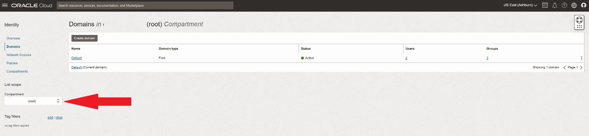
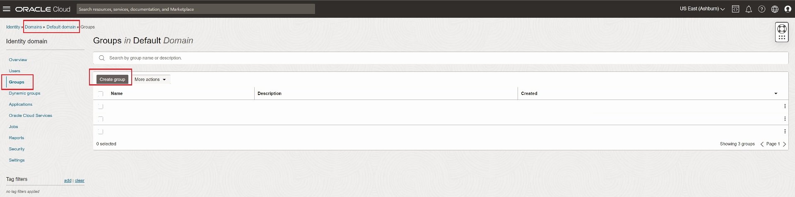
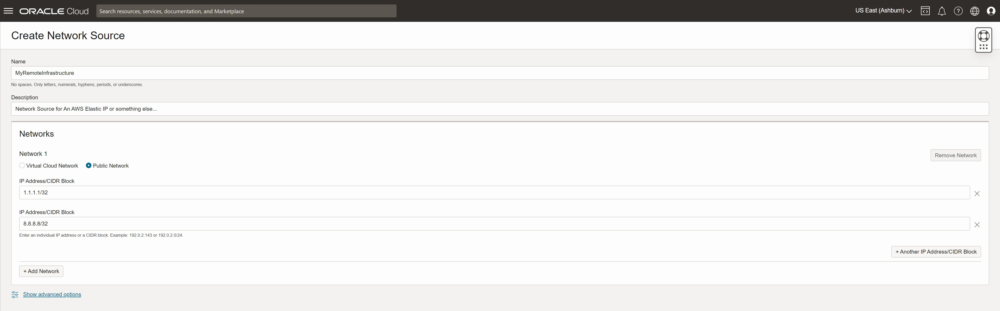
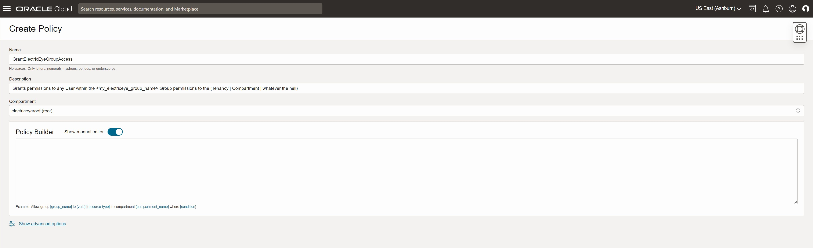
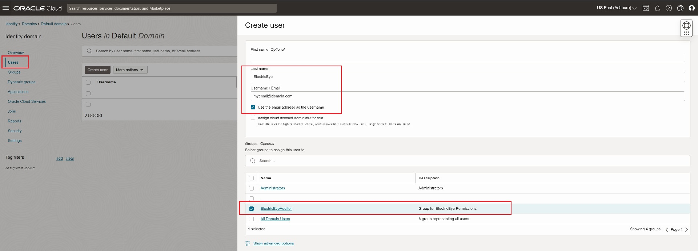

# ElectricEye Cloud Security Posture Management for Oracle Cloud Infrastructure (OCI)

This documentation is dedicated to using ElectricEye for evaluation of Oracle Cloud Environments using CSPM and Attack Surface Monitoring capabilities.

## Table of Contents

- [Setting up OCI Permissions](#setting-up-oci-permissions)
- [Configuring TOML](#configuring-toml)
- [Use ElectricEye for OCI](#use-electriceye-for-oci)
- [Configuring Security List & NSG Auditors](#configuring-security-list--nsg-auditors)
- [OCI Attack Surface Monitoring](#oci-external-attack-surface-reporting)
- [Oracle Cloud Infrastructure Checks & Services](#oracle-cloud-infrastructure-checks--services)

## Setting up OCI Permissions

Oracle Cloud Infrastructure Identity and Access Management (IAM) lets you control who has access to your cloud resources. You can control what type of access a group of users have and to which specific resources.

At a high-level, an Oracle Tenancy is a "cloud account" which is a logical container for all of your resources you run in OCI and is controlled by IAM. When you setup your Tenancy you pick a "Home Region" which is a distinct geographical location where the physical infrastrucute and services that underpin Oracle Cloud exist, for instance the `us-ashburn-1` Region is located in Ashburn, Virginia, United States. Depending on your tiering for your Tenancy, you can activate other Regions to build out additional resources, IAM is a global resource and is propagated to the other Regions.

Oracle Cloud can add extra logical separation within a Tenancy by the use of Compartments which is a collection of related resources. Compartments are a fundamental component of Oracle Cloud Infrastructure for organizing and isolating your cloud resources. You use them to clearly separate resources for the purposes of measuring usage and billing, access (through the use of policies), and isolation (separating the resources for one project or business unit from another). A common approach is to create a compartment for each major part of your organization. For more information, see [Learn Best Practices for Setting Up Your Tenancy](https://docs.oracle.com/en-us/iaas/Content/GSG/Concepts/settinguptenancy.htm#Setting_Up_Your_Tenancy).

By default, each Tenancy has a "root" Compartment, which can have up to 5 nested Compartments within them. This is similar to setting up Organizational Units within AWS Organizations or using Folders within a Google Cloud Platform Organization. ElectricEye will natively handle looping through your various Regions and Compartments as long as the User that you setup has the proper Permissions (which this section is dedicated to!)

1. In your OCI Tenancy, navigate to **Identity** -> **Domains**, ensure that you have your "root" Compartment specified in the **List scope** section as shown in the screenshot below.



2. Select your **Domain**, it will likely just be `Default`. Navigate to **Groups** and select **Create group** as shown below.



3. Enter a **Name** and **Description** for your Group, and select **Create**. We will add a User to this Group later.

4. **OPTIONAL STEP** Navigate to **Identity** -> **Network Sources**, again ensure that you have your "root" Compartment specified in the **List scope** section, and select **Create Network Source**.

5. **OPTIONAL STEP** Enter a **Name** and **Description** for your Network Source. Within **Networks** select *Public Network* and add the CIDR notation to however many IP Addresses you wish to grant access to as shown in the screenshot below. This will be used for a Condition within our OCI Policy, if you will be running ElectricEye from an AWS Account you can add the Elastic IP of a NAT Gateway, you can add the public IP of a GCE/EC2 instance, a Fargate Service, or your own corporate network. You can add more than just a `/32` here to grant access to wider ranges as well. Select **Create** when done.



6. Navigate to **Identity** -> **Policies**, again ensure that you have your "root" Compartment specified in the **List scope** section, and select **Create Policy**.

7. Enter a **Name** and **Description** for your Policy. Ensure that the **Compartment** is still your "root" Compartment. Select the toggle for **Show manual editor** as shown in the screenshot below.



8. Within the **Policy Builder** paste in one of the following policy snippets depending on the level of access you wish to grant to ElectricEye. Granting access to your entire Tenancy provides access to all Compartments and Regions, you can scope down further to specific Compartments and use Conditional statements to scope down to specific Regions and/or specific Network Sources (if you did `Optional Steps 4 and 5`). Select **Create** when done.

#### IMPORTANT NOTE: Replace <your_group_name> with, you know, your actual Group name you created in Step 3. Leave the single-quotes.

> - Granting Read Access to all resources and log events in your entire Tenancy

```
Allow group 'Default'/'<your_group_name>' to read all-resources in tenancy
Allow group 'Default'/'<your_group_name>' to read audit-events in tenancy
```

> - Granting Read Access to all resources and log events in a specific Compartment. Obviously, replace the value of `my-silly-compartment-name` with your Compartment. You can add multiple lines for multiple compartments.

```
Allow group 'Default'/'<your_group_name>' to read all-resources in compartment my-silly-compartment-name
Allow group 'Default'/'<your_group_name>' to read audit-events in compartment my-silly-compartment-name
```

> - Granting Read Access to all resources and log events in your entire Tenancy for a specific Region, example shown is for Oracle's US West Phoenix, Arizona, United States (`phx`). See [here](https://docs.oracle.com/en-us/iaas/Content/Identity/Concepts/commonpolicies.htm#restrict-admin-to-specific-region) for more details.

```
Allow group 'Default'/'<your_group_name>' to read all-resources in tenancy where request.region='phx'
Allow group 'Default'/'<your_group_name>' to read audit-events in tenancy where request.region='phx'
```

> - Granting Read Access to all resources and log events in your entire Tenancy for a specific Network Source (IP-based Restriction), replace the `electriceye-networks` name with the actual name of the Network Source you created in (*Optional!*) Step 5.

```
Allow group 'Default'/'<your_group_name>' to read all-resources in tenancy where request.networkSource.name='electriceye-networks'
Allow group 'Default'/'<your_group_name>' to read audit-events in tenancy where request.networkSource.name='electriceye-networks'
```

#### Another Note: In the future, specifically-scope permissions for the exact APIs needed will be added to `/policies/` in the root directory...

9. In your OCI Tenancy, navigate to **Identity** -> **Domains** -> **`Your Domain`** -> **Users** and select **Create user**.

10. Every OCI user requires an email, you can use a blackhole domain here or your own Email that is different than the email you used for the Tenant Administrator. Add the User in the **Group** you created in Step 3 as shown in the screenshot below and select **Create**.



11. Navigate to your **User** and select it, in the `Resources` navigation menu select **API Keys** and then **Add API key**. While you are here, copy the value of **`OCID`** as well, you will need it for the next section.

12. Choose the option to **Generate API key pair** and then select **Download private key**. This will be `.pem` formatted X.509 certificate that contains all of your permissions. Oracle recommends [changing the file permissions](https://docs.oracle.com/iaas/Content/API/Concepts/apisigningkey.htm#two) so only you can view it, if you will be storing the key locally.

13. After creation you will need the **Fingerprint** as well as the contents of the `.pem` file to save to two different AWS SSM Parameter Store SecureString Parameters or AWS Secrets Manager Secrets. If you will be using an SDK or CLI, ensure that you create an enviornment variable or have a way to account for the newlines. For example you can use the following commands, this assumes that you renamed your private key to `oci.pem` and it is in your current directory.

```bash
export OCI_API_KEY_PARAMETER_NAME="oci-api-key"
export OCI_PEM_FINGERPINT='<you_fingerprint_here>'
export OCI_PEM_CONTENTS=$(cat ./oci.pem)

aws ssm put-parameter \
    --name $OCI_PEM_CONTENTS \
    --description 'Oracle Cloud API Key private key for ElectricEye' \
    --type SecureString \
    --value $OCI_API_KEY_PARAMETER_NAME

aws ssm put-parameter \
    --name $OCI_PEM_CONTENTS-fingerprint \
    --description 'Oracle Cloud API Key Fingerprint for ElectricEye' \
    --type SecureString \
    --value $OCI_PEM_FINGERPINT
```

#### NOTE: You can also create an AWS Secrets Manager Secret to store these values

Once you have your API Key private key contents and Fingerprint saved as Parameters or Secrets, proceed to the next section to configure your TOML configuration.

## Configuring TOML

This section explains how to configure ElectricEye using a TOML configuration file. The configuration file contains settings for credentials, regions, accounts, and global settings and is located [here](../../eeauditor/external_providers.toml).

To configure the TOML file, you need to modify the values of the variables in the `[global]`, `[regions_and_accounts.oci]`, and `[credentials.oci]` sections of the file. Here's an overview of the key variables you need to configure:

- `credentials_location`: Set this variable to specify the location of where credentials are stored and will be retrieved from. You can choose from AWS Systems Manager Parameter Store (`AWS_SSM`), AWS Secrets Manager (`AWS_SECRETS_MANAGER`), or from the TOML file itself (`CONFIG_FILE`) which is **NOT** recommended.

**NOTE** When retrieving from SSM or Secrets Manager, your current Profile / Boto3 Session is used and *NOT* the ElectricEye Role that is specified in `aws_electric_eye_iam_role_name`. Ensure you have `ssm:GetParameter`, `secretsmanager:GetSecretValue`, and relevant `kms` permissions as needed to retrieve your stored secrets.

- `virustotal_api_key_value`: The location (or actual contents) of your VirusTotal (VT) API Key, this location must match the value of `global.credentials_location` e.g., if you specify "AWS_SSM" then the value for this variable should be the name of the AWS Systems Manager Parameter Store SecureString Parameter. VirusTotal is used for the **OCI_ArtifactRegistry_Auditor** to check individual SHA256 hashes of artifacts against VirusTotal for malware. The logic is currently hard-coded that if 5 or more detectors report `suspicious` or that 2 or more detectors report `malicious` then the artifact is considered malicious.

- `oci_tenancy_ocid`: Provide your Oracle Cloud Infrastructure Tenancy ID (`ocid`) that is associated with your OCI credentials

- `oci_user_ocid`: The User ID (`ocid`) for the ElectricEye user you created and generated an API Key for

- `oci_region_name`: The Region name you want to evaluate with ElectricEye. OCI Tenants typically only have one Region enabled as quotas to activate other Regions are locked behind support levels. If you require multiple Accounts evaluated create different TOMLs and running ElectricEye within a container or open up an Issue and I can add multi-Region support to the roadmap (it's simple, but lot's of manual code edits).

- `oci_compartment_ocids`: A list of Compartment IDs (`ocid`) you want ElectricEye to evaluate, depending on the age of your OCI Tenancy the "root" Compartment ID will match your Tenancy ID. Ensure that you have `tenancy` level permissions otherwise you will not be able to access cross-Compartment resources from your parent Compartment.

- `oci_user_api_key_fingerprint_value`: The location (or actual contents) of your OCI User API Key Fingerprint. This must be the CONTENTS not the file path this location must match the value  of `global.credentials_location` e.g., if you specify "AWS_SSM" then the value for this variable should be the name of the AWS Systems Manager Parameter Store SecureString Parameter

- `oci_user_api_key_private_key_pem_contents_value`: The location (or actual contents) of your OCI User API Key Private Key PEM. This must be the CONTENTS not the file path this location must match the value  of `global.credentials_location` e.g., if you specify "AWS_SSM" then the value for this variable should be the name of the AWS Systems Manager Parameter Store SecureString Parameter

It's important to note that this setting is a sensitive credential, and as such, its value should be stored in a secure manner that matches the location specified in the `[global]` section's `credentials_location` setting. For example, if `credentials_location` is set to `"AWS_SSM"`, then the OCI_service_account_json_payload_value should be the name of an AWS Systems Manager Parameter Store SecureString parameter that contains the contents of the OCI service account key JSON file.

## Use ElectricEye for OCI

1. With >=Python 3.7 installed, install and upgrade `pip3` and setup `virtualenv`.

```bash
sudo apt install -y python3-pip
pip3 install --upgrade pip
pip3 install virtualenv --user
virtualenv .venv
```

2. This will create a virtualenv directory called `.venv` which needs to be activated.

```bash
#For macOS and Linux
. .venv/bin/activate

#For Windows
.venv\scripts\activate
```

3. Clone the repo and install all dependencies.

```bash
git clone https://github.com/jonrau1/ElectricEye.git
cd ElectricEye
pip3 install -r requirements.txt

# if use AWS CloudShell
pip3 install --user -r requirements.txt
```

4. Use the Controller to conduct different kinds of Assessments.

    - 4A. Retrieve all options for the Controller.

    ```bash
    python3 eeauditor/controller.py --help
    ```

    - 4B. Evaluate your entire OCI Tenancy.

    ```bash
    python3 eeauditor/controller.py -t OCI
    ```

    - 4C. Evaluate your OCI environment against a specifc Auditor (runs all Checks within the Auditor).

    ```bash
    python3 eeauditor/controller.py -t OCI -a OCI_AutonomousDatabase_Auditor
    ```

    - 7D. Evaluate your OCI environment against a specific Check within any Auditor, it is ***not required*** to specify the Auditor name as well. The below examples runs the "[OCI.OKE.1] Oracle Container Engine for Kubernetes (OKE) cluster API servers should not be accessible from the internet" check.

    ```bash
    python3 eeauditor/controller.py -t OCI -c oci_oke_cluster_public_api_endpoint_check
    ```

## Configuring Security List & NSG Auditors

The Auditors for Oracle Cloud Virtual Cloud Network (VCN) Security Lists and Network Security Groups are configured using JSON files ([for NSGs](../../eeauditor/auditors/oci/electriceye_oci_vcn_nsg_auditor_config.json) and [for Security Lists](../../eeauditor/auditors/oci/electriceye_oci_vcn_seclist_auditor_config.json)) which contains titles, check IDs, to-from IANA port numbers and protocols that map to high-danger services you should not leave open to the world such as SMB, Win NetBIOS, databases, caches, et al. While this is not the same as figuring out what your how your actual assets & services are configured (see the [EASM](#aws-external-attack-surface-reporting) section for that) this is a good hygeine check.

The JSON file is already prefilled with several dozen checks, however you can easily append more to the list. Shown below are how UDP (protocol `17`) and TCP (protcol `6`) rules are configured. The example shown is for the NSG Auditor, however the Rule Sets are the same, the two JSON files are in case you wanted to audit for different services on different security layers or totally ignore NSGs.

```json
[
    {
        "ToPort": 1194,
        "FromPort": 1194,
        "Protocol": "17",
        "CheckTitle": "[OCI.NetworkSecurityGroup.28] Virtual Cloud Network Network Security Groups should not allow unrestricted OpenVPN (UDP 1194) access",
        "CheckId": "oci-vcn-nsg-openvpn-open-check",
        "CheckDescriptor": "OpenVPN (UDP 1194)"
    },
    {
        "ToPort": 5672,
        "FromPort": 5672,
        "Protocol": "6",
        "CheckTitle": "[OCI.NetworkSecurityGroup.29] Virtual Cloud Network Network Security Groups should not allow unrestricted access to AmazonMQ/RabbitMQ (TCP 5672)",
        "CheckId": "oci-vcn-nsg-rabbitmq-open-check",
        "CheckDescriptor": "AmazonMQ / RabbitMQ / AMQP (TCP 5672)"
    },
]
```

#### `ToPort`

The IANA Port number at the top of the range for whatever service needs internet access, e.g., if your service required ports 135-139, then 139 is the `ToPort`

#### `FromPort`

The IANA Port number at the bottom of the range for whatever service needs internet access, e.g., if your service required ports 135-139, then 135 is the `ToPort`

#### `Protocol`

Unlike the AWS Security Group Auditor, the Protocols are represented numerically by Oracle Cloud, `17` for UDP services and `6` for TCP services.

#### `CheckTitle`

The `Title` within the AWS Security Finding Format, aka the title of the finding, ensure you follow the rule number order and the guidelines - or choose your own.

#### `CheckId`

An all lowercase, dash-separated string that is appended to the `Id` and `GeneratorId` within the AWS Security Finding Format, this is the ensure uniqueness of the Check performed by the Auditor

#### `CheckDescriptor`

A descriptor of what the protocol & port service is, this is added into the `Description` field within the AWS Security Finding Format and can be anything you want as long as it does not contain double-quotes (`""`)

## OCI Attack Surface Monitoring

If you only wanted to run Attack Surface Monitoring checks use the following command which show an example of outputting the ASM checks into a JSON file for consumption into SIEM or BI tools.

```bash
python3 eeauditor/controller.py -t AWS -a ElectricEye_AttackSurface_OCI_Auditor -o json_normalized --output-file ElectricASMforOCI
```

## Oracle Cloud Infrastructure Checks & Services

These are the following services and checks perform by each Auditor, there are currently **221 Checks** across **18 Auditors** that support the secure configuration of **25 services/components**

| Auditor File Name | Scanned Resource Name | Auditor Scan Description |
|---|---|---|
| OCI_AutonomousDatabase_Auditor | Oracle Autonomous Databasee | ADBs should be encrypted with a Customer-managed Master Encryption Key |
| OCI_AutonomousDatabase_Auditor | Oracle Autonomous Databasee | ADBs with available upgrade versions should be reviewed for upgrade |
| OCI_AutonomousDatabase_Auditor | Oracle Autonomous Databasee | ADBs should have an Oracle Object Storage bucket configured for manual and long-term backup storage |
| OCI_AutonomousDatabase_Auditor | Oracle Autonomous Databasee | ADBs should be registered with Oracle Data Safe |
| OCI_AutonomousDatabase_Auditor | Oracle Autonomous Databasee | ADBs should be registered with Database Management |
| OCI_AutonomousDatabase_Auditor | Oracle Autonomous Databasee | ADBs should have a customer contact detail to receive upgrade and other important notices |
| OCI_AutonomousDatabase_Auditor | Oracle Autonomous Databasee | ADBs should be configured to autoscale database compute resources |
| OCI_AutonomousDatabase_Auditor | Oracle Autonomous Databasee | ADBs should be configured to autoscale database storage resources |
| OCI_AutonomousDatabase_Auditor | Oracle Autonomous Databasee | ADBs should have Autonomous Data Guard enabled |
| OCI_AutonomousDatabase_Auditor | Oracle Autonomous Databasee | ADBs should enforce mutual TLS (mTLS) connections |
| OCI_AutonomousDatabase_Auditor | Oracle Autonomous Databasee | ADBs should schedule long term backups |
| OCI_AutonomousDatabase_Auditor | Oracle Autonomous Databasee | ADBs with Private Access should have at least one Network Security Group (NSG) assigned |
| OCI_AutonomousDatabase_Auditor | Oracle Autonomous Databasee | ADBs should have Operations Insights enabled |
| OCI_AutonomousDatabase_Auditor | Oracle Autonomous Databasee | ADBs should be configured for Private Access connectivity through a Virtual Cloud Network (VCN) |
| OCI_AutonomousDatabase_Auditor | Oracle Autonomous Databasee | ADBs should configure an IP-based Allow-list to reduce permissible network access |
| OCI_ArtifactRegistry_Auditor | Oracle Artifact Registry repository | Repositories that are empty should be reviewed for deletion |
| OCI_ArtifactRegistry_Auditor | Oracle Artifact Registry repository | Repositories should consider enabling immutable artifacts | 
| OCI_ArtifactRegistry_Auditor | Oracle Artifact Registry artifact | Artifacts should be scanned for malware and viruses |
| OCI_BlockStorage_Auditor | Oracle Block Storage volume | Volumes (with high availability/resilience requirements) should use replication |
| OCI_BlockStorage_Auditor | Oracle Block Storage volume | Volumes should use auto-tune policies |
| OCI_BlockStorage_Auditor | Oracle Block Storage volume | Volumes should use a CMK MEK for encryption |
| OCI_BlockStorage_Auditor | Oracle Block Storage volume | Volumes should be a member of a Block Volume Group |
| OCI_BlockStorage_Auditor | Oracle Block Storage volume | Volumes should have an assigned backup policy |
| OCI_ComputeInstance_Auditor | Oracle Cloud Compute instance | Instances should have Secure Boot enabled |
| OCI_ComputeInstance_Auditor | Oracle Cloud Compute instance | Instances should have Measured Boot enabled |
| OCI_ComputeInstance_Auditor | Oracle Cloud Compute instance | Instances should have the Trusted Platform Module enabled |
| OCI_ComputeInstance_Auditor | Oracle Cloud Compute instance | Instances should enable block volume in-transit encryption |
| OCI_ComputeInstance_Auditor | Oracle Cloud Compute instance | Instances should be encrypted with a Customer-managed Master Encryption Key |
| OCI_ComputeInstance_Auditor | Oracle Cloud Compute instance | Instances should disable access to legacy Instance Metadata Service (IMDSv1) endpoints |
| OCI_ComputeInstance_Auditor | Oracle Cloud Compute instance | Instances should have the Management Agent enabled |
| OCI_ComputeInstance_Auditor | Oracle Cloud Compute instance | Instances should have the Monitoring Agent enabled |
| OCI_ComputeInstance_Auditor | Oracle Cloud Compute instance | Instances should have the Vulnerability Scanning plugin enabled |
| OCI_ComputeInstance_Auditor | Oracle Cloud Compute instance | Instances should not be publicly discoverable on the internet |
| OCI_ComputeInstance_Auditor | Oracle Cloud Compute instance | Instances should have at least one Network Security Group (NSG) assigned |
| OCI_ComputeInstance_Auditor | Oracle Cloud Compute instance | Instances should not have any exploitable vulnerabilities |
| OCI_ComputeManagement_Auditor | Oracle Cloud Compute instance configuration | Instance configurations should enable the Vulnerability Scanning agent |
| OCI_ComputeManagement_Auditor | Oracle Cloud Compute instance configuration | Instance configurations should enable the OS Management Service Agent |
| OCI_ComputeManagement_Auditor | Oracle Cloud Compute instance configuration | Instance configurations should enable the Management Agent |
| OCI_ComputeManagement_Auditor | Oracle Cloud Compute instance configuration | Instance configurations should enable the Compute Instance Run Command Agent |
| OCI_ComputeManagement_Auditor | Oracle Cloud Compute instance configuration | Instance configurations should ensure public IP addresses are not mapped unless required |
| OCI_ComputeManagement_Auditor | Oracle Cloud Compute instance configuration | Instance configurations should define NSGs to protect instances |
| OCI_ComputeManagement_Auditor | Oracle Cloud Compute instance configuration | Instance configurations should disable IMDSv1 |
| OCI_ComputeManagement_Auditor | Oracle Cloud Compute instance configuration | Instance configurations should ensure PV volume in-transit encryption is enabled |
| OCI_ComputeManagement_Auditor | Oracle Cloud Compute instance configuration | Instance configurations should ensure Secure Boot is enabled |
| OCI_ComputeManagement_Auditor | Oracle Cloud Compute instance configuration | Instance configurations should ensure Measured Boot is enabled |
| OCI_ComputeManagement_Auditor | Oracle Cloud Compute instance configuration | Instance configurations should ensure the TPM is enabled |
| OCI_ComputeManagement_Auditor | Oracle Cloud Compute instance configuration | Instance configurations should define a customer-managed Vault MEK for encryption |
| OCI_ContainerInstance_Auditor | Oracle Cloud Container Instance | Container instances should consider defining a container restart policy |
| OCI_ContainerInstance_Auditor | Oracle Cloud Container Instance | Container instances should consider defining a graceful shutdown timeout |
| OCI_ContainerRegistry_Auditor | Oracle Container Registry repository | Repositories that are public should be reviewed |
| OCI_ContainerRegistry_Auditor | Oracle Container Registry repository | Repositories should have an Oracle Vulnerability Scanning Service (VSS) target association | 
| OCI_ContainerRegistry_Auditor | Oracle Container Registry image | Images should be signed with an image signature |
| OCI_ContainerRegistry_Auditor | Oracle Container Registry image | Images should not have any exploitable vulnerabilities |
| OCI_CloudFunctions_Auditor | Oracle Cloud Functions application | Applications should have NSGs assigned |
| OCI_CloudFunctions_Auditor | Oracle Cloud Functions application | Applications should enforce the usage of signing images |
| OCI_CloudFunctions_Auditor | Oracle Cloud Functions application | Applications should be configured to use more than 1 subnet for high availability |
| OCI_CloudFunctions_Auditor | Oracle Cloud Functions application | Applications should using tracing for performance monitoring |
| OCI_CloudFunctions_Auditor | Oracle Cloud Functions function | Function images should be scanned for vulnerabilities |
| OCI_CloudFunctions_Auditor | Oracle Cloud Functions function | Function should use provisioned concurrency |
| OCI_FileStorage_Auditor | Oracle File Storage file system | File Storage file systems should be encrypted with a Customer-managed Master Encryption Key |
| OCI_FileStorage_Auditor | Oracle File Storage file system | File Storage file systems should enforce secure export options by requiring that NFS clients use privileged source ports |
| OCI_FileStorage_Auditor | Oracle File Storage file system | File Storage file systems should enforce secure export options by configuring NFS identity squashing |
| OCI_FileStorage_Auditor | Oracle File Storage mount target | File Storage Mount Targets should have at least one Network Security Group (NSG) assigned |
| OCI_GoldenGate_Auditor | Oracle GoldenGate deployment | Deployments should autoscale |
| OCI_GoldenGate_Auditor | Oracle GoldenGate deployment | Deployments should report as healthy |
| OCI_GoldenGate_Auditor | Oracle GoldenGate deployment | Deployments should not be public-facing |
| OCI_GoldenGate_Auditor | Oracle GoldenGate deployment | Deployments should upgrade to the latest version, if possible |
| OCI_GoldenGate_Auditor | Oracle GoldenGate deployment | Deployments should have at least one NSG assigned |
| OCI_GoldenGate_Auditor | Oracle GoldenGate connection | Connections should utilize private endpoints for network connectivity |
| OCI_GoldenGate_Auditor | Oracle GoldenGate connection | Connections should be encrypted with a Vault Customer-managed MEK |
| OCI_GoldenGate_Auditor | Oracle GoldenGate connection | Connections should have at least one NSG assigned |
| OCI_GoldenGate_Auditor | Oracle GoldenGate connection | Connects should protect connections with TLS or mTLS |
| OCI_KubernetesEngine_Auditor | OKE cluster | OKE cluster API servers should not be accessible from the internet |
| OCI_KubernetesEngine_Auditor | OKE cluster | OKE cluster should have at least one Network Security Group (NSG) assigned |
| OCI_KubernetesEngine_Auditor | OKE cluster | OKE clusters should enable image verification policies |
| OCI_KubernetesEngine_Auditor | OKE cluster | OKE clusters with the Kubernetes dashboard enabled should be reviewed |
| OCI_KubernetesEngine_Auditor | OKE cluster | OKE clusters should use one of the latest supported Kubernetes versions |
| OCI_KubernetesEngine_Auditor | OKE cluster | OKE clusters should not use deprecated versions of Kubernetes |
| OCI_KubernetesEngine_Auditor | OKE node pool | OKE node pools should enable block volume in-transit encryption |
| OCI_KubernetesEngine_Auditor | OKE node pool | OKE node pools should have at least one Network Security Group (NSG) assigned |
| OCI_KubernetesEngine_Auditor | OKE node pool | OKE node pools should be configured to protect pods with a Network Security Group (NSG) |
| OCI_KubernetesEngine_Auditor | OKE node pool | OKE node pools should be configured to force terminate evicted worker nodes after the draining grace period |
| OCI_KubernetesEngine_Auditor | OKE node pool | OKE node pools should use the latest supported Kubernetes versions |
| OCI_KubernetesEngine_Auditor | OKE node pool | OKE node pools should not use deprecated versions of Kubernetes |
| OCI_KubernetesEngine_Auditor | OKE virtual node pool | OKE virtual node pools should have at least one Network Security Group (NSG) assigned |
| OCI_KubernetesEngine_Auditor | OKE virtual node pool | OKE virtual node pools should be configured to protect pods with a Network Security Group (NSG) |
| OCI_KubernetesEngine_Auditor | OKE virtual node pool | OKE virtual node pools should use the latest supported Kubernetes versions |
| OCI_KubernetesEngine_Auditor | OKE virtual node pool | OKE virtual node pools should not use deprecated versions of Kubernetes |
| OCI_LoadBalancer_Auditor | Oracle Load Balancer | Load Balancers should have Network Security Groups (NSGs) assigned |
| OCI_LoadBalancer_Auditor | Oracle Load Balancer | Load Balancer listeners should be configured to use HTTPS/TLS |
| OCI_LoadBalancer_Auditor | Oracle Load Balancer | Load Balancer backend sets should be configured to use HTTPS/TLS |
| OCI_LoadBalancer_Auditor | Oracle Load Balancer | Load Balancers with health checks reporting Critical or Warning should be investigated |
| OCI_MySQL_DatabaseService_Auditor | Oracle MySQL DB System | DB systems should be configured to take automatic backups |
| OCI_MySQL_DatabaseService_Auditor | Oracle MySQL DB System | DB systems should have Point-in-Time Recovery (PITR) enabled |
| OCI_MySQL_DatabaseService_Auditor | Oracle MySQL DB System | DB systems should have Crash Recovery enabled |
| OCI_MySQL_DatabaseService_Auditor | Oracle MySQL DB System | DB systems should have Deletion Protection enabled |
| OCI_MySQL_DatabaseService_Auditor | Oracle MySQL DB System | DB systems should enforce creating a final manual snapshot before deletion |
| OCI_MySQL_DatabaseService_Auditor | Oracle MySQL DB System | DB systems should be configured to automatically delete automatic snapshots after system deletion |
| OCI_MySQL_DatabaseService_Auditor | Oracle MySQL DB System | DB systems should be configured to be highly available |
| OCI_NoSQL_Auditor | Oracle NoSQL Table |  Oracle NoSQL Database Cloud Service tables should be configured for on-demand scaling (autoscaling) |
| OCI_ObjectStorage_Auditor | Oracle Cloud Storage bucket | buckets should be encrypted with a Customer-managed Master Encryption Key |
| OCI_ObjectStorage_Auditor | Oracle Cloud Storage bucket | buckets should have a lifecycle policy defined |
| OCI_ObjectStorage_Auditor | Oracle Cloud Storage bucket | buckets should define a lifecycle policy rule to delete failed multipart uploads |
| OCI_ObjectStorage_Auditor | Oracle Cloud Storage bucket | buckets should not allow public access to objects |
| OCI_ObjectStorage_Auditor | Oracle Cloud Storage bucket | buckets should be configured to use object replication to promote resilience and recovery |
| OCI_ObjectStorage_Auditor | Oracle Cloud Storage bucket | buckets should be configured to use object versioning to promote resilience and recovery |
| OCI_OpenSearch_Auditor | Oracle Search with OpenSearch clusteer | clusters should have Security Mode enabled and set to Enforcing |
| OCI_VCN_SecurityList_Auditor | OCI Security List | Are all ports (-1) open to the internet |
| OCI_VCN_SecurityList_Auditor | OCI Security List | Is FTP (tcp20-21) open to the internet |
| OCI_VCN_SecurityList_Auditor | OCI Security List | Is TelNet (tcp23) open to the internet |
| OCI_VCN_SecurityList_Auditor | OCI Security List | Is WSDCOM-RPC (tcp135) open to the internet |
| OCI_VCN_SecurityList_Auditor | OCI Security List | Is SMB (tcp445) open to the internet |
| OCI_VCN_SecurityList_Auditor | OCI Security List | Is MSSQL (tcp1433) open to the internet |
| OCI_VCN_SecurityList_Auditor | OCI Security List | Is OracleDB (tcp1521) open to the internet |
| OCI_VCN_SecurityList_Auditor | OCI Security List | Is MySQL/MariaDB (tcp3306) open to the internet |
| OCI_VCN_SecurityList_Auditor | OCI Security List | Is RDP (tcp3389) open to the internet |
| OCI_VCN_SecurityList_Auditor | OCI Security List | Is PostgreSQL (tcp5432) open to the internet |
| OCI_VCN_SecurityList_Auditor | OCI Security List | Is Kibana (tcp5601) open to the internet |
| OCI_VCN_SecurityList_Auditor | OCI Security List | Is Redis (tcp6379) open to the internet |
| OCI_VCN_SecurityList_Auditor | OCI Security List | Is Splunkd (tcp8089) open to the internet |
| OCI_VCN_SecurityList_Auditor | OCI Security List | Is Elasticsearch (tcp9200) open to the internet |
| OCI_VCN_SecurityList_Auditor | OCI Security List | Is Elasticsearch (tcp9300) open to the internet |
| OCI_VCN_SecurityList_Auditor | OCI Security List | Is Memcached (udp11211) open to the internet |
| OCI_VCN_SecurityList_Auditor | OCI Security List | Is Redshift (tcp5439) open to the internet |
| OCI_VCN_SecurityList_Auditor | OCI Security List | Is DocDB (tcp27017) open to the internet |
| OCI_VCN_SecurityList_Auditor | OCI Security List | Is Cassandra (tcp9142) open to the internet |
| OCI_VCN_SecurityList_Auditor | OCI Security List | Is Kafka (tcp9092) open to the internet |
| OCI_VCN_SecurityList_Auditor | OCI Security List | Is NFS (tcp2049) open to the internet |
| OCI_VCN_SecurityList_Auditor | OCI Security List | Is Rsync (tcp873) open to the internet |
| OCI_VCN_SecurityList_Auditor | OCI Security List | Is TFTP (udp69) open to the internet |
| OCI_VCN_SecurityList_Auditor | OCI Security List | Is Docker API (tcp2375) open to the internet |
| OCI_VCN_SecurityList_Auditor | OCI Security List | Is K8s API (tcp10250) open to the internet |
| OCI_VCN_SecurityList_Auditor | OCI Security List | Is SMTP (tcp25) open to the internet |
| OCI_VCN_SecurityList_Auditor | OCI Security List | Is NetBioas (tcp137-139) open to the internet |
| OCI_VCN_SecurityList_Auditor | OCI Security List | Is OpenVPN (udp1194) open to the internet |
| OCI_VCN_SecurityList_Auditor | OCI Security List | Is RabbitMQ (tcp5672) open to the internet |
| OCI_VCN_SecurityList_Auditor | OCI Security List | Is Spark WebUI (tcp4040) open to the internet |
| OCI_VCN_SecurityList_Auditor | OCI Security List | Is POP3 (tcp110) open to the internet |
| OCI_VCN_SecurityList_Auditor | OCI Security List | Is VMWare ESXi (tcp8182) open to the internet |
| OCI_VCN_NetworkSecurityGroup_Auditor | OCI Network Security Group | Are all ports (-1) open to the internet |
| OCI_VCN_NetworkSecurityGroup_Auditor | OCI Network Security Group | Is FTP (tcp20-21) open to the internet |
| OCI_VCN_NetworkSecurityGroup_Auditor | OCI Network Security Group | Is TelNet (tcp23) open to the internet |
| OCI_VCN_NetworkSecurityGroup_Auditor | OCI Network Security Group | Is WSDCOM-RPC (tcp135) open to the internet |
| OCI_VCN_NetworkSecurityGroup_Auditor | OCI Network Security Group | Is SMB (tcp445) open to the internet |
| OCI_VCN_NetworkSecurityGroup_Auditor | OCI Network Security Group | Is MSSQL (tcp1433) open to the internet |
| OCI_VCN_NetworkSecurityGroup_Auditor | OCI Network Security Group | Is OracleDB (tcp1521) open to the internet |
| OCI_VCN_NetworkSecurityGroup_Auditor | OCI Network Security Group | Is MySQL/MariaDB (tcp3306) open to the internet |
| OCI_VCN_NetworkSecurityGroup_Auditor | OCI Network Security Group | Is RDP (tcp3389) open to the internet |
| OCI_VCN_NetworkSecurityGroup_Auditor | OCI Network Security Group | Is PostgreSQL (tcp5432) open to the internet |
| OCI_VCN_NetworkSecurityGroup_Auditor | OCI Network Security Group | Is Kibana (tcp5601) open to the internet |
| OCI_VCN_NetworkSecurityGroup_Auditor | OCI Network Security Group | Is Redis (tcp6379) open to the internet |
| OCI_VCN_NetworkSecurityGroup_Auditor | OCI Network Security Group | Is Splunkd (tcp8089) open to the internet |
| OCI_VCN_NetworkSecurityGroup_Auditor | OCI Network Security Group | Is Elasticsearch (tcp9200) open to the internet |
| OCI_VCN_NetworkSecurityGroup_Auditor | OCI Network Security Group | Is Elasticsearch (tcp9300) open to the internet |
| OCI_VCN_NetworkSecurityGroup_Auditor | OCI Network Security Group | Is Memcached (udp11211) open to the internet |
| OCI_VCN_NetworkSecurityGroup_Auditor | OCI Network Security Group | Is Redshift (tcp5439) open to the internet |
| OCI_VCN_NetworkSecurityGroup_Auditor | OCI Network Security Group | Is DocDB (tcp27017) open to the internet |
| OCI_VCN_NetworkSecurityGroup_Auditor | OCI Network Security Group | Is Cassandra (tcp9142) open to the internet |
| OCI_VCN_NetworkSecurityGroup_Auditor | OCI Network Security Group | Is Kafka (tcp9092) open to the internet |
| OCI_VCN_NetworkSecurityGroup_Auditor | OCI Network Security Group | Is NFS (tcp2049) open to the internet |
| OCI_VCN_NetworkSecurityGroup_Auditor | OCI Network Security Group | Is Rsync (tcp873) open to the internet |
| OCI_VCN_NetworkSecurityGroup_Auditor | OCI Network Security Group | Is TFTP (udp69) open to the internet |
| OCI_VCN_NetworkSecurityGroup_Auditor | OCI Network Security Group | Is Docker API (tcp2375) open to the internet |
| OCI_VCN_NetworkSecurityGroup_Auditor | OCI Network Security Group | Is K8s API (tcp10250) open to the internet |
| OCI_VCN_NetworkSecurityGroup_Auditor | OCI Network Security Group | Is SMTP (tcp25) open to the internet |
| OCI_VCN_NetworkSecurityGroup_Auditor | OCI Network Security Group | Is NetBioas (tcp137-139) open to the internet |
| OCI_VCN_NetworkSecurityGroup_Auditor | OCI Network Security Group | Is OpenVPN (udp1194) open to the internet |
| OCI_VCN_NetworkSecurityGroup_Auditor | OCI Network Security Group | Is RabbitMQ (tcp5672) open to the internet |
| OCI_VCN_NetworkSecurityGroup_Auditor | OCI Network Security Group | Is Spark WebUI (tcp4040) open to the internet |
| OCI_VCN_NetworkSecurityGroup_Auditor | OCI Network Security Group | Is POP3 (tcp110) open to the internet |
| OCI_VCN_NetworkSecurityGroup_Auditor | OCI Network Security Group | Is VMWare ESXi (tcp8182) open to the internet |
| ElectricEye_AttackSurface_OCI_Auditor | Oracle Cloud Compute instance | Is a FTP service publicly accessible |
| ElectricEye_AttackSurface_OCI_Auditor | Oracle Cloud Compute instance | Is a SSH service publicly accessible |
| ElectricEye_AttackSurface_OCI_Auditor | Oracle Cloud Compute instance | Is a Telnet service publicly accessible |
| ElectricEye_AttackSurface_OCI_Auditor | Oracle Cloud Compute instance | Is a SMTP service publicly accessible |
| ElectricEye_AttackSurface_OCI_Auditor | Oracle Cloud Compute instance | Is a HTTP service publicly accessible |
| ElectricEye_AttackSurface_OCI_Auditor | Oracle Cloud Compute instance | Is a POP3 service publicly accessible |
| ElectricEye_AttackSurface_OCI_Auditor | Oracle Cloud Compute instance | Is a Win NetBIOS service publicly accessible |
| ElectricEye_AttackSurface_OCI_Auditor | Oracle Cloud Compute instance | Is a SMB service publicly accessible |
| ElectricEye_AttackSurface_OCI_Auditor | Oracle Cloud Compute instance | Is a RDP service publicly accessible |
| ElectricEye_AttackSurface_OCI_Auditor | Oracle Cloud Compute instance | Is a MSSQL service publicly accessible |
| ElectricEye_AttackSurface_OCI_Auditor | Oracle Cloud Compute instance | Is a MySQL/MariaDB service publicly accessible |
| ElectricEye_AttackSurface_OCI_Auditor | Oracle Cloud Compute instance | Is a NFS service publicly accessible |
| ElectricEye_AttackSurface_OCI_Auditor | Oracle Cloud Compute instance | Is a Docker API service publicly accessible |
| ElectricEye_AttackSurface_OCI_Auditor | Oracle Cloud Compute instance | Is a OracleDB service publicly accessible |
| ElectricEye_AttackSurface_OCI_Auditor | Oracle Cloud Compute instance | Is a PostgreSQL service publicly accessible |
| ElectricEye_AttackSurface_OCI_Auditor | Oracle Cloud Compute instance | Is a Kibana service publicly accessible |
| ElectricEye_AttackSurface_OCI_Auditor | Oracle Cloud Compute instance | Is a VMWARE ESXi service publicly accessible |
| ElectricEye_AttackSurface_OCI_Auditor | Oracle Cloud Compute instance | Is a HTTP Proxy service publicly accessible |
| ElectricEye_AttackSurface_OCI_Auditor | Oracle Cloud Compute instance | Is a SplunkD service publicly accessible |
| ElectricEye_AttackSurface_OCI_Auditor | Oracle Cloud Compute instance | Is a Kubernetes API Server service publicly accessible |
| ElectricEye_AttackSurface_OCI_Auditor | Oracle Cloud Compute instance | Is a Redis service publicly accessible |
| ElectricEye_AttackSurface_OCI_Auditor | Oracle Cloud Compute instance | Is a Kafka service publicly accessible |
| ElectricEye_AttackSurface_OCI_Auditor | Oracle Cloud Compute instance | Is a MongoDB/DocDB service publicly accessible |
| ElectricEye_AttackSurface_OCI_Auditor | Oracle Cloud Compute instance | Is a Rabbit/AmazonMQ service publicly accessible |
| ElectricEye_AttackSurface_OCI_Auditor | Oracle Cloud Compute instance | Is a SparkUI service publicly accessible |
| ElectricEye_AttackSurface_OCI_Auditor | Oracle Load Balancer | Is a FTP service publicly accessible |
| ElectricEye_AttackSurface_OCI_Auditor | Oracle Load Balancer | Is a SSH service publicly accessible |
| ElectricEye_AttackSurface_OCI_Auditor | Oracle Load Balancer | Is a Telnet service publicly accessible |
| ElectricEye_AttackSurface_OCI_Auditor | Oracle Load Balancer | Is a SMTP service publicly accessible |
| ElectricEye_AttackSurface_OCI_Auditor | Oracle Load Balancer | Is a HTTP service publicly accessible |
| ElectricEye_AttackSurface_OCI_Auditor | Oracle Load Balancer | Is a POP3 service publicly accessible |
| ElectricEye_AttackSurface_OCI_Auditor | Oracle Load Balancer | Is a Win NetBIOS service publicly accessible |
| ElectricEye_AttackSurface_OCI_Auditor | Oracle Load Balancer | Is a SMB service publicly accessible |
| ElectricEye_AttackSurface_OCI_Auditor | Oracle Load Balancer | Is a RDP service publicly accessible |
| ElectricEye_AttackSurface_OCI_Auditor | Oracle Load Balancer | Is a MSSQL service publicly accessible |
| ElectricEye_AttackSurface_OCI_Auditor | Oracle Load Balancer | Is a MySQL/MariaDB service publicly accessible |
| ElectricEye_AttackSurface_OCI_Auditor | Oracle Load Balancer | Is a NFS service publicly accessible |
| ElectricEye_AttackSurface_OCI_Auditor | Oracle Load Balancer | Is a Docker API service publicly accessible |
| ElectricEye_AttackSurface_OCI_Auditor | Oracle Load Balancer | Is a OracleDB service publicly accessible |
| ElectricEye_AttackSurface_OCI_Auditor | Oracle Load Balancer | Is a PostgreSQL service publicly accessible |
| ElectricEye_AttackSurface_OCI_Auditor | Oracle Load Balancer | Is a Kibana service publicly accessible |
| ElectricEye_AttackSurface_OCI_Auditor | Oracle Load Balancer | Is a VMWARE ESXi service publicly accessible |
| ElectricEye_AttackSurface_OCI_Auditor | Oracle Load Balancer | Is a HTTP Proxy service publicly accessible |
| ElectricEye_AttackSurface_OCI_Auditor | Oracle Load Balancer | Is a SplunkD service publicly accessible |
| ElectricEye_AttackSurface_OCI_Auditor | Oracle Load Balancer | Is a Kubernetes API Server service publicly accessible |
| ElectricEye_AttackSurface_OCI_Auditor | Oracle Load Balancer | Is a Redis service publicly accessible |
| ElectricEye_AttackSurface_OCI_Auditor | Oracle Load Balancer | Is a Kafka service publicly accessible |
| ElectricEye_AttackSurface_OCI_Auditor | Oracle Load Balancer | Is a MongoDB/DocDB service publicly accessible |
| ElectricEye_AttackSurface_OCI_Auditor | Oracle Load Balancer | Is a Rabbit/AmazonMQ service publicly accessible |
| ElectricEye_AttackSurface_OCI_Auditor | Oracle Load Balancer | Is a SparkUI service publicly accessible |

Continue to check this section for information on active, retired, and renamed checks or using the `--list-checks` command in the CLI!