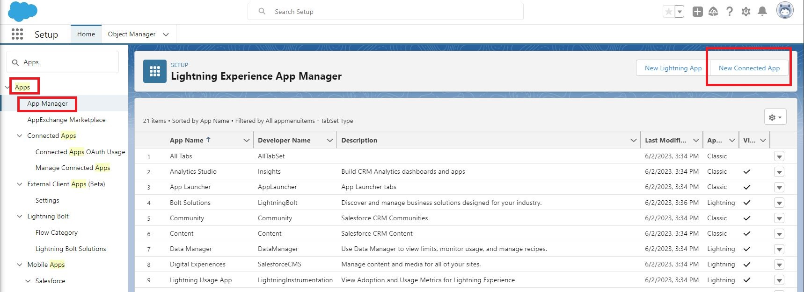
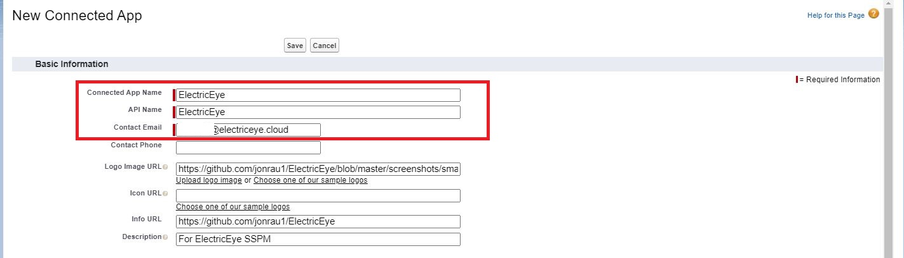
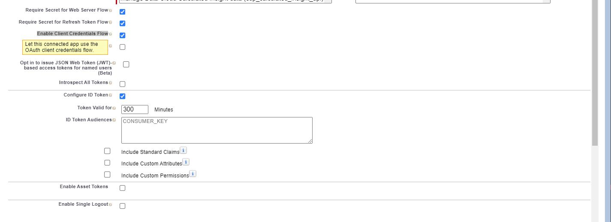
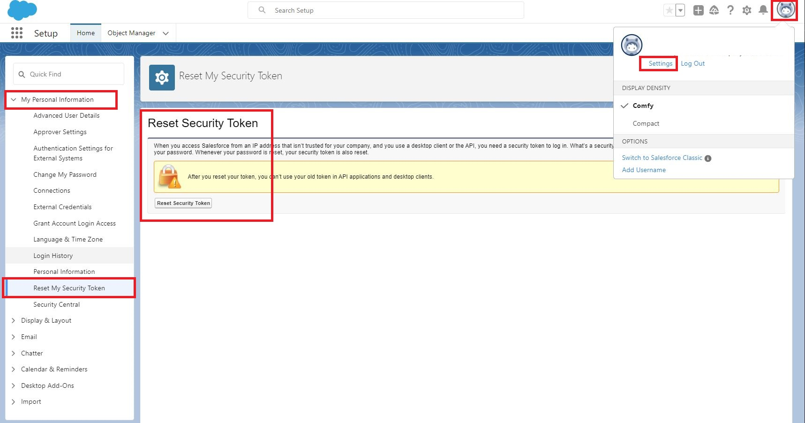

# ElectricEye SaaS Security Posture Management (SSPM) for Salesforce

This documentation is dedicated to using ElectricEye for evaluation of Salesforce tenants using SSPM capabilities.

## Table of Contents

- [Setting up Salesforce Connected App](#setting-up-salesforce-connected-app)
- [Configuring TOML](#configuring-toml)
- [Use ElectricEye for Salesforce](#use-electriceye-for-salesforce)
- [Salesforce Checks & Services](#salesforce-checks--services)

## Setting up Salesforce Connected App

For a client application (ElectricEye, in this case) to access Salesforce REST API resources, it must be authorized as a safe visitor. To implement this authorization, use a connected app and an OAuth 2.0 authorization flow.

A connected app requests access to REST API resources on behalf of the client application. For a connected app to request access, it must be integrated with your org’s REST API using the OAuth 2.0 protocol. OAuth 2.0 is an open protocol that authorizes secure data sharing between applications through the exchange of tokens.

Connected Apps can be created in: Group, Professional, Enterprise, Essentials, Performance, Unlimited, and Developer Editions. The following user permissions are required, these are subject to change, always refer to the [official Salesforce documentation](https://help.salesforce.com/s/articleView?id=sf.connected_app_create_basics.htm&type=5) to double-check.

| USER ACTIONS | USER PERMISSIONS NEEDED |
|---|---|
| To read, create, update, or delete connected apps | Customize Application AND either </br> Modify All Data OR Manage Connected Apps |
| To update all fields except Profiles, Permission Sets, and Service Provider SAML Attributes | Customize Application AND either </br> Modify All Data OR Manage Connected Apps |
| To update Profiles, Permission Sets, and Service Provider SAML Attributes | Customize Application AND Modify All Data AND Manage Profiles and Permission Sets |
| To rotate the consumer key and consumer secret | Allow consumer key and secret rotation |
| To install and uninstall connected apps | Customize Application AND either </br> Modify All Data OR Manage Connected Apps |
| To install and uninstall packaged connected apps | Customize Application AND either </br> Modify All Data OR Manage Connected Apps </br> AND Download AppExchange Packages |

Use the following steps to create a basic Connected Application.

1. In the navigation menu, navigate to **Apps** -> **App Manager** and select **New Connected App** as shown below.



2. Enter information for the following fields: **Connected App Name**, **API Name**, **Contact Email** (that is for Salesforce to contact *you*) and optionally: **Logo Image URL** (such as [this one](../../screenshots/smalllogo.png)), **Info URL**, and **Description** as shown below.



3. Select the option for **Enable OAuth Settings** and enter a **Callback URL** such as `http://localhost:3000/#/signup` or another callback you control. In the **Selected OAuth Scopes** section, add the following permissions as shown in the screenshot below.
- Access Headless Registration API (`user_registration_api`)
- Access Interaction API resources (`interaction_api`)
- Access all Data Cloud API resources (`cdp_api`)
- Access custom permissions (`custom_permissions`)
- Access the Salesforce API Platform (`sfap_api`)
- Access the identity URL service (`id`, `profile`, `email`, `address`, `phone`)
- Access unique user identifiers (`openid`)
- Manage user data via APIs (`api`)
- Perform requests at any time (`refresh_token`, `offline_access`)


4. Continuing in the `API (Enable OAuth Settings)` section, ensure you select the options for all of: **Require Secret for Web Server Flow**, **Require Secret for Refresh Token Flow** and **Enable Client Credentials Flow**. Select **Configure ID Token** and customize the **Token valid for** value to a value between 2 and 720 minutes as shown below. When you have completed these steps, select **Save** either at the top or bottom of the current page.



5. Once complete, select **Manage Consumer Details** and copy the values for **Consumer Key** and **Consumer Secret**. These are incredibly sensitive, and should be safeguarded in AWS Secrets Manager, AWS Systems Manager SecureString Parameters or another PIM or vault solution.

6. For the OAuth flow, you will also need to note a **Username** (this is typically your email), your **Password** and you must (re)generate a **Security Token**. You can do this by navigating to **View Profile** -> **Settings** -> **My Personal Information** -> **Reset My Security Token** and selecting **Reset Security Token** which will be emailed to you, as shown below.



**NOTE** If you will be running ElectricEye from behind a set IP such as a NAT Gateway, an Amazon EC2 Elastic IP, or any other fixed IP ranges consider adding IP allowlists to your Connected App. Double-check that all of your sensitive data is stored in a secure location with strong crytopgrahy that is only accessible to the identity that will run ElectricEye.

7. To access specialized (and highly sensitive) `sObjects` such as `TwoFactorInfo`, `TwoFactorMethodsInfo`, and `SamlSsoConfig` (among others) with the Query API - the Profile of the User you used for **Step 6** requires specialized permissions, referenced below. This is based off the concept that you're using a Profile based on `Systems Administrator`. You will need another Administrator to change the profile of current Administrators, so you may be required to create or modify another User and swap between sessions to ensure you have the proper permissions.

| SECTION | PERMISSION REQUIRED |
|---|---|
| General User Permissions | Manage Multi-Factor Authentication in API |
| General User Permissions | Manage Multi-Factor Authentication in User Interface |
| General User Permissions | View Threat Detection Events | 
| Administrative Permissions | Manage Encryption Keys |
| Administrative Permissions | Manage Security Center |
| Administrative Permissions | Manage Session Permission Set Activations |
| Administrative Permissions | Use Identity Features |
| Administrative Permissions | View Restriction and Scoping Rules |

Once complete, proceed to the next section to learn how to configure the TOML configuration file for ElectricEye.

## Configuring TOML

This section explains how to configure ElectricEye using a TOML configuration file. The configuration file contains settings for credentials, regions, accounts, and global settings and is located [here](../../eeauditor/external_providers.toml).

To configure the TOML file, you need to modify the values of the variables in the `[global]` and `[credentials.salesforce]` sections of the file. Here's an overview of the key variables you need to configure:

- `credentials_location`: Set this variable to specify the location of where credentials are stored and will be retrieved from. You can choose from AWS Systems Manager Parameter Store (`AWS_SSM`), AWS Secrets Manager (`AWS_SECRETS_MANAGER`), or from the TOML file itself (`CONFIG_FILE`) which is **NOT** recommended.

**NOTE** When retrieving from SSM or Secrets Manager, your current Profile / Boto3 Session is used and *NOT* the ElectricEye Role that is specified in `aws_electric_eye_iam_role_name`. Ensure you have `ssm:GetParameter`, `secretsmanager:GetSecretValue`, and relevant `kms` permissions as needed to retrieve this values.

- `salesforce_connected_app_client_id_value`: The location (or actual contents) of your Salesforce Connected App Client ID this location must match the value  of `global.credentials_location`.

- `salesforce_connected_app_client_secret_value`: The location (or actual contents) of your Salesforce Connected App Client Secret this location must match the value  of `global.credentials_location`.

- `salesforce_api_enabled_username_value`: The location (or actual contents) of your Salesforce User's Username that has MFA and API access this location must match the value  of `global.credentials_location`.

- `salesforce_api_enabled_password_value`: The location (or actual contents) of your Salesforce User's Password that has MFA and API access this location must match the value  of `global.credentials_location`.

- `salesforce_api_enabled_security_token_value`: The location (or actual contents) of your Salesforce User's Security Token that has MFA and API access this location must match the value  of `global.credentials_location`.

- `salesforce_instance_location`: The Country Code OR the Instance Identifier Code (e.g., NA224, CS87, CS102, NA214, etc.) of your Salesforce Instance. This is found under **Company Settings** -> **Company Information**, use either `ADDRESS` or `INSTANCE`. Refer [here](https://help.salesforce.com/s/articleView?id=000382217&type=1) for possible instance identifiers.

- `salesforce_failed_login_breaching_rate`: The threshold for when to create a failing finding for the `Salesforce_Users_Auditor` Check for failed login-in attempts by active users in your Instance (Check ID: `salesforce_user_failed_logins_above_limit_check`).

- `salesforce_api_version`: The Salesforce API Version you will want to use, as of 27 JUNE 2023 ElectricEye uses `v58.0`.

## Use ElectricEye for Salesforce

1. With >=Python 3.8 installed, install and upgrade `pip3` and setup `virtualenv`.

```bash
sudo apt install -y python3-pip
pip3 install --upgrade pip
pip3 install virtualenv --user
virtualenv .venv
```

2. This will create a virtualenv directory called `.venv` which needs to be activated.

```bash
#For macOS and Linux
. .venv/bin/activate

#For Windows
.venv\scripts\activate
```

3. Clone the repo and install all dependencies.

```bash
git clone https://github.com/jonrau1/ElectricEye.git
cd ElectricEye
pip3 install -r requirements.txt

# if use AWS CloudShell
pip3 install --user -r requirements.txt
```

4. Use the Controller to conduct different kinds of Assessments.

    - 4A. Retrieve all options for the Controller.

    ```bash
    python3 eeauditor/controller.py --help
    ```

    - 4B. Evaluate your entire Salesforce Instance.

    ```bash
    python3 eeauditor/controller.py -t Salesforce
    ```

    - 4C. Evaluate your Salesforce Instance against a specifc Auditor (runs all Checks within the Auditor).

    ```bash
    python3 eeauditor/controller.py -t Salesforce -a Salesforce_Users_Auditor
    ```

    - 4D. Evaluate your Salesforce Instance against against a specific Check within any Auditor, it is ***not required*** to specify the Auditor name as well. The below examples runs the "[Salesforce.Users.2] Salesforce users that are active should have multi-factor authentication (MFA) enabledd" check.

    ```bash
    python3 eeauditor/controller.py -t Salesforce -c salesforce_active_user_mfa_check
    ```

## Salesforce Checks & Services

These are the following services and checks perform by each Auditor, there are currently **13 Checks** across **2 Auditors** that support the secure configuration of **3 services/components**

| Auditor File Name | Scanned Resource Name | Auditor Scan Description |
|---|---|---|
| Salesforce_Users_Auditor | Salesforce user | Users that are not active should be audited |
| Salesforce_Users_Auditor | Salesforce user | Users should have an MFA device |
| Salesforce_Users_Auditor | Salesforce user | Users should have a phishing-resistant MFA device |
| Salesforce_Users_Auditor | Salesforce user | Users should access Salesforce via federated SSO |
| Salesforce_Users_Auditor | Salesforce user | Users that have never logged in should be audited |
| Salesforce_Users_Auditor | Salesforce user | Users with failed login attempts above a specified limit should be audited |
| Salesforce_ThreatDetection_Auditor | Salesforce threat detection event | Open Threat Detection session hijacking events should be investigated |
| Salesforce_ThreatDetection_Auditor | Salesforce threat detection event | Open Threat Detection credential stuffing events should be investigated |
| Salesforce_ThreatDetection_Auditor | Salesforce threat detection event | Open Threat Detection report anomaly events should be investigated |
| Salesforce_ThreatDetection_Auditor | Salesforce threat detection event | Open Threat Detection API anomaly events should be investigated |
| Salesforce_ThreatDetection_Auditor | Salesforce transaction security policy (TSP) | Salesforce instances should have TSPs |
| Salesforce_ThreatDetection_Auditor | Salesforce transaction security policy (TSP) | Transaction security policies should define an alerting action |
| Salesforce_ThreatDetection_Auditor | Salesforce transaction security policy (TSP) | Transaction security policies should define a blocking or MFA-challenge action |

Continue to check this section for information on active, retired, and renamed checks or using the `--list-checks` command in the CLI!