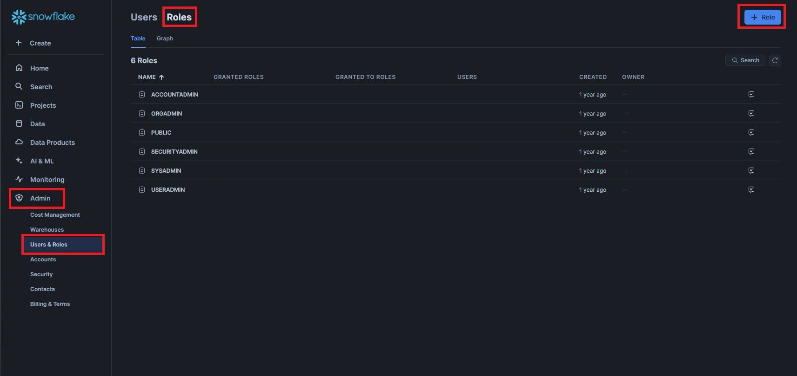
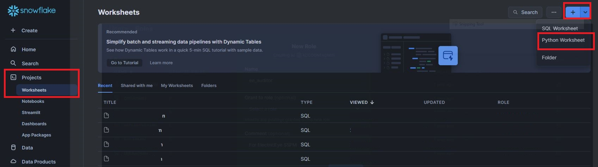
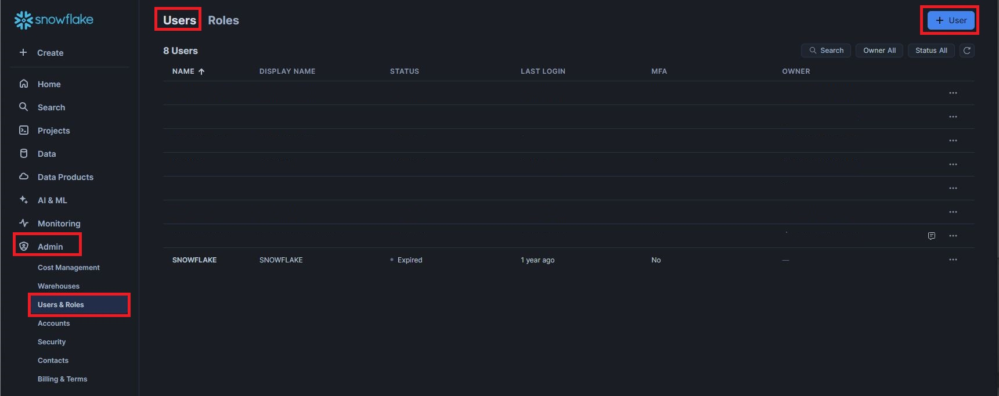
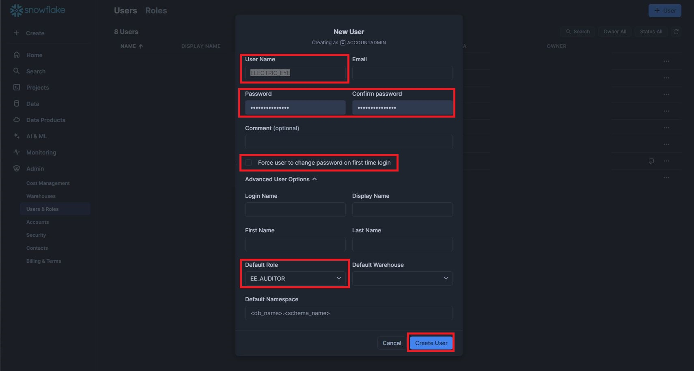

# ElectricEye SaaS Security Posture Management (SSPM) for Snowflake

This documentation is dedicated to using ElectricEye for evaluation of Snowflake enterprise data warehouses using SSPM capabilities.

## Table of Contents

- [Setting up Snowflake Permissions](#setting-up-snowflake-permissions)
- [Configuring TOML](#configuring-toml)
- [Use ElectricEye for Snowflake](#use-electriceye-for-snowflake)
- [Snowflake Checks & Services](#snowflake-checks--services)

## Setting up Snowflake Permissions

Snowflake's principal identity construct is a User - these can represent regular Users, those created using Single Sign-On (SSO) and SCIM, and can also represent 'service accounts' meant for machine-to-machine connectivity.

ElectricEye uses Password-based authentication with a 'service account', in the future, RSA private key authentication may be considered.

ElectricEye only queries data in the `SNOWFLAKE` Database and within the `ACCOUNT_USAGE` schema, the following steps will guide you through creating a Custom role, providing `GRANTS` to the required Database and Schema, and creating a new user.

**NOTE** - The following steps should be performed using an `ACCOUNTADMIN` or a similarly permissioned User + Role combo that is allowed to create users, create roles, and manage grants.

1. From the Snowflake console navigate to **Admin** -> **Users & Roles** -> select the **Roles** tab at the top of the window -> select the **+ Role** option at the top-right of the window as shown below.



2. Enter a **Name** (like `EE_AUDITOR`) and **Comment** while ignoring the **Grant to role** option and select **Create Role** as shown below.


3. Navigate to **Projects** -> **Worksheets** -> and create a new **SQL Worksheet** from the creation toggle at the top right of the screen as shown below.



4. Run each of the following SQL commands sequentially within the Worksheet. Do note that the `GRANT IMPORTED PRIVILEGES` grant allows your custom role access to the entire `SNOWFLAKE` database and should be done with care. Ensure you change the name of your Role -- `EE_AUDITOR` is used in this case -- if you used a different name for you role. Likewise, change to name of the Warehouse -- `COMPUTE_WH` is used in this case -- if you have a different warehouse.

```sql
use role ACCOUNTADMIN
GRANT IMPORTED PRIVILEGES ON DATABASE SNOWFLAKE TO ROLE EE_AUDITOR;
GRANT SELECT ON all tables IN SCHEMA SNOWFLAKE.ACCOUNT_USAGE TO ROLE EE_AUDITOR;
GRANT USAGE ON WAREHOUSE COMPUTE_WH TO ROLE EE_AUDITOR;
```

5. Navigate back to **Admin** -> **Users & Roles** -> select the **Users** tab at the top of the window -> select the **+ User** option at the top-right of the window as shown below.



6. Provide a **User Name**, **Password**, and an optional **Comment**. As this is a "service account" deselect the option to **Force user to change password on first time login**. Under `Advanced User Options`, assign your custom role as the **Default Role**, select a **Default Warehouse**, and select **Create User** as shown below.



Now that you have setup your Role, Grants, and new "service account" User - you can proceed to the next step to configure the TOML.

## Configuring TOML

> **EXPERIMENTAL**: Using the arguments `-ut` False and `--args` you can provide an escaped JSON object containing the below values instead of using the TOML. For example: `python .\eeauditor\controller.py -t Snowflake -ut False --args '{\"credentials_location\": \"CONFIG_FILE\",\"snowflake_username\": \"EXAMPLE\",\"snowflake_password_value\" : \"EXAMPLE\",\"snowflake_account_id\": \"EXAMPLE\",\"snowflake_warehouse_name\": \"EXAMPLE\",\"snowflake_region\": \"EXAMPLE\",\"snowflake_service_account_usernames\": [\"EXAMPLE\", \"EXAMPLE\"]}'`

This section explains how to configure ElectricEye using a TOML configuration file. The configuration file contains settings for credentials, regions, accounts, and global settings and is located [here](../../eeauditor/external_providers.toml).

To configure the TOML file, you need to modify the values of the variables in the `[global]`, `[regions_and_accounts.oci]`, and `[credentials.oci]` sections of the file. Here's an overview of the key variables you need to configure:

- `credentials_location`: Set this variable to specify the location of where credentials are stored and will be retrieved from. You can choose from AWS Systems Manager Parameter Store (`AWS_SSM`), AWS Secrets Manager (`AWS_SECRETS_MANAGER`), or from the TOML file itself (`CONFIG_FILE`) which is **NOT** recommended.

**NOTE** When retrieving from SSM or Secrets Manager, your current Profile / Boto3 Session is used and *NOT* the ElectricEye Role that is specified in `aws_electric_eye_iam_role_name`. Ensure you have `ssm:GetParameter`, `secretsmanager:GetSecretValue`, and relevant `kms` permissions as needed to retrieve your stored secrets.

- `snowflake_username`: Username for your Snowflake Account, this should be a user with the ability to read all tables and views in the default schemas.

- `snowflake_password_value`: The location (or actual contents) of the Password for the User specified in `snowflake_account_id` this location must match the value of `global.credentials_location` e.g., if you specify "AWS_SSM" then the value for this variable should be the name of the AWS Systems Manager Parameter Store SecureString Parameter.

> It's important to note that this setting is a sensitive credential, and as such, its value should be stored in a secure manner that matches the location specified in the `[global]` section's `credentials_location` setting. For example, if `credentials_location` is set to `"AWS_SSM"`, then the Snowflake_service_account_json_payload_value should be the name of an AWS Systems Manager Parameter Store SecureString parameter that contains the contents of the Snowflake service account key JSON file.

- `snowflake_account_id`: The Account ID for your Snowflake Account, this is found in the URL when you login to your Snowflake Account, e.g., VULEDAR-MR69420.

- `snowflake_warehouse_name`: The name of the warehouse you use for querying data in Snowflake, this should be a warehouse that has the ability to run queries

- `snowflake_region`: The Region of your Snowflake Account, this is found in the URL when you login to your Snowflake Account, e.g., us-east-1

- `snowflake_service_account_usernames`: The Usernames of "Service Accounts" created in Snowflake, this will optionally exempt these Usernames from being audited against the following checks: **snowflake_password_assigned_user_has_mfa_check**, **snowflake_accountadmins_have_email_check**, **snowflake_admin_default_role_check**, **snowflake_logins_without_mfa_check**, and **snowflake_bypass_mfa_review_check**

## Use ElectricEye for Snowflake

1. With >=Python 3.9 installed, install and upgrade `pip3` and setup `virtualenv`.

```bash
sudo apt install -y python3-pip
pip3 install --upgrade pip
pip3 install virtualenv --user
virtualenv .venv
```

2. This will create a virtualenv directory called `.venv` which needs to be activated.

```bash
#For macOS and Linux
. .venv/bin/activate

#For Windows
.venv\scripts\activate
```

3. Clone the repo and install all dependencies.

```bash
git clone https://github.com/jonrau1/ElectricEye.git
cd ElectricEye
pip3 install -r requirements.txt

# if using AWS CloudShell
pip3 install --user -r requirements.txt
```

4. Use the Controller to conduct different kinds of Assessments. Ensure you use the `-tp` / `--toml-path` argument if you have a custom TOML configuration file.

- 4A. Retrieve all options for the Controller.

    ```bash
    python3 eeauditor/controller.py --help
    ```

- 4B. Evaluate your entire Snowflake Account.

    ```bash
    python3 eeauditor/controller.py -t Snowflake
    ```

- 4C. Evaluate your Snowflake environment against a specifc Auditor (runs all Checks within the Auditor).

    ```bash
    python3 eeauditor/controller.py -t Snowflake -a Snowflake_Account_Auditor
    ```

- 4D. Evaluate your Snowflake environment against a specific Check within any Auditor, it is ***not required*** to specify the Auditor name as well. The below examples runs the "[Snowflake.Account.9] Snowflake Accounts should configure a password policy" check.

    ```bash
    python3 eeauditor/controller.py -t Snowflake -c snowflake_account_password_policy_check
    ```

## Snowflake Checks & Services

These are the following services and checks performed by each Auditor, there are currently **21 Checks** across **2 Auditors** that support the secure configuration of **3 services/components**

| Auditor File Name | Scanned Resource Name | Auditor Scan Description |
|---|---|---|
| Snowflake_Users_Auditor | Snowflake user | Password assigned users should use MFA |
| Snowflake_Users_Auditor | Snowflake user | Service account users (without a password) should have an RSA Private Key |
| Snowflake_Users_Auditor | Snowflake user | Snowflake users who have not logged in within 90 days should be disabled |
| Snowflake_Users_Auditor | Snowflake user | Snowflake admin users should have an email |
| Snowflake_Users_Auditor | Snowflake user | Snowflake users should not have built-in admin roles as their default role |
| Snowflake_Users_Auditor | Snowflake user | Snowflake password users should be monitored for logging in without MFA |
| Snowflake_Users_Auditor | Snowflake user | Snowflake admin users should rotate their passwords yearly |
| Snowflake_Users_Auditor | Snowflake user | Snowflake users allowed to bypass MFA should be reviewed |
| Snowflake_Users_Auditor | Snowflake account | Snowflake accounts should have at least 2, but less than 10, admins |
| Snowflake_Account_Auditor | Snowflake account | Snowflake accounts should be configured to use SSO |
| Snowflake_Account_Auditor | Snowflake account | Snowflake accounts should be configured to use SCIM |
| Snowflake_Account_Auditor | Snowflake account | Snowflake accounts should have 15 minute or less session timeouts set for admins |
| Snowflake_Account_Auditor | Snowflake account | Snowflake custom roles should not use built-in admin roles |
| Snowflake_Account_Auditor | Snowflake account | Snowflake tasks shouldn't be owned by admins |
| Snowflake_Account_Auditor | Snowflake account | Snowflake tasks shouldn't run with admin privileges |
| Snowflake_Account_Auditor | Snowflake account | Snowflake stored procedures shouldn't be owned by admins |
| Snowflake_Account_Auditor | Snowflake account | Snowflake stored procedures shouldn't run with admin privileges |
| Snowflake_Account_Auditor | Snowflake account | Snowflake accounts should have a password policy |
| Snowflake_Account_Auditor | Snowflake password policy | Snowflake password policies should require 14 character minimum length for passwords |
| Snowflake_Account_Auditor | Snowflake account | Snowflake users should be monitored for altering their session timeouts |
| Snowflake_Account_Auditor | Snowflake account | Snowflake accounts should use a network policy |

Continue to check this section for information on active, retired, and renamed checks or using the `--list-checks` command in the CLI!